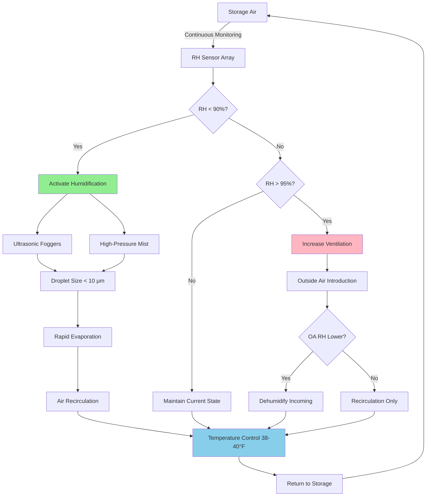

## Physical Principles of Potato Storage Humidity

Potato storage at 90-95% relative humidity represents a critical threshold where vapor pressure equilibrium between the tuber surface and surrounding air minimizes transpiration-driven weight loss while preventing condensation that promotes bacterial soft rot and fungal diseases.

The moisture transfer from potato tubers follows Fick's first law of diffusion, where mass flux depends on the vapor pressure gradient between the tuber surface (essentially 100% RH at the evaporating surface) and the storage air. At 90-95% RH, this gradient remains minimal, reducing weight loss to 0.3-0.5% per month compared to 3-5% monthly losses at 80% RH.

### Water Vapor Pressure Gradient

The driving force for moisture loss from stored potatoes:

$$\Delta P_v = P_{sat}(T_{surface}) - \phi \cdot P_{sat}(T_{air})$$

Where:
- $\Delta P_v$ = vapor pressure difference (Pa)
- $P_{sat}(T_{surface})$ = saturation vapor pressure at tuber surface temperature (Pa)
- $\phi$ = relative humidity of storage air (0.90-0.95 for optimal storage)
- $P_{sat}(T_{air})$ = saturation vapor pressure at air temperature (Pa)

### Weight Loss Calculation

Monthly weight loss percentage based on vapor pressure deficit:

$$W_{loss} = \frac{k \cdot A \cdot \Delta P_v \cdot t}{\rho_{potato} \cdot V} \times 100$$

Where:
- $W_{loss}$ = weight loss percentage
- $k$ = mass transfer coefficient (typically 2-4 × 10⁻⁸ kg/(m²·s·Pa) for potatoes)
- $A$ = surface area of potato pile (m²)
- $t$ = storage time (seconds)
- $\rho_{potato}$ = potato bulk density (650-700 kg/m³)
- $V$ = volume of potato pile (m³)

At 38-40°F (3.3-4.4°C) storage temperature:
- **95% RH**: $\Delta P_v$ ≈ 40 Pa, weight loss ≈ 0.3%/month
- **90% RH**: $\Delta P_v$ ≈ 80 Pa, weight loss ≈ 0.5%/month
- **85% RH**: $\Delta P_v$ ≈ 120 Pa, weight loss ≈ 1.2%/month
- **80% RH**: $\Delta P_v$ ≈ 160 Pa, weight loss ≈ 2.5%/month

## Humidity Control System Design

## Relative Humidity Effects on Potato Storage Quality

| RH Range | Weight Loss/Month | Skin Condition | Disease Risk | Sprouting | Storage Duration |
|----------|-------------------|----------------|--------------|-----------|------------------|
| 95-98% | 0.2-0.3% | Excellent, no shrinkage | **High** - condensation promotes soft rot | Normal | 6-8 months |
| **90-95%** | **0.3-0.5%** | **Excellent, minimal shrinkage** | **Low** - optimal balance | **Normal** | **8-10 months** |
| 85-90% | 0.8-1.2% | Good, slight shrinkage | Low | Slightly accelerated | 6-8 months |
| 80-85% | 2.0-2.5% | Fair, visible shrinkage | Very low | Accelerated | 4-6 months |
| 75-80% | 3.5-4.5% | Poor, severe shrinkage | Very low | Rapid | 2-4 months |
| < 75% | > 5.0% | Unacceptable, desiccation | Minimal | Rapid then dormancy | < 2 months |

## Psychrometric Analysis

At optimal potato storage conditions (39°F, 92.5% RH):
- Dry bulb temperature: 39°F (3.9°C)
- Wet bulb temperature: 38.3°F (3.5°C)
- Dew point: 37.8°F (3.2°C)
- Specific humidity: 0.00384 lb_water/lb_dry_air (5.35 g/kg)
- Enthalpy: 8.2 BTU/lb (19.1 kJ/kg)

The narrow temperature band between dry bulb and dew point (1.2°F) requires precise temperature control to prevent condensation on tuber surfaces while maintaining high humidity in the air.

## Humidification System Requirements

**Moisture Addition Rate**:

$$\dot{m}_w = \dot{V} \cdot \rho_{air} \cdot (\omega_{target} - \omega_{supply})$$

For a 50,000 ft³ storage facility with 2 ACH:
- $\dot{V}$ = 100,000 CFM = 2,832 m³/min
- $\rho_{air}$ = 0.0749 lb/ft³ at 39°F
- $\omega_{target}$ = 0.00384 lb/lb (92.5% RH)
- $\omega_{supply}$ = 0.00307 lb/lb (75% RH at 39°F outside air)

$$\dot{m}_w = 100,000 \times 0.0749 \times (0.00384 - 0.00307) = 0.58 \text{ lb/min} = 4.4 \text{ gal/day}$$

## Humidification Technologies

**Ultrasonic Foggers**:
- Droplet size: 1-5 μm (instantly evaporates without surface wetting)
- Energy efficiency: 1-2 kW per 10 lb/hr capacity
- Minimal heat addition: < 100 BTU/hr per fogger unit
- Precise RH control: ±2% accuracy with staged operation

**High-Pressure Misting**:
- Operating pressure: 800-1,200 psi (5.5-8.3 MPa)
- Droplet size: 10-15 μm (rapid evaporation in low-velocity air)
- Energy requirement: 3-5 kW per 10 lb/hr capacity
- Distribution uniformity: excellent in forced-air systems

**Evaporative Media**:
- Not recommended for potato storage due to risk of overshooting target RH
- Difficult to maintain 90-95% without exceeding condensation threshold

## Temperature-Humidity Interaction

The relationship between temperature and safe maximum humidity:

$$RH_{max} = 100 \times \left(1 - \frac{\Delta T_{safety}}{T_{dewpoint} - T_{air}}\right)$$

Where $\Delta T_{safety}$ = 1-2°F minimum temperature differential to prevent surface condensation during air circulation cycling.

At 39°F air temperature with 2°F safety margin:
- Maximum safe RH ≈ 94-95%
- Below this threshold, localized cold spots will not develop condensation
- Air velocity across tuber surfaces must remain below 50 FPM to prevent convective cooling

## Monitoring and Control Strategy

**Sensor Placement**:
- Minimum 4 sensors per 10,000 ft³ storage volume
- Vertical stratification: sensors at floor level, mid-height, and near ceiling
- Horizontal distribution: corners and center zones
- Accuracy requirement: ±2% RH, ±0.5°F temperature

**Control Logic**:
- Primary control band: 91-94% RH (deadband prevents excessive cycling)
- Humidification activates below 91% RH
- Ventilation increase activates above 94% RH
- Integration time: 5-minute moving average to filter transient fluctuations

**Safety Interlocks**:
- Disable humidification if any sensor exceeds 96% RH
- Emergency ventilation at 97% RH sustained for 10 minutes
- Condensation detection via leaf wetness sensors on tuber surfaces

## Economic Impact of Humidity Control

For 1 million pounds of stored potatoes over 8 months:

| RH Maintained | Weight Loss | Economic Loss (@$0.12/lb) | System Cost Premium |
|---------------|-------------|---------------------------|---------------------|
| 90-95% | 0.4% (4,000 lb) | $480 | Baseline |
| 85-90% | 1.0% (10,000 lb) | $1,200 | -$3,000 initial |
| 80-85% | 2.2% (22,000 lb) | $2,640 | -$5,000 initial |

The investment in high-precision humidification systems ($8,000-12,000 for a 50,000 ft³ facility) provides ROI within one storage season through reduced shrinkage losses.

## Ventilation Rate Optimization

Fresh air introduction must balance:
- Respiration heat removal: 0.15-0.25 BTU/lb/day from potato metabolism
- CO₂ removal: maintain below 5,000 ppm to prevent physiological damage
- Humidity control: minimize dry outside air that requires re-humidification

Optimal ventilation rate:

$$CFM_{ventilation} = \max\left(\frac{Q_{respiration}}{1.08 \times \Delta T}, \frac{V_{storage}}{ACH_{min}}\right)$$

Where ACH_min = 1-2 air changes per hour during active storage, 4-6 ACH during initial cooling.

---

**File**: `/Users/evgenygantman/Documents/github/gantmane/hvac/content/specialty-applications-testing/specialty-hvac-applications/farm-crops-processing/potato-storage/rh-90-95-percent/_index.md`

**Content Summary**: This comprehensive technical guide covers the physics-based design of HVAC systems for potato storage at 90-95% relative humidity, including vapor pressure calculations, weight loss formulas, psychrometric analysis, humidification system sizing, and control strategies to optimize storage quality while minimizing economic losses.
