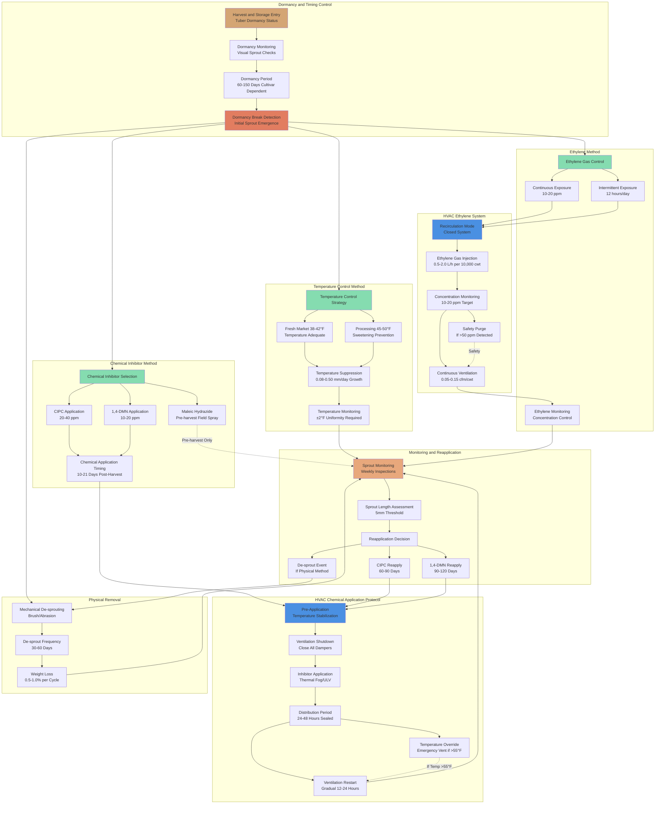

# Sprout Inhibition and HVAC System Integration

Sprouting represents a critical quality deterioration mechanism in long-term potato storage, causing weight loss of 2-3% of tuber dry matter, increased respiration rates, reduced marketability, and accelerated senescence. Effective sprout control requires integrated management of physiological dormancy, temperature-dependent growth kinetics, and chemical or physical inhibition methods coordinated with HVAC system operation.

## Sprouting Physiology and Dormancy Mechanisms

Potato tubers undergo endodormancy immediately following harvest, a physiologically regulated rest period controlled by hormonal balance within the tuber. Abscisic acid (ABA) maintains dormancy, while gibberellins (GA) promote sprout initiation. The transition from dormancy to active sprouting occurs when GA biosynthesis overcomes ABA suppression, typically 60-150 days post-harvest depending on cultivar genetics.

**Dormancy Period by Cultivar:**

| Variety Classification | Dormancy Duration | Representative Cultivars | Sprout Management Strategy |
|------------------------|-------------------|-------------------------|---------------------------|
| Very short dormancy | 60-75 days | Norchip, Snowden, Red Pontiac | Chemical inhibitors mandatory |
| Short dormancy | 75-100 days | Russet Burbank, Superior, Kennebec | Temperature + chemical required |
| Medium dormancy | 100-130 days | Russet Norkotah, Ranger Russet, Umatilla | Temperature primary, inhibitors supplemental |
| Long dormancy | 130-150 days | Shepody, Goldrush, Alturas | Temperature control sufficient |
| Extended dormancy | 150-180 days | Certain processing cultivars | Environmental control only |

Processing potatoes for chip and fry applications typically require 6-10 month storage at 45-50°F to prevent cold-induced sweetening. Even long-dormancy cultivars will initiate sprouting within this storage period, necessitating active sprout suppression beyond temperature control alone.

## Temperature-Dependent Sprouting Kinetics

Sprout elongation rate exhibits exponential dependence on storage temperature, following Arrhenius-type kinetics typical of enzymatic metabolic processes. Temperature serves as the primary environmental factor controlling sprout development velocity after dormancy break.

**Sprout Growth Rate Model:**

The sprout elongation rate follows an exponential temperature relationship:

$$R_{sprout}(T) = R_0 \cdot e^{k_s(T - T_{min})}$$

Where:
- $R_{sprout}$ = sprout elongation rate (mm/day)
- $R_0$ = base rate at minimum sprouting temperature (0.05-0.10 mm/day)
- $k_s$ = temperature coefficient (0.085-0.12 per °F, cultivar dependent)
- $T$ = storage temperature (°F)
- $T_{min}$ = minimum sprouting temperature (35-38°F)

For typical processing storage at 45°F with $k_s = 0.095$ per °F:

$$R_{sprout}(45) = 0.08 \cdot e^{0.095(45-36)} = 0.08 \cdot e^{0.855} = 0.08 \cdot 2.35 = 0.188 \text{ mm/day}$$

**Alternative Q₁₀ Temperature Model:**

Biological rate processes are often characterized by Q₁₀ temperature coefficients:

$$R_{sprout}(T) = R_{ref} \cdot Q_{10}^{(T-T_{ref})/10}$$

Where:
- $R_{ref}$ = reference rate at $T_{ref}$ (typically 40°F)
- $Q_{10}$ = rate change factor per 10°F increase (typically 2.5-3.5 for sprouting)

For $Q_{10} = 3.0$ and reference rate of 0.10 mm/day at 40°F:

At 45°F: $R_{sprout} = 0.10 \cdot 3.0^{(45-40)/10} = 0.10 \cdot 3.0^{0.5} = 0.10 \cdot 1.73 = 0.173$ mm/day

At 50°F: $R_{sprout} = 0.10 \cdot 3.0^{(50-40)/10} = 0.10 \cdot 3.0 = 0.30$ mm/day

**Empirical Sprout Growth Data:**

| Storage Temperature | Sprout Growth Rate | Time to 5mm Sprouts | Time to 10mm Sprouts | Temperature Control Adequacy |
|---------------------|--------------------|--------------------|---------------------|------------------------------|
| 38°F (3.3°C) | 0.08-0.12 mm/day | 42-63 days | 83-125 days | Adequate for most cultivars |
| 40°F (4.4°C) | 0.12-0.18 mm/day | 28-42 days | 56-83 days | Marginal for short-dormancy |
| 42°F (5.6°C) | 0.18-0.28 mm/day | 18-28 days | 36-56 days | Inadequate for processing |
| 45°F (7.2°C) | 0.30-0.50 mm/day | 10-17 days | 20-33 days | Inhibitors required |
| 50°F (10°C) | 0.80-1.40 mm/day | 3.6-6.3 days | 7.1-12.5 days | Inhibitors essential |
| 55°F (12.8°C) | 2.00-3.50 mm/day | 1.4-2.5 days | 2.9-5.0 days | Rapid intervention required |

Sprouts exceeding 5mm length reduce marketability and increase handling damage susceptibility. Sprouts beyond 10mm cause significant weight loss (1-2% per month) and require de-sprouting before processing or shipping.

**Temperature Uniformity Requirements:**

The exponential temperature dependence of sprouting creates severe consequences for temperature non-uniformity within storage piles. A 5°F hot spot at 50°F exhibits sprout growth rates 2.5-3.0 times higher than the 45°F target, leading to localized severe sprouting while the bulk remains acceptable.

Temperature variation within ±2°F throughout the pile is essential for uniform sprout control. This requires:
- Strategic temperature sensor placement at multiple pile depths and horizontal locations
- Adequate ventilation airflow distribution (coefficient of variation <15%)
- Elimination of dead zones and short-circuit airflow patterns
- Continuous monitoring and automatic airflow adjustment

## Sprout Inhibition Methods and Mechanisms

### Temperature Control Strategy

Low-temperature storage remains the most reliable and environmentally acceptable sprout suppression method. The mechanism operates through metabolic suppression of enzymatic processes driving cell division and elongation in meristematic tissue.

**Fresh Market (Table Stock) Temperature Strategy:**

Storage at 38-42°F provides sufficient sprout suppression for 3-6 month holding periods without chemical inhibitors. At 38°F, sprout growth rate of 0.08-0.12 mm/day allows 60-90 days before visible sprouting in short-dormancy cultivars, 120-180 days in medium-dormancy types.

Cold-induced sweetening occurs through starch-to-sugar conversion below 45°F, but is acceptable for fresh consumption applications. After-cooking darkening from reducing sugars is less problematic than the browning during frying that affects processing potatoes.

**Processing Potato Temperature Limitation:**

Processing potatoes must maintain 45-50°F to prevent reducing sugar accumulation that causes dark fry colors and acrylamide formation during high-temperature processing. At 45°F, sprout growth rate of 0.30-0.50 mm/day necessitates additional sprout control measures within 30-45 days of dormancy break.

Temperature alone cannot provide adequate sprout suppression for 6-10 month processing storage, requiring integration of chemical or physical inhibitors.

### Chemical Sprout Inhibitors and Application Systems

Chemical sprout inhibitors function through metabolic disruption of cell division in meristematic tissue (eye buds). Effective application requires uniform vapor distribution throughout the storage pile, coordination with HVAC ventilation control, and proper timing relative to dormancy status.

**Chlorpropham (CIPC) - Isopropyl-N-(3-chlorophenyl)carbamate:**

CIPC remains the most widely used sprout inhibitor globally, though regulatory restrictions have increased in recent years. The compound inhibits microtubule formation during cell division, preventing mitosis in sprout meristematic tissue.

**Application parameters:**
- Application rate: 20-40 ppm (parts per million by weight)
- Timing: 10-21 days post-harvest (after complete wound healing)
- Reapplication interval: 60-90 days
- Application method: Thermal fog or ULV (ultra-low volume) spray
- Vapor distribution period: 24-48 hours with zero ventilation

**Temperature dependency of CIPC vapor pressure:**

CIPC volatility increases with temperature, affecting distribution uniformity:

$$P_{vapor}(T) = P_0 \cdot e^{-\Delta H_{vap}/R(1/T - 1/T_0)}$$

Where:
- $P_{vapor}$ = vapor pressure (Pa)
- $\Delta H_{vap}$ = enthalpy of vaporization (50-60 kJ/mol for CIPC)
- $R$ = gas constant (8.314 J/mol·K)
- $T$ = temperature (K)

At storage temperature of 45°F (280 K), CIPC exhibits low vapor pressure requiring thermal fogging or carrier solvents to enhance volatilization and distribution.

**1,4-Dimethylnaphthalene (1,4-DMN):**

1,4-DMN has emerged as an alternative to CIPC with improved volatility characteristics and regulatory acceptance in some markets. The compound interferes with sprout development through similar cell division disruption mechanisms.

**Application parameters:**
- Application rate: 10-20 ppm
- Higher volatility than CIPC, improved distribution at storage temperatures
- Reapplication interval: 90-120 days
- Application method: Thermal fog or passive evaporation
- Distribution period: 24-36 hours

**Maleic Hydrazide (MH):**

Unlike CIPC and 1,4-DMN which are applied post-harvest, maleic hydrazide is a growth regulator applied to the crop 2-4 weeks before harvest. The compound is systemically absorbed and concentrated in meristematic tissue, providing sprout inhibition for 6-9 months.

Pre-harvest application eliminates HVAC coordination requirements but requires precise timing and may reduce processing quality in some cultivars.

### Ethylene Gas Application

Ethylene ($\text{C}_2\text{H}_4$) serves as a natural plant hormone that, at controlled concentrations, suppresses sprout development through hormonal signaling disruption. The method is gaining adoption due to natural compound status and absence of synthetic chemical residues.

**Ethylene application protocol:**
- Concentration: 10-20 ppm in storage atmosphere
- Exposure duration: Continuous or intermittent (12 hours/day)
- Temperature: Most effective at 40-50°F
- Humidity: Standard storage conditions (90-95% RH)
- Ventilation control: Closed recirculation system during exposure

**HVAC System Requirements for Ethylene Application:**

**Gas injection and distribution:**
- Ethylene introduced into recirculation airstream upstream of fan
- Injection rate: 0.5-2.0 L ethylene/hour per 10,000 cwt storage
- Uniform mixing in supply plenum before distribution
- Concentration monitoring in supply and return air

**Recirculation system:**
- Complete closure of outdoor air dampers during exposure periods
- Internal circulation fans maintain 0.05-0.15 cfm/cwt airflow
- Airtight construction to prevent ethylene escape
- Respiratory heat and moisture accumulation management

**Safety systems:**
- Ethylene concentration monitoring with alarm at 30 ppm (above target, below flammability threshold)
- Automatic ventilation purge if concentration exceeds 50 ppm
- Flammability consideration: Ethylene LEL is 27,000 ppm (2.7%), storage concentrations 10-20 ppm present no flammability risk
- Occupancy safety: Ethylene is relatively non-toxic, but displaces oxygen in confined spaces

**Ethylene generation options:**

1. **Compressed ethylene gas cylinders:** High purity (99%+), precise dosing, higher cost
2. **Catalytic ethanol conversion:** On-site generation from ethanol, lower purity (90-95%), reduced costs
3. **Ethephon decomposition:** Chemical powder (2-chloroethyl phosphonic acid) releases ethylene in presence of moisture

### Physical Sprout Removal (De-sprouting)

Mechanical removal of developed sprouts through brushing or abrasion provides temporary suppression but does not prevent re-sprouting. The method is energy-intensive and causes handling damage, used primarily when chemical inhibitors are unavailable or prohibited.

De-sprouting frequency: Every 30-60 days after initial sprouting, depending on temperature and cultivar. Each de-sprouting cycle removes 0.5-1.0% of tuber weight through sprout mass and surface abrasion.

## HVAC Integration for Chemical Inhibitor Application

Effective sprout inhibitor performance depends critically on uniform vapor distribution throughout the storage pile. The HVAC system must transition from normal ventilation mode to sealed recirculation for inhibitor application, then return to standard operation without quality degradation.

**Pre-Application Preparation Phase:**

**Temperature stabilization (24-48 hours before application):**
- Achieve uniform pile temperature within ±1°F of target (45-50°F)
- Eliminate vertical stratification through extended circulation
- Verify temperature uniformity with multi-point monitoring
- Avoid application during cooling or warming transitions

**Humidity conditioning:**
- Target: 85-92% RH (slightly below storage standard)
- Reduced humidity enhances vapor deposition on tuber surfaces
- Avoid condensation which dilutes inhibitor and promotes decay
- Monitor dew point throughout pile to prevent localized condensation

**Ventilation system verification:**
- Test damper closure integrity (leakage <5% of normal airflow)
- Verify internal circulation fan operation
- Confirm temperature override safety controls functional
- Seal any structural air leaks in building envelope

**Inhibitor Application Phase:**

**Vapor introduction:**

For thermal fogging CIPC application:
- Fogging equipment positioned in main supply plenum or distribution duct
- Application occurs with circulation fans operating at 50-100% capacity
- Fog injection rate: 5-10 minutes per application
- Total CIPC quantity: 20-40 ppm × tuber mass (e.g., 100-200 lb CIPC for 5,000,000 lb storage)

**Ventilation shutdown protocol:**

Immediately following application:
1. Close all outdoor air and exhaust dampers (motorized closure)
2. Shut down supply fans (complete airflow cessation)
3. Seal access doors and any ventilation openings
4. Initiate 24-hour distribution period with zero ventilation

**Temperature monitoring during shutdown:**

Respiratory heat accumulation during zero-ventilation period:

$$Q_{resp} = m \cdot q_{resp}(T)$$

For 50,000 cwt at 45°F with respiration rate of 0.30 Btu/h·cwt:
$$Q_{resp} = 50,000 \times 0.30 = 15,000 \text{ Btu/h}$$

Temperature rise rate in sealed storage:

$$\frac{dT}{dt} = \frac{Q_{resp}}{m \cdot c_p} = \frac{15,000}{5,000,000 \times 0.85} = 0.00353 \text{ °F/h} = 0.085 \text{ °F/day}$$

This minimal temperature rise (2-3°F over 24-48 hour shutdown) is acceptable. However, if outdoor temperature is high or insulation is poor, structure heat gain may require emergency ventilation:

**Temperature override control:**
- If pile temperature exceeds 55°F, automatic ventilation restart
- Brief ventilation purge (15-30 minutes at 0.1 cfm/cwt) to remove excess heat
- Re-seal after temperature reduction to 50°F
- Multiple purge cycles if necessary to prevent quality deterioration

**Vapor Distribution and Deposition Period (24-48 hours):**

During the sealed period, inhibitor vapor distributes through the pile via:
- Molecular diffusion (very slow, minimal contribution)
- Natural convection from respiratory heat (slow, contributes to long-term uniformity)
- Residual air circulation from initial fan operation (primary distribution mechanism)

The vapor deposits on tuber surfaces through adsorption, with concentration equilibrium:

$$C_{surface} = K_{partition} \cdot C_{vapor}$$

Where $K_{partition}$ depends on surface moisture, temperature, and chemical properties of the inhibitor.

Deposition period of 24-48 hours allows vapor concentration to equilibrate between air and tuber surfaces, ensuring adequate dosage on all tubers including those in pile interior.

**Post-Application Ventilation Resumption:**

**Gradual restart protocol (hours 48-72):**

1. **Initial purge:** Operate fans at 10-20% capacity with outdoor air dampers 100% open for 2-4 hours to remove excess vapor from air without stripping tuber surface deposits.

2. **Gradual ramp:** Increase fan speed and reduce outdoor air percentage over 12-24 hours to avoid rapid temperature and humidity swings.

3. **Return to normal operation:** Resume standard storage ventilation schedule (0.05-0.15 cfm/cwt) with typical outdoor air economizer control.

**Temperature recovery:**

If pile temperature has risen 3-5°F during shutdown, gradual cooling at 0.5-1.0°F/day prevents condensation and tuber stress:
- Use cool outdoor air when available (night cooling preferred)
- Avoid mechanical refrigeration during first 24 hours post-application
- Monitor for condensation at pile surface (warmest location during cooling)

**Humidity re-establishment:**

Return to 90-95% RH storage standard through:
- Reduced outdoor air ventilation (minimizes dry air introduction)
- Supplemental humidification if ambient conditions are dry
- Typical humidity recovery period: 2-5 days

**Reapplication Requirements:**

Most inhibitors require reapplication every 60-90 days to maintain efficacy as vapor desorbs from tuber surfaces and degrades through photolysis and metabolism:

| Inhibitor Type | Initial Application Timing | Reapplication Interval | Total Applications per Season |
|----------------|---------------------------|------------------------|------------------------------|
| CIPC | 10-21 days post-harvest | 60-90 days | 3-5 applications |
| 1,4-DMN | 14-28 days post-harvest | 90-120 days | 2-4 applications |
| Ethylene (continuous) | After dormancy break | Continuous or daily | N/A - ongoing |
| Ethylene (intermittent) | After dormancy break | 12 hours per day | N/A - daily cycle |

Each reapplication follows the same HVAC coordination protocol, requiring 24-48 hour ventilation shutdown and gradual restart.

## Sprout Inhibition Method Comparison

**Chemical vs. Physical vs. Temperature Control:**

| Parameter | Low Temperature Alone | CIPC Chemical | 1,4-DMN Chemical | Ethylene Gas | Physical De-sprouting |
|-----------|----------------------|---------------|------------------|--------------|----------------------|
| **Efficacy for processing storage (45-50°F)** | Inadequate | Excellent | Excellent | Good | Poor (temporary) |
| **Application complexity** | Simple | Moderate | Moderate | Complex | Simple |
| **HVAC coordination required** | Continuous | Periodic shutdown | Periodic shutdown | Continuous recirculation | None |
| **Regulatory status (2025)** | Unrestricted | Restricted (EU ban, US allowed) | Emerging acceptance | Unrestricted (natural) | Unrestricted |
| **Cost per cwt per season** | $0.00 | $0.15-$0.30 | $0.20-$0.35 | $0.25-$0.45 | $0.40-$0.80 |
| **Weight loss impact** | Minimal if adequate | Minimal | Minimal | Minimal | 0.5-1.0% per cycle |
| **Quality impacts** | Cold-sweetening <45°F | Minimal residues | Minimal residues | Russeting in some cultivars | Surface damage |
| **Reapplication frequency** | N/A - continuous | 60-90 days | 90-120 days | Continuous or daily | 30-60 days |
| **Effectiveness duration** | Unlimited | 60-90 days | 90-120 days | Effective during exposure | 10-30 days |
| **Energy impact** | High refrigeration | Moderate (shutdown events) | Moderate (shutdown events) | Moderate (recirculation) | Moderate (handling) |
| **Labor requirement** | Minimal | Low (automated application) | Low (automated application) | Low (automated injection) | High (manual operation) |
| **Residue concerns** | None | Detected (regulatory limits) | Minimal (newer compound) | None (natural hormone) | None |
| **Environmental acceptability** | Excellent | Fair (synthetic chemical) | Good | Excellent (natural) | Excellent |

**Recommended Strategies by Storage Type:**

**Fresh market (38-42°F, 3-6 months):**
- Primary method: Low temperature control
- Supplemental: CIPC or ethylene if short-dormancy cultivars
- HVAC requirement: Standard refrigeration and ventilation

**Processing chips/fries (45-50°F, 6-10 months):**
- Primary method: CIPC or 1,4-DMN chemical inhibitors
- Supplemental: Temperature as low as quality permits (45-47°F preferred)
- HVAC requirement: Periodic shutdown capability, sealed construction

**Organic production:**
- Primary method: Temperature (may accept 42-44°F with minor sweetening)
- Supplemental: Ethylene gas, essential oils (spearmint, caraway)
- HVAC requirement: Recirculation system for gas application

**Seed potatoes (38-40°F, 6-9 months):**
- Primary method: Low temperature control
- Supplemental: Minimal inhibitors to preserve viability
- HVAC requirement: Standard refrigeration, avoid CIPC (may reduce sprouting vigor at planting)

## Sprout Inhibition Control Diagram

**Control Logic Description:**

The sprout inhibition control system integrates physiological dormancy monitoring with multiple suppression methods coordinated through HVAC operations:

1. **Dormancy tracking:** Visual monitoring every 7-14 days identifies dormancy break, triggering inhibitor application timing.

2. **Temperature control:** Continuous operation maintains target storage temperature with ±2°F uniformity. Adequate for fresh market storage (38-42°F), insufficient alone for processing storage (45-50°F).

3. **Chemical inhibitor pathway:** Requires HVAC shutdown protocol with 24-48 hour sealed distribution period, followed by gradual ventilation restart. Repeated every 60-120 days based on inhibitor type.

4. **Ethylene pathway:** Requires continuous or intermittent recirculation with gas injection and concentration monitoring. HVAC operates in sealed mode during exposure periods with safety purge override.

5. **Physical removal:** Independent of HVAC operation, used when chemical methods are unavailable or prohibited.

6. **Monitoring loop:** Continuous sprout length assessment determines reapplication timing, maintaining sprouts below 5mm threshold.

## Sprout Monitoring and Quality Assessment

Effective sprout management requires systematic monitoring to detect dormancy break, assess inhibitor effectiveness, and determine reapplication timing.

**Monitoring Protocol:**

**Frequency:** Weekly inspections during dormancy period, increasing to twice-weekly after dormancy break.

**Sample size:** Minimum 100 tubers per 10,000 cwt storage, distributed across multiple pile locations and depths.

**Assessment criteria:**
1. Sprout presence (percentage of tubers with visible sprouts)
2. Sprout length (average and maximum, measured in mm)
3. Sprout number per tuber (single vs. multiple sprout initiation)
4. Sprout vigor (thick/robust vs. thin/weak indicates inhibitor effectiveness)

**Action thresholds:**

| Observation | Sprout Management Action |
|-------------|-------------------------|
| 5% of tubers with 2-3mm sprouts | Normal condition, continue monitoring |
| 10% of tubers with 3-5mm sprouts | Plan inhibitor reapplication within 14 days |
| 20% of tubers with 5-8mm sprouts | Immediate inhibitor reapplication required |
| 30% of tubers with >8mm sprouts | Emergency treatment, consider de-sprouting |
| Rapid growth after inhibitor application | Inhibitor failure, switch to alternative method |

**Temperature uniformity verification:**

Correlation between sprout development and pile location indicates temperature non-uniformity:
- If sprouting concentrated in specific zones → Temperature hot spots, adjust ventilation distribution
- If sprouting uniform throughout pile → Dormancy break, normal progression requiring treatment
- If sprouting at pile surface only → Surface warming from poor insulation or solar gain

## Integration with Long-Term Storage Management

Sprout inhibition represents one component of comprehensive storage quality management, requiring coordination with temperature control, humidity management, and disease prevention strategies.

**Seasonal Storage Timeline:**

| Days Post-Harvest | Storage Phase | Temperature Target | Sprout Management Activity | HVAC Operating Mode |
|-------------------|---------------|--------------------|-----------------------------|---------------------|
| 0-3 | Harvest entry | 60-70°F (field heat) | None - tubers dormant | Maximum cooling |
| 3-14 | Curing | 50-60°F | None - wound healing priority | Minimal ventilation |
| 14-35 | Gradual cooling | 60°F → 45°F at 0.5°F/day | Monitor dormancy status | Controlled cooling |
| 35-40 | Temperature stabilization | 45-50°F | Prepare for inhibitor application | Standard storage ventilation |
| 40-42 | Initial inhibitor application | 45-50°F | CIPC or 1,4-DMN application | 48-hour shutdown + restart |
| 42-130 | Early storage dormancy | 45-50°F | Weekly sprout monitoring | Standard ventilation |
| 130-140 | Dormancy break detection | 45-50°F | First sprouts observed | Standard ventilation |
| 140-142 | Second inhibitor application | 45-50°F | CIPC/1,4-DMN reapplication | 48-hour shutdown + restart |
| 142-230 | Mid-storage | 45-50°F | Bi-weekly monitoring | Standard ventilation |
| 230-232 | Third inhibitor application | 45-50°F | Reapplication as needed | 48-hour shutdown + restart |
| 232-300 | Late storage | 45-50°F | Continued monitoring | Standard ventilation |
| 300-310 | Pre-shipping warm-up | 45°F → 55°F at 1°F/day | Final sprout assessment | Controlled warming |

This timeline demonstrates integration of sprout management with temperature control phases across a 10-month processing potato storage season.

**Energy Implications:**

Sprout inhibitor applications requiring 24-48 hour HVAC shutdown create temporary energy savings (no fan operation, no refrigeration) but require additional cooling energy during pre-application stabilization and post-application recovery.

For typical processing storage:
- Pre-application stabilization energy: 10-20% increase for 48 hours to achieve ±1°F uniformity
- Shutdown period savings: 100% fan energy, 80-100% refrigeration energy for 24-48 hours
- Post-application recovery: 15-25% increase for 48-72 hours to restore temperature and humidity

Net energy impact per application cycle: Approximately neutral to slight increase, primarily due to pre-application conditioning requirements.

---

Effective potato sprout inhibition integrates physiological understanding of tuber dormancy, quantitative modeling of temperature-dependent growth kinetics, and precise coordination between chemical or physical suppression methods and HVAC system operation. Processing potato storage at 45-50°F requires active sprout control beyond temperature alone, with chemical inhibitors (CIPC, 1,4-DMN) or ethylene gas providing reliable suppression when properly distributed through coordinated ventilation management. HVAC system design must accommodate periodic shutdown for chemical application, sealed recirculation for ethylene exposure, and precise temperature uniformity to prevent localized sprouting hot spots. Systematic monitoring with quantitative sprout assessment guides reapplication timing and ensures storage quality maintenance throughout 6-10 month storage seasons.
