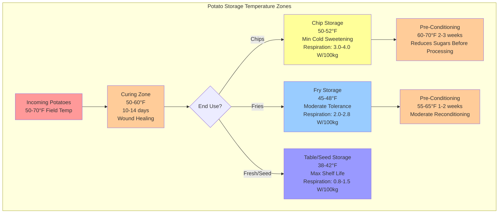

Potato storage temperature requirements vary from 38°F to 50°F depending on end-use application, driven by the thermodynamic relationship between temperature and biochemical reaction rates. The primary engineering challenge involves balancing physiological respiration rates (which generate heat) against cold-induced sweetening (which renders tubers unsuitable for processing).

## Respiration Thermodynamics

Potato tubers remain metabolically active post-harvest, consuming oxygen and producing carbon dioxide, water vapor, and heat. Respiration rate follows Arrhenius kinetics:

$$k = A e^{-\frac{E_a}{RT}}$$

Where:
- $k$ = respiration rate (mg CO₂/kg·hr)
- $A$ = pre-exponential factor (frequency factor)
- $E_a$ = activation energy (typically 50-70 kJ/mol for potato respiration)
- $R$ = universal gas constant (8.314 J/mol·K)
- $T$ = absolute temperature (K)

The heat generation rate from respiration approximates:

$$Q_{resp} = m \cdot k \cdot \Delta H_{comb}$$

Where:
- $Q_{resp}$ = respiration heat load (W)
- $m$ = mass of potatoes (kg)
- $k$ = respiration rate (kg CO₂/kg·s)
- $\Delta H_{comb}$ = heat of combustion (~450 kJ/mol CO₂ for carbohydrate oxidation)

For practical HVAC load calculations, respiration heat generation ranges from 0.8-1.2 W per 100 kg at 38°F to 2.5-4.0 W per 100 kg at 50°F, representing a 3-4× increase over this temperature range.

## Cold-Induced Sweetening Mechanism

Below 50°F, potatoes exhibit cold-induced sweetening—enzymatic conversion of starch to reducing sugars (glucose and fructose). This occurs because low temperatures inhibit sucrose phosphate synthase while allowing amylase activity to continue. The temperature coefficient (Q₁₀) for this conversion is approximately 2-3, meaning reaction rates double or triple for every 10°C increase.

When processing potatoes stored below 45°F undergo frying or baking, reducing sugars participate in Maillard reactions with amino acids, producing dark brown discoloration and acrid flavors. This makes temperature selection critical for processing applications.

## Temperature Requirements by End Use

| End Use | Storage Temperature | RH Range | Sugar Threshold | Physiological Basis |
|---------|-------------------|----------|-----------------|-------------------|
| **Chip Processing** | 50-52°F | 90-95% | <0.25% reducing sugars | Prevents cold sweetening; maintains frying quality |
| **French Fry Processing** | 45-48°F | 90-95% | <0.30% reducing sugars | Balances firmness and color; moderate sweetening tolerance |
| **Fresh Market (Table Stock)** | 38-42°F | 90-95% | Not critical | Maximizes shelf life; sweetness acceptable |
| **Seed Potatoes** | 38-40°F | 90-95% | Not critical | Maintains dormancy; prevents sprouting |
| **Early Storage (Curing)** | 50-60°F | 90-95% | N/A | Promotes wound healing via suberin formation |

## Storage Zone Thermal Stratification

## HVAC System Design Considerations

**Refrigeration Load Components:**

The total cooling load consists of:

$$Q_{total} = Q_{resp} + Q_{field} + Q_{infiltration} + Q_{envelope}$$

For a 10,000 cwt (453,600 kg) storage:

1. **Respiration heat** at 50°F: ~1,800 W continuous
2. **Field heat removal** (pulldown from 60°F to 50°F over 30 days): Average 3,500 W
3. **Infiltration and envelope**: ~2,000-3,000 W depending on insulation (R-30 minimum recommended)
4. **Total peak design load**: ~7,300-8,300 W (2.1-2.4 tons refrigeration)

**Air Distribution:**

Maintain air velocity through potato pile at 40-80 fpm (0.2-0.4 m/s) to ensure uniform temperature distribution while avoiding excessive moisture removal. The convective heat transfer coefficient at these velocities:

$$h_c = 10.45 - v + 10v^{0.5}$$

Where $v$ is air velocity in m/s, yielding $h_c$ of 12-18 W/m²·K for typical storage conditions.

**Humidity Control:**

Maintain 90-95% RH to prevent weight loss while avoiding condensation. Weight loss rate follows:

$$\frac{dm}{dt} = -h_m \cdot A \cdot (P_{sat,surface} - P_{air})$$

Where $h_m$ is the mass transfer coefficient (related to $h_c$ by Lewis relation), $A$ is surface area, and the vapor pressure difference drives moisture loss. Below 90% RH, potatoes lose 0.5-1.0% mass per month; above 98% RH, condensation promotes bacterial soft rot.

## Temperature Control Strategy

Modern potato storage facilities employ modulating refrigeration with precise temperature control (±0.5°F) and gradual temperature reduction protocols:

1. **Initial curing:** 50-60°F for 10-14 days to promote suberin layer formation over wounds
2. **Gradual cooling:** 0.5-1.0°F per day to target storage temperature
3. **Maintenance phase:** Hold at setpoint with minimal temperature swing
4. **Pre-processing conditioning:** Warm to 60-70°F at 1-2°F per day to enzymatically reduce accumulated sugars

The slow temperature ramp rates prevent condensation on tuber surfaces and allow respiration rates to adjust gradually, minimizing physiological stress.

## Standards and References

Storage temperature guidelines derive from ASABE S557 "Potato Storage Design and Management" and university extension research (University of Idaho, Washington State University, Cornell). Processing industry specifications typically require:

- Chip potatoes: <0.20% reducing sugars by colorimetric assay
- Fry potatoes: <0.30% reducing sugars with L* color value >60 after frying

These specifications directly constrain acceptable storage temperature ranges and necessitate end-use specific climate control strategies.
