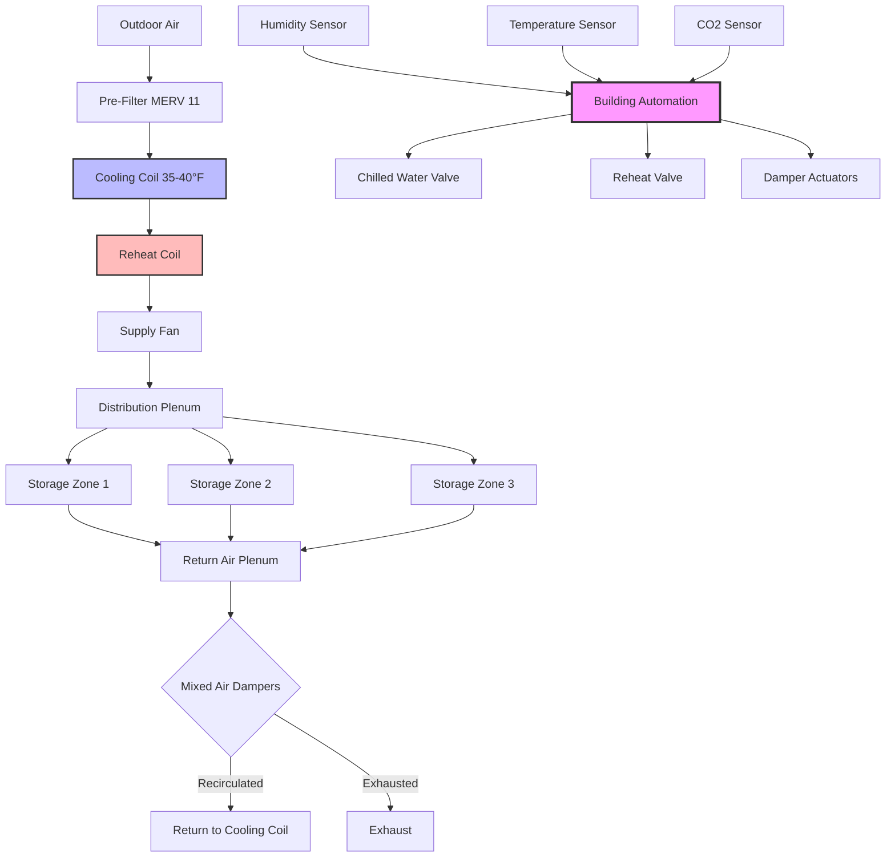

# HVAC Systems for Seed Storage Facilities

Seed storage represents one of the most critical applications of precision climate control in agriculture. The fundamental challenge is maintaining seed viability by controlling the biochemical deterioration rate, which doubles for every 1% increase in seed moisture content or every 5°C increase in temperature above baseline conditions.

## Physical Principles of Seed Storage

### Equilibrium Moisture Content Dynamics

Seeds are hygroscopic materials that continuously exchange moisture with surrounding air until reaching equilibrium. The equilibrium moisture content (EMC) depends on relative humidity, temperature, and seed composition according to the Modified Henderson equation:

$$\text{EMC} = \left[\frac{-\ln(1-\text{RH}/100)}{A \cdot (T+C)}\right]^{1/B}$$

Where:
- EMC = equilibrium moisture content (% wet basis)
- RH = relative humidity (%)
- T = temperature (°C)
- A, B, C = empirical constants specific to seed type

For most agricultural seeds:
- A = 8.0 × 10⁻⁵
- B = 1.8 to 2.2
- C = 49.81

The relationship between seed moisture content and storage life follows Harrington's thumb rule:

$$\text{Storage Life} = K \cdot 2^{-(M+T/5)}$$

Where K is a constant, M is moisture content (%), and T is temperature (°C). This exponential relationship demands precise climate control.

### Heat and Mass Transfer

The rate of moisture transfer between seed and air follows Fick's law of diffusion:

$$\frac{dm}{dt} = -D \cdot A \cdot \frac{dC}{dx}$$

Where D is the diffusion coefficient (m²/s), A is surface area (m²), and dC/dx is the concentration gradient. Temperature elevation increases diffusion coefficients exponentially according to the Arrhenius equation:

$$D = D_0 \cdot e^{-E_a/RT}$$

This creates a positive feedback loop where heat generation from respiration accelerates moisture migration and further deterioration.

## HVAC System Architecture

### Deep Dehumidification with Reheat

The system employs overcooling to remove moisture far below the dew point, followed by controlled reheat to achieve target conditions. The required cooling coil leaving temperature is calculated from psychrometric relationships:

$$T_{\text{coil}} = T_{\text{dp}} - \Delta T_{\text{approach}}$$

Where dewpoint temperature is derived from the Antoine equation:

$$T_{\text{dp}} = \frac{B}{\ln(A/P_v) - C}$$

For water vapor: A = 8.07131, B = 1730.63, C = 233.426, with vapor pressure in mmHg.

Reheat load depends on the sensible heat ratio and total cooling:

$$Q_{\text{reheat}} = Q_{\text{total}} \cdot (1 - \text{SHR}) \cdot \frac{\Delta T_{\text{reheat}}}{T_{\text{coil}} - T_{\text{space}}}$$

## Storage Condition Requirements by Seed Type

| Seed Type | Temperature (°C) | Relative Humidity (%) | Target Moisture Content (% wb) | Maximum Storage Duration (years) | Air Changes/Hour |
|-----------|------------------|----------------------|-------------------------------|----------------------------------|------------------|
| Cereal grains (wheat, corn) | 5-10 | 50-60 | 10-12 | 5-10 | 2-4 |
| Soybeans | 5-10 | 50-60 | 11-13 | 3-5 | 2-4 |
| Vegetable seeds | 5-10 | 25-35 | 5-8 | 3-5 | 4-6 |
| Tree seeds (orthodox) | 0-5 | 30-40 | 6-9 | 10-20 | 1-2 |
| Flower seeds | 10-15 | 35-45 | 6-8 | 2-4 | 3-5 |
| Grass seeds | 5-10 | 40-50 | 8-10 | 5-8 | 2-4 |
| Oilseeds (sunflower, canola) | 0-5 | 40-50 | 7-9 | 1-3 | 3-5 |

## Design Considerations

### Psychrometric Process Analysis

The air conditioning process follows a path on the psychrometric chart:

1. **Cooling and dehumidification**: Mixed air crosses the saturation line at apparatus dewpoint
2. **Reheat**: Constant absolute humidity with increasing dry bulb temperature
3. **Space conditioning**: Sensible heat pickup from respiration and infiltration

Bypass factor affects performance:

$$\text{BF} = \frac{T_{\text{leaving}} - T_{\text{ADP}}}{T_{\text{entering}} - T_{\text{ADP}}}$$

Target bypass factors range from 0.05-0.10 for seed storage applications, requiring 10-20 rows of cooling coil depth.

### Ventilation and Recirculation Strategy

Outdoor air introduction must be minimized during humid periods but increased during favorable conditions. The optimal outdoor air fraction is determined by enthalpy comparison:

$$\text{OA}_{\text{fraction}} = \begin{cases}
0.10 & \text{if } h_{\text{outdoor}} > h_{\text{return}} \\
0.50 & \text{if } h_{\text{outdoor}} < h_{\text{return}} \text{ and RH}_{\text{outdoor}} < 50\%
\end{cases}$$

This economizer strategy reduces cooling load while purging respiration gases (CO₂, ethylene).

### Load Calculations

Sensible heat generation from seed respiration:

$$Q_{\text{resp}} = m_{\text{seed}} \cdot R_{\text{resp}} \cdot h_{\text{fg}}$$

Where respiration rate (R_resp) is approximately 0.001-0.01 kg H₂O/(kg·day) depending on moisture content and temperature, and h_fg = 2450 kJ/kg at typical storage conditions.

Total cooling load includes:

- Seed respiration: 5-15 W/m³
- Transmission through walls/roof: 10-25 W/m²
- Infiltration: 0.5-1.0 air changes/hour
- Lighting and equipment: 3-8 W/m²
- Personnel (intermittent): 100 W/person

### Control System Architecture

Multi-stage control sequence:

1. **Stage 1** (RH < setpoint + 2%): Modulate chilled water valve, minimum reheat
2. **Stage 2** (RH > setpoint + 2%): Maximum cooling, proportional reheat control
3. **Stage 3** (RH > setpoint + 5%): Enable dedicated desiccant dehumidification
4. **Emergency** (RH > setpoint + 8%): Increase ventilation rate, activate backup dehumidification

Temperature control operates independently with ±0.5°C deadband to prevent excessive cycling.

## Standards and References

Design and operation of seed storage facilities follow:

- **ASAE S352.2**: Moisture measurement for unground grain and seeds
- **ASAE D245.6**: Moisture relationships of plant-based agricultural products
- **ASHRAE Applications Handbook Chapter 25**: Agricultural products storage
- **ISTA Rules**: International Seed Testing Association storage protocols
- **FAO Seed Storage Guidelines**: Temperature and humidity recommendations by crop type

The sum of temperature (°C) plus relative humidity (%) should not exceed 100 for long-term storage, and preferably remain below 80 for maximum viability retention. This empirical rule translates to typical conditions of 10°C and 50% RH or 5°C and 60% RH for orthodox seeds.

Maintaining these conditions requires continuous monitoring with calibrated instrumentation (±0.5°C, ±2% RH accuracy) and redundant dehumidification capacity to ensure uninterrupted protection of genetic resources and commercial seed inventories.
