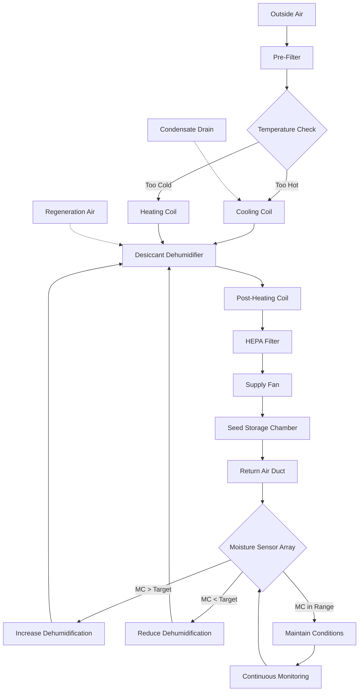

## Physical Principles of Seed Moisture Equilibrium

Seed moisture content represents the critical balance between seed viability and degradation. Seeds stored within the 5-13% moisture content range maintain metabolic dormancy while preserving germination potential. This equilibrium state depends on the thermodynamic relationship between water activity in the seed and relative humidity in the surrounding air.

The equilibrium moisture content (EMC) of seeds follows sorption isotherms described by the Henderson equation:

$$
M = \left[\frac{\ln(1-RH)}{-A(T+C)}\right]^{1/B}
$$

Where:
- $M$ = equilibrium moisture content (decimal, dry basis)
- $RH$ = relative humidity (decimal)
- $T$ = temperature (°C)
- $A, B, C$ = empirical constants specific to seed type

The relationship between water activity ($a_w$) and relative humidity establishes the driving force for moisture migration:

$$
a_w = \frac{p}{p_s} = \frac{RH}{100}
$$

Where $p$ is vapor pressure at the seed surface and $p_s$ is saturation vapor pressure at storage temperature.

## Moisture Content Requirements by Seed Type

Different seed classifications require specific moisture content targets based on their biochemical composition and storage sensitivity:

| Seed Category | Optimal Moisture (%) | Storage Temp (°F) | Max RH (%) | Storage Duration |
|---------------|---------------------|-------------------|------------|------------------|
| Cereal grains (wheat, barley) | 12-13 | 40-50 | 60-65 | 12-18 months |
| Oilseeds (soybean, sunflower) | 8-9 | 35-45 | 50-55 | 8-12 months |
| Legumes (peas, beans) | 10-12 | 40-50 | 55-60 | 10-15 months |
| Vegetable seeds (tomato, pepper) | 5-8 | 35-45 | 40-50 | 18-36 months |
| Hybrid corn seed | 10-12 | 40-50 | 55-60 | 8-10 months |
| Small grains (canola, mustard) | 8-10 | 35-45 | 50-55 | 12-18 months |

## Psychrometric Fundamentals for Seed Storage

Maintaining target moisture content requires precise control of air temperature and relative humidity. The relationship between these parameters governs moisture transfer rates between seeds and the storage environment.

The rate of moisture change follows Fick's second law for diffusion:

$$
\frac{\partial M}{\partial t} = D_{eff} \nabla^2 M
$$

Where $D_{eff}$ is the effective moisture diffusivity, temperature-dependent according to the Arrhenius relationship:

$$
D_{eff} = D_0 \exp\left(\frac{-E_a}{RT}\right)
$$

With $E_a$ as activation energy (typically 25-45 kJ/mol for seeds), $R$ as the gas constant (8.314 J/mol·K), and $T$ as absolute temperature.

## HVAC System Design for Moisture Control

## Critical Design Parameters

**Dehumidification Capacity**

Calculate required moisture removal rate:

$$
\dot{m}_{water} = \dot{V} \rho_{air} (W_1 - W_2)
$$

Where $\dot{V}$ is volumetric airflow rate, $\rho_{air}$ is air density, and $W_1, W_2$ are humidity ratios (lb water/lb dry air) at inlet and outlet conditions.

**Air Change Rate**

Seed storage facilities require 2-4 air changes per hour during active conditioning, reducing to 0.5-1 ACH during stable storage:

$$
ACH = \frac{Q_{supply}}{V_{storage}}
$$

**Temperature-Moisture Interaction**

The Roberts-Ellis viability equation quantifies seed longevity as a function of moisture and temperature:

$$
v = K_E - C_H \log_{10}(M) - C_T T - C_Q T^2
$$

Where $v$ is storage period for 50% viability loss, and $C_H, C_T, C_Q$ are species-specific constants.

## Control Strategies for Precision Moisture Management

**Desiccant Dehumidification Systems**

Desiccant wheels provide precise dewpoint control independent of temperature, essential for achieving sub-50% RH conditions. Regeneration temperature typically operates at 250-350°F with energy recovery:

$$
\eta_{recovery} = \frac{T_{exhaust} - T_{ambient}}{T_{regeneration} - T_{ambient}}
$$

**Monitoring and Adjustment**

Deploy moisture sensors at multiple locations within storage bins. Sensor placement follows the principle that moisture migrates from warmer to cooler zones, creating vertical gradients. Measure at:

- Top surface (highest risk of condensation)
- Mid-depth (bulk average)
- Bottom zone (coolest region)

**Prevention of Overdrying Damage**

Excessive drying below 5% moisture content causes seed coat cracking and embryo damage. Implement low-limit controls that halt dehumidification when moisture content approaches the lower threshold:

$$
\Delta P_{crack} = \frac{E \Delta M}{(1-\nu^2)}
$$

Where mechanical stress ($\Delta P$) in the seed coat relates to modulus of elasticity ($E$), moisture change ($\Delta M$), and Poisson's ratio ($\nu$).

## Energy Efficiency Considerations

Seed storage HVAC systems operate continuously throughout storage duration. Optimize energy consumption through:

- Variable frequency drives on supply fans (30-50% energy reduction)
- Heat recovery from desiccant regeneration cycle
- Night cooling during favorable ambient conditions
- Thermal mass utilization in building structure

The specific energy consumption for moisture removal:

$$
SEC = \frac{E_{total}}{m_{seed} \Delta M}
$$

Typically ranges from 800-1500 kWh per ton of water removed, varying with initial moisture content and ambient conditions.

## Standards and Testing Protocols

Moisture content verification follows ASAE S352.2 standards using oven-dry method at 103°C for 72 hours. In-line moisture meters require calibration against gravimetric methods every 30 days during active storage periods.

Target moisture content selection balances viability preservation against fungal growth risk. Below 13% moisture content, fungal activity ceases for most species, while enzymatic degradation minimizes below 8% moisture content at temperatures below 50°F.
