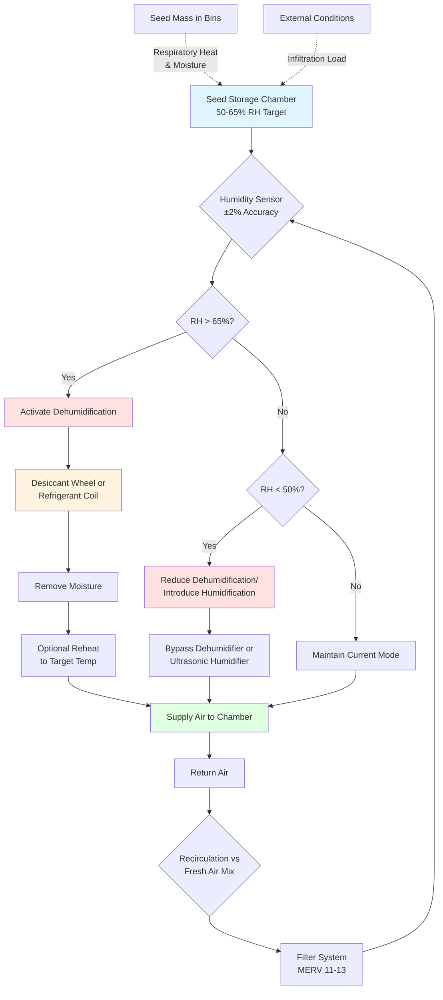

## Physical Principles of Seed Storage Humidity Control

Seed viability depends fundamentally on maintaining moisture equilibrium between the seed interior and surrounding air. The hygroscopic nature of seeds creates a dynamic moisture exchange governed by sorption isotherms, making precise relative humidity control critical for long-term preservation.

### Moisture Equilibrium Thermodynamics

Seeds reach equilibrium moisture content (EMC) through vapor pressure equalization between internal cellular structures and ambient air. This relationship follows the modified Henderson equation:

$$\text{EMC} = \left[\frac{-\ln(1-\text{RH}/100)}{A \cdot (T+B)}\right]^{1/C}$$

Where:
- EMC = equilibrium moisture content (% dry basis)
- RH = relative humidity (%)
- T = temperature (°C)
- A, B, C = empirical constants specific to seed species

For most agricultural seeds at 50-65% RH and 10-15°C storage temperature, EMC stabilizes between 8-12% moisture content, the optimal range preventing both desiccation damage and fungal proliferation.

### Seed Respiration and Heat Generation

Living seed tissues continue respiration, generating metabolic heat and moisture according to:

$$Q_{\text{resp}} = m_s \cdot R_r \cdot f(T) \cdot f(\text{MC})$$

Where:
- $Q_{\text{resp}}$ = respiratory heat (W)
- $m_s$ = seed mass (kg)
- $R_r$ = base respiration rate (W/kg)
- $f(T)$ = temperature dependency function
- $f(\text{MC})$ = moisture content dependency function

Maintaining 50-65% RH directly suppresses $f(\text{MC})$, reducing respiration rates by 60-80% compared to 75% RH conditions. This reduces both sensible heat load and moisture generation within storage bins.

## HVAC System Design for 50-65% RH Control

### Psychrometric Requirements

The HVAC system must maintain supply air conditions that account for:

1. **Sensible heat removal**: Respiratory heat plus solar and structural gains
2. **Latent heat removal**: Moisture release from seed respiration and potential condensation
3. **Ventilation requirements**: Fresh air introduction without compromising RH control

Supply air humidity ratio must satisfy:

$$\omega_{\text{supply}} = \omega_{\text{space}} - \frac{m_{\text{moisture}}}{m_{\text{air}}}$$

For 50-65% RH at 12°C storage temperature, supply air should maintain 0.0045-0.0060 kg water/kg dry air (approximately 5-8°C dew point).

### Dehumidification Strategies

**Desiccant Dehumidification**

Preferred for precise control in the 50-65% RH range, desiccant systems provide:

- Continuous moisture removal independent of coil temperature limitations
- Regeneration heat recovery opportunities
- Minimal temperature fluctuation during humidity control

Desiccant wheel moisture removal capacity:

$$\dot{m}_{\text{water}} = \dot{V} \cdot \rho_{\text{air}} \cdot (\omega_{\text{inlet}} - \omega_{\text{outlet}})$$

**Refrigerant-Based Systems with Reheat**

Overcool to condense moisture, then reheat to target temperature:

$$Q_{\text{reheat}} = \dot{m}_{\text{air}} \cdot c_p \cdot (T_{\text{final}} - T_{\text{coil}})$$

Less energy-efficient than desiccant for this humidity range but acceptable for smaller facilities.

## Seed Type RH Requirements

Different seed species exhibit varying moisture equilibrium characteristics:

| Seed Type | Optimal RH Range | Target EMC | Storage Temp | Max Storage Duration |
|-----------|------------------|------------|--------------|---------------------|
| Corn (Maize) | 55-65% | 10-12% | 10-15°C | 12-18 months |
| Soybeans | 50-60% | 9-11% | 8-12°C | 10-15 months |
| Wheat | 55-65% | 11-13% | 10-15°C | 18-24 months |
| Rice | 50-60% | 10-12% | 12-18°C | 12-18 months |
| Vegetable Seeds | 50-55% | 8-10% | 5-10°C | 24-36 months |
| Flower Seeds | 50-60% | 8-11% | 8-12°C | 18-30 months |

### Control Tolerance Requirements

Maintaining RH within ±5% of setpoint prevents moisture cycling that accelerates seed deterioration. Each 10% RH swing causes approximately 2% EMC variation, inducing expansion-contraction stress on seed coats.

## Humidity Control System Schematic

## Standards and Best Practices

**ASABE Standards**
- ASABE S352.2: Moisture measurement for unground grain and seeds
- ASABE D245.6: Moisture relationships of plant-based agricultural products

**Monitoring Requirements**
- RH sensors: ±2% accuracy, calibrated quarterly
- Temperature sensors: ±0.5°C accuracy
- Air velocity verification: minimum 0.15 m/s through seed mass
- Data logging: 15-minute intervals minimum

**Energy Optimization**

The relationship between storage temperature and dehumidification energy reveals:

$$\text{COP}_{\text{dehumidification}} = \frac{h_{fg}}{h_{\text{regeneration}} - h_{\text{process}}}$$

Operating at lower temperatures (10-12°C vs 20-25°C) reduces vapor pressure differential, lowering dehumidification energy demand by 30-40% while simultaneously reducing seed respiration rates.

## System Commissioning and Verification

1. **Uniformity Testing**: Verify <3% RH variation across storage volume
2. **Load Response**: Confirm system maintains setpoint during maximum seed loading
3. **Infiltration Control**: Pressure test facility to <0.1 air changes per hour
4. **Control Stability**: Monitor for oscillation; PID tuning to prevent RH cycling

Proper implementation of 50-65% RH control extends seed viability from 6-8 months (uncontrolled storage) to 18-36 months, preserving germination rates above 85% for commercial-grade seed stocks.

## Conclusion

Maintaining 50-65% RH in seed storage facilities requires understanding moisture sorption thermodynamics and applying dehumidification systems capable of precise control in this moderate humidity range. Desiccant-based systems typically provide superior performance compared to refrigerant overcool-reheat approaches, delivering energy-efficient operation while preventing moisture cycling damage. Combined with temperature control at 8-15°C, this RH range optimizes the physical conditions for long-term seed preservation across most agricultural and horticultural species.
