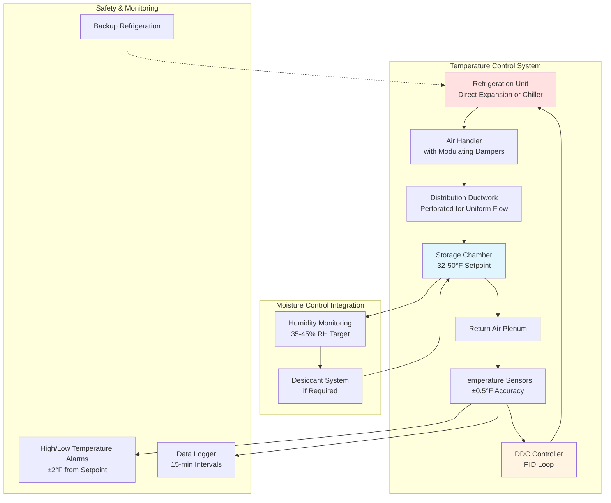

## Thermodynamic Principles of Seed Storage at 32-50°F

Cold storage between 32-50°F (0-10°C) represents the optimal temperature range for extending seed viability by reducing metabolic respiration rates. This temperature band exploits the exponential relationship between temperature and biochemical reaction kinetics, governed by the Arrhenius equation applied to seed respiration.

### Respiration Rate and Temperature Relationship

Seed deterioration is fundamentally a function of respiration rate, which follows an exponential temperature dependence. The respiration rate at any temperature can be expressed as:

$$Q_r = Q_{r0} \cdot e^{\frac{-E_a}{R} \left(\frac{1}{T} - \frac{1}{T_0}\right)}$$

Where:
- $Q_r$ = respiration rate at temperature T (mg CO₂/kg·hr)
- $Q_{r0}$ = respiration rate at reference temperature $T_0$ (typically 20°C)
- $E_a$ = activation energy for respiration (typically 50-65 kJ/mol for seeds)
- $R$ = universal gas constant (8.314 J/mol·K)
- $T$ = absolute temperature (K)
- $T_0$ = reference absolute temperature (K)

The temperature coefficient Q₁₀ (respiration rate change per 10°C) for seeds typically ranges from 2.0 to 3.0, meaning respiration rate doubles to triples with each 10°C temperature increase:

$$Q_{10} = \left(\frac{Q_{r2}}{Q_{r1}}\right)^{\frac{10}{T_2-T_1}}$$

For storage at 5°C (41°F) versus 20°C (68°F), assuming Q₁₀ = 2.5, the respiration rate reduction is approximately 56%, translating directly to extended seed longevity.

## Temperature Effects on Seed Viability

| Temperature Range | Relative Respiration Rate | Expected Storage Duration | Viability Loss Rate | Optimal Seed Types |
|-------------------|---------------------------|---------------------------|---------------------|-------------------|
| 32-35°F (0-2°C) | 0.20-0.25 | 5-10 years | 0.5-1% per year | Orthodox seeds, cereals |
| 36-40°F (2-4°C) | 0.30-0.40 | 3-7 years | 1-2% per year | Most vegetable seeds |
| 41-45°F (5-7°C) | 0.45-0.55 | 2-5 years | 2-4% per year | Legumes, soybeans |
| 46-50°F (8-10°C) | 0.60-0.75 | 1-3 years | 4-6% per year | Short-term commercial storage |
| Reference: 68°F (20°C) | 1.00 | <1 year | 10-15% per year | Not recommended |

*Note: Values assume moisture content of 8-12% and proper sealed storage*

## HVAC System Design for Cold Seed Storage

## Heat Load Calculation for Seed Storage Facilities

The total refrigeration load for maintaining 32-50°F storage consists of:

$$Q_{total} = Q_{envelope} + Q_{product} + Q_{infiltration} + Q_{respiration} + Q_{equipment}$$

### Envelope Heat Gain

Through insulated walls, ceiling, and floor:

$$Q_{envelope} = U \cdot A \cdot \Delta T$$

Where:
- $U$ = overall heat transfer coefficient (typically 0.020-0.030 Btu/hr·ft²·°F for R-30 to R-50 insulation)
- $A$ = surface area (ft²)
- $\Delta T$ = temperature difference between ambient and storage (°F)

### Product Cooling Load

For initial seed mass cooling from ambient to storage temperature:

$$Q_{product} = \frac{m \cdot c_p \cdot \Delta T}{t}$$

Where:
- $m$ = seed mass (lb)
- $c_p$ = specific heat of seeds (typically 0.35-0.45 Btu/lb·°F)
- $\Delta T$ = temperature reduction (°F)
- $t$ = cooling period (hr)

### Respiration Heat Release

Seeds continue metabolic activity even at cold temperatures:

$$Q_{respiration} = m \cdot q_r \cdot C_f$$

Where:
- $m$ = seed mass (lb)
- $q_r$ = specific respiration heat release (0.5-2.0 Btu/lb·day at 32-50°F)
- $C_f$ = conversion factor to hourly basis

## Cold Storage Preservation Standards

**USDA and International Seed Storage Guidelines:**

- **Temperature uniformity:** ±1.0°F maximum variation throughout storage volume
- **Temperature stability:** ±0.5°F from setpoint over 24-hour period
- **Moisture content:** 8-12% for orthodox seeds before cold storage
- **Relative humidity:** 35-45% to prevent moisture migration
- **Air velocity:** <50 fpm across seed containers to minimize desiccation
- **Monitoring frequency:** Continuous digital monitoring with 15-minute logging intervals

**AOSA (Association of Official Seed Analysts) Recommendations:**

Seeds stored at 40°F (4°C) with controlled moisture maintain >85% germination rates for 3-5 times longer than ambient storage. Each 10°F reduction in storage temperature approximately doubles seed longevity.

## System Design Considerations

**Refrigeration System Selection:**

For facilities storing 10,000-100,000+ lb of seeds:
- Direct expansion (DX) systems for smaller facilities (<5,000 ft³)
- Glycol chiller systems for larger operations with multiple zones
- Redundant refrigeration capacity (N+1 configuration) for critical seed banks
- Variable capacity compressors for efficient part-load operation

**Control Strategy:**

Implement proportional-integral-derivative (PID) control with:
- Proportional band: 3-5°F
- Integral time: 5-10 minutes
- Derivative time: 1-2 minutes
- Setpoint: 40-42°F for general purpose storage

**Energy Efficiency Measures:**

- High-efficiency compressors (EER >12.0)
- Economizer cycles when ambient temperatures drop below 50°F
- Demand-controlled defrost cycles
- LED lighting to minimize internal heat gain
- Thermal mass stabilization using water-filled containers

## Conclusion

Maintaining seed storage temperatures between 32-50°F requires precise HVAC design based on thermodynamic principles governing seed respiration kinetics. The exponential relationship between temperature and metabolic activity makes cold storage the most effective method for preserving seed viability. Proper system sizing, temperature uniformity, and continuous monitoring ensure optimal seed preservation for agricultural, research, and conservation applications.

---

**File:** `/Users/evgenygantman/Documents/github/gantmane/hvac/content/specialty-applications-testing/specialty-hvac-applications/farm-crops-processing/seed-storage/temperature-32-50f/_index.md`
