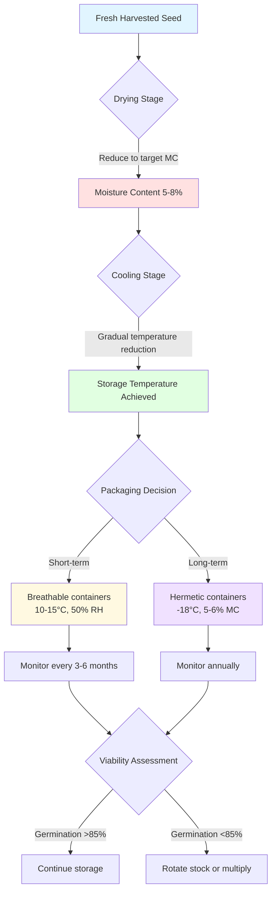
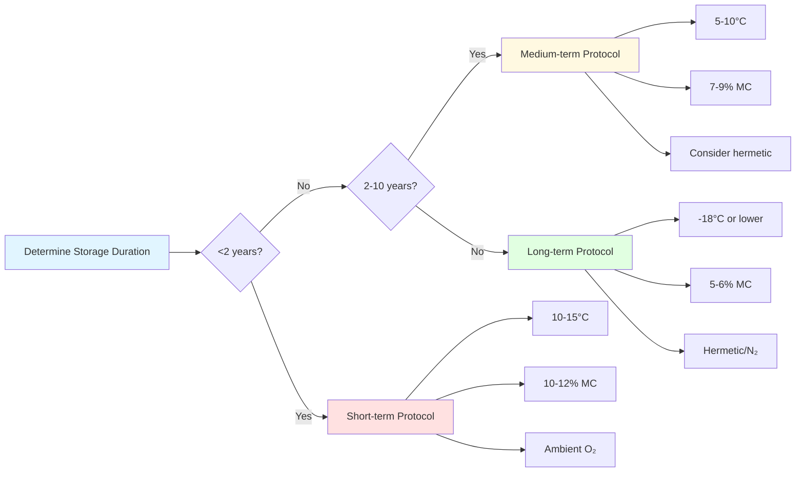

## Physical Basis of Seed Deterioration

Seed viability loss represents an irreversible thermodynamic process driven by biochemical degradation. Three environmental parameters control deterioration kinetics: temperature, moisture content, and oxygen partial pressure. These factors accelerate oxidative damage to cellular membranes, denature storage proteins, and fragment nucleic acids through hydrolytic reactions.

The metabolic heat generation from a seed mass follows:

$$Q_{resp} = m_{seed} \cdot r_{O_2} \cdot \Delta H_{comb}$$

Where $Q_{resp}$ is respiration heat (W), $m_{seed}$ is seed mass (kg), $r_{O_2}$ is oxygen consumption rate (kg O₂/kg·s), and $\Delta H_{comb}$ is the heat of combustion for seed carbohydrates (approximately 16,000 kJ/kg O₂).

## Harrington's Rule for Seed Longevity

Harrington established empirical relationships quantifying how storage conditions affect seed life expectancy. The rule states that for orthodox seeds (tolerant of desiccation):

**Temperature Effect:** Each 5°C reduction in storage temperature doubles seed longevity.

**Moisture Effect:** Each 1% reduction in seed moisture content doubles seed longevity.

The combined relationship yields:

$$L = L_0 \cdot 2^{-(T-T_0)/5} \cdot 2^{-(M-M_0)}$$

Where $L$ is storage life (years), $L_0$ is baseline life at reference conditions, $T$ is temperature (°C), $T_0$ is reference temperature, $M$ is moisture content (%), and $M_0$ is reference moisture content.

**Critical Constraints:**
- Applies to moisture content range: 5-14% (wet basis)
- Valid for temperature range: 0-50°C
- Orthodox seeds only (excludes recalcitrant types)

For maximum longevity, the sum $(T°C + M\%)$ should not exceed 10-15 for commercial storage or 5-8 for long-term germplasm preservation.

## Equilibrium Moisture Content

Seeds equilibrate with ambient relative humidity through sorption isotherms. The Henderson equation describes this relationship:

$$M_e = \left[\frac{-\ln(1-RH/100)}{A \cdot (T+C)}\right]^{1/B}$$

Where $M_e$ is equilibrium moisture content (% dry basis), $RH$ is relative humidity (%), $T$ is temperature (°C), and $A$, $B$, $C$ are seed-specific constants.

For many agricultural seeds: $A \approx 1.0 \times 10^{-5}$, $B \approx 2.0$, $C \approx 273.15$.

### Equilibrium Conditions by Storage Strategy

| Storage Type | Temperature | RH Target | EMC Target | Expected Life |
|--------------|-------------|-----------|------------|---------------|
| Short-term (1-2 yr) | 10-15°C | 50-60% | 10-12% | 18-24 months |
| Medium-term (3-10 yr) | 5-10°C | 35-45% | 7-9% | 5-10 years |
| Long-term (10+ yr) | -18°C | 25-35% | 5-6% | 20-50 years |
| Cryopreservation | -196°C | N/A | 5% | 100+ years |

## Respiration Suppression Mechanisms

Seed respiration follows Arrhenius kinetics. The temperature dependence of respiration rate:

$$r = r_0 \cdot e^{-E_a/(R \cdot T)}$$

Where $r$ is respiration rate, $r_0$ is pre-exponential factor, $E_a$ is activation energy (typically 50-80 kJ/mol for seeds), $R$ is gas constant (8.314 J/mol·K), and $T$ is absolute temperature (K).

**Key suppression strategies:**

1. **Temperature Reduction:** Decreasing from 25°C to 5°C reduces respiration by 80-90%
2. **Moisture Reduction:** Below 8% moisture, enzymatic activity becomes negligible
3. **Oxygen Limitation:** Hermetic storage with O₂ < 2% suppresses aerobic metabolism
4. **Inert Atmosphere:** N₂ or CO₂ environments prevent oxidative damage

## Germination Testing Protocols

ASHRAE does not directly specify germination testing, but AOSA (Association of Official Seed Analysts) and ISTA (International Seed Testing Association) protocols apply.

**Standard Germination Test:**
- Sample size: 400 seeds (4 replicates of 100)
- Temperature: Species-specific (typically 20-25°C)
- Substrate: Between paper or in sand
- Duration: 7-28 days depending on species
- Metric: Normal seedlings / total seeds × 100%

**Accelerated Aging Test:**
Predicts storage potential by exposing seeds to 41-45°C at 100% RH for 48-96 hours, then conducting standard germination.

The vigor index combines germination percentage with seedling growth metrics:

$$VI = \frac{\sum (G_i \cdot D_i)}{D_{max}}$$

Where $VI$ is vigor index, $G_i$ is germination count at day $i$, $D_i$ is day number, and $D_{max}$ is test duration.

## Storage Strategy Decision Matrix

## HVAC System Design Implications

Seed storage facilities require precision environmental control:

**Temperature Control:**
- Tolerance: ±2°C for short-term, ±1°C for long-term
- Load calculation must include respiration heat (typically 0.5-2 W/m³ for dry seeds)
- Avoid thermal cycling; gradual temperature changes only

**Humidity Control:**
- Desiccant dehumidification preferred for <30% RH requirements
- Dew point control more reliable than RH control at low temperatures
- ASHRAE Standard 62.1 ventilation rates do not apply; minimize outdoor air

**Air Distribution:**
- Low velocity (< 0.5 m/s) to prevent moisture stratification
- No direct airflow on seed containers
- Uniform temperature distribution critical (±0.5°C throughout space)

**Monitoring Requirements:**
- Temperature sensors: ±0.2°C accuracy, <1 minute response time
- RH sensors: ±2% accuracy at low RH ranges
- Data logging interval: 15 minutes minimum
- Alarm thresholds: Temperature ±3°C, RH ±5% from setpoint

## Economic Optimization

The trade-off between storage investment and seed replacement costs:

$$C_{total} = C_{storage} + C_{replacement} \cdot P_{failure}$$

Where $C_{total}$ is total annual cost, $C_{storage}$ is facility operating cost ($/year), $C_{replacement}$ is seed replacement cost, and $P_{failure}$ is probability of viability loss.

For high-value germplasm or foundation seed, long-term controlled storage shows positive return on investment within 5-10 years compared to periodic seed multiplication cycles.

## Practical Implementation

**Pre-storage conditioning:**
1. Dry seeds gradually (maximum 0.5% MC reduction per day)
2. Cool in stages (5-10°C reduction per day)
3. Equilibrate at target conditions for 48 hours before sealing

**Container selection:**
- Laminated foil-polyethylene for hermetic seal
- Minimize headspace (seed to container volume >0.7)
- Include oxygen absorbers for long-term storage

**Inventory management:**
- First-in-first-out rotation for commercial stocks
- Annual germination testing for long-term storage
- Regeneration when viability drops below 85% of initial
