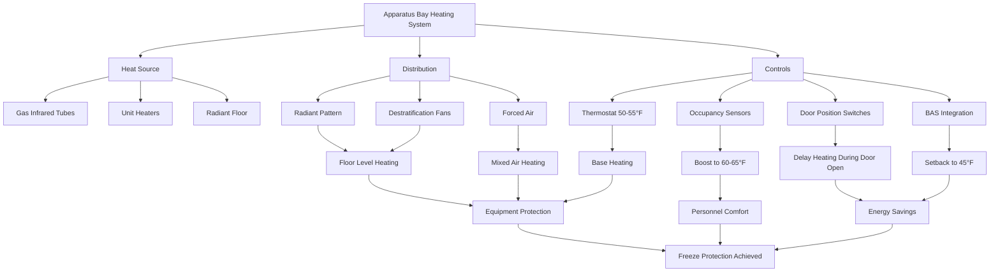

Fire apparatus bays require specialized heating strategies that balance equipment protection, personnel comfort during brief occupancy, and energy efficiency. The standard design temperature range of 50-60°F provides adequate freeze protection for apparatus and building systems while minimizing heating costs in these large, high-volume spaces with frequent door operations.

## Design Temperature Setpoints

Apparatus bays are maintained at lower temperatures than occupied spaces due to their intermittent occupancy and the thermal mass of fire apparatus. Design setpoints include:

**Standard Operating Conditions:**
- Normal setpoint: 50-55°F (10-13°C)
- Occupied boost: 60-65°F (16-18°C) during apparatus maintenance
- Minimum setpoint: 45°F (7°C) for freeze protection
- Setback temperature: 40-45°F (4-7°C) during extended unoccupied periods

The temperature must prevent freezing of water-based fire suppression systems, apparatus water tanks, and foam concentrate. Modern apparatus with heated compartments can tolerate lower bay temperatures, but plumbing fixtures and floor drains require continuous protection.

## Equipment Freeze Protection Requirements

Building systems within apparatus bays demand careful freeze protection:

**Critical Components:**
- Floor drains and trench drains: Maintain 45°F minimum
- Hose towers and wash racks: Heat trace or continuous circulation
- Fire sprinkler systems: Dry pipe or antifreeze loop preferred
- Potable water piping: Insulate and maintain 50°F minimum
- Apparatus fill stations: Heat trace and insulated enclosures

The apparatus themselves typically include integral tank heaters and compartment heating systems that operate independently of bay temperature. However, sudden temperature drops from door operations can stress these systems.

## Radiant vs. Forced Air Heating

Apparatus bays benefit significantly from radiant heating due to high ceilings and frequent door operations.

### Radiant Heating Systems

**Gas-fired infrared tube heaters** are the most common solution:
- Mounted at 12-20 ft height along bay walls
- Provide direct heating to floor and apparatus surfaces
- Minimal air movement reduces stratification
- Unaffected by door operations and air infiltration
- Recovery time: 15-30 minutes after door closure

**Electric radiant panels** offer clean, quiet operation:
- Suitable for stations with ample electrical capacity
- Zero combustion products
- Lower maintenance requirements
- Higher operating costs in most regions

### Forced Air Systems

**Unit heaters** provide rapid temperature response:
- Mounted at high points (20+ ft) with horizontal discharge
- Require destratification fans for even temperature distribution
- Significant heat loss during door operations
- More suitable for smaller bays or combined systems

The heat output required for radiant systems can be estimated using:

$$Q_{radiant} = \frac{A \cdot U \cdot \Delta T}{\eta_{radiant}}$$

where $A$ is floor area (ft²), $U$ is overall heat transfer coefficient (Btu/hr·ft²·°F), $\Delta T$ is temperature difference (°F), and $\eta_{radiant}$ is radiant system efficiency (typically 0.65-0.75).

## Heat Loss from Bay Door Operations

Door operations represent the dominant heat loss mechanism in apparatus bays. Each door opening creates massive air exchange:

**Infiltration Heat Loss:**

$$Q_{infiltration} = 1.08 \cdot CFM \cdot \Delta T$$

For a typical 14 ft × 14 ft bay door, the instantaneous air exchange approximates:

$$CFM \approx A_{door} \cdot V_{air} \cdot 60$$

where $A_{door}$ is door area (196 ft² for 14×14) and $V_{air}$ is air velocity (assume 50-100 fpm during opening).

**Typical Door Operation Impact:**
- Single door opening: 2,000-4,000 CFM instantaneous exchange
- Temperature drop: 5-15°F depending on outdoor conditions
- Recovery time (radiant): 20-40 minutes
- Recovery time (forced air): 10-20 minutes
- Daily heat loss: 30-50% of total heating load in cold climates

Air curtains or vestibule doors can reduce infiltration by 60-70% but are rarely used due to clearance requirements and operational concerns.

## Heating System Options Comparison

| Heating System | Initial Cost | Operating Cost | Recovery Time | Comfort | Maintenance |
|----------------|--------------|----------------|---------------|---------|-------------|
| Gas infrared tube | Moderate | Low | 20-40 min | Excellent | Low |
| Electric infrared | Moderate-High | High | 20-40 min | Excellent | Very Low |
| Gas unit heaters | Low | Moderate | 10-20 min | Fair | Moderate |
| Hydronic radiant floor | Very High | Low | 60-120 min | Excellent | Low |
| Hybrid radiant/forced air | High | Low-Moderate | 15-30 min | Very Good | Moderate |

## Energy Efficiency Considerations

Apparatus bays consume significant heating energy despite low temperature setpoints due to their volume and infiltration:

**Efficiency Strategies:**
- High-efficiency infrared heaters (80-90% thermal efficiency)
- Zoned heating for individual bay doors
- Occupancy sensors for automatic setback
- Insulated overhead doors with weatherstripping (R-value ≥ 12)
- Destratification fans to reduce ceiling stratification
- Heat recovery from apparatus exhaust systems

The total heating load combines envelope losses and infiltration:

$$Q_{total} = Q_{envelope} + Q_{infiltration} + Q_{door\_operations}$$

In cold climates, door operations and infiltration account for 60-75% of total heating energy consumption.

## Setback During Unoccupied Periods

Automated setback reduces energy consumption during predictable unoccupied periods:

**Setback Schedule:**
- Normal: 50-55°F during duty hours
- Night setback: 45-50°F (midnight to 6:00 AM)
- Extended absence: 40-45°F (training exercises, extended calls)
- Boost mode: 60-65°F activated by personnel or maintenance schedule

Modern building automation systems can integrate with dispatch systems to initiate warm-up cycles when apparatus return from calls, ensuring comfortable conditions upon arrival.

**Estimated Energy Savings:**
- 5°F night setback: 15-25% heating energy reduction
- Optimized recovery scheduling: additional 5-10% savings
- Occupancy-based boost: 10-15% savings versus continuous 60°F

## Apparatus Bay Heating System Schematic

The low-temperature heating strategy for apparatus bays represents a balance between equipment protection, operational readiness, and energy efficiency. Radiant heating systems provide the most effective solution for these challenging spaces, minimizing the impact of frequent door operations while maintaining reliable freeze protection for building systems and apparatus.
