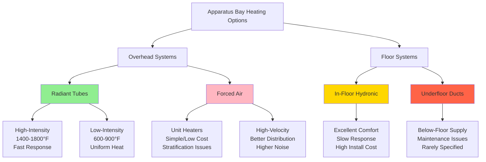

# Overhead and Underfloor HVAC Systems

Fire station apparatus bays require heating system configurations that accommodate vehicle heights reaching 13-14 feet while maintaining operational efficiency during frequent bay door cycles. The choice between overhead and underfloor distribution fundamentally affects energy performance, thermal comfort, and installation cost.

## Overhead Radiant Heating Systems

Gas-fired or electric radiant tube systems mounted at ceiling level deliver infrared energy directly to floor surfaces, vehicles, and personnel without heating the entire air volume. This approach proves most effective in high-bay environments with significant infiltration.

### High-Intensity Radiant Tubes

High-intensity systems utilize U-tube or straight-tube burners operating at 1400-1800°F surface temperature, emitting short-wave infrared radiation that penetrates air without heating it.

**Design Parameters:**

| Parameter | Value | Notes |
|-----------|-------|-------|
| Mounting height | 12-20 ft | Optimum 14-16 ft for apparatus bays |
| Input capacity | 50-80 BTU/hr·ft² | Climate dependent |
| Tube temperature | 1400-1800°F | Vented combustion type |
| Reflector efficiency | 85-92% | Directs radiation downward |
| Pattern width | 1.5-2.0× mounting height | At floor level |

Heat flux delivered to floor surface follows the inverse square law modified by view factor:

$$q'' = \frac{\varepsilon \sigma (T_s^4 - T_{\infty}^4) \cos \theta}{1 + (r/h)^2}$$

Where:
- $q''$ = heat flux at floor (BTU/hr·ft²)
- $\varepsilon$ = emissivity of tube surface (0.85-0.92)
- $\sigma$ = Stefan-Boltzmann constant
- $T_s$ = tube surface temperature (°R)
- $T_{\infty}$ = ambient temperature (°R)
- $\theta$ = angle from normal
- $r$ = radial distance from tube centerline
- $h$ = mounting height

**Advantages:**

- Minimal impact from door operation infiltration
- Fast recovery after bay door cycles (5-10 minutes)
- No floor penetrations or buried components
- Works effectively in bays up to 24 ft ceiling height
- Zoning flexibility with multiple tube runs

**Limitations:**

- High surface temperatures require adequate clearance
- Potential for shadowing behind tall apparatus
- Initial cost 40-60% higher than forced air
- Requires venting for combustion products

### Low-Intensity Radiant Systems

Low-intensity systems operate tube surfaces at 600-900°F through recirculating burner designs or electric resistance elements, producing longer-wave radiation with gentler heat distribution.

**Performance Characteristics:**

Lower surface temperatures provide:
- Reduced clearance requirements (10 ft minimum vs 12 ft)
- More uniform heat distribution
- Better comfort for personnel working under apparatus
- 15-20% lower operating temperatures

The radiant heat transfer coefficient:

$$h_r = \varepsilon \sigma (T_s + T_{floor})(T_s^2 + T_{floor}^2)$$

Low-intensity systems typically deliver $h_r$ = 1.2-1.8 BTU/hr·ft²·°F compared to 2.5-3.5 for high-intensity units.

## Overhead Warm Air Distribution

Forced air heating systems discharge heated air from overhead diffusers or unit heaters positioned around the bay perimeter or at ceiling level.

### Ceiling-Mounted Unit Heaters

Horizontal or vertical unit heaters provide point-source heating with directional discharge patterns.

**Sizing and Placement:**

$$\text{Throw} = V \times \frac{T_{discharge} - T_{ambient}}{50}$$

Where:
- $V$ = discharge velocity (fpm)
- $T$ = temperature (°F)
- Throw = horizontal distance to 50 fpm terminal velocity

**Design Considerations:**

- Input: 60-100 BTU/hr·ft² floor area (cold climates)
- Mounting: 12-16 ft height, angled 15-30° downward
- Discharge velocity: 800-1200 fpm at unit
- Multiple units required for uniform coverage
- Thermostat location: 5 ft above floor, away from doors

**Performance Issues:**

Thermal stratification in high bays creates temperature gradients:

$$\frac{dT}{dz} = 1.5 \text{ to } 3.0 \text{ °F/ft}$$

A 16 ft ceiling height produces 24-48°F temperature difference between floor and ceiling, wasting energy heating upper air volume. Destratification fans consuming 0.1-0.15 W/ft² can reduce gradients by 40-60%.

### High-Velocity Warm Air Systems

Linear slot diffusers or nozzle-type outlets discharge air at 1500-2500 fpm to maintain momentum and prevent stratification.

**System Characteristics:**

| Factor | High-Velocity | Standard Unit Heaters |
|--------|--------------|----------------------|
| Discharge velocity | 1500-2500 fpm | 800-1200 fpm |
| Throw distance | 40-60 ft | 20-30 ft |
| Sound level | 40-50 NC | 35-45 NC |
| Duct velocity | 2000-3000 fpm | 1200-1800 fpm |
| Recovery time (door cycle) | 20-30 min | 30-45 min |

## In-Floor Radiant Heating Design

Hydronic tubing embedded in the concrete slab delivers low-temperature radiant heating from floor surface, providing uniform warmth without consuming overhead space.

### Hydronic Tube Layout

PEX or PERT tubing installed in serpentine or spiral patterns before slab pour creates continuous heated surface.

**Design Parameters:**

$$q = \frac{T_{water,avg} - T_{room}}{R_{total}}$$

Where:
- $q$ = heat output (BTU/hr·ft²)
- $T_{water,avg}$ = average water temperature (°F)
- $T_{room}$ = desired room temperature (°F)
- $R_{total}$ = total thermal resistance (ft²·°F·hr/BTU)

**Typical Configuration:**

| Parameter | Value | Notes |
|-----------|-------|-------|
| Tube spacing | 6-12 in. | Closer spacing for higher output |
| Tube size | 1/2 in. to 3/4 in. PEX | 1/2 in. most common |
| Water temperature | 90-110°F | Low-temperature systems |
| Flow rate | 0.5-1.0 gpm per loop | Maintains turbulent flow |
| Loop length | 200-300 ft maximum | Prevents excessive pressure drop |
| Slab depth above tube | 1.5-2.5 in. | Balances response and efficiency |

The floor surface temperature:

$$T_{surface} = T_{room} + q \times R_{surface}$$

Maintain $T_{surface}$ = 75-85°F for comfort without overheating.

**Thermal Mass Effect:**

Concrete slab thermal storage:

$$Q_{stored} = \rho c V \Delta T$$

Where:
- $\rho$ = concrete density = 145 lb/ft³
- $c$ = specific heat = 0.22 BTU/lb·°F
- $V$ = slab volume (ft³)
- $\Delta T$ = temperature change

A 6-inch slab provides 4.5-6 hour thermal lag, making system slow to respond to setback and setup demands.

**Advantages:**

- Extremely uniform heat distribution
- No overhead equipment interfering with apparatus
- Silent operation, no moving air
- Efficient for continuous occupancy
- Melts snow tracked in on apparatus

**Limitations:**

- 3-4 hour warm-up time from cold start
- Cannot respond to rapid temperature changes
- Slab repairs difficult if tubing damaged
- Installation must occur during construction
- 25-35% higher first cost than radiant tubes

## Underfloor Duct Systems

Concrete slab trenches or cellular metal floor systems accommodate supply air distribution below floor level, delivering warm air through floor registers.

### Trench Duct Design

Precast or formed-in-place concrete trenches house supply ductwork with removable covers or grating.

**Configuration:**

- Trench depth: 12-18 in. below finished floor
- Width: 12-24 in. depending on duct size
- Cover: Steel grating or removable panels
- Register spacing: 8-12 ft on center
- Register size: 12×12 in. to 18×24 in.

Heat delivery per register:

$$q_{register} = 1.08 \times CFM \times (T_{supply} - T_{room})$$

**Operational Challenges:**

- Trench accumulates debris, requiring frequent cleaning
- Moisture collection promotes corrosion
- Vehicle traffic loads may damage covers
- Duct leakage difficult to detect and repair
- Register placement conflicts with vehicle positioning

### Raised Floor Plenum Systems

Elevated structural floor creates continuous underfloor plenum for air distribution, common in data centers but rarely used in apparatus bays due to load requirements.

**Load Considerations:**

Apparatus gross weight: 35,000-75,000 lb (fire engines)

Concentrated wheel loads:

$$P_{wheel} = \frac{W_{axle}}{n_{wheels}} \times \text{impact factor}$$

Standard raised floor systems (250-500 lb/ft² capacity) inadequate for apparatus loads. Heavy-duty systems (2000+ lb/ft²) become cost-prohibitive.

## Equipment Clearance Considerations

Overhead system placement must account for apparatus height and access requirements.

**Apparatus Dimensions:**

| Vehicle Type | Height | Width | Length |
|--------------|--------|-------|--------|
| Engine/Pumper | 10-11 ft | 8-9 ft | 30-35 ft |
| Ladder Truck | 11-13 ft | 8.5-10 ft | 40-50 ft |
| Platform/Tower | 11-12.5 ft | 10 ft | 45-50 ft |
| Ambulance | 9-10 ft | 7-8 ft | 18-22 ft |

**Minimum Clearances:**

- Radiant tubes: 24 in. above apparatus (prevents heat damage to electronics)
- Unit heaters: 18 in. side clearance (allows air circulation)
- Ductwork: 12 in. above apparatus (prevents impact)
- Light fixtures: 16 in. above apparatus (integrated with HVAC planning)

## System Effectiveness Comparison

### Performance Comparison Matrix

| System Type | Energy Efficiency | First Cost | Operating Cost | Response Time | Maintenance | Best Application |
|-------------|-------------------|------------|----------------|---------------|-------------|------------------|
| High-Intensity Radiant | Excellent (90-95%) | High | Low | Fast (5-10 min) | Low | High door cycle frequency |
| Low-Intensity Radiant | Excellent (85-92%) | High | Low | Medium (10-15 min) | Low | Moderate door cycles |
| Unit Heaters | Fair (75-80%) | Low | Medium | Medium (15-25 min) | Medium | Budget-constrained projects |
| High-Velocity Air | Good (80-85%) | Medium | Medium | Medium (20-30 min) | Medium | Tall bays (>20 ft) |
| In-Floor Hydronic | Excellent (90-95%) | Very High | Very Low | Slow (3-4 hr) | Low | 24-hour staffed stations |
| Underfloor Ducts | Poor (65-75%) | Medium | High | Slow (30-45 min) | High | Not recommended |

### Economic Analysis

Life-cycle cost comparison (20-year period, 8000 ft² bay, 6000 HDD climate):

**High-Intensity Radiant:**
- First cost: $64,000-$80,000 ($8-10/ft²)
- Annual energy: $4,800-$6,400
- 20-year total: $160,000-$208,000

**In-Floor Hydronic:**
- First cost: $88,000-$112,000 ($11-14/ft²)
- Annual energy: $3,200-$4,800
- 20-year total: $152,000-$208,000

**Unit Heaters:**
- First cost: $32,000-$48,000 ($4-6/ft²)
- Annual energy: $6,400-$8,800
- 20-year total: $160,000-$224,000

In-floor systems achieve lowest operating cost but require 8-12 years to recover higher first cost through energy savings. Radiant tubes offer best balance of performance and total cost for typical apparatus bay applications.

## Design Recommendations

**Select overhead radiant heating when:**
- Bay doors open frequently (>15 cycles/day)
- Ceiling height 12-20 ft
- Rapid temperature recovery required
- Budget favors lower operating cost over first cost
- Retrofit to existing facility

**Select in-floor radiant heating when:**
- Station continuously staffed (24/7 occupancy)
- New construction with accessible slab placement
- Minimal bay door operation (<10 cycles/day)
- Owner prioritizes comfort and quiet operation
- Budget accommodates higher first cost

**Avoid underfloor duct systems due to:**
- Maintenance access difficulties
- Debris and moisture accumulation
- Potential for duct damage from floor loads
- Poor energy performance from leakage

## Control Strategies

Effective control maximizes efficiency while maintaining readiness:

**Outdoor Reset:**

$$T_{supply} = T_{design} - \frac{(T_{design} - T_{min})(T_{outdoor} - T_{outdoor,design})}{T_{indoor} - T_{outdoor,design}}$$

Modulates supply temperature or radiant tube firing rate based on outdoor conditions.

**Setback Scheduling:**
- Occupied (apparatus in bay): 55-60°F
- Unoccupied nights: 45-50°F
- Deep setback (>8 hr): 40-45°F (in-floor systems not recommended for deep setback)

**Door Interlock:**
- Boost heating output 10 minutes before scheduled apparatus return
- Reduce output when bay door opens (waste prevention)
- Resume normal operation 5 minutes after door closes

## Conclusion

Overhead radiant heating systems provide the most effective solution for fire station apparatus bays, combining energy efficiency with fast response to door operation impacts. High-intensity radiant tubes deliver 30-40% energy savings compared to forced air systems while requiring minimal maintenance. In-floor radiant systems offer superior comfort and lowest operating cost but slow thermal response limits applicability to continuously staffed stations with infrequent door operations. Underfloor duct systems present maintenance and performance challenges that outweigh any installation advantages, making them unsuitable for apparatus bay applications. System selection should prioritize response time, door cycle frequency, and total cost of ownership over first cost alone.
