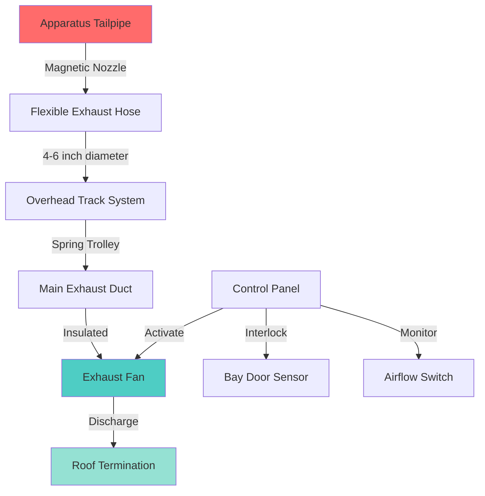

Source capture exhaust systems provide the most effective method for removing diesel exhaust directly at the apparatus tailpipe before emissions disperse into the apparatus bay. These systems capture 95-99% of exhaust gases when properly installed and operated, significantly reducing firefighter exposure to carcinogenic diesel particulate matter.

## Direct Tailpipe Connection Systems

Direct connection systems use rigid or flexible ductwork that connects directly to the vehicle exhaust pipe through a capture nozzle. The connection must accommodate vehicle movement during pull-in and pull-out operations while maintaining an effective seal.

**Key components:**

- Capture nozzles sized 0.5-1.0 inches larger than tailpipe diameter
- Spring-loaded or magnetic disconnect mechanisms
- Heat-resistant materials rated for 1200°F continuous exposure
- Stainless steel or aluminized steel construction
- Quick-disconnect couplings for rapid deployment

The capture nozzle typically features a conical inlet that guides onto the tailpipe, with internal sealing gaskets that accommodate minor misalignment. Proper sizing requires the nozzle to slip over the tailpipe with minimal clearance while allowing thermal expansion.

## Track-Mounted Hose Systems

Track-mounted systems suspend flexible exhaust hose from an overhead rail or track system, allowing the hose to follow vehicle movement during backing operations. These systems provide maximum flexibility for multiple apparatus types and parking configurations.

**System configurations:**

- Overhead monorail tracks with trolley carriages
- Spring-balanced hose reels for constant tension
- 4-6 inch diameter flexible exhaust hose
- Travel distances up to 40 feet from fan connection
- Manual or motorized hose positioning

The track system must provide smooth, low-friction movement to prevent hose drag that could dislodge the tailpipe connection. Rail materials include galvanized steel or aluminum with sealed bearing trolleys.

## Magnetic Disconnect Nozzles

Magnetic disconnect nozzles provide automatic release when the apparatus pulls away, preventing hose damage and ensuring safe departure during emergency response. The magnetic coupling must provide sufficient holding force during operation while releasing cleanly under departure loads.

**Design parameters:**

- Holding force: 15-25 pounds for typical apparatus
- Release force: 30-50 pounds pull force
- High-temperature neodymium magnets
- Stainless steel contact surfaces
- Gasket seal at nozzle-to-tailpipe interface

The magnetic force must be calibrated to resist normal vehicle vibration and air turbulence while releasing before hose damage occurs. Testing should verify clean release at various departure speeds and angles.

## System Fan and Ductwork Sizing

Proper fan sizing ensures adequate exhaust capture velocity while minimizing energy consumption and noise. The system must overcome static pressure losses in the ductwork, fittings, and discharge termination while providing sufficient transport velocity to prevent particulate deposition.

### Airflow Calculation

Required airflow depends on engine size and exhaust gas volume. For diesel apparatus:

$$Q = \frac{CID \times RPM \times VE}{3456}$$

Where:
- $Q$ = airflow rate (CFM)
- $CID$ = engine displacement (cubic inches)
- $RPM$ = maximum idle speed (typically 1000-1200 RPM)
- $VE$ = volumetric efficiency (0.80-0.85 for diesel)
- $3456$ = conversion constant

For a typical 500 CID diesel engine at 1200 RPM:

$$Q = \frac{500 \times 1200 \times 0.82}{3456} = 142 \text{ CFM}$$

Add 25-30% safety factor for system losses:

$$Q_{design} = 142 \times 1.25 = 178 \text{ CFM per apparatus}$$

### Static Pressure Calculation

Total system static pressure includes all resistance components:

$$SP_{total} = SP_{duct} + SP_{fittings} + SP_{hose} + SP_{discharge}$$

For flexible hose sections:

$$SP_{hose} = f \times \frac{L}{D} \times \frac{V^2}{4005}$$

Where:
- $f$ = friction factor (0.03-0.05 for flexible hose)
- $L$ = hose length (feet)
- $D$ = hose diameter (inches)
- $V$ = velocity (FPM)

Maintain transport velocity between 3000-4000 FPM to prevent particulate settling while minimizing pressure loss.

### Fan Selection

Select centrifugal fans rated for high-temperature service (400°F minimum) with backward-inclined or airfoil blades for efficiency. Fan motor should be located outside the airstream or use high-temperature rated motors.

## NIOSH and NFPA Recommendations

**NFPA 1500** (Standard on Fire Department Occupational Safety and Health Program) requires:

- Source capture exhaust systems for all enclosed apparatus bays
- Systems activated before apparatus engine start
- Automatic shutdown prevention if system fails
- Visual and audible alarms for system malfunction
- Regular inspection and maintenance protocols

**NIOSH recommendations:**

- Capture at tailpipe preferred over dilution ventilation
- Minimum 95% capture efficiency at idle conditions
- Airflow verification during annual testing
- Interlock with apparatus ignition when possible
- Training for all personnel on proper connection

**Installation requirements:**

- Hose length minimized to reduce pressure drop
- Ductwork sloped 1/4 inch per foot toward condensate drains
- Insulation on ductwork to prevent condensation
- Discharge location 10 feet from air intakes
- Emergency disconnect at fan for maintenance

## Installation Best Practices

**Planning considerations:**

1. **Track layout** - Position tracks to align with expected apparatus parking positions, allowing 2-3 feet of lateral adjustment
2. **Structural support** - Overhead tracks must support hose weight plus dynamic loads from vehicle movement
3. **Electrical interlock** - Integrate with bay door controls to ensure doors open before apparatus departure
4. **Condensate management** - Install drains at low points with trap primers or automatic draining systems
5. **Accessibility** - Provide access for hose inspection and nozzle replacement

**Commissioning procedures:**

- Verify airflow at each apparatus position using pitot traverse
- Test magnetic disconnect at various angles and speeds
- Confirm interlock operation with bay doors and apparatus ignition
- Document baseline airflow for comparison during maintenance
- Train all personnel on connection procedures and troubleshooting

**Maintenance schedule:**

- **Weekly**: Visual inspection of hoses and connections
- **Monthly**: Clean nozzles and check magnetic holding force
- **Quarterly**: Verify airflow rates and alarm function
- **Annually**: Professional inspection of fan bearings and motor
- **Bi-annually**: Replace flexible hose sections showing deterioration

## Source Capture System Comparison

| System Type | Capture Efficiency | Installation Cost | Operational Cost | Maintenance | Best Application |
|-------------|-------------------|-------------------|------------------|-------------|------------------|
| **Overhead Track with Magnetic Disconnect** | 95-99% | $8,000-$12,000 per bay | Low | Moderate | New construction, multiple apparatus types |
| **Fixed Position Hose Reel** | 90-95% | $5,000-$8,000 per bay | Low | Low | Fixed parking, limited apparatus variety |
| **Under-Floor Spring Reel** | 92-97% | $10,000-$15,000 per bay | Low | Moderate-High | High-end facilities, clean aesthetic |
| **Rigid Articulated Arm** | 97-99% | $12,000-$18,000 per bay | Low | Low | Single apparatus, precise positioning |
| **Cable-Assisted Overhead** | 93-97% | $7,000-$10,000 per bay | Low | Moderate | Retrofit applications, budget constraints |

**Selection criteria:**

- Overhead track systems provide best balance of performance and flexibility
- Magnetic disconnects essential for emergency response reliability
- Under-floor systems eliminate overhead obstructions but complicate maintenance
- Rigid arms offer highest capture efficiency but limit apparatus flexibility
- Cable systems provide economical solution for retrofit applications

**Integration with building systems:**

Source capture exhaust must coordinate with general apparatus bay ventilation to prevent negative pressure that could backdraft exhaust into occupied spaces. Provide makeup air equivalent to 100-110% of exhaust airflow through dedicated units or passive louvers interlocked with exhaust fan operation.

Temperature control becomes critical when large volumes of outdoor air enter during winter months. Consider infrared heating or destratification fans to maintain comfort without excessive energy consumption. Never allow source capture exhaust to be the sole ventilation source - supplemental air changes remove fugitive emissions and maintain air quality during non-exhaust periods.
