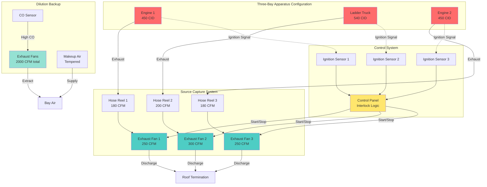

# Vehicle Exhaust Removal Systems for Fire Apparatus

Vehicle exhaust removal systems constitute the primary defense against carcinogen exposure for firefighters working in apparatus bays. Diesel particulate matter contains over 40 documented carcinogens, with epidemiological studies linking chronic exposure to elevated cancer risks. Effective exhaust removal requires integrated design addressing capture methodology, system capacity, automatic controls, and backup ventilation strategies.

## Source Capture vs Dilution Ventilation

The fundamental design choice involves direct source capture at the tailpipe versus dilution of exhaust gases throughout the bay volume.

### Source Capture Systems

Source capture systems mechanically connect to vehicle tailpipes, extracting exhaust gases before dispersion into occupied space. This approach achieves 95-99% capture efficiency when properly operated.

**System Architecture:**

- Articulated boom arms or overhead hose reels
- High-temperature exhaust hose (rated 1200°F minimum)
- Magnetic or spring-loaded tailpipe nozzles with automatic disconnect
- Dedicated exhaust fans (typically one per apparatus position)
- Exhaust termination minimum 10 ft from air intakes

**Performance Characteristics:**

The required exhaust flow depends on engine displacement and operating conditions. For diesel engines at idle:

$$Q_{capture} = 0.15 \times V_{engine} + 100$$

Where:
- $Q_{capture}$ = required capture flow rate (CFM)
- $V_{engine}$ = engine displacement (cubic inches)
- 100 = additional flow for safety margin

For a typical fire engine with 450 cubic inch displacement:

$$Q_{capture} = 0.15 \times 450 + 100 = 167.5 \text{ CFM}$$

Standard systems provide 150-400 CFM per position, scaled to the largest apparatus served.

**Advantages:**

- Minimal energy consumption (operates only during vehicle runtime)
- No bay depressurization or makeup air heating penalty
- Effective contaminant removal at source
- Lower long-term operating costs

**Limitations:**

- Requires crew discipline for connection/disconnection
- Equipment maintenance and periodic hose replacement
- Does not capture emissions during pre-connection warm-up
- Ineffective if crew bypasses system during emergencies

### Dilution Ventilation Systems

Dilution ventilation provides whole-bay air exchange, reducing contaminant concentrations through volumetric airflow. This approach serves as backup protection or standalone solution when source capture is impractical.

**Design Methodology:**

Calculate required dilution airflow using contaminant generation rate and permissible exposure limits:

$$Q_{dilution} = \frac{G \times 403 \times SF}{PEL - C_{background}}$$

Where:
- $Q_{dilution}$ = dilution airflow (CFM)
- $G$ = contaminant generation rate (L/min)
- 403 = unit conversion constant
- $SF$ = safety factor (typically 1.5-2.0)
- $PEL$ = permissible exposure limit (mg/m³)
- $C_{background}$ = background concentration (mg/m³)

**Practical Design Rates:**

| Operating Condition | Air Changes/Hour | Typical Application |
|---------------------|------------------|---------------------|
| Unoccupied/vehicles off | 4-6 ACH | Background ventilation |
| Occasional apparatus movement | 8-10 ACH | Normal operations |
| Extended idling without source capture | 12-15 ACH | Emergency backup mode |
| Multiple simultaneous vehicles | 15-20 ACH | Training or maintenance events |

For a 12,000 ft³ apparatus bay requiring 10 ACH:

$$Q = \frac{12,000 \times 10}{60} = 2,000 \text{ CFM}$$

**System Design Elements:**

- Low-level exhaust (within 12 inches of floor) since cooled diesel exhaust settles
- Makeup air tempered to maintain 50-60°F bay temperature
- Variable speed control based on CO or diesel particulate sensors
- Slight negative pressure (0.02-0.05 in. w.g.) relative to occupied spaces

## NFPA 1500 Requirements for Exhaust Removal

NFPA 1500: Standard on Fire Department Occupational Safety and Health Program establishes mandatory requirements for vehicle exhaust control.

**Key Requirements:**

1. **Section 6.6.1**: Fire stations shall be designed to minimize exposure to vehicle exhaust emissions
2. **Section 6.6.2**: Direct source capture systems or effective mechanical ventilation required
3. **Section 6.6.3**: Systems shall activate automatically upon vehicle startup
4. **Section 6.6.4**: Exhaust discharge location prevents contamination of air intakes

**Compliance Strategy:**

Primary compliance uses source capture with automatic activation interlocks. Dilution ventilation provides secondary protection during pre-connection periods and system failures.

| NFPA Requirement | Source Capture Implementation | Dilution Backup |
|------------------|------------------------------|-----------------|
| Minimize exposure | Direct tailpipe connection | Continuous bay ventilation 6+ ACH |
| Automatic activation | Ignition interlock starts fan | CO sensors trigger high-speed mode |
| Exhaust location | Discharge 10+ ft from intakes | Wall-mounted exhaust fans high/low |
| Prevent contamination | Negative pressure exhaust duct | Bay slightly negative to adjacent spaces |

## System Sizing for Multiple Apparatus

Multi-apparatus bays require capacity analysis addressing simultaneous operation scenarios.

**Sizing Methodology:**

1. **Determine apparatus complement:** Count and classify all vehicles by engine size
2. **Establish simultaneous operation factor:** Probability of concurrent engine operation
3. **Calculate total system capacity:** Sum individual requirements with diversity factor

**Simultaneous Operation Factors:**

- 2-bay station: 1.0 (both apparatus may operate simultaneously)
- 3-bay station: 0.85 (unlikely all three operate continuously)
- 4+ bay station: 0.75 (statistical diversity reduces peak demand)

For a 3-bay station with engines requiring 180, 200, and 180 CFM:

$$Q_{total} = (180 + 200 + 180) \times 0.85 = 476 \text{ CFM}$$

**System Configurations:**

**Individual Fans (Recommended):**
- Dedicated exhaust fan per apparatus position
- Sized for largest vehicle at that position
- Independent operation eliminates crosstalk between positions
- Typical: 200-400 CFM per fan

**Central Fan with Branch Ducts:**
- Single larger fan serves multiple positions via ductwork
- Motorized dampers isolate inactive positions
- Lower equipment cost but higher installation complexity
- Typical: 500-1200 CFM central fan

## Interlock with Vehicle Starting

Automatic activation interlocks ensure exhaust removal operates whenever engines run, eliminating reliance on manual crew actions during emergency response.

**Interlock Methods:**

**Electrical Sensing:**
- Current transformer on starter circuit or alternator output
- Voltage sensing across ignition switch
- Most reliable method for consistent activation
- Typical threshold: 20-30 seconds after engine start

**Pressure Differential:**
- Exhaust backpressure sensor in capture hose
- Activates fan when exhaust flow detected
- Backup method when electrical access unavailable
- Response time: 5-10 seconds

**Optical Detection:**
- Infrared sensors detect hot exhaust gases
- Non-contact sensing for retrofit applications
- Subject to false triggers from other heat sources

**Control Sequence:**

1. Vehicle ignition energizes → sensor detects engine start
2. Time delay (10-20 seconds) allows engine stabilization
3. Exhaust fan energizes to full speed
4. Alarm indicates system active (visual/audible)
5. Engine shutdown → time delay (60-90 seconds) purges residual exhaust
6. Fan de-energizes, system resets

**Interlock Requirements:**

- Manual override allows fan testing without starting vehicles
- Override auto-resets after 15 minutes maximum
- System monitors fan operation; alarm if fan fails to start
- Emergency vehicle departure bypasses system (manual disconnect)

## Bay Door Integration

Apparatus bay doors create significant interaction with exhaust removal systems through infiltration and pressure effects.

**Door Operation Impacts:**

Each bay door opening exchanges 1.5-2.0 bay volumes, introducing makeup air that affects exhaust system performance:

$$Q_{infiltration} = V_{bay} \times ACH_{door} \times \frac{n_{cycles}}{60}$$

Where:
- $V_{bay}$ = bay volume (ft³)
- $ACH_{door}$ = air changes per door cycle (1.5-2.0)
- $n_{cycles}$ = door operations per hour

**Integration Strategies:**

**Time-Delay Coordination:**
- Exhaust fans reduce to minimum speed when door opens
- Prevents excessive outdoor air ingress
- Fans return to full speed 60 seconds after door closes

**Pressure Monitoring:**
- Differential pressure sensors track bay pressure
- System modulates exhaust flow to maintain slight negative pressure
- Prevents excessive negative pressure during closed-door operation

**Makeup Air Interlocks:**
- Tempered makeup air activates when dilution ventilation operates
- Prevents excessive negative pressure that interferes with door operation
- Typical: 80% of exhaust volume provided as makeup air

## Health Protection for Firefighters

Diesel exhaust contains carcinogenic compounds including benzene, formaldehyde, and polycyclic aromatic hydrocarbons (PAHs). The International Agency for Research on Cancer (IARC) classifies diesel exhaust as a Group 1 carcinogen.

**Exposure Pathways:**

- Inhalation during apparatus positioning and maintenance
- Dermal contact with settled particulate matter
- Ingestion through hand-to-mouth contact

**Engineering Controls:**

**Primary Protection (Source Capture):**
- Reduces bay concentrations by 95-99% during connected operation
- Eliminates need for respiratory protection during routine maintenance
- Most effective and OSHA-preferred control hierarchy

**Secondary Protection (Dilution Ventilation):**
- Maintains background concentrations below exposure thresholds
- Provides continuous protection during pre-connection warm-up
- Ventilation rate of 6+ ACH keeps 8-hour TWA below NIOSH REL

**Tertiary Protection (Administrative Controls):**
- SOPs requiring source capture connection before extended idling
- Apparatus warm-up outdoors when practical
- Annual air monitoring to verify exposure levels

**Health Surveillance:**

Fire departments implementing comprehensive exhaust control demonstrate measurable health improvements:

- Reduced biomarkers for PAH exposure (1-hydroxypyrene in urine)
- Lower reported respiratory symptoms
- Decreased cardiovascular disease incidence

**System Performance Verification:**

Regular testing ensures exhaust removal effectiveness:

| Test Parameter | Frequency | Acceptance Criteria |
|----------------|-----------|---------------------|
| Capture velocity at tailpipe | Annual | 100+ fpm with engine at idle |
| Exhaust fan airflow | Annual | Within 10% of design CFM |
| Interlock operation | Quarterly | Fan starts within 30 seconds of ignition |
| Bay CO concentration | Monthly | <35 ppm during apparatus operation |
| System pressure drop | Annual | <2.0 in. w.g. (indicates duct blockage) |

---

**References:**

- NFPA 1500: Standard on Fire Department Occupational Safety and Health Program
- ACGIH Industrial Ventilation Manual, Chapter 10: Local Exhaust Systems
- NIOSH Alert: Preventing Occupational Exposures to Antineoplastic and Other Hazardous Drugs
- ASHRAE 62.1: Ventilation for Acceptable Indoor Air Quality

**Related Topics:**

- Source capture system components and specifications
- Diesel exhaust removal hose materials and ratings
- Bay door infiltration control strategies
- Fire station heating systems for apparatus bays
