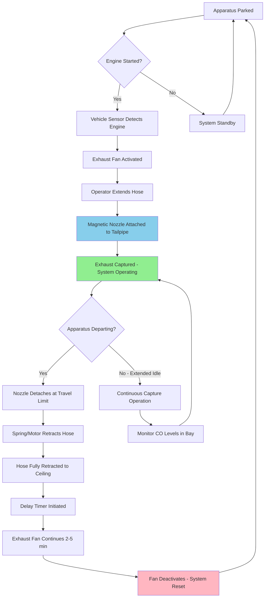

Diesel exhaust hose reel systems serve as the delivery mechanism for source capture ventilation in fire stations, positioning flexible exhaust hoses for connection to apparatus tailpipes. Proper reel design ensures rapid deployment, reliable retraction, and minimal interference with emergency response operations.

## Overhead Hose Reel Configurations

Ceiling-mounted hose reels represent the standard installation approach for apparatus bay exhaust systems. Overhead positioning keeps hoses elevated during retracted storage, preventing trip hazards and protecting hoses from vehicle traffic.

**Strategic Positioning:**

Locate hose reels directly above vehicle parking positions, offset 2-3 feet toward the rear to align with typical tailpipe locations. Mount reels at 8-10 feet above finished floor (AFF) to provide adequate clearance for raised aerial apparatus and allow full hose extension without ground contact during deployment.

Position reels to enable straight-line deployment to tailpipes, minimizing bends that increase pressure drop and reduce hose service life. For apparatus with dual exhaust outlets, install two independent hose reels or specify a dual-hose reel assembly.

**Swing Arm Design:**

Incorporate 180-degree rotational capability to accommodate parking variations and allow apparatus repositioning without disconnecting exhaust capture. Specify heavy-duty ball bearing or sealed roller bearing pivots rated for continuous duty cycles. Thrust bearings must support vertical hose weight (15-25 pounds typical) plus dynamic loading during extension/retraction cycles.

Provide positive stops at rotation limits to prevent hose twist and maintain proper orientation to exhaust ductwork connections. Install flexible duct connectors at reel inlets to isolate mechanical vibration and accommodate full swing radius without ductwork interference.

**Clearance Requirements:**

Maintain minimum 12-inch clearance from overhead door tracks, lighting fixtures, and structural members. Verify adequate ceiling height for fully retracted hose diameter (typically 8-12 inch coil diameter) plus reel housing. Account for apparatus with extended height (aerial ladders, platforms, light towers) to prevent contact during bay transit.

## Hose Length and Retraction Requirements

Hose length selection balances deployment flexibility against pressure drop penalties and retraction reliability. Excessive length increases friction losses and reduces capture velocity at the nozzle, while insufficient length restricts apparatus positioning.

**Length Determination:**

Calculate required hose length using geometric relationships:

$$L = \sqrt{(D_h)^2 + (D_v)^2} + S$$

Where:
- $L$ = Required hose length (ft)
- $D_h$ = Horizontal distance from reel to tailpipe (ft)
- $D_v$ = Vertical distance from reel to tailpipe (ft)
- $S$ = Service loop allowance, typically 2-3 ft

Standard hose lengths range from 12-20 feet for typical apparatus bay configurations. Verify actual deployment distance for each apparatus type, accounting for:

- Vehicle length variations
- Tailpipe positioning (center vs side exit)
- Clearance requirements for cab-tilt operations
- Adjustment range for parking position tolerance

**Retraction Performance:**

Complete retraction must occur within 2-4 seconds after nozzle release to prevent hose damage from departing vehicles. Retraction force must overcome:

$$F_r = F_h + F_f + F_g$$

Where:
- $F_r$ = Required retraction force (lbf)
- $F_h$ = Hose weight component (lbf)
- $F_f$ = Friction force in hose and reel bearings (lbf)
- $F_g$ = Gravitational component for vertical lift (lbf)

Size spring tension or motor torque to provide 25-35% margin above calculated retraction force to maintain consistent performance as springs age or bearings accumulate wear.

## Spring vs Motorized Reel Systems

Hose reel retraction mechanisms employ either constant-force springs or electric motors, each with distinct performance characteristics.

| System Type | Spring-Loaded Reels | Motorized Reels |
|-------------|---------------------|-----------------|
| **Retraction Speed** | Immediate (< 2 sec) | Delayed (3-5 sec) |
| **Initial Cost** | $800-1,500 per reel | $2,000-3,500 per reel |
| **Power Requirements** | None | 120V AC, 2-5A typical |
| **Maintenance Frequency** | Annual spring tension check | Quarterly motor/controller inspection |
| **Failure Mode** | Gradual tension loss | Complete retraction failure |
| **Service Life** | 10-15 years | 8-12 years (motor replacement) |
| **Noise Level** | Low (< 60 dBA) | Moderate (65-75 dBA) |
| **Control Integration** | Passive (automatic) | Active (sensors required) |
| **Cold Weather Performance** | Excellent | Good (heater may be required) |

**Spring-Loaded Systems:**

Constant-force spring mechanisms provide reliable retraction through mechanical energy storage. As the hose extends, the spring winds onto a storage drum, accumulating potential energy released during retraction.

Advantages include:
- Instantaneous retraction upon nozzle release
- No electrical power requirement
- Simple, robust construction
- Minimal maintenance requirements
- Predictable force profile throughout travel

Limitations include:
- Spring fatigue over time (5-10% tension loss per decade)
- Limited adjustment range for varying hose weights
- Higher initial tension can dislodge magnetic nozzles during vehicle backing
- Manual tension adjustment required during maintenance

**Motorized Systems:**

Electric motor-driven reels use gear reducers or direct-drive motors controlled by limit switches or rotary encoders. Vehicle detection sensors (photoelectric, inductive, or pressure-sensitive) trigger automatic retraction sequences.

Advantages include:
- Programmable retraction speed and delay
- Controlled tension prevents nozzle dislodgement
- Easily accommodates different hose weights
- Integration with building automation systems
- Diagnostic feedback for maintenance

Limitations include:
- Electrical power distribution requirements
- Control system complexity
- Delayed retraction creates potential hose damage window
- Higher maintenance burden (motor brushes, limit switches, sensors)
- Backup spring mechanism recommended for power failure

**Selection Criteria:**

Specify spring-loaded reels for:
- New construction installations
- Budget-constrained projects
- Stations with limited electrical capacity
- Cold climate applications
- Installations requiring minimal maintenance

Specify motorized reels for:
- Retrofit applications where spring tension may dislodge existing magnetic nozzles
- Stations with building automation systems
- Applications requiring delayed retraction for operator safety
- Installations with varying hose lengths or weights

## Connection to Vehicle Tailpipes

Hose-to-tailpipe connection methods determine system capture efficiency, deployment speed, and maintenance requirements.

**Magnetic Nozzle Connections:**

Rare-earth magnet assemblies create semi-sealed connections through magnetic attraction to ferrous tailpipe materials. Nozzles incorporate contoured rubber gaskets that conform to tailpipe geometry, achieving 95-98% capture efficiency.

Design the hose-to-nozzle connection with positive mechanical retention (bayonet lock, threaded collar, or quick-connect coupling) to prevent separation during vehicle backing operations. The magnetic holding force (25-50 pounds typical) must exceed hose retraction tension to prevent premature disconnection while remaining within safe manual removal force limits.

**Direct-Connect Adapters:**

Rigid or semi-rigid tailpipe adapters provide mechanical connections through clamp bands, threaded collars, or quick-disconnect couplings. These systems achieve 99%+ capture efficiency through positive sealing.

Connection sequence impacts emergency response time. Specify quick-disconnect designs that complete connection/disconnection in under 3 seconds per apparatus. Train personnel on proper connection technique to prevent cross-threading, incomplete engagement, or gasket damage.

**Ball-Socket Articulation:**

Install ball-socket joints between hose termination and nozzle assembly to accommodate tailpipe misalignment and vehicle movement during backing operations. Specify joints with:
- Angular deflection capability: ±15 degrees minimum
- Rotation capability: 360 degrees continuous
- Temperature rating: 500°F continuous, 800°F intermittent
- Seal material: High-temperature silicone or fluoroelastomer

This articulation prevents hose kinking during deployment and reduces connection force requirements for operators.

## Material Selection for Durability

Exhaust hose materials must withstand continuous exposure to high temperatures, acidic condensates, ozone, and mechanical abrasion while maintaining flexibility throughout the operating temperature range.

**Hose Construction:**

Specify multi-layer construction incorporating:

1. **Inner Layer:** High-temperature silicone rubber or fluoropolymer (PTFE, FEP) providing chemical resistance and smooth flow surfaces
2. **Reinforcement:** Stainless steel wire helix (20-22 gauge) or fiberglass cord maintaining structural integrity during suction conditions
3. **Outer Cover:** Silicone-coated fiberglass fabric or neoprene-coated polyester providing abrasion resistance and weather protection

**Performance Requirements:**

| Property | Specification | Test Method |
|----------|---------------|-------------|
| Temperature Range | -40°F to +500°F continuous | ASTM D6815 |
| Tensile Strength | > 800 psi | ASTM D412 |
| Tear Resistance | > 150 pli | ASTM D624 |
| Flame Resistance | Self-extinguishing | UL 94 V-0 |
| Ozone Resistance | No cracking after 168 hr | ASTM D1149 |
| Compression Set | < 25% at 400°F | ASTM D395 |
| Vacuum Resistance | No collapse at -10" w.c. | SMACNA HVAC-DCS |

**End Fittings:**

Fabricate hose-to-reel connections using galvanized steel, stainless steel, or powder-coated aluminum. Secure hoses to fittings through crimped ferrules, threaded collars with compression rings, or adhesive bonding per manufacturer specifications.

Specify strain relief boots at hose-to-fitting transitions to prevent stress concentration and premature failure. All metal components in contact with exhaust condensate require corrosion-resistant finishes or materials (Type 304/316 stainless steel preferred).

**Reel Construction:**

Fabricate reel drums and frames from 11-14 gauge steel with powder-coat finish or hot-dip galvanizing for corrosion protection. Design drum diameter to limit hose bend radius to $R_{min} \geq 3D_{hose}$ to prevent kinking and extend service life.

Bearings should be sealed ball or roller type with high-temperature grease (NLGI Grade 2, dropping point > 400°F) suitable for continuous duty operation. Specify stainless steel bearing races and seals for corrosive environments.

## Maintenance and Inspection Schedules

Systematic maintenance prevents unexpected failures and ensures consistent capture performance throughout system service life.

**Monthly Inspections (Apparatus Operators):**

Conduct visual inspection during routine apparatus checks:
- Verify hose extends and retracts fully without binding
- Inspect hose exterior for cuts, abrasions, or thermal damage
- Check magnetic nozzle holding force (should require deliberate force to remove)
- Test vehicle detection sensors and automatic fan activation
- Document any anomalies in station maintenance log

**Quarterly Inspections (Facility Maintenance):**

Perform detailed functional testing:
- Measure retraction time from full extension (should be < 4 seconds)
- Verify swing arm rotation through full 180-degree travel
- Inspect hose-to-reel connection for looseness or corrosion
- Test magnetic nozzle gasket condition and sealing performance
- Clean hose exterior and remove any oil or chemical contamination
- Lubricate reel bearings and pivot points per manufacturer schedule

**Annual Comprehensive Inspection (HVAC Contractor):**

Execute complete system performance verification:
- Conduct airflow measurement at each hose position using calibrated anemometer
- Verify minimum capture flow rate (350-500 CFM typical)
- Measure static pressure at reel inlet (should be 0.3-0.8" w.c.)
- Perform smoke testing to verify >95% capture efficiency
- Inspect spring tension or motor operation (adjust/replace as needed)
- Document all measurements in maintenance records

**Component Replacement Intervals:**

| Component | Replacement Interval | Indicators |
|-----------|---------------------|------------|
| Exhaust Hose | 5-8 years | Visible cracking, reduced flexibility, inner liner damage |
| Magnetic Nozzles | 3-5 years | Holding force < 20 lbf, gasket hardening |
| Spring Cartridges | 10-15 years | Retraction time > 5 seconds, incomplete retraction |
| Electric Motors | 8-12 years | Bearing noise, overheating, reduced torque |
| Bearings | 10-15 years | Roughness during rotation, visible corrosion |

Replace hoses immediately if any of the following damage occurs:
- Through-wall punctures or tears
- Thermal damage (melting, charring, or severe discoloration)
- Wire reinforcement exposure or breakage
- End fitting separation or loosening
- Collapse under vacuum conditions

## Hose Reel System Operation Sequence

The following diagram illustrates the complete operational cycle of a typical diesel exhaust hose reel system in a fire apparatus bay.

**Operational Notes:**

The system cycle prioritizes operator safety and capture reliability:

1. **Automatic Activation:** Vehicle detection sensors eliminate reliance on manual fan control, ensuring exhaust removal begins immediately upon engine start
2. **Magnetic Detachment:** Automatic nozzle release at 10-15 feet of vehicle travel prevents hose damage and enables rapid emergency response
3. **Rapid Retraction:** Spring or motor-driven retraction completes within 2-4 seconds to clear the bay floor before apparatus departs
4. **Purge Cycle:** Exhaust fans continue operation after apparatus departure to clear residual diesel particulates from the bay atmosphere
5. **Fail-Safe Design:** System defaults to fan activation on any sensor malfunction, prioritizing air quality over energy consumption

Station personnel should verify proper system operation during each shift change to ensure readiness for emergency response.

## Design Considerations

**Airflow Distribution:**

Size exhaust manifold to maintain balanced airflow across all hose reels when multiple apparatus operate simultaneously. Design duct static pressure to provide 0.4-0.6" w.c. at furthest hose reel, ensuring adequate capture velocity.

Maximum velocity in collection manifold should not exceed 2,500 fpm to limit noise and pressure drop. At 400 CFM per hose and four apparatus positions, manifold sizing requires:

$$A_{min} = \frac{Q_{total}}{V_{max}} = \frac{1600}{2500} = 0.64 \text{ ft}^2$$

This yields minimum 11-inch diameter duct, with 12-inch standard size providing design margin.

**Cold Climate Provisions:**

Heated makeup air prevents hose freezing from exhaust condensate in sub-freezing conditions. Size makeup air units to provide 65-75°F supply air equal to 100% of exhaust flow to maintain bay pressurization.

Install drain valves at low points in exhaust manifold to remove condensate before freezing occurs. Specify hose materials with low-temperature flexibility ratings to prevent cracking during cold-weather deployment.

**Noise Control:**

Exhaust fan noise should not exceed 65 dBA in apparatus bay or 45 dBA in adjacent living quarters. Specify inline silencers in exhaust ductwork, sized for maximum 0.15" w.c. pressure drop at design airflow. Select reels with low-noise bearings and smooth retraction profiles to minimize operational sound levels.

Properly engineered hose reel systems provide reliable, long-term diesel exhaust capture with minimal maintenance burden, protecting firefighter health while maintaining operational readiness for emergency response.
