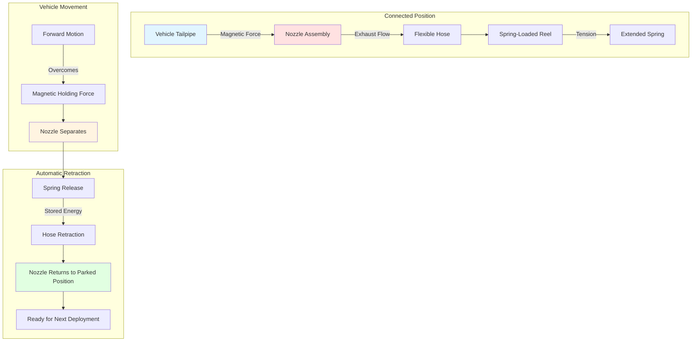

Magnetic and spring-loaded nozzle systems provide automatic attachment and release mechanisms for fire station diesel exhaust removal, enabling rapid vehicle deployment while maintaining effective source capture during warmup and stationary operation. These engineered connection devices balance the competing requirements of secure exhaust capture and instantaneous separation during emergency response.

## Magnetic Disconnect Operation

Magnetic nozzle systems employ rare-earth permanent magnets arranged in radial or circumferential patterns to create attractive forces between the nozzle assembly and ferrous vehicle tailpipes. The magnetic circuit design determines holding force, release characteristics, and operational reliability.

**Magnetic Force Fundamentals:**

The attractive force between magnet and tailpipe follows the relationship:

$$F = \frac{B^2 A}{2\mu_0}$$

Where:
- $F$ = magnetic force (N)
- $B$ = magnetic flux density at air gap (T)
- $A$ = effective magnetic contact area (m²)
- $\mu_0$ = permeability of free space ($4\pi \times 10^{-7}$ H/m)

Practical fire station nozzle systems generate holding forces of 110-220 N (25-50 lbf) to maintain connection during engine vibration and vehicle movement while permitting reliable separation at designed travel distances.

**Magnetic Circuit Design:**

Neodymium-iron-boron (NdFeB) magnets provide the highest energy product for compact nozzle assemblies, with typical grades of N42-N52 offering maximum operating temperatures of 80-150°C. High-temperature grades (N42SH through N52SH) extend operational limits to 150°C, accommodating exhaust system heat transfer to nozzle bodies.

The air gap between magnet and tailpipe critically affects holding force. For a 2 mm air gap (accounting for chrome plating, corrosion, or surface irregularities):

$$B_{gap} = \frac{B_r}{1 + \frac{\mu_r \times g}{L_m}}$$

Where:
- $B_r$ = remnant flux density of magnet material (1.2-1.4 T for NdFeB)
- $\mu_r$ = relative permeability of magnet (≈1.05)
- $g$ = air gap distance (m)
- $L_m$ = magnet thickness in field direction (m)

Increasing air gap from 1 mm to 3 mm typically reduces holding force by 40-60%, emphasizing the importance of conformal nozzle-to-tailpipe contact.

## Spring-Loaded Automatic Release

Spring-loaded release mechanisms convert vehicle motion into mechanical separation of the nozzle-tailpipe connection. The spring system must store sufficient energy to overcome magnetic holding force while maintaining manageable hose retraction velocity.

**Release Force Analysis:**

The required release spring force exceeds magnetic holding force by the release factor $k_r$ (typically 1.3-1.5):

$$F_{spring} = k_r \times F_{mag} + F_{hose} + F_{friction}$$

Where:
- $F_{spring}$ = spring release force (N)
- $k_r$ = release reliability factor (dimensionless)
- $F_{mag}$ = magnetic holding force (N)
- $F_{hose}$ = hose drag force during retraction (N)
- $F_{friction}$ = pivot and bearing friction (N)

For a typical installation with 220 N magnetic force, 45 N hose drag, and 15 N friction, the required spring force equals:

$$F_{spring} = 1.4 \times 220 + 45 + 15 = 368 \text{ N}$$

**Retraction Kinematics:**

Spring-loaded reel systems achieve controlled retraction through constant-force or constant-torque spring designs. Linear retraction velocity varies with hose extension:

$$v(x) = \sqrt{\frac{2(F_{spring} - F_{drag})x}{m_{eff}}}$$

Where:
- $v(x)$ = retraction velocity at extension $x$ (m/s)
- $F_{drag}$ = aerodynamic and friction drag (N)
- $m_{eff}$ = effective mass of hose and nozzle (kg)

Maximum retraction velocities of 1.5-2.5 m/s prevent hose whipping and equipment damage while ensuring rapid clearance from the apparatus bay.

## Tailpipe Adapter Compatibility

Nozzle assemblies must accommodate the range of tailpipe configurations across the fire apparatus fleet, including variations in diameter, orientation, and mounting height.

**Dimensional Requirements:**

| Tailpipe Parameter | Range | Nozzle Accommodation |
|-------------------|-------|---------------------|
| Outer Diameter | 63-152 mm (2.5-6 in) | Adjustable iris or multiple nozzle sizes |
| Exit Angle | 0-45° from horizontal | Swivel joint (±30°) |
| Height Above Floor | 300-900 mm | Adjustable hose length and reel position |
| Wall Thickness | 1.5-3.0 mm | Magnetic circuit depth |
| Material | Ferritic steel, stainless | Minimum steel content for magnetic attachment |

Austenitic stainless steel tailpipes (300-series) exhibit low magnetic permeability, reducing holding force by 85-95% compared to carbon steel. Adapter solutions include:

1. **Mechanical clamps:** Band or collar clamps for non-magnetic tailpipes
2. **Adhesive magnetic strips:** Ferrous material applied to tailpipe surface
3. **Hybrid systems:** Combined magnetic and mechanical retention

**Sealing Effectiveness:**

The nozzle-tailpipe interface creates a semi-sealed connection with controlled leakage. Capture efficiency $\eta_c$ relates to the leakage area ratio:

$$\eta_c = \frac{Q_{captured}}{Q_{total}} = \frac{1}{1 + \frac{A_{leak}}{A_{nozzle}} \sqrt{\frac{\Delta P_{nozzle}}{\Delta P_{leak}}}}$$

Where:
- $A_{leak}$ = gap area between nozzle and tailpipe (m²)
- $A_{nozzle}$ = nozzle throat area (m²)
- $\Delta P_{nozzle}$ = pressure drop through nozzle (Pa)
- $\Delta P_{leak}$ = pressure difference across leak path (Pa)

Properly fitted nozzles achieve 95-98% capture efficiency, with remaining exhaust gases drawn into the general apparatus bay ventilation system.

## Connection Reliability During Vehicle Warmup

Vehicle warmup periods impose thermal and vibrational loads on nozzle connections. Diesel engines generate tailpipe temperatures of 150-400°C during warmup, with thermal expansion affecting connection geometry.

**Thermal Considerations:**

Tailpipe linear expansion during warmup follows:

$$\Delta L = \alpha \times L_0 \times \Delta T$$

For a 600 mm tailpipe extension heating from 20°C to 300°C:

$$\Delta L = 12 \times 10^{-6} \times 0.6 \times 280 = 2.0 \text{ mm}$$

This 2 mm growth can shift nozzle position, requiring flexible mounting or articulated connections to maintain engagement.

**Vibration Resistance:**

Engine vibration transmits through the exhaust system at fundamental frequencies of 20-100 Hz (corresponding to engine speeds of 600-3000 RPM for 4-stroke engines). The magnetic connection must resist vibrational acceleration:

$$a_{vib} = (2\pi f)^2 A_{vib}$$

Where:
- $a_{vib}$ = vibrational acceleration (m/s²)
- $f$ = vibration frequency (Hz)
- $A_{vib}$ = vibration amplitude (m)

For 50 Hz vibration at 0.5 mm amplitude:

$$a_{vib} = (2\pi \times 50)^2 \times 0.0005 = 49.3 \text{ m/s}^2$$

The resulting dynamic force on a 2 kg nozzle assembly equals 98.6 N, requiring magnetic holding forces well above this threshold to prevent premature disconnection.

## Automatic Disconnect on Vehicle Movement

Automatic separation occurs when vehicle propulsion force exceeds the combined resistance of magnetic holding force and hose drag. The separation distance $d_{sep}$ depends on spring characteristics and release geometry.

**Separation Mechanics:**

For a vehicle accelerating at rate $a$ with magnetic nozzle attached:

$$F_{traction} - F_{mag} - F_{hose}(d) = m_{vehicle} \times a$$

Separation occurs when accumulated hose extension reaches:

$$d_{sep} = \frac{F_{mag} + F_{hose,max}}{k_{hose}}$$

Where $k_{hose}$ represents the effective spring rate of the hose-reel system.

Typical separation distances range from 3-5 m (10-15 ft), providing sufficient clearance for the nozzle to retract before the vehicle exits the apparatus bay door.

**Release Safety:**

The nozzle release must occur predictably to prevent:
- Hose entanglement with vehicle components
- Damage to tailpipe from excessive lateral forces
- Interference with adjacent apparatus
- Personnel injury from swinging hoses

Safety features include:
1. Breakaway force limiters (150-250 N threshold)
2. Guided retraction tracks preventing lateral swing
3. Cushioned end stops at fully retracted position
4. Visual and audible indicators of nozzle engagement status

## Installation and Adjustment Guidelines

Proper installation ensures reliable operation across the vehicle fleet and operational scenarios encountered in fire service applications.

**Hose Reel Positioning:**

Mount hose reels to satisfy geometric constraints:

1. **Horizontal offset:** 0.3-0.6 m (12-24 in) from vehicle centerline
2. **Vertical height:** 2.4-3.0 m (8-10 ft) above floor level
3. **Longitudinal position:** 1.0-1.5 m forward of tailpipe when parked

This positioning minimizes hose bending radius and permits natural alignment between nozzle and tailpipe.

**Magnetic Force Adjustment:**

Some nozzle designs permit magnetic force adjustment through:
- Magnet spacing adjustment (varying effective air gap)
- Selection of different magnet grades
- Addition/removal of magnet elements

Verify holding force using a calibrated pull scale applied perpendicular to the tailpipe surface. Target values:

| Vehicle Type | Minimum Hold Force | Maximum Hold Force |
|--------------|-------------------|-------------------|
| Light Ambulance | 110 N (25 lbf) | 180 N (40 lbf) |
| Type I Pumper | 130 N (30 lbf) | 220 N (50 lbf) |
| Aerial Apparatus | 150 N (35 lbf) | 245 N (55 lbf) |

Excessive magnetic force prevents reliable separation; insufficient force allows disconnection during vibration.

**Spring Tension Calibration:**

Adjust spring-loaded reel tension to achieve complete retraction without excessive acceleration:

1. Extend hose to maximum deployment length
2. Measure retraction time and terminal velocity
3. Adjust spring preload to achieve 2-4 second retraction time
4. Verify retraction occurs with nozzle loaded (0.5-1.0 kg test weight)

Document spring adjustment positions and retraction performance for each apparatus bay position.

**Alignment Verification:**

With vehicle parked in normal position:
1. Deploy nozzle to tailpipe
2. Verify axial alignment within ±15° of tailpipe centerline
3. Check for binding or excessive hose bending (radius > 300 mm)
4. Confirm magnetic engagement with audible "snap" or tactile feedback
5. Apply lateral displacement (±50 mm) to verify connection stability

Repeat verification for parking position variations (±150 mm fore-aft, ±100 mm lateral) to account for driver positioning variability.

## System Comparison

The selection between magnetic and spring-loaded systems depends on operational priorities, fleet characteristics, and installation constraints.

| Feature | Magnetic Nozzle | Spring-Loaded Mechanism |
|---------|----------------|------------------------|
| Attachment Method | Rare-earth magnets to ferrous tailpipe | Mechanical spring force |
| Holding Force | 110-220 N (25-50 lbf) | 150-370 N (35-85 lbf) |
| Release Trigger | Vehicle motion overcomes magnetic force | Spring tension overcomes resistance |
| Tailpipe Compatibility | Requires ferrous material | Compatible with all materials |
| Installation Complexity | Moderate (magnet alignment critical) | Low (standard hose reel mounting) |
| Adjustment Requirements | Magnetic force tuning for each vehicle | Spring tension calibration |
| Capture Efficiency | 95-98% (semi-sealed connection) | 92-96% (depends on nozzle fit) |
| Maintenance Frequency | Quarterly magnet inspection | Monthly spring tension check |
| Separation Distance | 3-5 m (10-15 ft) typical | 2-4 m (6-12 ft) typical |
| Temperature Limitation | 150°C continuous (NdFeB grade dependent) | 200°C+ (spring material dependent) |
| Cost (Relative) | Higher (magnet materials) | Lower (mechanical components) |
| Failure Mode | Gradual force reduction (magnet degradation) | Sudden (spring fatigue/breakage) |

Hybrid systems incorporating both magnetic attachment and spring-loaded retraction provide optimal performance, combining the secure connection of magnetic nozzles with the positive separation characteristics of spring mechanisms.

**Operational Reliability:**

Regular testing protocols verify continued system performance:

- **Weekly:** Visual inspection for hose damage, nozzle alignment
- **Monthly:** Spring tension verification, magnetic hold force check
- **Quarterly:** Full deployment/retraction cycle testing all positions
- **Annually:** Comprehensive load testing, replacement of worn components

Documented testing identifies degradation trends before system failure, maintaining the 99%+ operational reliability required for emergency response readiness.

Properly designed and maintained magnetic and spring-loaded nozzle systems provide the critical interface between apparatus exhaust systems and building extraction infrastructure, protecting firefighter health while supporting mission-critical rapid deployment capabilities.
