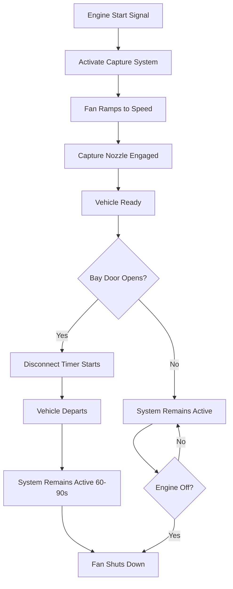

Source capture systems provide the most effective method for removing diesel exhaust at its point of generation in fire apparatus bays. These systems use direct-connect or proximity capture devices that attach to vehicle tailpipes and extract exhaust before it disperses into the occupied space.

## Direct-Connect Exhaust Capture Principles

Direct-connect source capture operates on the principle of capturing exhaust gases immediately at the tailpipe through a sealed or near-sealed connection. The system creates negative pressure within the exhaust ductwork that overcomes the vehicle's exhaust backpressure while maintaining efficient gas capture.

The fundamental capture mechanism relies on establishing adequate static pressure at the capture point:

$$\Delta P_{capture} = P_{exhaust} + P_{duct} + P_{stack}$$

where $\Delta P_{capture}$ represents the total pressure drop the extraction fan must overcome, $P_{exhaust}$ is the vehicle exhaust backpressure, $P_{duct}$ accounts for ductwork friction losses, and $P_{stack}$ represents stack discharge pressure requirements.

The capture device must accommodate rapid vehicle departure, typically disconnecting automatically when the apparatus pulls away. Spring-loaded, magnetic, or pneumatic release mechanisms enable quick disconnection while maintaining capture efficiency during engine warm-up periods.

## Capture Efficiency Requirements

Effective source capture systems must achieve minimum 95% capture efficiency during vehicle idling and warm-up operations. This efficiency ensures that less than 5% of exhaust gases escape into the bay atmosphere, protecting firefighters from diesel particulate matter and toxic gas exposure.

Capture efficiency depends on several critical parameters:

- **Connection seal quality**: Minimizing air leakage at the tailpipe connection
- **Exhaust velocity**: Maintaining sufficient velocity to overcome turbulent escape
- **System response time**: Activating capture within 3-5 seconds of engine start
- **Ductwork design**: Preventing excessive pressure drops that reduce capture effectiveness

Testing protocols typically employ tracer gas measurements to verify capture efficiency under various engine load conditions and ambient temperature scenarios.

## Fan Sizing for Exhaust Extraction

Exhaust extraction fans must be sized to handle the combined exhaust flow from the largest apparatus while overcoming all system pressure drops. The required fan capacity follows:

$$Q_{fan} = Q_{exhaust} \times N_{vehicles} \times SF$$

where $Q_{fan}$ is the total fan capacity (CFM), $Q_{exhaust}$ represents the maximum exhaust flow per vehicle (typically 600-1200 CFM depending on engine size), $N_{vehicles}$ is the number of simultaneously operating capture points, and $SF$ is a safety factor (1.15-1.25).

Fan static pressure requirements typically range from 2.5 to 4.5 inches water gauge, depending on ductwork length and stack height. Centrifugal exhaust fans with backward-curved or airfoil blades provide efficient operation across the required operating range.

### System Sizing Parameters

| Parameter | Small Apparatus | Medium Apparatus | Large Apparatus |
|-----------|----------------|------------------|-----------------|
| Engine Displacement | 5-7 L | 8-12 L | 13-15 L |
| Exhaust Flow Rate | 600-800 CFM | 800-1000 CFM | 1000-1200 CFM |
| Duct Diameter | 6 inches | 8 inches | 10 inches |
| Capture Velocity | 2000-2500 FPM | 2000-2500 FPM | 2000-2500 FPM |
| Fan Static Pressure | 2.5-3.0 in. w.g. | 3.0-3.5 in. w.g. | 3.5-4.5 in. w.g. |
| Motor Size | 1-2 HP | 2-3 HP | 3-5 HP |

Variable frequency drives enable fan speed modulation based on the number of active capture points, reducing energy consumption during single-vehicle operations.

## Ductwork Routing and Materials

Exhaust ductwork must withstand continuous exposure to hot, corrosive diesel exhaust gases containing sulfur compounds, water vapor, and particulate matter. Material selection critically impacts system longevity and maintenance requirements.

**Preferred ductwork materials include:**

- **304 or 316 stainless steel**: Excellent corrosion resistance, suitable for temperatures up to 1200°F
- **Aluminized steel**: Cost-effective alternative for moderate temperature applications (up to 800°F)
- **Galvanized steel**: Limited use due to zinc coating degradation from acidic condensate

Ductwork routing should minimize horizontal runs and incorporate continuous slope (minimum 1/4 inch per foot) toward condensate collection points. Flexible hose sections connecting the capture nozzle to rigid ductwork must use high-temperature rated materials capable of withstanding 500°F continuous exposure.

Avoid sharp bends (use minimum 1.5D radius bends) and incorporate cleanout access points every 20-25 feet of horizontal run. Support spacing follows SMACNA standards with additional reinforcement at direction changes.

## Stack Discharge Considerations

Stack discharge design prevents exhaust gas re-entrainment into building air intakes while ensuring adequate dispersion. The discharge velocity must exceed 2500 FPM to achieve proper plume rise and prevent downdraft conditions.

Minimum stack height follows:

$$H_{stack} = H_{building} + 3 + \frac{V_{discharge}}{1000}$$

where $H_{stack}$ and $H_{building}$ are measured in feet, and $V_{discharge}$ is the discharge velocity in FPM.

Position stacks at least 10 feet horizontally from any air intake, operable window, or property line. Weather caps must not impede discharge velocity or create excessive backpressure—use straight discharge terminations or high-velocity rain caps designed specifically for exhaust applications.

In cold climates, insulate stacks to prevent excessive condensation and ice formation. Condensate drains at the stack base prevent moisture accumulation and corrosion.

## System Interlock with Bay Doors

Source capture systems must integrate with apparatus bay door controls to ensure proper system operation during vehicle movements. The interlock sequence typically follows:

The interlock logic prevents fan shutdown during active exhaust capture, maintains operation for a timed period after vehicle departure (purging residual exhaust from ductwork), and coordinates with bay door position sensors to optimize energy consumption.

Door-mounted position switches signal the control system when apparatus is departing, triggering the timed shutdown sequence. This prevents premature fan shutdown while ensuring the system doesn't run indefinitely after vehicle exit.

Emergency override capabilities enable manual system activation for maintenance operations or testing. Status indication lights at each capture point provide visual confirmation of system operation for apparatus operators.

## System Performance Verification

Commission source capture systems through comprehensive testing protocols that verify capture efficiency, fan performance, and control sequence operation. Measure static pressure at design points, confirm discharge velocities meet minimum requirements, and validate interlock functionality through simulated apparatus movements.

Annual testing should include capture efficiency verification using tracer gas methods, filter inspection (if applicable), and confirmation of all safety interlocks. Document system performance to track degradation over time and identify maintenance needs before system failure.

Source capture systems represent the primary defense against diesel exhaust exposure in fire stations, requiring careful design, proper installation, and routine maintenance to protect firefighter health throughout their careers.
