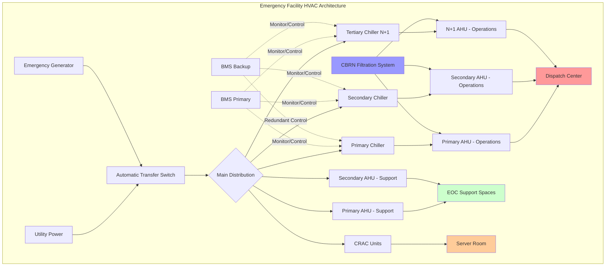

## Overview of Emergency Response Facility HVAC

Emergency response facilities require HVAC systems designed for continuous operation during crisis situations when conventional infrastructure may be compromised. These facilities include 911 dispatch centers, emergency operations centers (EOCs), fusion centers, and emergency management offices. The HVAC design must prioritize reliability, redundancy, and operational continuity under all circumstances including power outages, extreme weather, and chemical, biological, radiological, and nuclear (CBRN) events.

Critical design requirements include:

- **24/7/365 continuous operation capability** with no scheduled downtime
- **Fully redundant equipment** to eliminate single points of failure
- **Emergency power compatibility** with automatic transfer capabilities
- **Enhanced filtration systems** for CBRN protection
- **Precision environmental control** for sensitive electronic equipment
- **Positive pressurization** to prevent contaminant infiltration
- **Independent zoning** for critical versus support spaces

## Dispatch Center HVAC Requirements

Emergency dispatch centers house computer-aided dispatch (CAD) systems, radio equipment, telephony systems, and multiple display screens generating substantial heat loads. HVAC design must maintain precise temperature and humidity control while accommodating high sensible heat ratios.

### Thermal Load Characteristics

Dispatch center cooling loads typically range from 150-250 W/m² (48-79 BTU/h·ft²) due to equipment density. The sensible heat ratio commonly exceeds 0.90, requiring systems optimized for sensible cooling rather than dehumidification.

Total cooling capacity calculation:

$$Q_{total} = Q_{sensible} + Q_{latent} = (A \times q_{equipment} + n \times q_{occupant,sensible}) + (n \times q_{occupant,latent})$$

Where:
- $A$ = floor area (m²)
- $q_{equipment}$ = equipment heat gain density (W/m²)
- $n$ = number of occupants
- $q_{occupant,sensible}$ = sensible heat per occupant (75 W)
- $q_{occupant,latent}$ = latent heat per occupant (55 W)

### Dispatch Center Design Criteria

| Parameter | Requirement | Notes |
|-----------|-------------|-------|
| Temperature | 21-23°C (70-74°F) | ±1°C tolerance |
| Relative Humidity | 40-50% | Non-condensing |
| Air Changes | 15-20 ACH | Equipment cooling needs |
| Redundancy | N+1 minimum | N+2 preferred |
| Backup Power | 100% capacity | Full load operation |
| Acoustic Level | NC 35-40 | Low noise critical |
| Equipment UPS | 15+ minutes | HVAC controls continuity |

## Emergency Operations Center Design

EOCs serve as command and control facilities during emergencies and disasters. These spaces must maintain operational capability for extended periods, potentially with staff sheltering in place for days. HVAC systems must support both the main operations floor with extensive electronics and supporting spaces including sleeping areas, food preparation, and sanitation facilities.

### Multi-Zone System Configuration

EOCs require independent HVAC zones for different functional areas:

**Operations Floor**: High cooling capacity (200+ W/m²) with precision control and 100% redundancy. Multiple smaller units provide better reliability than single large systems.

**Support Spaces**: Standard comfort cooling (75-100 W/m²) with adequate ventilation for sleeping quarters and break areas.

**Server/IT Rooms**: Dedicated cooling with N+1 redundancy, potentially requiring 300-500 W/m² capacity for dense equipment racks.

**Generator Rooms**: Ventilation sized for combustion air plus heat rejection from engine operation.

## Reliability and Redundancy Principles

Emergency response facilities employ multiple redundancy strategies to ensure uninterrupted HVAC operation.

### Equipment Redundancy Approaches

**N+1 Configuration**: Base capacity (N) plus one additional unit. For a facility requiring 30 tons of cooling, install three 15-ton units. Loss of any single unit maintains 30 tons capacity.

**N+2 Configuration**: Base capacity plus two redundant units. Provides protection against simultaneous failures or maintenance requirements. Recommended for facilities with no backup location.

**2N Configuration**: Complete duplicate systems with independent infrastructure including chillers, air handlers, ductwork, and controls. Highest reliability but significant cost premium.

## Emergency Power Integration

HVAC systems must operate at full capacity on emergency generator power. This requires careful load analysis and generator sizing to accommodate the high inrush currents of compressors and large motors.

### Generator Capacity Calculation

Total generator capacity must include:

$$P_{generator} = 1.25 \times (P_{HVAC,running} + P_{critical,loads} + P_{starting,margin})$$

Where the 1.25 factor provides 25% reserve capacity, and starting margin accounts for motor inrush (typically 6× running current for motors without soft starters).

**Staged Starting Strategy**: When multiple compressors or air handlers must start, implement time-delay relays to sequence starts over 30-60 seconds, preventing simultaneous inrush that could overload the generator.

## CBRN Protection Considerations

Facilities designated as protective spaces during CBRN events require specialized HVAC modifications.

### Filtration and Pressurization

**CBRN Filtration Train**: Progressively finer filtration including:
- Pre-filter (MERV 8) for bulk particulate removal
- HEPA filter (99.97% efficient at 0.3 μm) for biological and radiological particles
- Activated carbon filter for chemical agent adsorption
- Post-filter to protect downstream components

**Positive Pressurization**: Maintain 0.02-0.05 in. w.g. (5-12 Pa) positive pressure relative to outdoors to prevent infiltration of contaminated air. Calculate required outdoor air:

$$Q_{OA} = \frac{\Delta P \times A_{leakage}}{\rho \times C_{flow}}$$

Where leakage area depends on building construction tightness and pressurization level drives the flow requirement.

**Collective Protection Mode**: During CBRN events, systems switch to 100% recirculation with CBRN filtration, ceasing outdoor air intake. This mode requires pre-purging the facility and adequate $CO_2$ removal for extended occupancy.

## Facility Types and HVAC Requirements

| Facility Type | Cooling Density | Redundancy | CBRN Protection | Emergency Power Duration |
|---------------|-----------------|------------|-----------------|-------------------------|
| 911 Dispatch Center | 150-250 W/m² | N+1 minimum | Optional | 72 hours minimum |
| Emergency Operations Center | 200-300 W/m² | N+2 preferred | Required | 7-14 days |
| Fusion Center | 250-350 W/m² | N+1 minimum | Required | 72 hours minimum |
| Emergency Management Office | 100-150 W/m² | N+1 | Optional | 48 hours minimum |
| Regional Coordination Center | 150-200 W/m² | N+2 | Required | 14+ days |
| Backup Dispatch Facility | 150-250 W/m² | N+1 | Optional | 72 hours minimum |

### Maintenance and Testing Protocols

Emergency facility HVAC systems require rigorous preventive maintenance with scheduled component rotation to verify redundant equipment operability. Monthly generator load testing should include HVAC equipment to confirm automatic transfer functionality and adequate capacity. Annual CBRN system testing with challenge aerosols validates filtration performance and pressurization levels.

Control systems must include comprehensive alarming to facility management and remote monitoring to detect any degradation in system performance. Predictive maintenance using vibration analysis, thermal imaging, and oil analysis helps identify potential failures before they impact operations.
