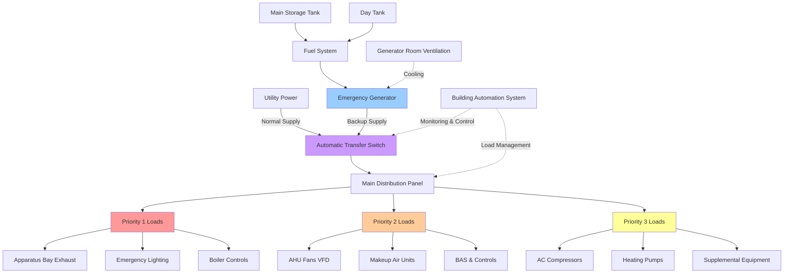

Emergency response facilities require uninterrupted HVAC operation to maintain operational readiness during power outages. Backup power systems must be properly sized, configured, and maintained to ensure critical environmental control systems remain functional when commercial power fails.

## Generator Sizing for HVAC Loads

Accurate generator sizing requires careful analysis of all HVAC loads that must operate during emergency conditions. The total generator capacity must account for both running loads and motor starting inrush currents.

The minimum generator capacity is calculated as:

$$P_{gen} = \frac{\sum P_{running} + P_{largest\_motor} \times (LRA/FLA - 1)}{\text{PF} \times \text{Eff}}$$

where $P_{gen}$ is the required generator capacity (kW), $P_{running}$ represents all simultaneous running loads, $LRA/FLA$ is the locked rotor to full load amperage ratio (typically 5-7 for HVAC motors), PF is the power factor (0.8-0.85 typical), and Eff is the generator efficiency (0.9-0.95).

For stepped motor starting, apply diversity factors based on the time delay between starts. A 10-second delay between large motor starts typically allows use of a 0.6-0.7 diversity factor for the second motor's starting load.

Size generators for continuous operation at 70-80% of rated capacity to allow headroom for future expansion and optimal fuel efficiency. Oversizing beyond 85% rated load operation reduces efficiency and increases maintenance costs.

## Transfer Switch Integration

Automatic transfer switches (ATS) monitor utility power and initiate generator startup when voltage or frequency deviates beyond acceptable limits. For HVAC applications, consider these critical parameters:

**Transfer Time Requirements:**
- Open transition: 100-300 milliseconds typical
- Closed transition: less than 100 milliseconds (required for critical ventilation)
- Delayed transition: programmable 1-30 second delay (reduces inrush)

Integrate the ATS with the building management system to coordinate HVAC equipment shutdown and restart sequences. Program a 5-10 second delay before energizing large HVAC loads to allow generator voltage and frequency stabilization.

For facilities requiring uninterrupted ventilation (apparatus bays with diesel exhaust, 24-hour living quarters), specify closed transition or bypass-isolation transfer switches that eliminate the brief power interruption during transfer.

## Load Prioritization Sequences

Implement staged loading to prevent generator overload during startup. Typical priority levels for fire/EMS stations:

**Priority 1 (0-10 seconds after generator stabilization):**
- Emergency lighting and exit signs
- Fire alarm and communication systems
- Apparatus bay exhaust fans (diesel fume removal)
- Furnace/boiler controls and igniters

**Priority 2 (10-30 seconds):**
- Air handling unit fans (reduced speed if equipped with VFDs)
- Makeup air units for apparatus bays
- Domestic hot water circulation pumps
- Building automation system

**Priority 3 (30-60 seconds):**
- Compressor(s) for air conditioning (staged start)
- Heating system pumps and zone valves
- Supplementary ventilation equipment
- Non-critical lighting and receptacles

Use programmable logic controllers or integrated building automation systems to execute the loading sequence. Monitor generator load percentage and delay subsequent stages if the load exceeds 85% of rated capacity.

## Critical HVAC Loads Table

| Equipment Type | Typical Load (kW) | Priority Level | Starting Method |
|----------------|-------------------|----------------|-----------------|
| Apparatus Bay Exhaust (each) | 2-4 | 1 | Direct-on-line |
| Makeup Air Unit Fan | 5-10 | 2 | Soft start / VFD |
| Air Handler (3-10 ton) | 1.5-4 | 2 | Soft start |
| Rooftop Unit (5-15 ton) | 6-18 | 2-3 | Staged compressors |
| Heating Boiler | 8-25 | 1-2 | Sequenced burners |
| Chiller (20-50 ton) | 15-45 | 3 | Reduced load start |
| Circulation Pumps (each) | 1-3 | 2 | Soft start |
| Exhaust Fans (each) | 0.5-2 | 2 | Direct-on-line |

## Fuel Storage and Supply Considerations

Diesel fuel storage capacity determines the maximum outage duration the facility can sustain. Calculate minimum fuel storage as:

$$V_{fuel} = \frac{P_{avg} \times t_{outage} \times SFC}{7.2 \times \rho_{fuel}}$$

where $V_{fuel}$ is the fuel tank volume (gallons), $P_{avg}$ is the average generator load (kW), $t_{outage}$ is the required runtime (hours), SFC is the specific fuel consumption (0.06-0.08 gal/kW-hr typical), and $\rho_{fuel}$ is the fuel density correction factor.

**Fuel System Requirements:**
- Minimum 48-72 hour runtime capacity at 70% load
- Day tank (50-100 gallons) for immediate availability
- Main storage tank with automatic transfer pumping
- Fuel quality maintenance (biocide treatment, water separation)
- Annual fuel testing and polishing services

Install fuel level monitoring with low-level alarms at 25% capacity. Implement automatic fuel delivery contracts to ensure replenishment during extended outages.

## Generator Room Ventilation

Generator rooms require substantial ventilation to remove combustion air, reject heat, and dilute any fuel vapors. Calculate ventilation requirements:

$$Q_{vent} = Q_{combustion} + Q_{cooling}$$

where $Q_{combustion} = P_{gen} \times 10$ cfm/kW (typical combustion air requirement) and $Q_{cooling}$ provides sufficient air changes to maintain room temperature below 104°F (40°C).

Cooling airflow typically requires 150-200 cfm per kW of generator capacity. Use louvers sized for maximum 500 fpm face velocity to minimize pressure drop and noise transmission.

**Ventilation System Design:**
- Separated combustion air intake (low level, outside air)
- Heat rejection exhaust (high level, motorized dampers)
- Emergency ventilation interlock with generator operation
- Acoustic louvers to limit noise transmission (NC 45-50 maximum)

## Testing and Maintenance Requirements

**Monthly Testing Protocol:**
- No-load test run: 30 minutes minimum
- Verify automatic start sequence
- Check fluid levels, battery voltage, coolant condition
- Inspect fuel system for leaks
- Record runtime hours and any abnormalities

**Annual Load Bank Testing:**
- Test at 100% rated load for 2 hours minimum
- Verify voltage regulation within ±5% across all load ranges
- Confirm frequency stability within ±0.5 Hz
- Exercise transfer switches through complete cycle (normal-emergency-normal)
- Validate load prioritization sequences

**Quarterly HVAC Integration Testing:**
- Simulate power failure during peak HVAC demand
- Verify all critical HVAC loads transfer and operate properly
- Confirm load sequencing prevents generator overload
- Test BAS communication and monitoring functions
- Document actual vs. designed load profiles

Maintain detailed maintenance logs documenting all tests, fuel additions, oil changes, and repairs. Many jurisdictions require monthly testing records for code compliance and insurance purposes.

## Backup Power System Architecture

This diagram illustrates the complete backup power architecture, showing utility and generator inputs to the automatic transfer switch, distribution to prioritized HVAC loads, fuel supply system, and integration with building controls. The color coding indicates priority levels, with Priority 1 loads (red) receiving power first, followed by Priority 2 (orange) and Priority 3 (yellow) equipment.
