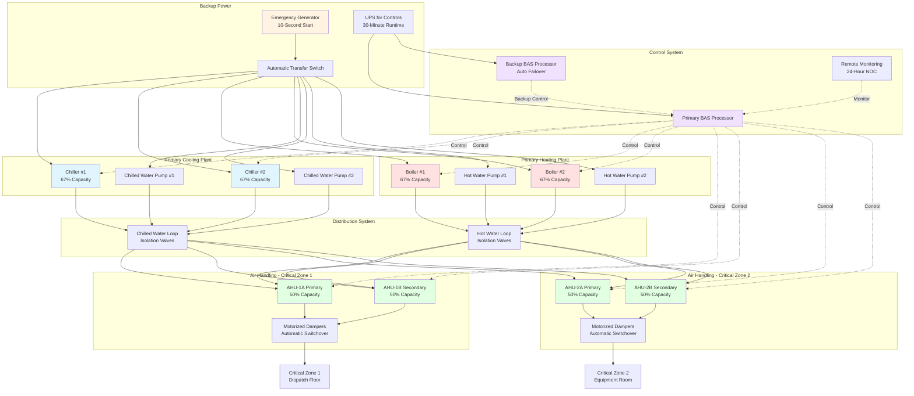

## Mission-Critical HVAC Requirements

Emergency operations centers (EOC), dispatch facilities, and critical command centers require HVAC systems engineered for continuous operation during community emergencies when standard infrastructure may be compromised. These facilities must maintain thermal and environmental conditions supporting personnel effectiveness and electronic equipment operation regardless of external conditions or utility disruptions.

The fundamental design principle distinguishes critical operations facilities from standard 24-hour occupancies: the facility cannot shut down for HVAC maintenance or tolerate environmental excursions that degrade operational capability. This requirement drives redundancy, component selection, monitoring sophistication, and maintenance strategies fundamentally different from conventional building systems.

## Reliability Requirements and System Uptime

### Availability Calculations

System reliability quantifies the probability that HVAC systems will perform their intended function over a specified period. For critical operations facilities, availability A represents the fraction of time systems remain operational:

$$A = \frac{MTBF}{MTBF + MTTR}$$

Where:
- $MTBF$ = Mean Time Between Failures (hours)
- $MTTR$ = Mean Time To Repair (hours)

Target availability levels by facility criticality:

| Facility Type | Required Availability | Maximum Annual Downtime | Tier Classification |
|--------------|---------------------|------------------------|---------------------|
| Tier I - Basic capacity | 99.671% | 28.8 hours | ASHRAE Level 1 |
| Tier II - Redundant components | 99.741% | 22.0 hours | ASHRAE Level 2 |
| Tier III - Concurrently maintainable | 99.982% | 1.6 hours | ASHRAE Level 3 |
| Tier IV - Fault tolerant | 99.995% | 0.4 hours | ASHRAE Level 4 |

**Critical Operations Typical Target**: Tier III (99.982% availability) minimum for 911 dispatch and emergency operations centers. High-value command centers may specify Tier IV requirements.

### Component Reliability Analysis

Individual component reliability impacts overall system availability. Component failure rate λ (failures per hour) relates to MTBF:

$$\lambda = \frac{1}{MTBF}$$

For series systems where any component failure causes system failure, overall system reliability $R_{system}$ over time period $t$:

$$R_{system}(t) = e^{-\lambda_1 t} \times e^{-\lambda_2 t} \times ... \times e^{-\lambda_n t} = e^{-(\lambda_1 + \lambda_2 + ... + \lambda_n)t}$$

**Parallel redundancy** improves reliability. For two identical components with reliability R in parallel configuration:

$$R_{parallel} = 1 - (1-R)^2$$

Example: Two chillers each with 95% reliability in N+1 configuration:
$$R_{parallel} = 1 - (1-0.95)^2 = 1 - 0.0025 = 0.9975 = 99.75\%$$

This demonstrates how redundancy transforms individual component reliability into system-level availability exceeding single-component performance.

## Redundancy Strategies

### System Architecture Configurations

**N Configuration**: Single path, no redundancy. Minimum capacity required for operation. Any component failure causes system failure. Not acceptable for critical operations.

**N+1 Configuration**: Single redundant component. System continues operation at full capacity with any single component failure. Standard baseline for critical facilities.

Design implementation:
- Dual chillers, each 50% capacity minimum (67% capacity preferred)
- Dual air handling units serving same zone with automatic switchover
- Dual heating plants with independent fuel sources
- Redundant controls processors with automatic failover

**N+2 Configuration**: Two redundant components. System tolerates two simultaneous failures. Used for highest-criticality facilities or extended maintenance scenarios.

**2N Configuration**: Complete system duplication. Two independent systems each capable of 100% facility load. Each system includes dedicated infrastructure (electrical service, water supply, fuel source). Highest reliability but highest cost.

**2N+1 Configuration**: Two complete systems plus one additional component. Ultimate redundancy combining system-level duplication with component-level backup. Typically reserved for national security or critical healthcare facilities.

### Concurrent Maintainability

Tier III systems require the ability to perform planned maintenance on any system component without impacting facility operation. This necessitates isolation capabilities and bypass arrangements beyond simple redundancy.

**Isolation Valve Strategies**:
- Three-valve bypass arrangement on all pumps, heat exchangers, and inline equipment
- Ball valves for positive shutoff (gate valves insufficient)
- Isolation valve tag system identifying equipment served and operational status
- Labeled bypass procedure posted at each isolation group

**Ductwork Isolation**:
- Motorized isolation dampers on parallel air handling unit branches
- Manual access dampers for maintenance isolation
- Bypass duct connections allowing airflow rerouting during filter or coil maintenance

**Piping Arrangements**:
- Reverse-return piping for load balancing without requiring valve throttling
- Strainer bypass piping allowing cleaning without system shutdown
- Test and balance ports for commissioning and troubleshooting without equipment penetration

## Equipment Selection for Mission-Critical Use

### Component Specifications

Critical operations equipment must exceed commercial-grade specifications in durability, serviceability, and monitoring capability.

**Chillers**:
- Industrial-grade compressors rated for 100,000+ operational hours
- Dual refrigerant circuits within single chiller (allowing 50% capacity at single-circuit failure)
- Comprehensive microprocessor controls with trending and diagnostics
- Redundant control power supplies
- Hot-gas bypass or digital scroll technology for stable low-load operation

**Boilers**:
- Cast-iron or heavy-gauge steel construction (minimum 12-gauge firebox)
- Scotch marine or fire-tube design for high thermal mass and stability
- Redundant flame safeguard controls
- Multiple fuel capability (natural gas primary, propane or oil backup)
- Dual-fuel burners with automatic switchover

**Air Handling Units**:
- Heavy-gauge cabinet construction (14-gauge minimum)
- Removable panel access to all internal components
- Oversized filter banks allowing extended replacement intervals
- Direct-drive plenum fans (eliminating belt maintenance)
- Redundant fan motors or dual-fan configuration
- Variable frequency drives with bypass contactors allowing constant-speed emergency operation

**Pumps**:
- Bronze-fitted or all-bronze construction resisting corrosion
- Mechanical seals (not packing glands)
- Base-mounted with rigid coupling (not flexible coupling requiring alignment)
- Oversized motors allowing impeller trimming for future capacity adjustment
- Pressure and temperature monitoring at inlet and discharge

**Controls and Sensors**:
- Industrial-grade sensors with 0.25% accuracy specification
- Redundant temperature and pressure monitoring at critical points
- Hardwired safety interlocks independent of software control
- Distributed control architecture (not centralized single-processor)
- Battery-backed memory preserving setpoints and trending during power outages

### Manufacturer Selection Criteria

Specify equipment manufacturers meeting critical-operations support requirements:
- 24-hour technical support with 30-minute maximum response time
- Local factory-authorized service within 2-hour travel radius
- Minimum 15-year parts availability commitment
- Training programs for facility maintenance personnel
- Loaner equipment program for extended repairs

## Maintenance Access Without Service Interruption

### Preventive Maintenance Strategy

Critical operations require preventive maintenance execution without reducing system capacity below operational requirements.

**Scheduled Maintenance Rotation**: Stagger equipment maintenance across redundant components:

| Week | Equipment Serviced | Available Capacity | Status |
|------|-------------------|-------------------|---------|
| Week 1 | Chiller #1, AHU #1 | N+1 → N | Acceptable |
| Week 2 | Chiller #2, AHU #2 | N+1 → N | Acceptable |
| Week 3 | Boiler #1, Pump Set #1 | N+1 → N | Acceptable |
| Week 4 | All systems operational | N+1 | Normal |

**Weather-Dependent Deferral**: Schedule maintenance during mild weather periods minimizing equipment loading:
- Chiller maintenance during shoulder seasons (April-May, September-October)
- Heating equipment maintenance during summer months
- Avoid extreme weather periods requiring maximum capacity

**Hot-Swappable Components**: Design systems allowing component replacement without system shutdown:
- Filter banks with downstream isolation allowing replacement under airflow
- Pump motors with quick-disconnect couplings
- Control panels with redundant processors swappable during operation
- Modular chiller components (compressors, condenser bundles) replaceable with specialized procedures

### Service Access Design

**Equipment Room Layout**:
- Clearances exceeding code minimum: 4 feet minimum all sides of major equipment
- Overhead crane or monorail for heavy component removal (compressors, motors, heat exchangers)
- Roll-out equipment sections with flanged connections and isolation valves
- Dedicated service elevator access independent of facility operational spaces

**Component Accessibility**:
- Swing-out motor mounts on air handling units
- Hinged or removable panels tool-free access to controls
- Filter access from corridor side (not requiring mechanical room entry)
- External gauge connections for refrigerant charging and diagnostics

## Monitoring and Alarm Systems

### Real-Time Performance Monitoring

Critical operations require continuous system monitoring with automated fault detection and alarming.

**Monitored Parameters (Minimum)**:

Chillers:
- Entering and leaving chilled water temperature (0.5°F resolution)
- Chilled water flow rate (GPM)
- Refrigerant pressures: suction and discharge (PSI)
- Compressor amperage (per circuit)
- Operating hours (compressor run time)

Boilers:
- Supply water temperature (0.5°F resolution)
- Return water temperature
- Flue gas temperature
- Burner operating status (firing/standby)
- Fuel pressure

Air Handling Units:
- Supply air temperature and humidity
- Return air temperature and humidity
- Mixed air temperature
- Filter differential pressure (magnehelic or electronic)
- Fan status and VFD speed
- Supply air static pressure

Facility Conditions:
- Space temperature (each zone)
- Space humidity (critical equipment spaces)
- Outdoor air temperature and humidity
- Electrical room temperature

**Trending and Analytics**:
- 1-minute interval data logging for all critical parameters
- 1-year minimum data retention
- Automated fault detection algorithms identifying degraded performance before failure
- Comparative analysis between redundant equipment detecting asymmetric performance

### Alarm Configuration

**Alarm Priority Classification**:

**Critical Alarms** (immediate response required, audible notification):
- Space temperature exceeding operational limits
- Loss of redundancy (single equipment failure in N+1 system)
- Fuel supply failure
- Complete loss of cooling or heating capacity
- Fire or smoke detection in mechanical spaces

**Warning Alarms** (response within 4 hours):
- Equipment performance degradation (reduced capacity, efficiency decline)
- Sensor drift or communication loss
- Predictive maintenance thresholds (filter pressure drop, fluid level)

**Maintenance Alerts** (response within 24 hours):
- Scheduled maintenance due
- Operating hours accumulation approaching service interval
- Consumable replacement (filters, belts, lubricant)

**Alarm Delivery Methods**:
- Building automation system (BAS) workstation display
- Audible annunciation in occupied control room
- Text message and email to on-call maintenance personnel
- Automatic notification to service contractor for critical alarms

### Remote Monitoring Integration

Critical facilities benefit from 24-hour monitoring by equipment manufacturers or specialized service providers:
- Secure internet connection to BAS allowing read-only external access
- Manufacturer portal displaying equipment operational parameters
- Predictive diagnostics identifying impending failures based on performance trending
- Automated parts ordering triggered by predictive maintenance algorithms
- Integration with facility's computerized maintenance management system (CMMS)

## Failure Mode and Effects Analysis

### Component Failure Scenarios

Systematic evaluation of failure modes identifies vulnerabilities and validates redundancy strategies.

**Single Component Failures** (must not cause loss of facility environmental control):

Chiller failure:
- Consequence: Loss of 50% cooling capacity (N+1 configuration)
- Mitigation: Remaining chiller provides full capacity up to design conditions
- Response: Schedule repair during next maintenance window (non-emergency)

Air handling unit failure:
- Consequence: Loss of conditioned air to served zones
- Mitigation: Redundant AHU automatically activates, dampers reposition
- Response: Investigate failure cause, restore primary unit within 24 hours

Pump failure:
- Consequence: Loss of fluid circulation in served system
- Mitigation: Standby pump starts automatically via pressure switch or flow sensor
- Response: Repair failed pump, restore to standby status

Control system processor failure:
- Consequence: Loss of automatic control and trending
- Mitigation: Redundant processor maintains control, operator notified
- Response: Replace failed processor during next business day

**Utility Failures** (must not interrupt facility operation):

Electrical power loss:
- Consequence: Complete HVAC system shutdown unless backed up
- Mitigation: Emergency generator starts within 10 seconds, automatic transfer switch restores power
- Response: Verify generator operation, investigate utility outage duration

Natural gas supply interruption:
- Consequence: Loss of heating and cooling (if gas-fired equipment)
- Mitigation: Automatic switchover to propane or oil backup fuel
- Response: Contact utility, monitor backup fuel supply level

Water supply failure:
- Consequence: Loss of evaporative cooling, humidification, or condensing water
- Mitigation: Onsite water storage (minimum 24-hour capacity), air-cooled backup systems
- Response: Emergency water delivery if extended outage

**Cascading Failure Analysis**:

Identify scenarios where initial failure propagates:
- Chiller failure during peak cooling loads → remaining chiller overloaded → compressor failure
- Pump seal failure → glycol leakage → low system fluid level → pump cavitation → pump failure
- Control failure → equipment operates at maximum capacity → premature wear → mechanical failure

Mitigation strategies include:
- Capacity margins preventing overload conditions (N+1 redundancy with 67% minimum component sizing)
- Low-level alarms and automatic shutdown before damage occurs
- Physical separation of redundant equipment preventing common-mode failures

## ASHRAE Tier Classification Guidance

### Tier System Overview

ASHRAE's tiered classification system (adapted from Uptime Institute data center tiers) provides standardized framework for critical facility design.

**Tier I - Basic Capacity**: Single path for power and cooling distribution, no redundant components. Any disruption or maintenance requires facility shutdown. Inappropriate for true critical operations but may apply to small fire stations in low-call-volume areas.

**Tier II - Redundant Capacity Components**: Single distribution path with N+1 redundant components. Maintenance on redundant components possible without shutdown, but distribution path maintenance requires shutdown. Suitable for small dispatch centers and suburban fire stations.

**Tier III - Concurrently Maintainable**: Multiple distribution paths but only one active, N+1 redundancy, maintenance on any component without operational impact. Appropriate for regional dispatch centers and metropolitan fire departments serving populations over 100,000.

**Tier IV - Fault Tolerant**: Multiple active distribution paths, 2N or 2N+1 redundancy, automatically tolerates any single equipment failure without operational impact. Required for state emergency operations centers, large regional dispatch facilities, and critical command centers.

### Design Specifications by Tier

**Tier II Implementation Example**:
```
Cooling: Two chillers (each 67% capacity)
Heating: Two boilers (each 67% capacity)
Air Handling: Two units per zone (each 50% capacity minimum)
Distribution: Single chilled water loop, single heating hot water loop
Controls: Single processor with local backup controller for critical equipment
Estimated Availability: 99.741%
```

**Tier III Implementation Example**:
```
Cooling: Three chillers (each 50% capacity) on dual chilled water loops
Heating: Three boilers (each 50% capacity) on dual heating hot water loops
Air Handling: Two units per zone (each 50% capacity) with crossover connections
Distribution: Dual bus ductwork with isolation dampers
Controls: Redundant processors with automatic failover
Estimated Availability: 99.982%
```

**Tier IV Implementation Example**:
```
Cooling: Four chillers (two per system, 2N) on completely independent loops
Heating: Four boilers (two per system, 2N) on completely independent loops
Air Handling: Four units per zone (two per system, 2N)
Distribution: Completely separated A-side and B-side systems
Controls: Fully redundant with hardwired backup control
Estimated Availability: 99.995%
```

### Cost and Benefit Analysis

Higher tiers significantly increase capital and operational costs:

| Parameter | Tier II | Tier III | Tier IV |
|-----------|---------|----------|---------|
| Capital Cost Premium | Baseline | +35-50% | +90-120% |
| Equipment Room Area | Baseline | +25-40% | +60-80% |
| Annual Maintenance | Baseline | +30-40% | +50-70% |
| Operational Complexity | Moderate | High | Very High |

**Selection Criteria**: Tier selection balances facility criticality against budget constraints:
- Tier II: Fire stations, small dispatch centers (serve <100,000 population)
- Tier III: Regional dispatch, county EOC, medium hospitals (serve 100,000-500,000)
- Tier IV: State EOC, major metropolitan dispatch, trauma centers (serve >500,000 or state-level)

## System Architecture Diagram



## Commissioning and Testing

Critical operations systems require comprehensive commissioning verifying reliability and redundancy claims.

**Functional Performance Testing**:
- Full-load operation testing at design conditions
- Redundancy verification: operate at N+1 capacity with one component isolated
- Automatic switchover testing: simulate failures, verify backup activation
- Control sequence verification under all operational modes

**Failure Simulation Testing**:
- Deliberate single-component failures verifying no loss of environmental control
- Utility failure scenarios: disconnect power, gas, water supplies
- Control failure testing: disable primary processor, verify backup takeover
- Simultaneous failure testing: verify system performs at reduced but adequate capacity

**Maintenance Procedure Validation**:
- Execute complete isolation procedure on each major component
- Verify bypass capability maintains operation during isolation
- Document valve positions and switching sequences
- Train facility operators on isolation and restoration procedures

**Documentation Deliverables**:
- As-built drawings reflecting all field changes
- Control sequences with failure mode responses documented
- Maintenance procedures for redundancy preservation
- Trending data establishing baseline performance for future diagnostics

Critical operations facilities demand HVAC systems engineered and maintained at levels exceeding conventional building standards. Proper implementation of redundancy, component selection, monitoring, and maintenance access strategies ensures these facilities maintain operational capability when communities depend on their continuous function during emergencies and routine operations alike.
