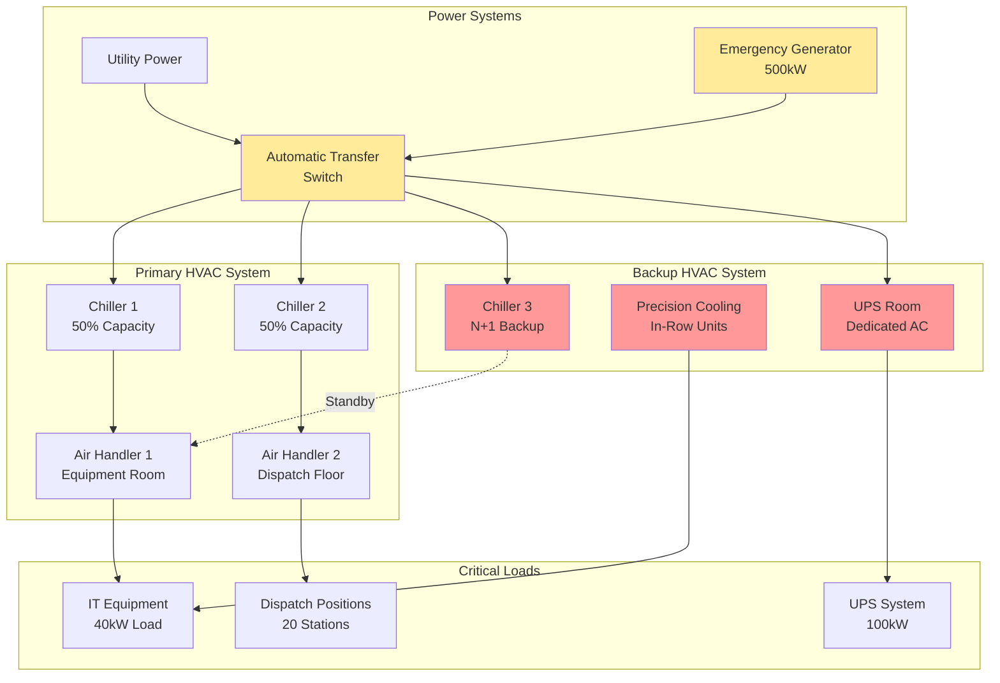

Emergency dispatch centers represent mission-critical facilities requiring absolute reliability in environmental control. These 24/7 operations house sophisticated communications equipment, computer systems, and personnel who cannot tolerate HVAC failures during emergency response situations.

## Mission-Critical Cooling Requirements

Dispatch centers operate continuously with no scheduled downtime, making HVAC reliability paramount. Equipment rooms containing servers, communications gear, and network infrastructure generate substantial heat loads that demand precision cooling regardless of outdoor conditions or facility emergencies.

The total cooling load combines several components:

$$Q_{total} = Q_{equipment} + Q_{personnel} + Q_{lighting} + Q_{envelope} + Q_{ventilation}$$

Equipment heat loads typically dominate the calculation. For dispatch center equipment rooms:

$$Q_{equipment} = \sum_{i=1}^{n} (P_i \times 3.412) \times DF$$

where $P_i$ is the power consumption of each device in watts, 3.412 converts watts to BTU/hr, and $DF$ is the diversity factor (typically 0.8-1.0 for dispatch centers due to constant operation).

A typical mid-sized dispatch center with 40 kW of IT equipment load requires:

$$Q_{equipment} = 40,000 \times 3.412 \times 0.95 = 129,656 \text{ BTU/hr} \approx 11 \text{ tons}$$

## Redundant HVAC System Design

Dispatch centers require N+1 or 2N redundancy to ensure continuous operation during equipment failures or maintenance. Common redundant configurations include:

**N+1 Configuration:** Base capacity (N) plus one additional unit providing 100% backup. For a facility requiring 20 tons of cooling, this means three 10-ton units where any two provide adequate cooling.

**2N Configuration:** Complete duplication of all systems. Two independent HVAC systems, each capable of handling 100% of the load. This configuration provides maximum reliability but doubles equipment and installation costs.

Critical design elements for redundancy include:

- Independent chilled water loops with dedicated pumps and chillers
- Separate electrical feeds from different panels or sources
- Isolated ductwork distribution to prevent single-point failures
- Automated failover controls with manual override capability
- Continuous monitoring with immediate alarm notification

## Equipment Heat Load Management

Modern dispatch centers house extensive IT infrastructure generating concentrated heat loads. Effective heat load management strategies include:

**Hot aisle/cold aisle configuration:** Server racks arranged to create alternating hot and cold aisles, with cold aisle temperatures maintained at 68-72°F and supply air directed to equipment intake faces.

**In-row cooling units:** Precision air conditioning units placed directly within equipment rows, providing close-coupled cooling with typical capacities of 10-30 kW per unit. These units offer superior temperature and humidity control compared to perimeter CRAC units.

**Raised floor vs. overhead distribution:** Raised floor systems distribute cool air beneath equipment with perforated tiles at cold aisles. Overhead systems supply cool air from above, allowing waste heat to rise naturally. Selection depends on ceiling height, equipment layout, and renovation constraints.

## UPS and Battery Room Cooling

Uninterruptible Power Supply (UPS) systems and battery rooms require dedicated environmental control. Battery performance and lifespan are highly temperature-sensitive, with optimal operating temperatures between 68-77°F.

The cooling load for UPS systems includes inefficiency losses:

$$Q_{UPS} = P_{load} \times \left(\frac{1}{\eta} - 1\right) \times 3.412$$

For a 100 kW UPS operating at 95% efficiency:

$$Q_{UPS} = 100,000 \times \left(\frac{1}{0.95} - 1\right) \times 3.412 = 17,958 \text{ BTU/hr}$$

Battery rooms must maintain temperature within ±5°F of the design point to prevent capacity degradation and thermal runaway conditions. Separate dedicated HVAC units with backup capability are essential, as battery failure during power outages would compromise the entire facility.

## Acoustic Considerations

Dispatch operations require quiet environments for clear radio and telephone communications. HVAC systems must achieve noise criteria (NC) ratings of NC-30 to NC-35 in call-taking areas.

Acoustic design strategies include:

- Low-velocity ductwork design (1,200-1,500 fpm maximum in occupied spaces)
- Sound-lined ductwork and plenums near dispatch positions
- Duct silencers at air handler discharge and branch takeoffs
- Vibration isolation for all mechanical equipment
- Variable speed drives operating at reduced speeds during normal conditions
- Equipment room separation from dispatch areas with sound-rated walls

Terminal velocity at diffusers should not exceed 400-500 fpm to prevent excessive noise generation.

## Emergency Generator Integration

Dispatch center HVAC systems require full generator backup with automatic transfer switching. Load shedding strategies prioritize critical cooling while reducing non-essential loads:

**Tier 1 (Highest Priority):**
- IT equipment room precision cooling
- UPS and battery room cooling
- Minimum ventilation for occupied dispatch areas

**Tier 2 (Medium Priority):**
- Full ventilation for dispatch areas
- Break room and support area cooling
- Exhaust systems

**Tier 3 (Lowest Priority):**
- Administrative area cooling
- Training room HVAC
- Non-critical support spaces

Generator capacity must account for motor starting inrush currents, typically 6-8 times full load amperage for conventional motors. Soft starters or variable frequency drives reduce starting demand by 50-70%.

## Design Criteria Summary

| Parameter | Requirement | Notes |
|-----------|-------------|-------|
| Equipment Room Temperature | 68-75°F | ±2°F control |
| Equipment Room Humidity | 40-55% RH | ±5% control |
| Dispatch Area Temperature | 70-74°F | Individual zone control |
| UPS/Battery Room Temperature | 68-77°F | ±3°F maximum deviation |
| Redundancy Level | N+1 minimum | 2N for high-reliability facilities |
| Acoustic Level (Dispatch) | NC-30 to NC-35 | Critical for communications |
| Backup Power Transfer Time | <10 seconds | Automatic transfer switch |
| Equipment Uptime Requirement | 99.99% | Maximum 52 minutes downtime/year |
| Ventilation Rate (Occupied) | 15-20 CFM/person | Per ASHRAE 62.1 |
| Emergency Mode Runtime | 72 hours minimum | On generator power |

## System Architecture

Successful dispatch center HVAC design requires understanding the critical nature of these facilities and implementing appropriate redundancy, monitoring, and backup systems. The combination of N+1 or 2N redundancy, precision environmental control, acoustic design, and comprehensive emergency power integration ensures continuous operation during routine conditions and emergency events.
