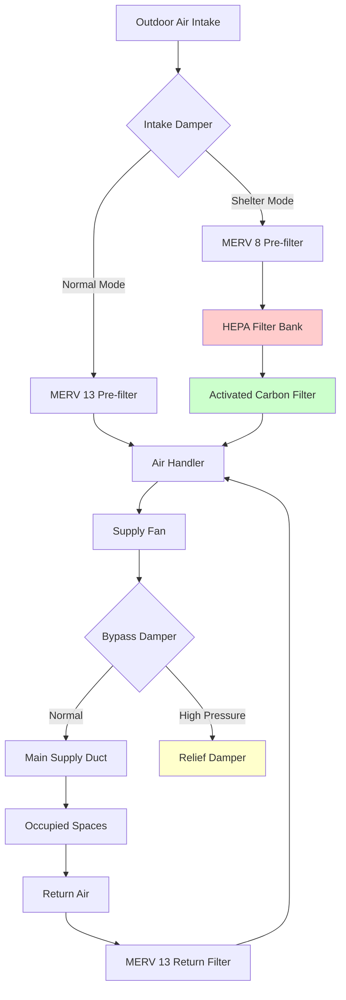

## Design Overview

Emergency Operations Centers (EOC) serve as command and coordination hubs during disasters, emergencies, and critical incidents. Unlike conventional office buildings, EOCs must maintain full operational capability during extended activation periods lasting days or weeks while accommodating dramatically variable occupancy loads ranging from minimal standby staffing to maximum capacity operations. The HVAC system represents a critical life safety component ensuring personnel effectiveness, equipment reliability, and potential shelter-in-place capability during external hazardous conditions.

The primary design challenge stems from the dual-mode operational profile: EOCs remain in warm standby condition with minimal staffing most of the year, then transition to intensive 24-hour operations during activations. This operational pattern demands HVAC systems capable of rapid response to changing thermal and ventilation loads while maintaining exceptional reliability under stress conditions when failure directly compromises emergency response capability.

## Extended Activation Period Requirements

### Continuous Operation Design

EOC activations during major disasters extend 7-21 days with continuous 24-hour staffing. HVAC systems must operate reliably throughout activation periods without maintenance intervention or performance degradation.

**System Reliability Provisions**:
- Redundant critical equipment (chillers, boilers, air handlers in N+1 configuration)
- Automatic failover controls switching to backup equipment on primary failure
- Accessible filters and consumables allowing replacement during operations
- Remote monitoring with predictive maintenance alerts
- 72-hour fuel supply for on-site generation if serving heating/cooling plants

**Thermal Endurance Design**: Extended operation at elevated loads requires oversized heat rejection and distribution systems:
- Cooling towers and condensers sized 125% of calculated peak load
- Chilled water and condenser water pumps with backup units
- Air-cooled equipment with extended coil surfaces for sustained capacity
- Multiple smaller units preferred over single large units (four 25-ton units superior to one 100-ton unit)

### Rapid Transition Capability

EOCs transition from standby to full activation within 2-4 hours. HVAC systems must rapidly condition spaces from setback temperatures while managing sudden occupancy and equipment heat gains.

**Temperature Recovery Performance**: Calculate required heating/cooling capacity for acceptable recovery time:

$$Q_{recovery} = Q_{design} + \frac{m \cdot c_p \cdot \Delta T}{t_{recovery} \cdot 3600}$$

Where:
- $Q_{recovery}$ = total heating/cooling capacity (BTU/hr)
- $Q_{design}$ = steady-state design load (BTU/hr)
- $m$ = building thermal mass (lb, structure + furnishings)
- $c_p$ = specific heat (typically 0.2 BTU/lb·°F for mixed construction)
- $\Delta T$ = temperature difference from setback to occupied (°F)
- $t_{recovery}$ = desired recovery time (hours, typically 1-2 hours)

**Ventilation Ramp-Up**: Outdoor air systems transition from minimum standby flow to design occupancy rates:
- Variable speed fans accommodate 10-100% flow range
- CO₂-based demand control ventilation responds to actual occupancy
- Dedicated outdoor air systems (DOAS) with energy recovery (60-70% effectiveness minimum)

## Variable Occupancy Load Management

### Occupancy Range Design

EOCs experience extreme occupancy variation requiring flexible HVAC capacity:

| Operating Mode | Occupancy Level | Cooling Load Ratio | Ventilation Requirement |
|----------------|----------------|-------------------|------------------------|
| Standby | 1-3 persons | 0.10-0.15 | Minimum code outdoor air |
| Limited Activation | 10-20 persons | 0.30-0.40 | 50-60% design occupancy |
| Partial Activation | 30-50 persons | 0.60-0.75 | 75-85% design occupancy |
| Full Activation | 75-150 persons | 1.00 | 100% design occupancy |

**Load Calculation Approach**: Size systems for maximum activation scenario with turndown capability to standby loads.

**Sensible Cooling Load** during full activation:

$$Q_{sensible} = Q_{envelope} + Q_{occupants} + Q_{lighting} + Q_{equipment} + Q_{ventilation}$$

Where occupant sensible heat at moderate activity (seated, office work):
$$Q_{occupants} = n \cdot 250 \text{ BTU/hr per person}$$

Communications and IT equipment load:
$$Q_{equipment} = P_{installed} \cdot DF \cdot 3.41 \text{ BTU/hr per watt}$$

Where $DF$ = diversity factor (0.6-0.8 for EOC equipment, higher than conventional office due to simultaneous operation during activations).

**Ventilation Load**: Outdoor air sensible and latent loads dominate during high occupancy:

$$Q_{oa,sensible} = 1.08 \cdot CFM_{oa} \cdot (T_{outdoor} - T_{supply})$$

$$Q_{oa,latent} = 0.68 \cdot CFM_{oa} \cdot (W_{outdoor} - W_{supply})$$

Minimum outdoor air during full activation:
$$CFM_{oa} = n_{occupants} \cdot 5 \text{ CFM/person} + A_{floor} \cdot 0.06 \text{ CFM/ft}^2$$

Apply whichever provides greater ventilation rate per ASHRAE 62.1 for conference rooms and assembly spaces.

### Zone Control Strategy

**Multiple-Zone VAV Systems**: Accommodate varying occupancy distribution across EOC functional areas:
- Main operations room: Large open space with flexible workstation density
- Conference rooms: High occupancy density during briefings, unoccupied during operations
- Break rooms and support areas: Intermittent occupancy throughout activation
- Administrative offices: Lower occupancy during activations (personnel deployed to operations floor)

**Control Sequence**:
1. CO₂ sensors in major spaces modulate outdoor air dampers (setpoint 800-1000 ppm)
2. Occupancy sensors in conference and break rooms enable local zone operation
3. Space temperature sensors modulate VAV box airflow
4. Main air handler discharge temperature resets based on zone requirements
5. Override capability for manual full-capacity operation during emergencies

## Communications Equipment Cooling

### Equipment Heat Load Characteristics

Modern EOCs contain substantial communications, IT, and display equipment generating continuous heat loads independent of occupancy:

**Typical Equipment Density**:
- Operations floor: 8-15 watts/ft² (workstations, displays, communications consoles)
- Server/communications room: 50-150 watts/ft² (servers, network equipment, radio systems)
- Display walls and AV systems: 25-40 watts/ft² in display areas

**Heat Load Calculation**: Calculate installed power heat equivalent:

$$Q_{IT} = \sum (P_{equipment} \cdot DF \cdot 3.41)$$

Critical equipment rooms require dedicated cooling independent of occupant comfort systems.

### Dedicated Equipment Cooling

**Server/Communications Room HVAC**:
- Precision air conditioning units maintaining tight temperature (72±2°F) and humidity (45±5% RH) control
- N+1 redundancy minimum (three units for two-unit required capacity)
- Overhead or raised floor air distribution with hot aisle/cold aisle configuration
- Separate from building HVAC on emergency power and UPS systems
- 24/7 operation regardless of EOC activation status

**Capacity Sizing**: Equipment room cooling accounts for all installed IT power plus safety factor:

$$Q_{total} = (P_{IT} \cdot 3.41 \cdot 1.15) + Q_{transmission}$$

The 1.15 multiplier accounts for UPS inefficiency and future equipment additions.

**Operations Floor Equipment Cooling**: Integrate equipment heat into general comfort HVAC:
- Underfloor air distribution (UFAD) systems effectively cool workstation equipment
- Supply air diffusers at workstations direct cooling to heat sources
- Raised floor plenum depth 12-18 inches minimum for adequate airflow
- Floor supply temperature 63-65°F with task/ambient conditioning approach

### Equipment Room Ventilation

**Heat Density Management**: High-density equipment rooms require substantial air circulation:

$$CFM_{equipment} = \frac{Q_{sensible}}{1.08 \cdot \Delta T}$$

Using supply-to-return temperature differential:
- $\Delta T$ = 15-20°F for general equipment rooms
- $\Delta T$ = 10-15°F for high-density server areas requiring more airflow

**Redundant Air Distribution**: Multiple air handlers serve equipment rooms:
- Ceiling-mounted or in-row cooling units positioned near heat sources
- Air circulation continues on backup unit if primary fails
- Backup unit sized for 100% load (not reduced capacity during failover)

## Conference Room Flexibility

### Multi-Purpose Space Design

EOC conference rooms serve dual functions: strategy briefings during activations (high occupancy) and training/meetings during standby (variable occupancy).

**Occupancy Design Criteria**:
- Briefing configuration: 15-20 ft² per person (densely packed theater-style seating)
- Conference configuration: 25-35 ft² per person (seated at tables)
- Design for briefing density to ensure adequate capacity during peak use

**Ventilation Flexibility**: Conference rooms require responsive outdoor air control:

$$CFM_{oa,min} = n_{max} \cdot 5 \text{ CFM/person} + A_{floor} \cdot 0.06 \text{ CFM/ft}^2$$

For 2,000 ft² conference room designed for 100 occupants maximum:
$$CFM_{oa} = 100 \cdot 5 + 2000 \cdot 0.06 = 500 + 120 = 620 \text{ CFM}$$

**Demand Control Ventilation**: CO₂ sensors modulate outdoor air:
- Setpoint 800-1000 ppm during occupied periods
- Minimum outdoor air position maintains code minimum when unoccupied
- Override to maximum outdoor air 30 minutes before scheduled briefings
- Faster response than occupancy-based ramp-up prevents CO₂ overshoot

### Load Swing Management

Conference rooms experience dramatic load swings between empty and maximum occupancy states:

**Cooling Load Comparison**:

| Condition | Occupants | Sensible Load (BTU/hr) | Latent Load (BTU/hr) |
|-----------|-----------|----------------------|-------------------|
| Unoccupied | 0 | 15,000 (lights, envelope) | 2,000 (infiltration) |
| Full Occupancy | 100 | 40,000 (+ 25,000 people) | 22,000 (+ 20,000 people) |
| Load Ratio | — | 2.7× | 11× |

**System Response Requirements**:
- VAV terminal units with 4:1 turndown ratio minimum (25-100% flow)
- Reheat capability prevents overcooling during low-occupancy high-outdoor-air conditions
- Latent capacity adequate for peak occupancy moisture generation
- Return air pathways sized for peak airflow (avoid velocity noise during full-flow operation)

## Air Quality During Extended Operations

### Continuous Occupancy Considerations

Personnel working 12-hour shifts over multiple days require exceptional indoor air quality to maintain alertness and cognitive function:

**Ventilation Rate Enhancement**:
- ASHRAE 62.1 minimum: 5 CFM/person + 0.06 CFM/ft² for offices
- Enhanced EOC ventilation: 15-20 CFM/person recommended for sustained mental acuity
- Total outdoor air during maximum occupancy significantly exceeds code minimum

**Air Filtration Standards**:
- MERV 13 minimum filtration for all outdoor and recirculated air
- Removes airborne particulates, bioaerosols, and outdoor contaminants
- MERV 14-16 recommended for facilities in urban or industrial areas
- Activated carbon filters if outdoor air quality concerns exist (wildfires, industrial releases)

### Contaminant Control

**Source Control Strategies**:
- Low-VOC materials throughout EOC construction and furnishing
- Dedicated exhaust for pantry areas with coffee makers and microwaves (50-100 CFM)
- Restroom exhaust continuous operation (minimum 0.5 ACH when EOC on standby)
- Separate IT equipment ventilation prevents ozone and electronic component off-gassing from entering occupied areas

**Pressure Relationships**: Maintain positive pressure in occupied spaces:
- Supply airflow exceeds return + exhaust by 10-15% creating positive pressurization
- Prevents infiltration of unconditioned and potentially contaminated outdoor air
- Pressurization relative to exterior: +0.03 to +0.05 inches water column
- Adjacent spaces at neutral or slightly negative pressure relative to main operations floor

### Humidity Control

**Comfort and Equipment Requirements**: Maintain 30-50% RH year-round:
- Below 30% RH: Static electricity damages electronics, occupant discomfort
- Above 50% RH: Condensation risk on cold surfaces, mold growth potential
- Year-round humidity control requires both humidification (winter) and dehumidification (summer)

**Dehumidification Approach**:
- Dedicated outdoor air system with cooling coil deep enough to achieve 50-55°F leaving air temperature
- Desiccant dehumidification for extreme latent loads or very humid climates
- Separate sensible cooling coil reheats air to supply temperature after dehumidification

**Humidification Systems**:
- Steam injection humidifiers for precise control and sanitary operation
- Humidifier capacity based on winter outdoor air moisture deficit:

$$lb_{water}/hr = CFM_{oa} \cdot (W_{setpoint} - W_{outdoor}) \cdot 4.5$$

Where humidity ratios ($W$) expressed in lb water/lb dry air.

## Shelter-In-Place Capabilities

### Design Criteria

EOCs designed for shelter-in-place operation protect occupants from external airborne hazards (chemical releases, radiological events, biological threats) while maintaining interior habitability.

**Protection Strategies**:
1. **Filtration mode**: Enhanced filtration removes particulates and NBC threats from outdoor air
2. **Recirculation mode**: Minimize outdoor air intake, maximize recirculation
3. **Positive pressurization**: Prevent infiltration of contaminated outdoor air
4. **Sealed envelope**: Minimize leakage paths for contaminant entry

### HVAC Operational Modes

**Normal Operation Mode**:
- Standard outdoor air rates per occupancy and code requirements
- MERV 13 filtration on outdoor and return air
- Building pressure neutral to slightly positive (+0.02 inches w.c.)

**Shelter-In-Place Mode**:
- Outdoor air dampers close to minimum position or fully closed
- Recirculation increases to maximum (100% if outdoor air eliminated)
- HEPA filtration (99.97% at 0.3 microns) and activated carbon filters engage on outdoor air
- Building pressurization increases (+0.05 to +0.10 inches w.c. relative to exterior)

**Transition Time**: Switch from normal to shelter mode within 60 seconds:
- Automated controls close outdoor air dampers on command
- Bypass dampers around HEPA/carbon filters close, forcing air through protective filtration
- Supply fan speed increases to maintain pressurization as outdoor air reduces

### Filtration and NBC Protection

**HEPA Filtration System**:
- H13 or H14 HEPA filters (99.95-99.995% efficiency at 0.3 microns)
- Removes biological agents, radiological particulates, fine dust
- Parallel filter banks with bypass dampers (isolate filters during normal operation to extend service life)
- Magnehelic gauges monitor pressure drop across filters indicating loading

**Activated Carbon Filtration**:
- Granular activated carbon (GAC) beds remove gaseous chemical contaminants
- Carbon depth 2-4 inches minimum for adequate residence time
- Replace carbon based on predicted service life for anticipated threats (typically annual replacement)
- Bypass during normal operation (carbon has limited service life)

**System Integration**:

### Air Change Rate and Occupant Loading

**Habitability Duration**: Calculate oxygen depletion and CO₂ accumulation rates during sealed operation.

**Oxygen Consumption**: Each occupant consumes approximately 0.63 CFM oxygen at sedentary activity:

$$t_{O_2} = \frac{V_{space} \cdot (0.2095 - 0.19)}{n \cdot 0.63}$$

Where:
- $V_{space}$ = interior volume (ft³)
- 0.2095 = atmospheric oxygen fraction
- 0.19 = minimum safe oxygen fraction (19%)
- $n$ = number of occupants
- 0.63 = oxygen consumption rate (CFM per person)
- $t_{O_2}$ = time to oxygen depletion (minutes)

**CO₂ Accumulation**: Occupants generate 0.37 CFM CO₂:

$$C_{CO_2}(t) = C_{initial} + \frac{n \cdot 0.37 \cdot t \cdot 10^6}{V_{space}}$$

Where:
- $C_{CO_2}(t)$ = CO₂ concentration at time $t$ (ppm)
- $C_{initial}$ = initial CO₂ concentration (typically 400-800 ppm)
- $t$ = elapsed time (minutes)

**Minimum Ventilation During Shelter**: Introduce limited outdoor air through protective filtration maintaining CO₂ below 5,000 ppm (OSHA 8-hour exposure limit):

$$CFM_{oa,min} = \frac{n \cdot 0.37 \cdot 10^6}{5000 - 400} = n \cdot 80 \text{ CFM per person}$$

This ventilation rate maintains indefinite habitability but requires contaminant-free outdoor air or complete filtration of hazards.

### Emergency Power Integration

**Critical Load Classification**: Shelter-in-place HVAC systems connect to emergency power:
- Supply and return fans (entire air handling system)
- Chilled water plant if electric cooling (chillers, pumps, cooling towers)
- Heating plant components (boilers, pumps)
- Controls and monitoring systems

**Generator Sizing**: Include HVAC loads in emergency generator capacity:
- Full HVAC electrical load during shelter operation
- Simultaneous operation of all critical systems (lights, IT, HVAC, life safety)
- Minimum 72-hour fuel capacity for on-site fuel storage
- Automatic transfer switch transitions to generator power within 10 seconds

## Design Parameters Summary

| Parameter | Standby Mode | Full Activation | Shelter-in-Place |
|-----------|--------------|-----------------|------------------|
| Occupancy | 1-3 persons | 75-150 persons | 100-200 persons |
| Outdoor Air | Minimum code | 15-20 CFM/person | 5-10 CFM/person filtered |
| Filtration | MERV 13 | MERV 13 | HEPA + Carbon |
| Temperature | 65-80°F setback | 72±2°F | 72±3°F |
| Humidity | 30-60% RH | 40-50% RH | 35-55% RH |
| Pressurization | Neutral | +0.02-0.03 in w.c. | +0.05-0.10 in w.c. |
| Air Changes | 2-4 ACH | 6-10 ACH | 4-6 ACH (recirculated) |
| System Redundancy | Single path | N+1 critical equipment | N+1 all equipment |

## Architectural and Operational Integration

**Architectural Coordination**:
- Central mechanical room location minimizes duct runs and response time
- Rooftop air intakes positioned away from potential contamination sources (vehicle exhaust, fuel storage)
- Equipment rooms adjacent to operations floor for short refrigerant and chilled water piping
- Adequate ceiling height for underfloor air distribution (10-12 feet floor-to-floor minimum)

**Controls and Monitoring**:
- Building automation system (BAS) monitors all HVAC parameters
- Graphical interface displays system status in main operations room
- Alarms for temperature excursions, equipment failures, filter loading, loss of pressurization
- Remote monitoring capability allows off-site support during activations

**Testing and Commissioning**:
- Functional performance testing validates rapid mode transitions
- Shelter-in-place mode testing confirms pressurization and filtration performance
- Tabletop exercises include HVAC failure scenarios requiring backup system activation
- Annual testing of emergency power transfer and HVAC restart

**Maintenance and Logistics**:
- Preventive maintenance during standby periods minimizes activation-period failures
- Spare parts inventory for critical components (filters, fan belts, control components)
- Service contracts provide 4-hour response for emergency repairs during activations
- Filter replacement schedule aligned with seasonal demand (pre-summer for cooling filters, pre-winter for humidifiers)

Emergency Operations Centers demand HVAC systems engineered for reliability, flexibility, and protection beyond conventional building standards. The investment in redundancy, filtration, and control sophistication ensures operational continuity during the precise circumstances when failure consequences are most severe.
