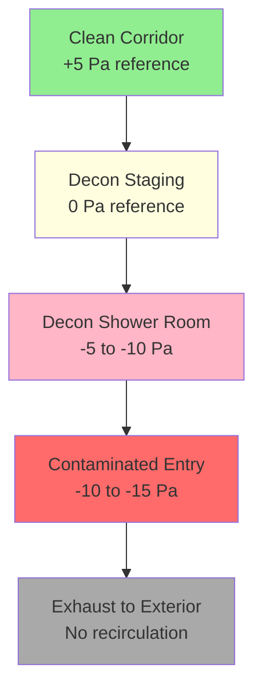
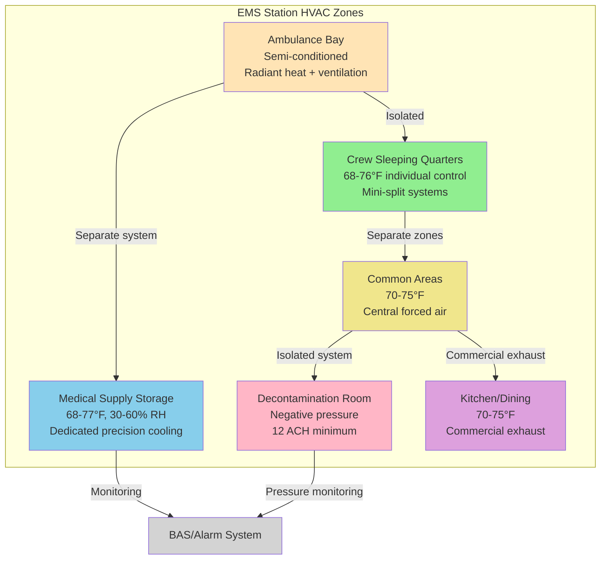

## EMS Facility HVAC Requirements

Emergency Medical Service facilities demand specialized HVAC design addressing unique operational requirements distinct from traditional fire stations. The integration of medical supply storage requiring precise temperature and humidity control, decontamination areas with containment ventilation, and ambulance bays with vehicle exhaust capture creates complex multi-zone systems. EMS stations operate continuously with 24-hour staffing, requiring reliable climate control for crew quarters while maintaining medical storage conditions within narrow tolerances.

The fundamental design challenge emerges from conflicting environmental requirements: ambulance bays operate as semi-conditioned spaces with frequent door openings and vehicle exhaust contamination, medical supply rooms demand tight temperature control (68-77°F) and humidity limits (30-60% RH), decontamination areas require negative pressure containment, and crew living quarters need residential comfort levels. These zones must remain thermally and atmospherically isolated while served by integrated mechanical systems.

## Ambulance Bay Conditioning

### Thermal Control Strategy

Ambulance bays present conditioning challenges similar to fire apparatus bays but with modified requirements reflecting smaller vehicle sizes and increased frequency of door operations. The thermal load calculation must account for infiltration from personnel entry doors, overhead vehicle doors, and the thermal mass of ambulances that may remain parked for extended periods.

**Heating Design**: Floor-level heating provides optimal comfort and operational benefits:

$$Q_{bay} = Q_{envelope} + Q_{infiltr} + Q_{vehicle} + Q_{door}$$

Where:
- $Q_{envelope}$ = transmission losses through walls, roof, doors (BTU/hr)
- $Q_{infiltr}$ = air leakage infiltration load (BTU/hr)
- $Q_{vehicle}$ = vehicle thermal mass heating requirement (BTU/hr)
- $Q_{door}$ = door operation infiltration (BTU/hr)

**Door infiltration calculation** for overhead ambulance doors:

$$Q_{door} = n \times A_{door} \times ACH \times 1.08 \times \Delta T$$

Typical values:
- $n$ = number of bay doors (1-4 typical)
- $A_{door}$ = 100-120 ft² per door (10 ft × 10-12 ft standard)
- $ACH$ = 3-6 air changes per hour for well-sealed doors
- $\Delta T$ = indoor design temperature minus outdoor design temperature (°F)

**Radiant floor heating** provides superior performance in ambulance bays:
- Hydronic tubing embedded in concrete slab at 6-8 inch spacing
- Supply water temperature 110-130°F for moderate climates
- Heat output 18-25 BTU/hr·ft² at design conditions
- Prevents ice and snow melt-off from vehicles freezing on floor
- Maintains floor surface temperature 70-75°F during occupied periods
- Slab insulation R-10 perimeter, R-5 under entire slab area

**Overhead unit heaters** serve as supplementary or alternative heating:
- Gas-fired or hot water unit heaters at 12-14 feet mounting height
- Capacity 75,000-150,000 BTU/hr per unit
- Horizontal discharge directed away from overhead doors
- Fast thermal response allows temperature setback during unoccupied hours
- Lower first cost but higher operating cost and less uniform heating

### Cooling Considerations

Most EMS ambulance bays operate as semi-conditioned spaces with heating-only or minimal cooling provision. Full air conditioning adds substantial cost and energy consumption with limited benefit given frequent door openings.

**Cooling strategies by climate**:
- Cold climates: Heating only with natural ventilation
- Moderate climates: Heating with mechanical ventilation and evaporative cooling
- Hot climates: Full air conditioning using rooftop units or split systems

**Air conditioning design parameters** when provided:
- Design temperature 78-82°F (higher than occupied spaces)
- Sensible-only cooling (no humidity control required)
- Capacity calculation includes solar gain through overhead doors
- Equipment sized for 50-60% door-closed operation (not continuous door-open conditions)

Cooling load calculation:

$$Q_{cooling} = Q_{envelope} + Q_{solar} + Q_{lights} + Q_{infiltr}$$

Apply diversity factor 0.5-0.6 to account for door-open periods when mechanical cooling ineffective.

## Crew Quarters and Living Areas

### Residential Comfort Standards

EMS crew quarters require continuous conditioning to residential comfort standards. Personnel work 12 or 24-hour shifts with sleep periods occurring during day and night hours, demanding consistent thermal comfort and superior acoustic performance.

**Design criteria for living spaces**:

| Space Type | Temperature | Humidity | Outdoor Air | Noise Level |
|------------|-------------|----------|-------------|-------------|
| Sleeping Quarters | 68-76°F (individual control) | 30-60% RH | 15 CFM/person | NC-25 to NC-30 |
| Common Areas | 70-75°F | 30-60% RH | 7.5 CFM/person | NC-30 to NC-35 |
| Kitchen/Dining | 70-75°F | 30-60% RH | 7.5 CFM/person | NC-35 to NC-40 |
| Restrooms/Showers | 72-78°F | No control | 50-70 CFM exhaust | NC-40 |
| Exercise Room | 68-72°F | 30-60% RH | 20 CFM/person | NC-35 to NC-40 |

**System selection** for crew quarters:

**Ductless mini-split systems**: Optimal for individual sleeping quarters:
- Individual zone control allows personalized temperature settings
- Quiet operation essential for daytime sleeping (sound levels 19-26 dB(A))
- Heat pump operation provides heating and cooling
- Capacity 9,000-12,000 BTU/hr per bedroom sufficient
- No ductwork reduces installation cost in renovations
- Individual metering possible for energy management

**Central forced air systems**: Appropriate for common areas:
- Zoned air handling with VAV boxes or zone dampers
- Common areas separate from sleeping quarters
- Dedicated outdoor air system (DOAS) with energy recovery
- Central dehumidification in humid climates
- MERV 13 filtration minimum for indoor air quality

### Acoustic Design

Sound control critically affects crew rest quality. Sleep disturbances from HVAC noise reduce personnel readiness and increase fatigue-related errors.

**Noise control measures**:
- Duct-mounted silencers on supply and return branches serving sleeping quarters
- Vibration isolation for all mechanical equipment (spring or neoprene isolators)
- Flexible duct connectors on air handlers and fan-coil units
- Low-velocity ductwork (600-800 FPM maximum in sleeping areas)
- Sound boots at register connections to minimize register noise
- Equipment location away from sleeping areas (rooftop or mechanical rooms)

**Acoustic separation**: Sleeping quarters require isolation from ambulance bay noise:
- Sound-rated partition assemblies (STC-50 minimum)
- Sealed penetrations through fire-rated partitions
- No transfer grilles or openings between bay and living quarters
- Separate HVAC systems prevent noise transmission through ductwork

## Medical Supply Storage Requirements

### Temperature and Humidity Control

EMS stations store temperature-sensitive medical supplies including medications, IV fluids, and biological materials. Storage area conditioning must maintain consistent temperature and humidity within manufacturer-specified ranges, typically 68-77°F and 30-60% relative humidity per USP guidelines.

**Cooling capacity calculation** for medical supply rooms:

$$Q_{storage} = Q_{trans} + Q_{lights} + Q_{people} + Q_{OA}$$

Where:
- $Q_{trans}$ = heat gain through walls, ceiling, floor (sensible)
- $Q_{lights}$ = lighting heat gain (3.41 BTU/hr per watt)
- $Q_{people}$ = occupant heat gain (250 BTU/hr sensible per person, low occupancy)
- $Q_{OA}$ = outdoor air ventilation load (sensible and latent)

**Humidity control**: Critical for medication stability:
- Dehumidification in humid climates maintains 30-60% RH
- Humidification in cold, dry climates prevents low humidity
- Relative humidity monitoring with alarms at setpoint deviations
- 24-hour humidity recording for quality assurance documentation

**System design considerations**:
- Dedicated cooling system isolated from other zones
- Redundant cooling capacity (dual systems or backup unit)
- Temperature monitoring with alarm notification
- Battery backup for monitoring systems during power outages
- Insulated storage room construction minimizes load and temperature swings

**Split system or precision air conditioning unit**:
- Cooling capacity 12,000-24,000 BTU/hr typical for 200-400 ft² storage rooms
- Heating capacity sized for winter design conditions
- Dehumidification capability to 30% RH minimum
- Temperature control accuracy ±2°F of setpoint
- Remote monitoring and alarm capability

### Ventilation Requirements

Medical supply storage requires minimal ventilation compared to occupied spaces. ASHRAE 62.1 classifies storage rooms as "Storage Rooms" requiring 0.12 CFM/ft² or mechanical exhaust can be eliminated with sealed room construction.

**Ventilation design**:
- Outdoor air ventilation 0.06-0.12 CFM/ft² if mechanically ventilated
- Transfer air from adjacent conditioned spaces acceptable
- No return air to other building zones (isolated system)
- Air filtration MERV 11 minimum to reduce particulate contamination

## Decontamination Area Design

### Containment Ventilation

Decontamination facilities require specialized ventilation preventing contaminated air migration to clean areas. The decontamination zone operates under negative pressure differential relative to adjacent spaces, with air flowing from clean areas toward contaminated areas and exhausting directly outdoors.

**Pressure relationship hierarchy**:

**Negative pressure design parameters**:
- Pressure differential -5 to -10 Pa relative to adjacent clean spaces
- Minimum 12 air changes per hour (ACH) in decontamination room
- 100% outdoor air (no recirculation)
- Supply air 90-95% of exhaust air (differential creates negative pressure)

**Exhaust air quantity calculation**:

$$Q_{exhaust} = \frac{V \times ACH}{60}$$

Where:
- $V$ = room volume (ft³)
- $ACH$ = 12-15 air changes per hour minimum
- Result in CFM

**Supply air quantity for negative pressure**:

$$Q_{supply} = Q_{exhaust} - Q_{undercut}$$

Where $Q_{undercut}$ = airflow through door undercut or transfer grille creating pressure differential, typically 50-100 CFM.

### Decontamination Room HVAC Features

**Air distribution**:
- Supply air at ceiling level with laminar downward flow pattern
- Supply diffusers oriented to avoid disturbing contaminant capture
- Exhaust grilles low on wall (12-18 inches above floor) to capture dense vapors
- No direct supply-to-exhaust air paths (prevents short-circuiting)

**Temperature control**:
- Design temperature 75-78°F for personnel comfort during showering
- Reheat coils on supply air for temperature control independent of airflow
- Humidity control secondary (high ventilation rates typically prevent excessive humidity)

**Exhaust air treatment**:
- Direct exhaust to outdoors through dedicated ductwork
- Exhaust discharge above roofline, minimum 10 feet from air intakes
- No filtration required for typical EMS decontamination (gross decontamination only)
- Exhaust fan located at discharge point (negative pressure ductwork)

**Emergency shutdown capability**:
- Manual controls outside decontamination area
- Emergency stop button activates exhaust fan and closes supply dampers
- Interlocked with facility alarm system

## Emergency Backup Power Integration

### Critical Load Identification

EMS facilities require emergency power for life safety systems and operational continuity. HVAC loads considered critical include medical supply storage cooling, minimum heating for freeze protection, and decontamination area ventilation during active use.

**Emergency power HVAC loads**:

| System | Load Type | Priority | Generator Sizing |
|--------|-----------|----------|------------------|
| Medical Supply Storage | Cooling & Monitoring | Critical | 100% of capacity |
| Crew Quarters Heating | Minimum heating | Critical | 50% of design capacity |
| Ambulance Bay Heating | Freeze protection | Critical | 30% of design capacity |
| Decontamination Exhaust | Full operation | Critical | 100% when activated |
| Crew Quarters Cooling | Comfort | Non-critical | Typically not included |
| Domestic Hot Water | Reduced capacity | Secondary | 50% of demand |

**Generator capacity calculation** for HVAC loads:

$$kW_{HVAC} = \sum (kW_{equip} \times PF \times DF)$$

Where:
- $kW_{equip}$ = equipment nameplate rating
- $PF$ = power factor (0.85-0.90 typical for motors)
- $DF$ = demand factor accounting for non-simultaneous operation (0.7-0.9)

**Transfer switch strategy**:
- Automatic transfer switches (ATS) for critical HVAC loads
- Transfer time under 10 seconds for medical storage cooling
- Manual transfer acceptable for non-critical comfort loads
- Separate HVAC circuits for critical and non-critical loads

### Fuel Supply and Runtime

**Generator fuel storage** sizing for extended operation:

$$Gallons = \frac{kW_{load} \times hours \times fuel_{rate}}{efficiency}$$

Where:
- $kW_{load}$ = HVAC electrical load on generator
- $hours$ = required runtime (48-72 hours typical)
- $fuel_{rate}$ = 0.06-0.08 gallons per kWh for diesel generators
- $efficiency$ = 0.85-0.90 generator efficiency

**Backup considerations**:
- Natural gas generators provide unlimited runtime if gas service maintained
- Diesel fuel storage sized for 48-72 hour operation at 75% generator load
- Fuel storage tank placement for delivery truck access
- Cold weather fuel additives and tank heaters in northern climates

## EMS Facility HVAC Zone Layout

## Controls and Monitoring

### Building Automation System

EMS facilities benefit from integrated building automation providing remote monitoring, alarm notification, and energy management while maintaining critical environment control.

**BAS monitoring points**:
- Medical supply storage temperature and humidity with alarm notification
- Decontamination room pressure differential and airflow
- Emergency generator status and fuel level
- Ambulance bay temperature for freeze protection
- Crew quarters zone temperatures
- Equipment runtime and fault status

**Alarm notification**:
- Medical storage temperature deviation: ±3°F from setpoint
- Medical storage humidity deviation: below 25% or above 65% RH
- Decontamination negative pressure loss
- Equipment failures requiring immediate attention
- Generator operation and transfer status

**Remote access capability**:
- Web-based interface for off-site monitoring
- Mobile device notifications for critical alarms
- Historical data logging for compliance documentation
- Trend analysis for preventive maintenance

### Energy Management

Despite 24-hour operation, EMS facilities achieve energy savings through strategic system design and control:

**Load shifting strategies**:
- Administrative areas on setback schedules (60°F heating, 85°F cooling when unoccupied)
- Ambulance bay temperature setback during mild weather
- Training room HVAC on occupancy schedule
- Domestic hot water temperature maintenance reduced during low-demand periods

**Efficiency measures**:
- High-efficiency heating equipment (95%+ AFUE furnaces, 90%+ boiler efficiency)
- Energy recovery ventilation (ERV) on outdoor air systems (60-70% effectiveness)
- LED lighting throughout facility
- Premium efficiency motors on all HVAC equipment
- Variable frequency drives (VFD) on supply and exhaust fans

**Utility incentives**: Many utilities offer rebates for:
- High-efficiency HVAC equipment
- Building automation system installation
- Energy recovery ventilators
- LED lighting retrofits

## Maintenance and Reliability

### Preventive Maintenance Program

Critical HVAC systems require scheduled maintenance preventing failures disrupting operations or compromising medical supply integrity.

**Quarterly maintenance**:
- Filter replacement (MERV 11-13 filters in occupied areas)
- Refrigerant charge verification on cooling equipment
- Temperature and humidity sensor calibration verification
- Belt tension and wear inspection
- Condensate drain cleaning and verification

**Annual maintenance**:
- Combustion analysis and burner adjustment on gas-fired equipment
- Refrigeration system leak testing
- Control system functional testing and calibration
- Motor bearing lubrication
- Exhaust fan belt and bearing service

**Medical storage system**: Enhanced maintenance schedule:
- Monthly temperature and humidity log review
- Quarterly redundant sensor verification
- Annual full system functional test with documented setpoint recovery time
- Backup cooling system monthly operational verification

### Redundancy and Reliability

**Critical system redundancy**:
- Dual cooling units for medical supply storage (N+1 redundancy)
- Backup exhaust fan for decontamination area
- Multiple heating zones in crew quarters (partial failure acceptable)
- Emergency generator capacity includes all critical HVAC loads

**Rapid response planning**:
- Service contracts with 4-hour response time for critical systems
- Spare parts inventory (filters, belts, contactors, fuses)
- Emergency contact list posted in mechanical rooms
- Operating procedures documented for maintenance staff

## Design Criteria Summary

**EMS Station HVAC Design Parameters**:

| Zone | Cooling | Heating | Ventilation | Pressure | Special Requirements |
|------|---------|---------|-------------|----------|---------------------|
| Ambulance Bay | 78-82°F (optional) | 65-70°F | Natural or mechanical | Neutral | Vehicle exhaust capture |
| Medical Storage | 68-77°F ±2°F | 68-77°F ±2°F | 0.12 CFM/ft² | Neutral | 30-60% RH, monitoring, redundancy |
| Crew Sleeping | 68-76°F adjustable | 68-76°F adjustable | 15 CFM/person | Positive | NC-25 to NC-30, individual control |
| Common Areas | 72-76°F | 68-74°F | 7.5 CFM/person | Positive | MERV 13 filtration |
| Decontamination | 75-78°F | 75-78°F | 12-15 ACH | -5 to -10 Pa | 100% exhaust, low exhaust pickup |
| Kitchen | 72-76°F | 68-74°F | Per hood type | Neutral | Commercial exhaust hood |

The successful EMS facility HVAC design integrates diverse environmental requirements into reliable, maintainable systems supporting continuous emergency medical operations. Proper system selection, redundancy for critical loads, and comprehensive monitoring ensure patient care capability and crew comfort under all operating conditions.
