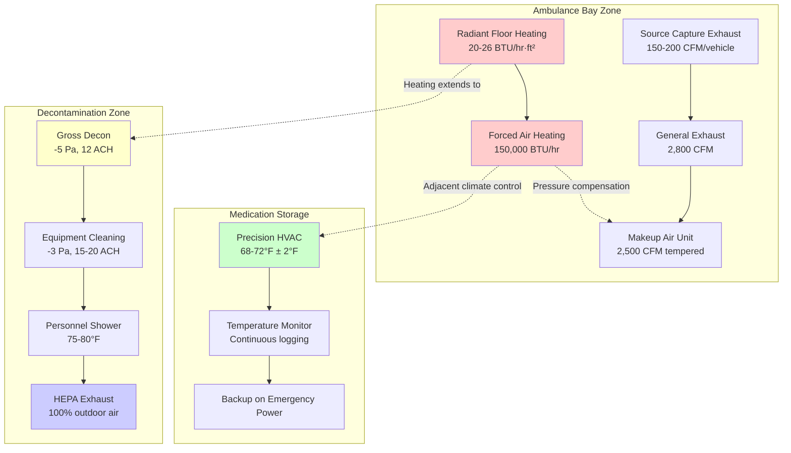

# EMS Ambulance Bay HVAC Design and Requirements

EMS ambulance bays require specialized HVAC design that addresses vehicle exhaust removal, temperature-sensitive medication storage, rapid response operational needs, and integration with decontamination areas. Unlike fire apparatus bays, ambulance bays must maintain tighter environmental control for pharmaceutical storage while accommodating frequent dispatch cycles and potential biological contamination events.

## Vehicle Exhaust Removal Requirements

Ambulance bay exhaust systems must capture diesel and gasoline engine emissions during warm-up cycles without creating negative pressure that interferes with adjacent climate-controlled medication storage areas.

### Source Capture System Design

Direct-connect exhaust capture provides optimal protection for EMS personnel during apparatus warm-up periods. Ambulances typically idle 3-5 minutes before departure, generating significant carbon monoxide and particulate emissions.

**System Components:**

- Spring-loaded hose reels with magnetic tailpipe connectors
- Quick-release nozzles rated for 800°F exhaust temperature
- Individual exhaust fans per apparatus position (150-200 CFM each)
- Automatic activation tied to ignition or manual pull-down
- Exhaust discharge termination minimum 10 feet from air intakes

**Capture Flow Calculation:**

For gasoline engines (common in smaller ambulances):

$$Q_{exhaust} = \frac{E_{displacement} \times RPM \times VE}{3456}$$

Where:
- $Q_{exhaust}$ = exhaust volume (CFM)
- $E_{displacement}$ = engine displacement (cubic inches)
- $RPM$ = idle speed (typically 600-800 RPM)
- $VE$ = volumetric efficiency (0.85 for idle conditions)
- $3456$ = conversion constant

For a typical 5.3L (323 cu in) ambulance engine at 700 RPM idle:

$$Q_{exhaust} = \frac{323 \times 700 \times 0.85}{3456} = 56 \text{ CFM}$$

Size capture system at 3× calculated exhaust volume to ensure complete capture: $56 \times 3 = 168$ CFM minimum.

**System Pressure Drop:**

Total system pressure drop determines fan selection:

$$\Delta P_{total} = \Delta P_{hose} + \Delta P_{duct} + \Delta P_{discharge}$$

Typical values:
- Flexible hose: 0.5-0.8 in. w.g. per 10 ft
- Rigid ductwork: 0.08-0.12 in. w.g. per 100 ft
- Discharge stack: 0.2-0.4 in. w.g.

Select exhaust fan to deliver design CFM at total system pressure drop plus 25% safety factor.

### Backup General Ventilation

General exhaust provides secondary protection during vehicle positioning and addresses fugitive emissions from apparatus maintenance.

**Ventilation Rate:**

$$Q_{ventilation} = \frac{V \times ACH}{60}$$

Where:
- $Q_{ventilation}$ = airflow (CFM)
- $V$ = bay volume (cubic feet)
- $ACH$ = air changes per hour (4-6 minimum, 10-12 during vehicle operation)

For a 40 ft × 50 ft × 14 ft bay:

$$Q_{ventilation} = \frac{(40 \times 50 \times 14) \times 6}{60} = 2,800 \text{ CFM}$$

Install low-level exhaust (within 12 inches of floor) since vehicle exhaust is denser than ambient air. Interlock general exhaust with apparatus door position and CO detection to activate at 9 ppm.

## Temperature Control for Medication Storage

EMS vehicles carry temperature-sensitive pharmaceuticals requiring strict environmental control. Ambulance bays must maintain 59-77°F (15-25°C) per USP guidelines for medication storage.

### Climate Control Zones

**Zone 1: Active Bay Area**
- Maintains 60-75°F year-round
- Precision within ±3°F to prevent medication degradation
- Independent of apparatus door position
- Heating capacity accounts for infiltration loads

**Zone 2: Medication Storage/Supply Room**
- Adjacent to bay for rapid restocking
- Maintains 68-72°F ± 2°F
- Temperature monitoring with alarm at 65°F and 78°F
- Backup heating/cooling on emergency power
- Data logging for compliance documentation

### Heating System Design

Radiant floor heating combined with forced air backup provides optimal temperature stability during door operations.

**Radiant Floor Capacity:**

$$q_{radiant} = \frac{k \times (T_{surface} - T_{ambient})}{R_{total}}$$

Where:
- $q_{radiant}$ = heat output (BTU/hr·ft²)
- $k$ = thermal conductivity of floor assembly
- $T_{surface}$ = floor surface temperature (85-90°F)
- $T_{ambient}$ = bay air temperature (65°F minimum)
- $R_{total}$ = thermal resistance (slab, tube spacing, flooring)

For typical 6-inch on-center tubing with 130°F water temperature:

Output = 22-26 BTU/hr·ft², providing baseline heat during closed-door periods.

**Supplemental Forced Air:**

High-efficiency gas furnaces or heat pumps sized for rapid recovery:

$$Q_{recovery} = \frac{V \times 1.08 \times \Delta T}{t_{recovery}}$$

Where:
- $Q_{recovery}$ = required heating capacity (BTU/hr)
- $V$ = bay volume (cubic feet)
- $1.08$ = constant for air at standard conditions
- $\Delta T$ = temperature drop during door opening (typically 8-12°F)
- $t_{recovery}$ = target recovery time (10-15 minutes)

For the 28,000 ft³ bay recovering 10°F in 12 minutes:

$$Q_{recovery} = \frac{28,000 \times 1.08 \times 10}{12/60} = 151,200 \text{ BTU/hr}$$

Select 150,000 BTU/hr unit to meet recovery requirements.

## Quick Response Ventilation Needs

EMS dispatch cycles require HVAC systems that do not impede vehicle departure while maintaining environmental control.

### Rapid Response Features

**Automatic System Shutdown:**
- Exhaust capture systems use breakaway connectors that disconnect when tension exceeds 15 lbf
- Hose reels retract automatically when ambulance departs
- Overhead doors trigger ventilation mode change via limit switches
- General exhaust continues for 5 minutes post-departure to clear residual emissions

**Door Cycle Optimization:**

High-speed sectional or roll-up doors minimize infiltration:
- Opening speed: 30-40 inches/second (vs 6-8 for conventional)
- Full cycle time: 8-12 seconds for 10 ft × 12 ft door
- Reduces infiltration volume by 60-70% compared to conventional doors

**Temperature Setback Limitations:**

Medication storage requirements eliminate deep setback strategies:
- Occupied mode: 68-72°F
- Standby mode: 65-75°F (maximum setback)
- Response time to occupied mode: < 5 minutes

## Bay Door Air Infiltration Management

Frequent door operations create substantial infiltration loads that must be managed without compromising medication storage temperatures.

### Infiltration Load Quantification

**Air Change Method:**

$$Q_{infiltration} = \frac{n_{cycles} \times V \times \rho \times c_p \times \Delta T}{t_{hour}}$$

Where:
- $Q_{infiltration}$ = infiltration heat loss (BTU/hr)
- $n_{cycles}$ = door cycles per hour (design for 2-4 typical, 12 maximum)
- $V$ = bay volume (cubic feet)
- $\rho$ = air density (0.075 lb/ft³ at standard conditions)
- $c_p$ = specific heat of air (0.24 BTU/lb·°F)
- $\Delta T$ = indoor-outdoor temperature difference

For 28,000 ft³ bay with 4 door cycles/hour and 50°F temperature difference:

$$Q_{infiltration} = \frac{4 \times 28,000 \times 0.075 \times 0.24 \times 50}{1} = 100,800 \text{ BTU/hr}$$

This represents 60-75% of total heating load in cold climates.

### Infiltration Mitigation Strategies

| Strategy | Effectiveness | Energy Savings | Implementation Cost |
|----------|--------------|----------------|---------------------|
| High-speed doors | 60-70% reduction | 35-45% heating | High ($8,000-15,000/door) |
| Vestibule air curtains | 30-40% reduction | 15-25% heating | Medium ($3,000-6,000/door) |
| Enhanced door seals | 20-30% reduction | 10-15% heating | Low ($500-1,000/door) |
| Demand-controlled makeup air | 15-25% reduction | 20-30% heating | Medium ($4,000-8,000/system) |

**Combined Approach:**

Layered mitigation provides optimal results:
1. High-speed insulated sectional doors with thermal break
2. Perimeter seals with automatic bottom threshold
3. Heated vestibule air curtain (optional for extreme climates)
4. Pressure-compensated makeup air system

## Heating for Cold Climate Operations

Ambulances in cold climates require shore power connections for patient compartment preconditioning and engine block heating.

### Equipment Integration

**Shore Power Stations:**
- 120V/240V outlets at each ambulance position
- Block heater circuits (1500W typical)
- Patient compartment heater circuits (1000-1500W)
- Total electrical load: 3-4 kW per ambulance position

**Preconditioning Benefits:**
- Reduces idling time by 70-80% (3-5 minutes to < 1 minute)
- Maintains medication storage temperature in vehicle
- Decreases exhaust capture system run time
- Improves cold-start reliability

### Bay Heating Design Parameters

**Cold Climate Specifications:**

| Parameter | Moderate Climate | Cold Climate | Extreme Cold |
|-----------|-----------------|--------------|--------------|
| Minimum bay temperature | 60°F | 65°F | 68°F |
| Design outdoor temperature | 10°F | -10°F | -30°F |
| Radiant floor supply temp | 115-125°F | 130-140°F | 140-150°F |
| Forced air backup capacity | 50% of load | 75% of load | 100% of load |
| Infiltration multiplier | 1.0× | 1.25× | 1.5× |

**Freeze Protection:**

Hydronic systems require glycol antifreeze and heat trace:
- Propylene glycol concentration: 30-40% (protects to -20°F to -40°F)
- Heat trace on exposed piping in unheated spaces
- Low-temperature alarm at 40°F in mechanical spaces

## Decontamination Area Integration

EMS crews require decontamination facilities adjacent to ambulance bays for biological exposure incidents and routine equipment cleaning.

### Decontamination Zone Design

**Spatial Relationship:**

**Pressure Cascade:**

Maintain negative-to-positive pressure gradient:
- Ambulance bay: -10 Pa (relative to outdoors)
- Decon airlock: -5 Pa (relative to clean areas)
- Equipment cleaning: -3 Pa (relative to clean areas)
- Personnel decon: -2 Pa (relative to clean areas)
- Clean corridor: +2 Pa (relative to decon areas)

### Ventilation Requirements

**Decontamination Room:**

$$Q_{decon} = \text{max}(ACH_{min}, Q_{dilution})$$

Where ACH minimum = 12 air changes per hour for contamination dilution.

**Exhaust System:**
- 100% exhaust with no recirculation
- HEPA filtration on exhaust (if biological agents suspected)
- Dedicated exhaust fan isolated from general building exhaust
- Discharge above roofline, minimum 25 feet from air intakes

**Makeup Air:**
- Tempered outdoor air (65-70°F supply temperature)
- Low-level supply to create floor-to-ceiling airflow pattern
- Interlocked with exhaust to maintain negative pressure

**Temperature Control:**

Decon showers require 75-80°F air temperature:
- Instantaneous water heating (0.5 GPM at 105°F)
- Supplemental radiant or electric resistance heating
- Rapid recovery after shower usage

### Equipment Cleaning Area

**Ventilation Parameters:**

| Requirement | Specification |
|-------------|---------------|
| Air changes | 15-20 ACH |
| Exhaust rate | 1.5 CFM/ft² floor area |
| Temperature | 70-75°F |
| Humidity | 40-60% RH |
| Filtration | MERV 13 minimum |

**Humidity Control:**

Equipment washing generates high moisture loads:
- Exhaust removes moisture-laden air
- Prevent condensation on cold surfaces (insulate exterior walls, roof deck)
- Condensate drainage at floor level
- Optional dehumidification if humidity exceeds 65% RH

## Design Parameters Summary

**EMS Ambulance Bay HVAC Design Table:**

| System Component | Design Parameter | Notes |
|-----------------|------------------|-------|
| **Exhaust Systems** | | |
| Source capture per vehicle | 150-200 CFM | Based on engine displacement |
| General ventilation (minimum) | 4-6 ACH | Continuous background |
| General ventilation (active) | 10-12 ACH | During vehicle operation |
| Exhaust fan pressure | 1.5-2.5 in. w.g. | Includes duct, hose, discharge losses |
| **Heating Systems** | | |
| Bay temperature (occupied) | 68-72°F | Medication storage requirement |
| Bay temperature (standby) | 65-75°F | Limited setback |
| Radiant floor output | 20-30 BTU/hr·ft² | Climate dependent |
| Forced air backup | 100,000-200,000 BTU/hr | Per 25,000-30,000 ft³ bay |
| Recovery time target | 10-15 minutes | Post door cycle |
| **Infiltration Control** | | |
| Door speed (high-speed) | 30-40 in/sec | 8-12 second full cycle |
| Air curtain discharge | 2,000-2,500 fpm | Heated to 90-100°F |
| Design door cycles | 2-4 typical, 12 max | Per hour |
| **Decontamination** | | |
| Decon room ventilation | 12-15 ACH | 100% exhaust |
| Equipment cleaning | 15-20 ACH | High moisture removal |
| Pressure differential | -5 to -10 Pa | Relative to clean areas |
| Shower area temperature | 75-80°F | Occupant comfort |
| **Medication Storage** | | |
| Storage room temperature | 68-72°F ± 2°F | USP <797> compliance |
| Temperature monitoring | Continuous with alarm | At 65°F and 78°F |
| Data logging interval | 15-minute minimum | Regulatory compliance |

## System Integration Diagram

## Code Compliance and Standards

**Referenced Standards:**

- **NFPA 1500**: Fire Department Occupational Safety and Health Program (exhaust exposure limits apply to EMS facilities)
- **USP <797>**: Pharmaceutical Compounding—Sterile Preparations (temperature control requirements)
- **ASHRAE 62.1**: Ventilation for Acceptable Indoor Air Quality (minimum ventilation rates)
- **IMC Chapter 5**: Exhaust Systems (vehicle exhaust capture and decontamination exhaust)
- **OSHA 29 CFR 1910.1030**: Bloodborne Pathogens (decontamination facility requirements)

**Energy Code Considerations:**

ASHRAE 90.1 allows exceptions for 24-hour EMS facilities:
- Continuous medication storage climate control exempt from setback requirements
- Emergency lighting on separate circuits from general lighting
- High-speed doors qualify for energy efficiency credits
- Exhaust heat recovery not required for contaminated airstreams

## Conclusion

EMS ambulance bay HVAC design demands precise integration of vehicle exhaust capture, pharmaceutical-grade temperature control, rapid response operational capability, and decontamination system coordination. The design must maintain 68-72°F for medication storage while managing infiltration loads from frequent door cycles, provide source capture exhaust without impeding emergency departures, and establish pressure cascades that prevent biological contaminant migration. Radiant floor heating combined with forced air backup delivers optimal temperature stability, while high-speed doors and demand-controlled makeup air minimize energy consumption. Decontamination area integration requires careful pressure differential management and HEPA-filtered exhaust to protect personnel and adjacent spaces from biological exposure incidents.
