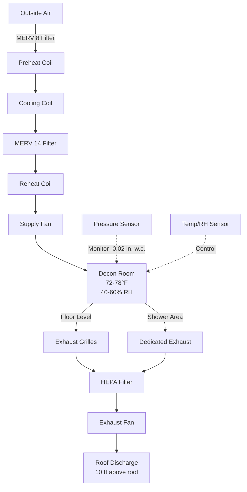

## Overview

Decontamination areas in EMS facilities require specialized HVAC systems to protect personnel and prevent cross-contamination during the cleaning of equipment and personnel exposed to hazardous materials, biological agents, or infectious diseases. These spaces must maintain strict environmental controls while providing safe, effective decontamination capabilities.

## Negative Pressure Containment

The decontamination area must operate under negative pressure relative to all adjacent spaces to prevent the migration of contaminants.

**Pressure Differential Requirements:**

| Adjacent Space | Minimum Pressure Differential |
|---------------|------------------------------|
| Corridor | -0.01 to -0.03 in. w.c. |
| Clean Areas | -0.02 to -0.04 in. w.c. |
| Vehicle Bay | -0.01 in. w.c. |

### Maintaining Negative Pressure

Negative pressure is achieved by exhausting more air than is supplied to the space. The pressure differential must be continuously monitored with visual indicators and alarms to alert personnel if containment is compromised. Differential pressure sensors should trigger alarms at 80% of the minimum required differential.

The makeup air system must be interlocked with the exhaust system to prevent positive pressurization during startup or equipment failure. Exhaust fans should be energized before supply fans, and supply fans should shut down before exhaust fans during system shutdown.

## Air Changes Per Hour Requirements

Decontamination areas require significantly higher air change rates than standard occupied spaces to rapidly dilute and remove airborne contaminants.

**Minimum ACH Requirements:**

- **Active Decontamination:** 12-20 ACH
- **Standby Mode:** 6-10 ACH
- **Post-Decontamination Purge:** 20-30 ACH for 30 minutes

The volumetric exhaust flow rate is calculated as:

$$Q_{\text{exhaust}} = \frac{V \times \text{ACH}}{60}$$

where $Q_{\text{exhaust}}$ is exhaust flow in CFM, $V$ is room volume in cubic feet, and ACH is air changes per hour.

The supply airflow must be reduced to maintain negative pressure:

$$Q_{\text{supply}} = Q_{\text{exhaust}} - Q_{\text{offset}}$$

where $Q_{\text{offset}}$ is typically 100-200 CFM for a standard decon room to achieve the required pressure differential.

## Exhaust and Filtration Requirements

The exhaust system must capture contaminants at the source and provide appropriate filtration before discharge.

### Exhaust System Design

**Capture Points:**
- Overhead exhaust grilles above wash-down areas
- Low-level exhaust near floor drains
- Dedicated exhaust for shower enclosures
- Equipment wash stations with local exhaust

The exhaust air distribution should follow a **high-to-low** pattern, with supply air introduced near the ceiling and exhaust concentrated at the floor level where heavier contaminants settle.

### Filtration Requirements

| Contaminant Type | Filtration Level | Efficiency |
|------------------|------------------|------------|
| Particulates | HEPA | 99.97% at 0.3 μm |
| Biological Agents | HEPA + UV-C | 99.97% + germicidal |
| Chemical Vapors | Activated Carbon | Application-specific |
| General Use | MERV 14-16 | 90-95% average |

HEPA filtration is mandatory for facilities handling biological hazards or infectious disease cases. Filter housings must allow for safe filter change-out procedures with bag-in/bag-out capability.

## Shower and Wash-Down Area Considerations

Decontamination showers require coordinated HVAC and plumbing design to handle high moisture loads and temperature swings.

### Drainage Coordination

Floor drains must be sized for the combined flow of:
- Multiple shower heads (2.5-5.0 GPM each)
- Equipment wash-down spray nozzles (10-20 GPM)
- General floor drainage

Trench drains with removable grates facilitate cleaning and maintenance. All drains must have deep-seal traps (minimum 4 inches) to prevent sewer gas migration and maintain room negative pressure.

### Moisture Control

The high moisture generation during active decontamination operations can overwhelm standard HVAC systems. Design considerations include:

- **Humidistat control** to increase exhaust rates when RH exceeds 70%
- **Reheat coils** in supply air to prevent condensation
- **Moisture-resistant ductwork** (stainless steel or coated galvanized)
- **Sloped duct sections** to drain condensate

## Temperature and Humidity Control

**Temperature Requirements:**
- **Occupied/Active Use:** 72-78°F
- **Unoccupied Standby:** 65-70°F

**Humidity Requirements:**
- **Target Range:** 40-60% RH
- **Maximum:** 70% RH during active decontamination
- **Minimum:** 30% RH

Temperature control must account for the thermal load from hot water usage during decontamination. Reheat capacity should be sized for 100% outside air at winter design conditions plus the latent cooling load from steam generation.

## Isolation from Other Facility Areas

Physical and airflow isolation prevents contaminant spread to clean areas of the facility.

### Architectural Barriers

- **Vestibules or airlocks** at entry/exit points
- **Self-closing, gasketed doors** rated for pressure differential
- **Sealed wall/ceiling penetrations** for all utilities
- **Continuous vapor barriers** in walls and ceiling

### Airflow Isolation

The decon area must be on a **dedicated air handling unit** separate from other building systems. Ductwork serving the decon area must not be connected to ductwork serving clean areas. Exhaust discharge must be located to prevent re-entrainment:

- Minimum 10 feet above roof level
- Minimum 25 feet from air intakes
- Downwind of prevailing winds relative to building air intakes

## Decontamination Area Design Criteria Summary

| Parameter | Requirement | Notes |
|-----------|-------------|-------|
| Pressure Differential | -0.01 to -0.03 in. w.c. | Relative to adjacent spaces |
| Air Changes (Active) | 12-20 ACH | During decontamination |
| Air Changes (Standby) | 6-10 ACH | Unoccupied mode |
| Temperature | 72-78°F | Occupied setpoint |
| Relative Humidity | 40-60% RH | Normal operation |
| Exhaust Filtration | HEPA (99.97%) | For biological hazards |
| Outside Air | 100% | No recirculation |
| Exhaust Location | 10 ft above roof | 25 ft from intakes |
| Door Clearance | 1 inch minimum | Maintains airflow |
| Alarm Setpoint | 80% of min. ΔP | Pressure loss warning |

## Control Sequences

The decon area HVAC system should include the following control modes:

1. **Standby Mode:** Reduced ACH, temperature setback, maintains negative pressure
2. **Active Decontamination:** Full ACH, occupied temperature, maximum exhaust
3. **Purge Mode:** Enhanced ACH for rapid contaminant removal post-use
4. **Emergency Mode:** Maximum exhaust, minimum supply for maximum negative pressure

Manual override controls must be located outside the decon area to allow emergency activation without entering a contaminated space.

## Conclusion

EMS facility decontamination areas demand rigorous HVAC design to protect personnel and prevent cross-contamination. The integration of negative pressure containment, high ventilation rates, effective filtration, and proper isolation creates a safe environment for critical decontamination operations while maintaining facility-wide infection control.
