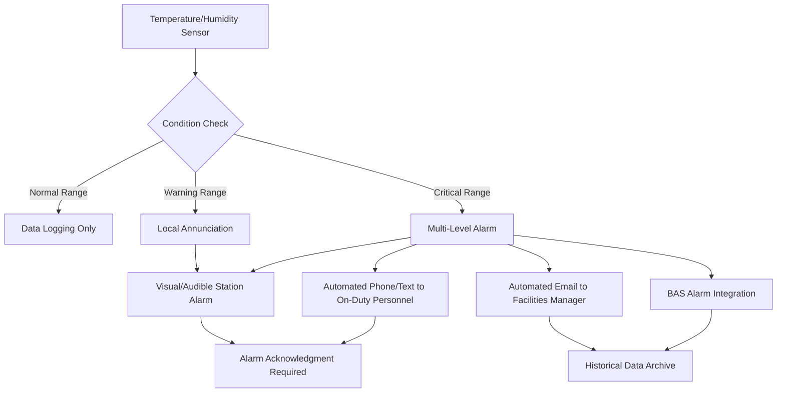

# Medical Equipment Storage HVAC for EMS Facilities

EMS medical equipment storage requires precise environmental control to maintain medication efficacy, preserve equipment integrity, and ensure supply readiness during emergency responses. The HVAC design must provide stable temperature and humidity conditions with backup systems, continuous monitoring, and contamination prevention to protect critical pharmaceutical supplies and medical devices.

The design challenge centers on maintaining pharmaceutical-grade environmental conditions in a 24-hour emergency facility where supply access occurs at unpredictable intervals, backup cooling systems must activate seamlessly during power failures, and environmental monitoring must alert personnel to any deviations that could compromise medication stability.

## Temperature Control for Medication Stability

Pharmaceutical products require specific temperature ranges to maintain chemical stability and therapeutic effectiveness. Most medications stored in EMS facilities fall into two categories: room temperature storage (controlled room temperature, 20-25°C or 68-77°F) and refrigerated storage (2-8°C or 36-46°F).

### Room Temperature Storage Areas

The primary medical supply storage area maintains controlled room temperature per USP guidelines. This zone stores IV fluids, oral medications, most injectables, bandaging materials, and medical devices.

**Design Parameters:**

| Parameter | Specification | Rationale |
|-----------|--------------|-----------|
| Temperature range | 68-77°F (20-25°C) | USP controlled room temperature |
| Temperature stability | ±2°F maximum deviation | Prevents excursions affecting medications |
| Recovery time | <15 minutes to setpoint | After door openings or equipment failures |
| Control accuracy | ±1°F at sensor | Precision controller required |

**Cooling Load Calculation:**

The sensible cooling load for medical storage combines envelope loads, internal gains, and infiltration:

$$Q_{total} = Q_{envelope} + Q_{lights} + Q_{infiltration} + Q_{people}$$

Where envelope load includes transmission through walls, ceiling, and floor:

$$Q_{envelope} = U \cdot A \cdot \Delta T$$

For a typical 200 sq ft medical storage room with 10 ft ceiling height and R-13 walls:

$$Q_{envelope} = \frac{1}{13} \cdot 500 \text{ ft}^2 \cdot (85-72) = 500 \text{ BTU/hr}$$

Lighting load at 1.0 W/sq ft:

$$Q_{lights} = 200 \text{ ft}^2 \cdot 1.0 \text{ W/ft}^2 \cdot 3.41 = 682 \text{ BTU/hr}$$

Infiltration from door openings (estimate 2 air changes per hour):

$$Q_{infiltration} = 1.08 \cdot CFM \cdot \Delta T = 1.08 \cdot 67 \cdot 13 = 940 \text{ BTU/hr}$$

Total sensible load approximately 2100 BTU/hr, requiring minimum 0.2 tons cooling capacity. Size actual equipment at 1.5-2.0 safety factor for door openings and future expansion: **0.3-0.4 tons minimum**.

### Dedicated HVAC System

Medical storage areas require dedicated temperature control systems independent from general building HVAC to ensure continuous operation and prevent cross-contamination.

**System Configuration:**

- Split system or ductless mini-split dedicated to storage area
- Redundant cooling capacity or automatic failover to backup unit
- Electric resistance or hot water reheat for precise temperature control
- Year-round cooling availability (medication storage does not follow setback schedules)

**Control Strategy:**

- Precision temperature controller (±1°F accuracy)
- Outdoor reset disabled (maintain constant setpoint regardless of outdoor conditions)
- Humidity control through reheat (cooling with reheat to maintain 68°F lower limit)
- 24/7 operation with no setback periods

The system must provide both heating and cooling capability simultaneously during shoulder seasons when dehumidification requires cooling followed by reheat to maintain the 68-77°F range.

## Humidity Requirements for Equipment Protection

Relative humidity control prevents moisture damage to medications, medical devices, and packaging materials. Excessive humidity promotes microbial growth, degrades hygroscopic medications, and corrodes electronic medical equipment. Low humidity creates static electricity risks and desiccates certain products.

**Humidity Design Criteria:**

| Condition | Specification | Control Method |
|-----------|--------------|----------------|
| Relative humidity range | 30-60% RH | USP recommendation for pharmaceuticals |
| Optimal target | 40-50% RH | Minimizes both microbial growth and static |
| Maximum deviation | ±10% RH | Maintains product stability |
| Measurement accuracy | ±3% RH | Calibrated sensors required |

### Dehumidification Systems

Summer conditions typically require active dehumidification. The dedicated cooling system provides latent removal during operation, but reheat prevents over-cooling.

**Dehumidification Capacity:**

Calculate latent load from infiltration and envelope moisture diffusion:

$$Q_{latent} = 0.68 \cdot CFM \cdot \Delta W$$

Where $\Delta W$ is humidity ratio difference between outdoor and indoor conditions.

For design conditions 85°F DB/75°F WB outdoor, 72°F DB/50% RH indoor:
- Outdoor humidity ratio: 0.0147 lb/lb
- Indoor humidity ratio: 0.0081 lb/lb
- $\Delta W$ = 0.0066 lb/lb

For 67 CFM infiltration:

$$Q_{latent} = 0.68 \cdot 67 \cdot 0.0066 = 300 \text{ BTU/hr}$$

The cooling system must provide adequate latent capacity (typically SHR 0.70-0.80) while reheat prevents space temperature from dropping below 68°F during dehumidification mode.

### Humidification Systems

Winter conditions in cold climates may require humidification to maintain 30% RH minimum. Steam humidification provides the most sanitary option for pharmaceutical storage.

**Humidifier Selection:**

- Electrode or resistive steam humidifier (generates clean steam)
- Capacity 1-3 lbs/hr for typical storage room
- Dispersion tube in supply ductwork with 10-15 ft absorption distance
- Controlled by space humidity sensor with ±3% accuracy

Avoid evaporative pad humidifiers and ultrasonic units in medical storage due to contamination risks and mineral dust generation.

## Backup Cooling for Critical Supplies

Power failures and equipment malfunctions can compromise medication stability. Backup cooling systems maintain environmental conditions during emergencies, protecting pharmaceutical inventory that may exceed $50,000-$100,000 value in typical EMS facilities.

### Emergency Power Integration

Connect medical storage HVAC to emergency generator with automatic transfer switch. Generator capacity must include medical storage cooling load as priority load.

**Load Priority Assignment:**

1. Life safety systems (emergency lighting, fire alarm)
2. Critical medical equipment (refrigerators, medication storage HVAC)
3. Essential EMS functions (communications, apparatus bay doors)
4. Non-critical loads (administrative HVAC, general lighting)

Generator starts within 10 seconds of power failure. HVAC systems reconnect automatically after 30-60 second delay to prevent inrush current overload.

### Redundant Cooling Equipment

Facilities without generator backup or requiring higher reliability install redundant cooling units with automatic failover.

**Redundancy Configurations:**

- **Dual units, one standby:** Primary unit operates continuously, backup unit activates on primary failure detection (high temperature alarm or loss of airflow)
- **Lead-lag operation:** Both units share load, automatic switchover if either fails
- **Portable backup:** Mobile air conditioner (8,000-12,000 BTU/hr) stored on-site with quick-connect capability

Monitor primary unit operation continuously. High temperature alarm activates backup unit and alerts facility personnel within 2-5 minutes of failure detection.

### Thermal Mass and Passive Protection

The storage room itself provides thermal buffering during short power interruptions. Optimize passive protection:

- High thermal mass construction (concrete or masonry walls provide 4-8 hour thermal buffer)
- Insulation minimum R-13 walls, R-19 ceiling
- Minimize window area (eliminate if possible, or specify insulated glazing)
- Weather stripping on access doors
- Vestibule entry for high-traffic storage areas

A well-insulated 200 sq ft storage room maintains temperature within acceptable range for 2-4 hours after cooling system failure, providing time for backup system activation or portable cooling deployment.

## Monitoring and Alarming Systems

Continuous environmental monitoring with automatic alarming protects pharmaceutical inventory from temperature and humidity excursions. The monitoring system provides real-time data logging, immediate alarm notification, and historical documentation for regulatory compliance.

### Temperature and Humidity Monitoring

**Sensor Specifications:**

| Parameter | Sensor Type | Accuracy | Location |
|-----------|-------------|----------|----------|
| Temperature | RTD or thermistor | ±0.5°F | Geometric center of room, 5 ft above floor |
| Humidity | Capacitive RH sensor | ±3% RH | Co-located with temperature sensor |
| Calibration | Annual certification | NIST traceable | Document calibration dates |

Install redundant sensors in critical storage areas. Primary sensor controls HVAC system; secondary sensor provides independent monitoring and alarm backup.

### Alarm System Configuration

The monitoring system generates alarms for out-of-range conditions, sensor failures, and communication losses.

**Alarm Setpoints:**

- **High temperature warning:** 75°F (2°F below maximum allowable)
- **High temperature critical:** 77°F (maximum allowable limit)
- **Low temperature warning:** 70°F (2°F above minimum allowable)
- **Low temperature critical:** 68°F (minimum allowable limit)
- **High humidity:** 55% RH (5% below maximum)
- **Low humidity:** 35% RH (5% above minimum)
- **Sensor fault:** Immediate alarm on loss of communication or out-of-range reading

**Alarm Notification Methods:**

Alarm notification escalates based on severity and acknowledgment time:

1. **Immediate:** Local audible and visual alarm at monitoring station (control room or charge desk)
2. **2 minutes:** Automated phone call or text message to on-duty EMS personnel
3. **5 minutes:** Secondary notification to facilities manager or designated backup
4. **10 minutes:** Escalation to administration if alarm unacknowledged

### Data Logging and Reporting

Maintain continuous temperature and humidity records for regulatory compliance and quality assurance.

**Data Storage Requirements:**

- Sampling interval: 5-15 minutes (configurable)
- Storage duration: Minimum 2 years (pharmaceutical compliance)
- Data format: Exportable to Excel or CSV for analysis
- Graphical display: Real-time and historical trend graphs
- Report generation: Automatic daily/weekly summary reports

Document all excursions outside acceptable range, including duration, magnitude, and corrective actions taken. This documentation supports medication viability assessment if excursions occur.

## Cleanliness Requirements for Storage

Medical supply storage areas maintain clean conditions to prevent particulate contamination of medications, IV supplies, and sterile equipment. While not classified cleanrooms, these spaces require higher cleanliness standards than general building areas.

### Air Filtration

**Filtration Specifications:**

- Minimum MERV 11 filtration on supply air (removes >65% of 1.0-3.0 micron particles)
- MERV 13 preferred for facilities with higher cleanliness requirements
- Pre-filters (MERV 8) extend final filter life and reduce maintenance costs
- Filter monitoring: Pressure differential gauge or electronic sensor with alarm at 150% of initial resistance

Replace filters on time-based schedule (quarterly typical) or pressure differential indication. Maintain clean filter storage and use proper handling procedures during replacement to prevent contamination introduction.

### Positive Pressurization

Maintain slight positive pressure relative to adjacent spaces to prevent infiltration of unfiltered air and contaminants from apparatus bays or exterior areas.

**Pressurization Design:**

- Pressure differential: +0.02 to +0.05 in. w.g. relative to corridors
- Pressure differential: +0.05 to +0.10 in. w.g. relative to apparatus bay (if adjacent)
- Achieve pressurization through supply air volume 5-10% greater than exhaust/transfer air
- Door undercuts or transfer grilles allow pressure relief while maintaining positive differential

Monitor pressure differential with magnehelic gauge visible from corridor. Alarm condition if pressure falls below +0.01 in. w.g., indicating filter blockage or supply fan failure.

### Surface Finishes and Maintenance

Select room finishes that support cleaning and minimize particle generation:

- **Flooring:** Sheet vinyl, epoxy, or sealed concrete (avoid carpet and porous materials)
- **Walls:** Painted gypsum board or FRP panels (smooth, washable surface)
- **Ceiling:** Painted gypsum board or cleanroom-rated ceiling tile
- **Shelving:** Stainless steel or epoxy-coated wire shelving (solid shelves trap dust)

Establish cleaning schedule: daily dust mopping, weekly damp mopping, monthly surface disinfection. HVAC supply and return grilles require quarterly cleaning to prevent dust accumulation and re-entrainment.

## Refrigerator and Freezer Exhaust

Medical refrigerators and freezers generate heat through compressor operation and condenser heat rejection. This heat load must be removed from the storage space to prevent temperature rise and maintain equipment efficiency.

### Heat Rejection Load

Calculate refrigerator/freezer heat rejection to space:

$$Q_{reject} = Q_{cooling} \cdot \left(\frac{COP + 1}{COP}\right)$$

For typical medical refrigerator:
- Cooling capacity: 500 BTU/hr (maintaining 40°F internal temperature)
- COP: 2.5 (energy efficiency ratio of refrigeration cycle)
- Heat rejection: $500 \cdot \frac{3.5}{2.5} = 700$ BTU/hr

Facilities with multiple refrigeration units accumulate significant heat load. Four medical refrigerators plus one small freezer generate approximately 3500-4000 BTU/hr heat rejection, requiring 0.3-0.35 tons additional cooling capacity in the room HVAC system.

### Condenser Ventilation

**Air-Cooled Condensers:**

Medical refrigerators and freezers use air-cooled condensers that draw room air across condenser coils and discharge heated air back to the space. Maintain adequate clearance for airflow:

- Minimum 4 inches clearance at rear and sides of unit
- Minimum 6 inches clearance above unit (for top-discharge models)
- No obstructions blocking condenser air intake or discharge

Clean condenser coils quarterly to maintain efficiency. Dust buildup increases discharge air temperature and reduces equipment life.

### Refrigerator Placement Strategy

Position refrigeration equipment to minimize impact on medication storage and occupant comfort:

- **Concentrate refrigerators in one area:** Simplifies heat load management and allows supplemental cooling if needed
- **Avoid direct discharge onto medication shelving:** Hot air discharge can create localized warm zones
- **Separate from room thermostat:** Prevents short-cycling of HVAC system from localized heat sources
- **Provide dedicated exhaust:** In high-density installations, local exhaust grille above refrigerator array removes concentrated heat directly

For storage rooms with more than 5,000 BTU/hr refrigeration heat rejection, consider dedicated exhaust fan (100-200 CFM) above equipment area with matching makeup air to maintain room pressurization. This approach removes concentrated heat before it distributes throughout the space.

### Backup Power for Refrigeration

Medical refrigerators storing temperature-sensitive medications require emergency power backup. Typical pharmacy refrigerators maintain 36-46°F for vaccines, insulin, and biologics that degrade rapidly if exposed to room temperature.

**Generator Connection:**

- Connect critical refrigeration to emergency circuits
- Automatic transfer within 10 seconds of power failure
- Load priority equivalent to life safety systems
- Test monthly under load conditions

**Passive Protection:**

- Refrigerators maintain temperature 4-8 hours without power if doors remain closed
- Post signage: "Emergency Power - Do Not Open During Power Failure"
- Temperature data loggers document excursions during extended outages
- Emergency ice packs or phase-change material in refrigerator provide thermal mass

## System Integration and Controls

The medical storage HVAC system integrates with building management systems while maintaining independent operation capability during BAS failures.

**Control Architecture:**

- **Standalone capability:** HVAC units operate from local controllers if BAS communication lost
- **BAS monitoring:** Temperature, humidity, and alarm status displayed at central workstation
- **Manual override:** Local disconnect and manual control access for maintenance
- **Trending and logging:** Continuous data storage in BAS database with export capability

**Sequence of Operations:**

1. **Normal operation:** HVAC unit maintains 72°F setpoint with 40-50% RH target
2. **Cooling mode:** Compressor operates to maintain temperature, reheat coil modulates to prevent over-cooling during dehumidification
3. **Heating mode:** Electric resistance or hot water coil maintains minimum 68°F during winter
4. **Alarm condition:** High/low temperature activates backup unit (if installed) and generates notifications
5. **Power failure:** Automatic transfer to emergency generator within 10 seconds

The integration of precise environmental control, redundant backup systems, and comprehensive monitoring ensures medical supply storage maintains pharmaceutical-grade conditions throughout normal operations and emergency scenarios, protecting critical EMS inventory and ensuring medication efficacy during emergency response.

## Conclusion

Medical equipment storage in EMS facilities demands HVAC design that balances pharmaceutical storage requirements with emergency facility operational constraints. Temperature control within 68-77°F, humidity maintenance at 30-60% RH, backup cooling systems with automatic failover, and continuous monitoring with multi-level alarming protect medication integrity and equipment readiness. The dedicated HVAC systems operate independently from building schedules, connect to emergency power, and integrate with monitoring systems to provide the environmental stability required for pharmaceutical storage while supporting 24-hour EMS operations.
