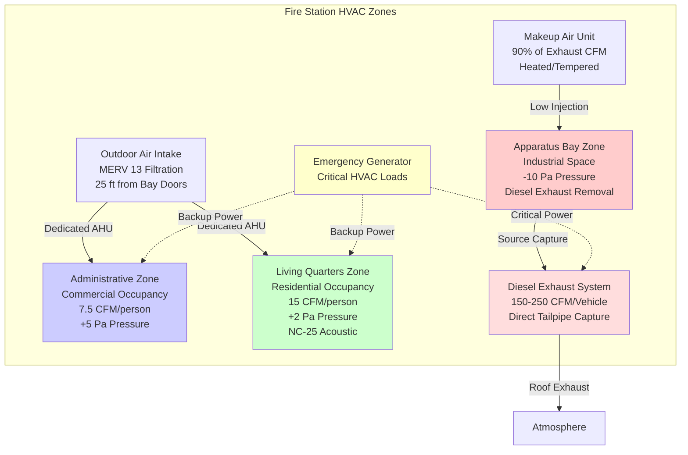

## Fire Station HVAC Requirements

Fire stations demand sophisticated HVAC systems addressing three fundamental challenges: maintaining separate environmental zones with distinct requirements, preventing diesel exhaust contamination of occupied spaces, and providing reliable comfort conditioning for personnel working continuous 24-hour shifts. The design must reconcile competing demands of large apparatus bays requiring rapid thermal recovery after door operations, residential-quality living quarters for shift personnel, and administrative spaces following commercial building standards.

The critical design requirement centers on zone isolation. Apparatus bays contain diesel exhaust and experience extreme infiltration loads from frequent door operations, requiring negative pressurization and dedicated exhaust systems. Living quarters demand residential comfort levels with individual zone control and acoustic isolation for sleeping personnel. Administrative areas operate on commercial schedules allowing energy conservation strategies inappropriate for continuously occupied zones.

Successful fire station HVAC design integrates source-capture diesel exhaust removal, zone pressurization control preventing contamination migration, redundant systems ensuring continuous operation, and emergency power backup maintaining critical functions during utility outages.

## Zone Separation Strategy

### Three-Zone Design Approach

Fire stations require complete HVAC separation between functional zones to prevent cross-contamination and optimize system operation for each zone's unique requirements.

### Zone Pressurization Control

Pressure relationships between zones prevent diesel exhaust and vehicle contaminant migration to occupied spaces. The pressure cascade follows this hierarchy:

$$P_{admin} > P_{living} > P_{outdoor} > P_{bay}$$

Where pressure differentials maintain:
- Administrative to apparatus bay: +10 to +15 Pa
- Living quarters to apparatus bay: +7 to +12 Pa
- Living quarters to outdoor: +2 to +5 Pa
- Apparatus bay to outdoor: -5 to -10 Pa

Building automation systems monitor differential pressures continuously using reference points in each zone. Variable-speed exhaust fans in the apparatus bay modulate to maintain negative pressure regardless of door position or outdoor wind conditions.

**Airflow Separation Requirements**:
- No return air pathways from apparatus bay to occupied space air handlers
- No transfer grilles or door undercuts between apparatus bay and living/administrative zones
- Dedicated outdoor air intakes for each zone separated by minimum 25 feet
- Exhaust discharge points minimum 10 feet from any air intake

### Zone-Specific Design Criteria

| Zone Type | Outdoor Air | Temperature Range | Pressure | Filtration | Acoustic Limit | System Type |
|-----------|-------------|-------------------|----------|------------|----------------|-------------|
| Apparatus Bay | 0.15 ACH minimum | 60-70°F heating | -5 to -10 Pa | MERV 11 | NC-40 | Radiant floor + makeup air |
| Living Quarters | 15 CFM/person | 68-76°F adjustable | +2 to +5 Pa | MERV 13 | NC-25 sleeping | Mini-split or VAV |
| Kitchen/Dining | 7.5 CFM/person | 70-76°F | 0 to +2 Pa | MERV 13 | NC-35 | Dedicated exhaust + supply |
| Administrative | 5-7.5 CFM/person | 70-76°F occupied | +5 to +10 Pa | MERV 13 | NC-35 | VAV with setback |
| Exercise Areas | 20 CFM/person | 65-75°F | 0 to +5 Pa | MERV 11 | NC-40 | High-volume ventilation |
| Training Rooms | 7.5 CFM/person | 70-76°F | +2 to +5 Pa | MERV 13 | NC-35 | VAV with scheduling |

## Diesel Exhaust Removal Integration

### Source Capture System Design

Direct-connect exhaust capture systems eliminate diesel particulate and carbon monoxide exposure by capturing emissions at the vehicle tailpipe before dispersal into bay atmosphere. This approach proves far more effective than general dilution ventilation.

**Tailpipe Capture Components**:
- Spring-loaded hose reels mounted at ceiling (12-16 feet) or floor level
- Flexible exhaust hose 3-5 inch diameter, temperature-rated to 1200°F
- Magnetic quick-connect nozzles sealing to vehicle exhaust pipe
- Automatic release mechanism allowing rapid apparatus departure
- Hose lengths 20-30 feet serving apparatus parking positions

**System Capacity Calculation**:

Total exhaust capacity accounts for simultaneous apparatus operation with diversity factor:

$$Q_{exhaust} = \sum_{i=1}^{n} (CFM_i \times DF_i)$$

Where:
- $CFM_i$ = exhaust requirement per vehicle (150-250 CFM)
- $DF_i$ = diversity factor based on apparatus count
- Ambulance/light vehicles: 150 CFM
- Pumpers/engines: 200 CFM
- Aerials/tankers: 250 CFM

For stations with 1-2 apparatus: DF = 1.0 (100% simultaneous operation)
For stations with 3-4 apparatus: DF = 0.75
For stations with 5+ apparatus: DF = 0.60

**Example Calculation** for 4-bay station (2 pumpers, 1 aerial, 1 ambulance):

$$Q_{total} = (2 \times 200 + 1 \times 250 + 1 \times 150) \times 0.75 = 600 \text{ CFM}$$

Add 20% safety factor: $Q_{design} = 600 \times 1.2 = 720$ CFM

### Makeup Air Integration

Exhaust system operation creates negative pressure requiring tempered makeup air to maintain zone pressurization and prevent excessive infiltration.

**Makeup Air Calculation**:

$$Q_{makeup} = Q_{exhaust} \times 0.90$$

Provide 90% replacement to maintain designed negative pressure while preventing over-pressurization.

**Makeup Air Unit Sizing**:

Heating capacity for makeup air unit:

$$Q_{heating} = Q_{makeup} \times 1.08 \times (T_{indoor} - T_{outdoor})$$

For example, 720 CFM exhaust requiring 650 CFM makeup air at outdoor design temperature -10°F and bay temperature 65°F:

$$Q_{heating} = 650 \times 1.08 \times (65 - (-10)) = 52,650 \text{ BTU/hr}$$

Select gas-fired makeup air unit minimum 55,000 BTU/hr input capacity with modulating burner.

### System Interlocks and Controls

**Automatic Activation Sequences**:
1. Bay door opening triggers exhaust system startup (15-second delay)
2. Exhaust fan proof of operation starts makeup air unit
3. Makeup air unit temperature control modulates heating
4. Personnel manually connect tailpipe capture hoses to apparatus
5. Bay door closing initiates 5-minute purge timer
6. System shutdown after purge cycle completion

**Safety Interlocks**:
- CO monitoring in apparatus bay with alarm at 35 ppm (OSHA PEL), action level at 9 ppm
- Makeup air unit high-temperature limit shutdown (150°F discharge)
- Exhaust fan failure alarm with visual/audible notification
- Pressure differential monitoring with alarm for loss of bay negative pressure

## 24/7 Occupied Building Considerations

### Continuous Operation Requirements

Fire stations never close, requiring HVAC systems designed for uninterrupted operation with maintenance strategies accommodating continuous occupancy.

**Redundancy Strategy**:
- Dual heating sources (combination radiant floor and unit heaters or furnaces)
- Redundant exhaust fans with automatic switchover on failure detection
- N+1 cooling capacity for critical spaces (communications, IT equipment)
- Dual-fuel capability for heating systems in severe climates (gas primary, oil backup)

**Maintenance Without Shutdown**:
- Isolation valves on all major equipment allowing bypass during service
- Dual pumps in hydronic systems (lead-lag operation)
- Multiple air handling units serving different zones (failure affects only one zone)
- Filter access and routine service points accessible without disrupting occupants

### Comfort Requirements for Shift Personnel

Personnel working 24-hour shifts require residential-quality comfort in living quarters comparable to home environment.

**Individual Zone Control**:
- Separate thermostats for each sleeping quarter (bunk room)
- Temperature range 68-76°F with occupant adjustment authority
- Ductless mini-split systems provide individual room control
- Common areas (day room, kitchen) on shared zone with averaging control

**Acoustic Design**:
- NC-25 maximum in sleeping quarters (comparable to residential bedroom)
- Low-velocity ductwork in sleeping areas (maximum 600 FPM)
- Sound attenuators on supply and return ducts near sleeping quarters
- Vibration isolation for all mechanical equipment (spring isolators minimum 95% effectiveness)
- Equipment location on rooftop or remote mechanical rooms

**Air Quality**:
- MERV 13 filtration minimum in living quarters (captures diesel particulate)
- Energy recovery ventilator providing continuous fresh air without drafts
- Relative humidity control 30-50% year-round
- No recirculated air from apparatus bay under any condition

## Energy Efficiency Strategies

### System Efficiency Measures

Continuous operation necessitates high-efficiency equipment to control operating costs while maintaining comfort.

**Equipment Selection**:
- Condensing boilers minimum 92% AFUE for hydronic heating systems
- High-efficiency furnaces minimum 95% AFUE for forced-air systems
- Cooling equipment minimum 16 SEER (air-cooled) or 1.0 kW/ton (water-cooled)
- ECM motors on all air handling units and fan coil units
- Variable-speed drives on pumps and large fans (>5 HP)

**Energy Recovery Ventilation**:

ERV effectiveness calculation:

$$\eta_{sensible} = \frac{T_{supply} - T_{outdoor}}{T_{return} - T_{outdoor}}$$

Select ERV units with minimum 70% sensible effectiveness for living quarters and administrative zones. Annual energy savings:

$$\text{Savings} = Q_{ventilation} \times 1.08 \times DD \times 24 \times \eta_{sensible} \times \text{Fuel Cost}$$

Where DD = annual heating degree days

### Zone-Specific Scheduling

Limited setback opportunities due to continuous living quarters occupancy, but administrative and training areas allow temperature setback.

**Administrative Zone Setback**:
- Occupied hours (0700-1800): 72°F heating, 74°F cooling
- Unoccupied hours (1800-0700): 55°F heating, 85°F cooling
- Weekend setback: 55°F heating, 85°F cooling

**Training Room Scheduling**:
- Scheduled training events: 70°F heating, 75°F cooling
- Unscheduled periods: 60°F heating, 80°F cooling
- Night setback: 55°F heating, no cooling

**Apparatus Bay Management**:
- Continuous heating to prevent freeze damage to apparatus (60-65°F minimum)
- Radiant floor heating maintains minimum temperature with low operating cost
- Setback below 60°F risks frozen water in apparatus pumps and tanks

### Lighting and Plug Load Control

**High-Bay LED Lighting**:
- Apparatus bay: 50 foot-candles at floor level, LED high-bay fixtures
- Occupancy sensors for auxiliary spaces (restrooms, storage)
- Daylight harvesting in spaces with windows (administrative, training)

**Plug Load Management**:
- Timers on water heaters, vending machines, non-essential equipment
- Power strips with occupancy control in training rooms and offices
- Energy Star appliances in kitchen (refrigerators, dishwashers)

## Emergency Power Backup for HVAC

### Critical Load Identification

Emergency generators maintain life safety and minimum comfort during utility power outages. Critical HVAC loads receive emergency power while non-essential systems shut down.

**Critical HVAC Systems** (emergency generator):
- Diesel exhaust removal system (full capacity)
- Apparatus bay makeup air unit (heating only, no cooling)
- Living quarters heating (minimum 68°F setpoint)
- Living quarters ventilation fans (continuous operation)
- Kitchen exhaust (Type I hood if present)
- Controls and building automation system
- Fuel oil pumps for heating equipment

**Non-Critical HVAC Systems** (shed during outage):
- Administrative zone cooling
- Training room HVAC
- Energy recovery ventilators
- Apparatus bay cooling
- Radiant floor heating pumps (thermal mass provides carryover)

### Generator Capacity Calculation

Emergency generator sizing includes HVAC electrical loads plus life safety systems.

**HVAC Load Calculation**:

$$\text{Generator}_{\text{HVAC}} = \sum \text{Motor FLA} \times 1.25 + \sum \text{Heater kW} \times 1.0$$

**Example** for 4-bay station:
- Exhaust fan motor: 5 HP × 1.25 = 6.25 HP (4.7 kW)
- Makeup air unit fan: 3 HP × 1.25 = 3.75 HP (2.8 kW)
- Makeup air unit burner: 55 MBH gas (minimal electrical)
- Living quarters AHU: 2 HP × 1.25 = 2.5 HP (1.9 kW)
- Living quarters furnace: 100 MBH input (800W blower)
- Controls and automation: 2 kW
- **Total HVAC Load**: 12.2 kW

Add non-HVAC emergency loads (lighting, communications, apparatus bay doors, fuel dispensing) typically 25-40 kW. Total generator capacity 50-75 kW typical for 4-bay stations.

### Automatic Transfer and Load Shedding

**Transfer Sequence**:
1. Utility power failure detected by automatic transfer switch (ATS)
2. Emergency generator starts (10-15 second delay)
3. Generator reaches rated speed and voltage
4. ATS transfers critical loads to generator
5. Non-critical loads remain de-energized
6. Building automation system implements emergency mode

**Load Shedding Strategy**:
- Immediate shed: Administrative cooling, training HVAC, ERVs
- Delayed shed (5 minutes): Apparatus bay cooling if running
- Priority restoration: Diesel exhaust system, living quarters heating/ventilation
- Manual restoration: Administrative and training zones after generator runtime confirmed

### Fuel Storage and Runtime

**Generator Fuel Calculation**:

Runtime on full fuel tank:

$$\text{Runtime (hrs)} = \frac{\text{Tank Capacity (gal)} \times 0.9}{\text{Fuel Consumption (gal/hr)}}$$

Diesel generator fuel consumption approximately:

$$\text{Fuel (gal/hr)} = \frac{\text{Load (kW)} \times 0.067}{0.85}$$

For 50 kW load at 75% capacity (37.5 kW):

$$\text{Fuel} = \frac{37.5 \times 0.067}{0.85} = 3.0 \text{ gal/hr}$$

With 250-gallon fuel tank: Runtime = (250 × 0.9) / 3.0 = 75 hours

Design fuel storage for minimum 48-hour runtime at 75% generator capacity. Many jurisdictions require 72-96 hour capacity for essential facilities.

### Cold Weather Considerations

**Generator Cold-Start Capability**:
- Block heaters maintaining engine temperature 90-120°F
- Battery warmers preventing cold-cranking failures
- Automatic exercising under load (weekly, 30 minutes minimum)
- Fuel oil additives preventing gelling (biodiesel blends particularly susceptible)

**Freeze Protection**:
- Heat trace on fuel lines from tank to generator
- Insulated fuel tanks or indoor tank location
- Glycol in hydronic heating systems (20-30% propylene glycol)
- Pipe heat trace on condensate lines and outdoor piping

## Design Integration and Coordination

Successful fire station HVAC requires early coordination with architectural, structural, and electrical disciplines.

**Architectural Coordination**:
- Apparatus bay ceiling height minimum 14 feet accommodating exhaust collection
- Mechanical equipment rooms located away from sleeping quarters (noise isolation)
- Outdoor air intake locations on prevailing upwind side, away from bay doors
- Rooftop equipment screening coordinated with apparatus aerial ladder operations

**Structural Coordination**:
- Rooftop unit weights and seismic restraint loads provided during design development
- Radiant floor tubing embedded before concrete slab pour
- Supplemental structural support for ceiling-mounted exhaust hose reels
- Vibration isolation spring deflection coordinated with structure

**Electrical Coordination**:
- HVAC electrical load profile for main service and emergency generator sizing
- Control power requirements for BAS and exhaust system interlocks
- Dedicated circuits for makeup air unit and exhaust fans
- Emergency power distribution to critical HVAC loads

**Code Compliance**:
- NFPA 1500: Fire department occupational safety (diesel exhaust exposure limits)
- ASHRAE 62.1: Ventilation rates for mixed-use occupancy building
- ASHRAE 90.1: Energy efficiency with allowances for 24/7 occupancy
- IMC: Exhaust system construction, makeup air requirements, combustion air

---

Fire station HVAC design balances competing requirements of contamination control, continuous comfort conditioning, and operational reliability. Zone separation with pressure control prevents diesel exhaust migration, source-capture systems minimize exposure, redundant equipment ensures uninterrupted operation, and emergency power maintains critical functions during utility outages. Successful designs integrate these elements early in project planning with thorough coordination across all disciplines.
