# HVAC Design for Fire Station Apparatus Bays

Apparatus bays represent the most challenging HVAC design element in fire stations, requiring integration of diesel exhaust removal, vehicle protection heating, frequent bay door infiltration mitigation, and strict separation from living quarters. The design must address carcinogenic diesel particulate exposure while maintaining energy efficiency despite extreme infiltration loads.

## Temperature and Ventilation Requirements

Apparatus bays require year-round temperature maintenance between 50°F and 65°F to protect vehicles, equipment, and water-based fire suppression agents from freezing. NFPA 1500 mandates ventilation controls to minimize firefighter exposure to vehicle exhaust emissions.

### Temperature Control Design Criteria

| Parameter | Winter | Summer | Notes |
|-----------|--------|--------|-------|
| Minimum temperature | 50°F | N/A | Prevents equipment freeze-up |
| Maximum temperature | 65°F | 85°F | Comfort during maintenance |
| Heating setpoint | 55°F | N/A | Energy-efficient baseline |
| Cooling setpoint | N/A | 80°F | Natural ventilation preferred |
| Relative humidity | 40-60% | 40-60% | Prevents condensation |

The heating load calculation must account for massive infiltration from bay door operations:

$$Q_{total} = Q_{transmission} + Q_{infiltration} + Q_{ventilation}$$

Where transmission load through walls, roof, and floor represents only 30-40% of total heating requirement, with infiltration dominating the load profile.

### Ventilation Requirements

**Background Ventilation:** Minimum 4-6 air changes per hour maintains acceptable air quality during non-apparatus operation periods. This baseline ventilation prevents buildup of fugitive emissions and moisture.

**Apparatus Operation Ventilation:** When vehicles operate without source capture connection, increase ventilation to 10-15 air changes per hour to dilute diesel particulate matter (DPM) concentration below permissible exposure limits.

Calculate required dilution ventilation:

$$Q_{dilution} = \frac{G \times 403}{PEL - C}$$

Where:
- $Q_{dilution}$ = required airflow (CFM)
- $G$ = contaminant generation rate (L/min)
- $403$ = conversion constant
- $PEL$ = permissible exposure limit (mg/m³)
- $C$ = ambient concentration (mg/m³)

For typical diesel engines at idle, $G \approx 0.5-1.5$ L/min depending on displacement.

## Exhaust Removal System Integration

Diesel exhaust contains over 40 carcinogenic compounds. The International Agency for Research on Cancer classifies diesel engine exhaust as a Group 1 carcinogen. Effective exhaust removal is critical to firefighter health.

### Source Capture Systems

Direct tailpipe connection provides 95-99% capture efficiency when properly deployed. Source capture operates only during vehicle runtime, minimizing energy consumption and eliminating bay pressurization.

**System Components:**
- Telescoping or articulated boom arms
- Magnetic or mechanical tailpipe adapters rated for 1200°F
- Stainless steel exhaust hose (12-20 ft length)
- Dedicated exhaust fans (150-400 CFM per vehicle)
- Automatic activation interlocks tied to ignition

**Design Calculation:**

Fan sizing based on capture velocity requirements:

$$CFM_{capture} = V_{capture} \times A_{tailpipe} \times 60$$

Where:
- $V_{capture}$ = 100-150 fpm at tailpipe opening
- $A_{tailpipe}$ = tailpipe area (sq ft)
- $60$ = conversion factor (fpm to fps)

Add duct friction losses and fitting resistance:

$$SP_{total} = SP_{duct} + SP_{fittings} + SP_{discharge}$$

Typical total static pressure: 0.5-1.5 in. w.g.

### General Exhaust Backup

Floor-level exhaust inlets (within 12 inches of floor) capture cooled diesel exhaust that stratifies below ambient air. General exhaust provides backup during pre-connection warm-up and addresses fugitive emissions.

System maintains slight negative pressure (0.02-0.05 in. w.g.) relative to living quarters to prevent contaminant migration.

```mermaid
graph TD
    A[Apparatus Bay HVAC System] --> B[Source Capture Exhaust]
    A --> C[General Exhaust]
    A --> D[Radiant Heating]
    A --> E[Makeup Air]
    A --> F[Bay Door Infiltration Control]

    B --> B1[Boom Arms at Each Position]
    B --> B2[Dedicated Fans 150-400 CFM]
    B --> B3[Ignition Interlock]

    C --> C1[Floor Level Inlets]
    C --> C2[4-6 ACH Background]
    C --> C3[Negative Pressure Control]

    D --> D1[Gas-Fired Radiant Tubes]
    D --> D2[12-16 ft Mounting Height]
    D --> D3[40-60 BTU/hr/sq ft]

    E --> E1[Tempered Outside Air]
    E --> E2[Makeup for Exhaust]
    E --> E3[Prevents Depressurization]

    F --> F1[High-Speed Doors]
    F --> F2[Perimeter Seals]
    F --> F3[Vestibule Air Curtains]

    style A fill:#f9f,stroke:#333,stroke-width:4px
    style B fill:#bbf,stroke:#333,stroke-width:2px
    style C fill:#bbf,stroke:#333,stroke-width:2px
    style D fill:#fbb,stroke:#333,stroke-width:2px
    style E fill:#bfb,stroke:#333,stroke-width:2px
    style F fill:#ffb,stroke:#333,stroke-width:2px
```

## Heating for Vehicle and Equipment Protection

Radiant heating provides superior performance in apparatus bays compared to forced air systems. Radiant energy heats surfaces (floor, vehicles, equipment) rather than air volume, providing 30-40% energy savings in high-infiltration environments.

### Radiant Tube Heating Systems

Gas-fired or electric radiant tubes mounted 12-16 feet above the floor deliver infrared energy directly to surfaces and occupants.

**Design Parameters:**

$$q_{radiant} = \frac{BTU_{input} \times \eta_{radiant}}{A_{floor}}$$

Where:
- $q_{radiant}$ = radiant heat flux (BTU/hr/sq ft)
- $BTU_{input}$ = burner input (BTU/hr)
- $\eta_{radiant}$ = radiant efficiency (0.50-0.65 typical)
- $A_{floor}$ = floor area (sq ft)

Target: 40-60 BTU/hr per sq ft depending on climate zone and building envelope.

**Performance Advantages:**

| Factor | Radiant | Forced Air |
|--------|---------|------------|
| Energy efficiency | 30-40% savings | Baseline |
| Door operation recovery | Fast (minimal impact) | Slow (loses heated air) |
| Thermal comfort | Superior (direct warming) | Poor (stratification) |
| Ceiling height | Effective to 30 ft | Stratifies above 16 ft |
| Maintenance access | Minimal interference | Ductwork obstacles |

**Control Strategy:**

Outdoor reset control modulates radiant output based on outdoor temperature:

$$T_{supply} = T_{design} - \frac{(T_{outdoor} - T_{design,outdoor}) \times Reset_{ratio}}{100}$$

Typical reset ratio: 1.0-1.5 (°F supply change per °F outdoor change)

Setback to 45°F during extended unoccupied periods (>8 hours) reduces energy consumption by 20-30%.

### Supplemental Heating

Perimeter unit heaters (50,000-100,000 BTU/hr) provide supplemental heating during extreme cold or extended apparatus maintenance. Position heaters to avoid direct impingement on personnel or apparatus.

Destratification fans (0.5-1.0 HP per 10,000 sq ft) can supplement radiant systems by circulating stratified warm air, but provide minimal benefit with properly designed radiant systems.

## Air Infiltration from Bay Doors

Bay doors represent 60-70% of total heating load due to frequent operation and large opening area. Each door cycle exchanges 1.5-2 complete bay volumes.

### Infiltration Load Calculation

$$Q_{infiltration} = 1.08 \times CFM_{inf} \times \Delta T$$

Where:
- $Q_{infiltration}$ = sensible heating load (BTU/hr)
- $1.08$ = constant for standard air
- $CFM_{inf}$ = infiltration airflow rate
- $\Delta T$ = indoor-outdoor temperature difference (°F)

For a 60 ft × 80 ft × 16 ft bay (76,800 cu ft) with 10 door cycles per day:

$$CFM_{inf} = \frac{V_{bay} \times cycles \times ACH_{per\_cycle}}{60 \text{ min/hr}}$$

$$CFM_{inf} = \frac{76,800 \times 10 \times 1.5}{60} = 19,200 \text{ CFM average}$$

At $\Delta T = 50°F$ (winter design):

$$Q_{infiltration} = 1.08 \times 19,200 \times 50 = 1,036,800 \text{ BTU/hr}$$

This massive load requires infiltration mitigation strategies.

### Infiltration Control Strategies

**High-Speed Doors:** Opening speed of 3-4 ft/sec reduces infiltration by 40-60% compared to conventional sectional doors (0.5-1.0 ft/sec). Faster operation minimizes opening duration and air exchange.

**Perimeter Seals:** EPDM gaskets and bottom seals reduce infiltration during closed periods by 30-40%. Maintain seal compression and replace damaged sections annually.

**Vestibule Air Curtains:** 2000-3000 fpm discharge velocity creates air barrier when doors open. Effectiveness decreases with large opening dimensions (>14 ft wide). Requires makeup air equal to air curtain discharge.

**Staging Areas:** Small personnel doors (3 ft × 7 ft) for non-apparatus access reduce need for full bay door openings by 60-80% of door cycles.

## Separation from Living Quarters

NFPA 1500 requires positive separation between apparatus bays and living quarters to prevent diesel particulate migration and maintain occupant health. The bay must operate under negative pressure relative to living spaces.

### Pressure Control

**Design Pressure Differential:** -0.02 to -0.05 in. w.g. (apparatus bay relative to living quarters)

Achieve through:
1. Exhaust airflow exceeds supply airflow by 200-500 CFM
2. Building automation system (BAS) monitors differential pressure
3. Modulating dampers adjust supply/exhaust to maintain setpoint

**Verification:**

$$\Delta P = P_{living} - P_{bay} > 0.02 \text{ in. w.g.}$$

Install pressure differential monitors with local alarm for out-of-range conditions.

### Physical Separation

**Barriers:**
- 2-hour fire-rated walls separate apparatus bay from living quarters
- Self-closing fire doors (1.5-hour rated minimum)
- Sealed penetrations for all ductwork, piping, conduit

**Vestibules:** 6 ft × 8 ft minimum vestibule with self-closing doors on both ends creates airlock. Maintain vestibule at intermediate pressure between bay and living quarters.

**Ductwork Isolation:** No return air ducts from apparatus bay. Supply air from living quarters HVAC must not recirculate through apparatus bay. Independent systems prevent cross-contamination.

## Humidity and Moisture Control

Apparatus bays experience high moisture loads from wet apparatus returning from incidents, washdown operations, and infiltration during humid conditions.

### Moisture Sources

| Source | Load (lb/day) | Peak (lb/hr) |
|--------|---------------|--------------|
| Wet apparatus (per vehicle) | 20-40 | 8-12 |
| Floor washdown | 50-100 | 40-60 |
| Infiltration (humid climate) | 30-80 | 10-20 |
| Personnel (10 occupants) | 15-25 | 3-5 |

**Total Design Load:** 200-300 lb/day typical for 4-bay station.

### Moisture Control Strategies

**Dehumidification:** Dedicated dehumidification equipment (80-120 pint/day capacity) maintains 40-60% RH during humid seasons. Prevent condensation on cold surfaces (vehicles, tools, floor drains).

Latent load calculation:

$$Q_{latent} = 0.68 \times CFM \times \Delta W$$

Where:
- $Q_{latent}$ = latent cooling load (BTU/hr)
- $0.68$ = constant for standard air
- $CFM$ = ventilation airflow
- $\Delta W$ = humidity ratio difference (grains/lb)

**Floor Drainage:** Minimum 1/4 inch per foot slope to floor drains. Trench drains at bay door thresholds capture water before spreading across bay floor.

**Ventilation:** Increase outdoor air ventilation during dry periods to purge moisture. Effective when outdoor dew point is 10°F below indoor dew point.

**Surface Temperature Control:** Maintain minimum surface temperatures above dew point to prevent condensation. Radiant heating raises floor temperature 10-15°F above air temperature, significantly reducing condensation risk.

## Design Criteria Summary

| Parameter | Specification | Code/Standard |
|-----------|--------------|---------------|
| Heating setpoint | 50-65°F | NFPA 1500 |
| Background ventilation | 4-6 ACH | ASHRAE 62.1 |
| Apparatus operation ventilation | 10-15 ACH | NFPA 1500 |
| Exhaust capture velocity | 100-150 fpm | ACGIH |
| Radiant heating input | 40-60 BTU/hr/sq ft | Climate dependent |
| Bay pressure vs living quarters | -0.02 to -0.05 in. w.g. | NFPA 1500 |
| Relative humidity | 40-60% | Equipment protection |
| Makeup air tempering | Minimum 55°F | Thermal comfort |
| Floor drain slope | 1/4 in. per ft minimum | IPC |
| Fire separation | 2-hour rated | IBC/NFPA 101 |

## System Integration and Control

Coordinate all apparatus bay HVAC systems through central BAS to prevent operational conflicts and optimize energy performance.

**Control Sequences:**

1. **Vehicle Departure Mode:** Upon apparatus departure alarm, suspend all exhaust systems and maintain minimum heating. Prevents excessive building depressurization.

2. **Source Capture Operation:** Ignition interlock activates dedicated exhaust fan when vehicle starts. Modulate makeup air to prevent excessive negative pressure (>-0.10 in. w.g.).

3. **General Exhaust Operation:** Manual or CO sensor activation (>35 ppm) triggers general exhaust to 10-15 ACH. Activate makeup air handling unit to temper replacement air to 55°F minimum.

4. **Unoccupied Mode:** Heating setback to 45°F, exhaust systems disabled, ventilation reduced to 2 ACH for moisture control.

5. **Door Operation:** High-speed door activation triggers data logging for energy analysis. No HVAC system changes during brief door cycles.

**Energy Conservation:**

- Outdoor air economizer during mild weather (50-70°F) provides free cooling
- Radiant heating setback during unoccupied hours (typically 00:00-06:00)
- Exhaust system operation limited to actual vehicle runtime
- BAS trending identifies excessive door operations for operational improvements

## Conclusion

Apparatus bay HVAC design requires integration of diesel exhaust removal, energy-efficient radiant heating, infiltration mitigation, and strict separation from living quarters. Source capture exhaust systems provide superior carcinogen exposure protection while minimizing energy consumption compared to general dilution ventilation. Radiant heating delivers 30-40% energy savings in high-infiltration environments while maintaining the 50-65°F range necessary for vehicle and equipment protection. Proper pressure control and physical separation prevent diesel particulate migration to living quarters, protecting firefighter health per NFPA 1500 requirements. The design must account for bay door infiltration representing 60-70% of heating load through high-speed doors, effective seals, and strategic use of personnel doors.
