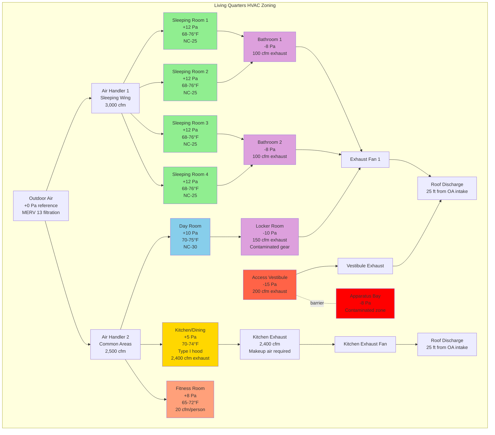

Fire station living quarters demand specialized HVAC design that addresses continuous 24-hour occupancy, unpredictable shift patterns, critical contamination isolation from apparatus bays, and diverse simultaneous space uses ranging from sleep to high-intensity physical activity. Unlike conventional residential or commercial facilities, these spaces must maintain exceptional indoor air quality while preventing diesel exhaust, combustion byproducts, and carcinogenic contaminants from entering areas where personnel rest and recover between emergency responses.

## 24-Hour Occupancy Considerations

Continuous occupancy fundamentally alters HVAC system design parameters. Fire stations operate every hour of every day with personnel working extended shifts (typically 24 or 48 hours), creating unique thermal comfort, ventilation, and reliability requirements that conventional commercial designs cannot address.

**Continuous operation requirements:**

Fire station HVAC systems must provide uninterrupted service with no scheduled maintenance downtime during occupied hours—which means no scheduled downtime at all. Equipment failures cannot be tolerated during extreme weather when personnel comfort directly impacts emergency response readiness.

System redundancy becomes mandatory rather than optional. Design approaches include:

- N+1 equipment configuration for all critical systems (boilers, chillers, air handling units)
- Dual-compressor packaged equipment providing 50% capacity during single-compressor failure
- Multiple smaller air handling units serving living quarters rather than single large units
- Bypass piping and isolation valves enabling equipment maintenance without system shutdown
- Emergency generator capacity sized to maintain minimum heating (55°F) and ventilation during power outages

**Unpredictable load patterns:**

Unlike office buildings with predictable occupancy schedules, fire stations experience random load fluctuations driven by emergency call patterns. HVAC systems must respond to:

- Sudden occupancy changes when crews depart for extended emergency incidents
- Immediate full-load conditions upon crew return requiring rapid comfort recovery
- Simultaneous diverse activities: sleeping personnel, active fitness training, meal preparation
- Day-sleep requirements for night-shift personnel demanding acoustic and thermal control during high outdoor temperature periods

Design for worst-case simultaneous occupancy rather than applying diversity factors. Size systems assuming all sleeping quarters, fitness areas, kitchen, and day rooms operate at maximum load simultaneously.

**No setback operation:**

Conventional building control strategies employing night setback or weekend setback do not apply to living quarters. Temperature must remain within comfort range continuously:

$$T_{space} = 68\text{°F to }76\text{°F (continuous)}$$

Individual zone control allows occupants to adjust within this range based on personal preference and activity level, but systems cannot reduce capacity or outdoor air ventilation based on time-of-day schedules.

## Sleeping Area Comfort Requirements

Sleeping quarters represent the most critical thermal comfort zones in fire stations. Personnel must achieve quality rest during unpredictable hours—including daytime sleep for night shifts—while maintaining immediate readiness for emergency response.

**Individual zone control:**

Each sleeping room requires dedicated temperature control independent of adjacent spaces. Shared thermostats create conflicts between personnel with different comfort preferences or working opposite shifts.

Recommended control approaches:

- Individual fan coil units with local thermostats in each sleeping room
- VAV terminal units with electric or hot water reheat providing room-level authority
- Ductless mini-split heat pumps offering individual control with minimal ductwork
- Direct digital control (DDC) enabling remote adjustment via room-mounted controllers

Temperature control range must accommodate personal preference:

$$T_{sleep} = 68\text{°F to }76\text{°F}$$

with occupant-adjustable setpoints throughout this range. Some personnel prefer cooler sleeping conditions (68-70°F) while others require warmer environments (74-76°F).

**Acoustic criteria:**

Sound levels in sleeping quarters must support daytime sleep during active station operations. Design for maximum background sound levels:

$$\text{NC} \leq 25\text{ (target NC-20)}$$

Achieving these acoustic criteria requires:

- Low-velocity ductwork with maximum 400 fpm terminal velocity at diffusers
- Supply and return duct silencers within 15 feet of sleeping rooms
- Vibration isolation for all air handling equipment serving sleeping areas
- Acoustically rated dampers at zone terminals to prevent sound transmission through ductwork
- Individual return air paths rather than common return plenums connecting multiple sleeping rooms

**Ventilation rates:**

ASHRAE 62.1 classifies sleeping areas as residential occupancy requiring:

$$Q_{vent} = 5\text{ cfm/person} + 0.06\text{ cfm/ft}^2$$

For typical 120 ft² sleeping rooms with single occupancy:

$$Q_{vent} = 5(1) + 0.06(120) = 5 + 7.2 = 12.2\text{ cfm minimum}$$

Provide continuous ventilation—do not employ demand-controlled ventilation (DCV) in sleeping quarters. Personnel must receive adequate outdoor air during sleep regardless of metabolic CO₂ production rates.

**Thermal load characteristics:**

Sleeping area loads differ from typical residential bedrooms due to equipment heat gains and envelope exposures. Calculate sensible cooling loads:

$$Q_{cool} = Q_{envelope} + Q_{occupant} + Q_{equipment} + Q_{ventilation}$$

Where:
- $Q_{envelope}$: Transmission and solar gains through walls, roof, windows
- $Q_{occupant}$: 250 Btuh sensible per sleeping occupant
- $Q_{equipment}$: 200-400 Btuh for personal electronics, task lighting
- $Q_{ventilation}$: Sensible load from outdoor air ventilation

Heating loads follow standard residential calculations with continuous occupancy preventing night setback recovery loads.

## Kitchen and Dining Area Ventilation

Fire station kitchens operate continuously with frequent heavy cooking loads. Commercial kitchen exhaust requirements must coordinate with living quarter HVAC to maintain proper building pressurization and contamination isolation from apparatus bays.

**Exhaust hood requirements:**

Install Type I exhaust hoods over all cooking appliances generating grease-laden vapors (ranges, griddles, fryers, broilers). Size hood exhaust based on appliance type and duty classification per NFPA 96:

| Appliance Type | Light Duty | Medium Duty | Heavy Duty |
|----------------|------------|-------------|------------|
| Gas ranges/ovens | 200 cfm/ft | 300 cfm/ft | 400 cfm/ft |
| Electric ranges | 150 cfm/ft | 250 cfm/ft | 350 cfm/ft |
| Solid fuel appliances | — | — | 600 cfm/ft |

For typical fire station 8-ft hood over gas range and griddle (medium duty):

$$Q_{exhaust} = 8\text{ ft} \times 300\text{ cfm/ft} = 2,400\text{ cfm}$$

**Makeup air integration:**

Kitchen exhaust creates negative pressure that must be offset with dedicated makeup air to prevent:

- Drawing contaminated air from apparatus bays through building envelope gaps
- Excessive negative pressure interfering with combustion appliance venting
- Uncomfortable drafts near building entrances
- Compromising living quarter positive pressure relative to apparatus bays

Provide makeup air equal to 80-100% of kitchen exhaust volume. Direct makeup air into kitchen zone rather than adjacent spaces:

$$Q_{makeup} = 0.90 \times Q_{exhaust} = 0.90 \times 2,400 = 2,160\text{ cfm}$$

Temper makeup air to prevent occupant discomfort:

$$T_{makeup} = T_{space} - 10\text{°F (maximum discharge differential)}$$

During winter design conditions, this requires substantial heating capacity. For 2,160 cfm makeup air from 0°F outdoor to 62°F discharge temperature:

$$Q_{heat} = 1.08 \times \text{cfm} \times \Delta T = 1.08 \times 2,160 \times (62-0) = 144,600\text{ Btuh}$$

**Dining area requirements:**

Dining spaces follow commercial occupancy ventilation rates per ASHRAE 62.1:

$$Q_{vent} = 7.5\text{ cfm/person} + 0.06\text{ cfm/ft}^2$$

For 400 ft² dining area with 12-person crew:

$$Q_{vent} = 7.5(12) + 0.06(400) = 90 + 24 = 114\text{ cfm}$$

Design dining area as separate HVAC zone from sleeping quarters to accommodate:
- Higher cooling loads from simultaneous occupancy and metabolic heat gains
- Neutral pressure relative to corridors (versus positive pressure in sleeping areas)
- Extended operating hours during meal preparation and dining

## Day Room and Recreation Conditioning

Day rooms and fitness areas experience the widest range of occupancy densities and activity levels in fire stations, requiring HVAC systems that respond rapidly to changing loads while maintaining acceptable indoor air quality during high-intensity exercise.

**Fitness area design criteria:**

Exercise spaces generate substantial sensible and latent loads requiring enhanced cooling and dehumidification capacity. Design parameters:

**Ventilation:** ASHRAE 62.1 classifies fitness areas as "Exercise rooms" requiring:

$$Q_{vent} = 20\text{ cfm/person}$$

For 6-person fitness room:

$$Q_{vent} = 20 \times 6 = 120\text{ cfm}$$

**Cooling loads:** Personnel during high-intensity exercise generate:
- Sensible gain: 600-800 Btuh per person
- Latent gain: 200-300 Btuh per person

Total cooling load for 6-person occupancy:

$$Q_{cool} = 6[(700 + 250) + Q_{envelope} + Q_{equipment}] = 5,700\text{ Btuh} + \text{envelope and equipment loads}$$

**Temperature control:** Maintain cooler setpoints during exercise:

$$T_{fitness} = 65\text{°F to }72\text{°F}$$

Lower temperatures compensate for elevated metabolic rates during physical activity.

**Humidity control:** Target relative humidity:

$$\text{RH} = 50\text$$

Dedicated outdoor air systems (DOAS) with independent dehumidification effectively control humidity without overcooling during moderate weather.

**Day room requirements:**

Day rooms (lounges, TV rooms, recreation spaces) follow residential occupancy classification:

$$Q_{vent} = 5\text{ cfm/person} + 0.06\text{ cfm/ft}^2$$

Provide separate zone control from sleeping quarters to accommodate:
- Variable occupancy levels and activity types
- A/V equipment heat gains (500-2000 Btuh depending on installation)
- Flexible temperature preferences during social activities versus individual relaxation

## Bathroom Exhaust and Ventilation

Bathroom and locker room exhaust systems serve dual purposes: moisture control and contamination removal. Fire station locker facilities require enhanced exhaust to remove contaminants from turnout gear and equipment stored between emergency calls.

**Exhaust rates:**

Design bathroom exhaust per ASHRAE 62.1 Table 6-4:

| Fixture Type | Exhaust Rate |
|--------------|--------------|
| Water closet (private) | 25 cfm/fixture (intermittent) or 50 cfm continuous |
| Shower | 50 cfm/showerhead |
| Bathtub | 50 cfm/tub |
| Urinal | 35 cfm/fixture |

For typical 3-fixture bathroom (toilet, shower, lavatory):

$$Q_{exhaust} = 50 + 50 + 0 = 100\text{ cfm}$$

Lavatory sinks do not require dedicated exhaust; general room exhaust suffices.

**Locker room contamination control:**

Locker rooms storing turnout gear require continuous exhaust to remove:
- Residual combustion byproducts absorbed into gear during fire suppression
- Off-gassing from protective equipment materials
- Moisture from wet gear following operations

Provide minimum 0.5 air changes per hour (ACH) continuous with capability for 2.0 ACH during high-contamination periods:

$$Q_{exhaust} = \frac{\text{Volume} \times \text{ACH}}{60} = \frac{(40 \times 30 \times 10) \times 0.5}{60} = 100\text{ cfm continuous}$$

**Pressure control:**

Maintain bathrooms and locker rooms at negative pressure relative to all adjacent spaces:

$$\Delta P = -5\text{ Pa to }-10\text{ Pa}$$

This prevents moisture and contaminant migration into sleeping quarters and day rooms. Provide transfer air grilles or door undercuts to allow airflow from adjacent spaces toward bathroom exhaust points.

## Isolation from Apparatus Bay Contamination

The primary health and safety concern in fire station HVAC design is preventing diesel exhaust, combustion byproducts, and carcinogenic contaminants from apparatus bays entering living quarters where personnel spend the majority of their time.

**Pressure differential requirements:**

Maintain living quarters at positive pressure relative to apparatus bays and contaminated zones. Minimum pressure differential:

$$\Delta P_{living-apparatus} = +10\text{ Pa to }+15\text{ Pa}$$

This ensures airflow direction is always from clean spaces toward contaminated areas. Combined with apparatus bay negative pressure of -5 Pa to -10 Pa relative to outdoors, total pressure gradient becomes:

$$\Delta P_{total} = 15\text{ Pa (living)} - (-10\text{ Pa (bay)}) = 25\text{ Pa}$$

**Physical separation strategies:**

- Install vestibules at all transitions between apparatus bays and living areas
- Provide vestibule exhaust maintaining -10 Pa to -20 Pa relative to both adjacent zones
- Seal all ductwork penetrations through fire-rated separations using UL-listed fire-rated duct sealant
- Eliminate transfer grilles or return air pathways between apparatus bays and living quarters
- Use separate air handling systems—never share equipment between contaminated and clean zones

**Outdoor air intake location:**

Position outdoor air intakes serving living quarters to prevent contamination:

- Minimum 25 feet horizontal separation from apparatus bay doors
- Locate on prevailing upwind side of building relative to bay door locations
- Minimum 10 feet above grade to avoid ground-level exhaust plumes
- Install CO monitoring in outdoor air stream with alarm at 9 ppm per ASHRAE 62.1

**Continuous pressure monitoring:**

Install differential pressure sensors at critical boundaries:

- Living quarter corridor to apparatus bay access vestibule
- Each sleeping wing corridor to apparatus bay
- Mechanical room (if adjacent to apparatus bay) to bay space

Configure building automation system (BAS) to alarm when pressure differentials fall below minimum thresholds, indicating potential contamination pathways.

## Living Quarters HVAC Zoning Diagram

## Comfort Criteria by Living Space Type

| Space Type | Temperature Range | Relative Humidity | Ventilation Rate (ASHRAE 62.1) | Pressure Relationship | Maximum Sound Level | Air Changes per Hour |
|------------|-------------------|-------------------|--------------------------------|----------------------|---------------------|----------------------|
| Sleeping Quarters | 68-76°F (individual control) | 30-60% | 5 cfm/person + 0.06 cfm/ft² | +12 Pa to corridor | NC-25 (target NC-20) | 4-6 ACH |
| Kitchen/Dining | 70-74°F | 30-60% | 7.5 cfm/person + 0.06 cfm/ft² | Neutral to corridor | NC-35 | 15-20 ACH with hood operation |
| Day Room/Lounge | 70-75°F | 30-60% | 5 cfm/person + 0.06 cfm/ft² | +10 Pa to corridor | NC-30 | 4-6 ACH |
| Fitness Room | 65-72°F | 50-60% | 20 cfm/person | +8 Pa to corridor | NC-35 | 8-12 ACH |
| Bathrooms/Showers | 70-75°F | 50-70% | 50-70 cfm per fixture | -8 Pa to all spaces | NC-35 | 8-10 ACH |
| Locker Rooms (contaminated) | 68-75°F | 40-60% | 0.5 ACH continuous, 2.0 ACH boost | -10 Pa to all spaces | NC-35 | 0.5-2.0 ACH |
| Access Vestibules | 60-70°F (seasonal) | 30-60% | 100% exhaust (no supply) | -15 Pa to both adjacent zones | NC-40 | 15-25 ACH |
| Corridors/Hallways | 68-74°F | 30-60% | Transfer air from adjacent spaces | +10 Pa to apparatus bay | NC-35 | 4-6 ACH |

**Notes on table criteria:**

**Temperature ranges:** Reflect activity levels and occupancy patterns. Sleeping areas provide widest range for individual preference adjustment. Fitness areas maintain cooler temperatures to compensate for metabolic heat generation during exercise.

**Pressure relationships:** All positive pressure values are relative to corridor spaces. Corridor spaces maintain +10 Pa relative to apparatus bays. Negative pressure spaces (bathrooms, locker rooms, vestibules) exhaust to outdoors preventing contamination spread.

**Sound levels:** Sleeping quarters demand lowest acoustic criteria to support daytime sleep during active station operations. Common areas tolerate higher background sound consistent with social and physical activities.

**Ventilation rates:** Direct application of ASHRAE 62.1 minimum requirements. Continuous operation facilities do not employ demand-controlled ventilation in sleeping or common areas. Kitchen rates exclude Type I hood exhaust which is calculated separately per NFPA 96.

## System Selection and Design Recommendations

**Preferred system configurations for living quarters:**

- **Separate air handling systems:** Dedicate independent air handlers to living quarters with no connection to apparatus bay or administrative HVAC systems
- **Multiple smaller units:** Four 1,500 cfm air handlers provide better redundancy than single 6,000 cfm unit
- **Individual zone control:** VAV with reheat, fan coil units, or ductless mini-splits for sleeping quarters
- **Dedicated outdoor air systems (DOAS):** Decouple ventilation from thermal loads enabling independent humidity control
- **Runaround loop energy recovery:** Provides energy savings while maintaining complete separation between exhaust and outdoor air streams (preferred over rotary wheel or plate heat exchangers for contamination isolation)

**Equipment capacity and redundancy:**

Size heating and cooling equipment for continuous operation without backup only if N+1 redundancy is provided at central plant level or multiple packaged units serve the facility. Single air handler serving all living quarters requires dual compressors providing minimum 50% cooling capacity during single-compressor failure.

Emergency generator capacity must include HVAC loads sufficient to maintain minimum habitability: 55°F heating, continuous ventilation, and bathroom exhaust during extended power outages.

Fire station living quarters represent one of the most demanding HVAC applications, requiring integration of residential comfort standards, commercial system reliability, and industrial contamination control strategies into facilities operating 24 hours per day, 365 days per year.

---

**Related Topics:**
- [Apparatus Bay HVAC](/specialty-applications-testing/specialty-hvac-applications/fire-emt-stations/apparatus-bays/)
- [Diesel Exhaust Removal Systems](/specialty-applications-testing/specialty-hvac-applications/fire-emt-stations/diesel-exhaust-removal/)
- [24-Hour Occupancy HVAC Design](/specialty-applications-testing/specialty-hvac-applications/fire-emt-stations/living-quarters/24-hour-occupancy/)
