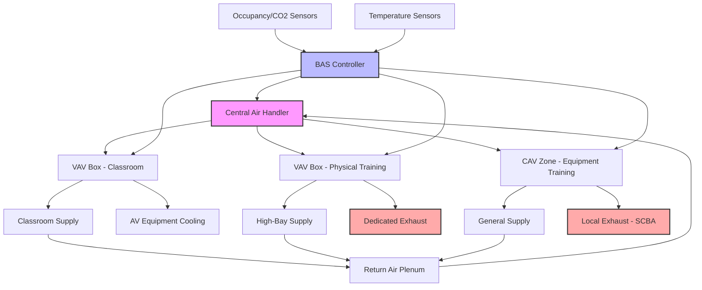

Fire station training facilities require specialized HVAC systems that accommodate diverse activities ranging from classroom instruction to intensive physical training. These spaces must provide appropriate environmental conditions for each training type while integrating effectively with the overall station HVAC infrastructure.

## Classroom Conditioning Requirements

Training classrooms in fire stations demand environmental conditions that support learning and concentration during extended instructional periods. The design cooling load typically ranges from 300-450 Btu/h per occupant, accounting for the heat generation from audiovisual equipment, lighting, and high occupancy density.

Temperature control must maintain 68-72°F during heating season and 73-76°F during cooling season, with setpoint adjustability to accommodate instructor preferences. Relative humidity should remain between 30-50% to ensure comfort and preserve training materials, books, and electronic equipment.

Ventilation rates follow ASHRAE Standard 62.1 requirements for educational facilities, with outdoor air calculated as:

$$V_{ot} = R_p \times P_z + R_a \times A_z$$

where $V_{ot}$ is total outdoor airflow (cfm), $R_p$ is people outdoor air rate (5 cfm/person for classrooms), $P_z$ is zone population, $R_a$ is area outdoor air rate (0.06 cfm/ft²), and $A_z$ is zone floor area.

Zone-level temperature control allows instructors to adjust conditions independently from other training areas. Individual thermostats with occupied/unoccupied scheduling maximize energy efficiency when classrooms are vacant.

## Physical Training Room Ventilation

Physical training areas generate substantial heat and moisture from firefighters conducting cardiovascular exercise, strength training, and conditioning drills. These spaces require robust ventilation systems capable of managing latent and sensible loads that can exceed 1,500 Btu/h per occupant during peak activity.

The design approach prioritizes high air change rates, typically 8-12 ACH during occupied periods, with the capability to reduce to 2-4 ACH during unoccupied times. Supply air distribution should avoid direct impingement on exercising personnel while providing effective mixing throughout the space.

Exhaust ventilation must address odor control and moisture removal. Dedicated exhaust fans operating continuously at minimum flow rates prevent odor migration to adjacent spaces. Demand-controlled ventilation using CO₂ or occupancy sensors modulates airflow based on actual usage:

$$V_{dcv} = V_{min} + (V_{max} - V_{min}) \times \frac{C_{measured} - C_{setpoint}}{C_{occupied} - C_{setpoint}}$$

where $V_{dcv}$ is demand-controlled ventilation airflow, $V_{min}$ and $V_{max}$ are minimum and maximum design airflows, and $C$ represents CO₂ concentrations.

Temperature setpoints in physical training rooms typically run cooler than classrooms, maintaining 65-68°F to accommodate metabolic heat generation from intense exercise. Ceiling-mounted or high-wall air distribution prevents equipment interference and maximizes usable floor space.

## Equipment Training Area Needs

Equipment training areas where firefighters practice with PPE, SCBA equipment, tools, and apparatus components require specialized environmental considerations. These spaces often experience variable occupancy and equipment heat loads from charging stations, compressors, and demonstration equipment.

Ventilation design must account for potential off-gassing from rubber components, battery charging systems, and cleaning solvents. Local exhaust ventilation at SCBA fill stations and equipment maintenance areas captures contaminants at the source. General dilution ventilation provides 6-8 ACH minimum to maintain acceptable indoor air quality.

Temperature and humidity control preserves equipment integrity and ensures realistic training conditions. Maintaining 60-80°F and 40-60% RH prevents degradation of rubber seals, electronic components, and fabric materials in stored equipment.

## Audio-Visual Equipment Cooling

Modern fire training facilities incorporate extensive AV systems including projectors, large-format displays, recording equipment, and computer systems. These electronics generate concentrated heat loads requiring dedicated cooling strategies.

Equipment racks and control rooms benefit from supplemental cooling systems independent of space conditioning. Small split systems or dedicated air handlers maintain equipment room temperatures at 65-70°F regardless of adjacent space conditions. Minimum airflow during unoccupied periods prevents equipment overheating.

Projector and display cooling integrates with room HVAC design. Ceiling-mounted projectors require adequate clearance from supply diffusers to prevent heat buildup and noise interference. Some installations utilize spot cooling or dedicated exhaust systems for high-wattage projection equipment.

## Flexible Use Space Considerations

Many fire stations design multi-purpose training areas that serve various functions throughout the week. A single space might host classroom instruction in the morning, physical training in the afternoon, and community meetings in the evening.

HVAC systems serving flexible spaces must accommodate rapid thermal transition between use types. Variable air volume systems with zone-level control provide the responsiveness required for changing occupancy patterns and activity levels. Programmable thermostats with multiple schedule options allow station personnel to pre-condition spaces before use transitions.

The HVAC system capacity must address the highest anticipated load condition while maintaining efficient operation during lighter loads. Typically, this means sizing for high-density physical training scenarios while incorporating turndown capabilities for classroom or meeting configurations.

## Integration with Station HVAC Systems

Training facility HVAC integrates with the broader station environmental control system while maintaining operational independence. Dedicated air handling units serving training areas allow isolation during maintenance or system failures without impacting critical apparatus bay or living quarter operations.

Central building automation systems coordinate training area operation with station-wide schedules, optimizing energy consumption during low-activity periods while ensuring readiness for scheduled training sessions. Override capabilities allow manual adjustment when impromptu training activities occur outside programmed schedules.

Zoning strategies separate high-ventilation training areas from administrative and living spaces, preventing unnecessary conditioning of unoccupied areas. Individual zone controls provide granular temperature management while central equipment provides economies of scale in heating and cooling generation.

## Training Area HVAC System Flow

## Design Criteria by Training Space Type

| Space Type | Temperature (°F) | Ventilation Rate | Air Changes/Hour | Humidity Control | Special Requirements |
|------------|-----------------|------------------|------------------|------------------|---------------------|
| Classroom | 70-74 | 5 cfm/person + 0.06 cfm/ft² | 4-6 ACH | 30-50% RH | Zone control, low noise (NC-30) |
| Physical Training | 65-68 | 20 cfm/person minimum | 8-12 ACH | 40-60% RH | High ventilation, demand control |
| Equipment Training | 60-75 | 6-8 ACH minimum | 6-8 ACH | 40-60% RH | Local exhaust at fill stations |
| Multi-Purpose | 68-72 | Variable by use | 6-10 ACH | 35-50% RH | Programmable controls, rapid response |
| AV/Server Room | 65-70 | Equipment heat removal | 10-15 ACH | 40-55% RH | Independent cooling, redundancy |
| Simulation Lab | 65-75 | 1.5 cfm/ft² minimum | 8-10 ACH | Controlled | Precise control, contaminant removal |

## System Design Best Practices

Training facility HVAC design should prioritize operational flexibility and energy efficiency. Modular equipment selection allows future expansion as training programs evolve. Redundant components in critical areas ensure training continuity during equipment maintenance or failure.

Energy recovery ventilation systems capture conditioning energy from training area exhaust streams, reducing heating and cooling loads during high-ventilation periods. These systems prove particularly cost-effective in physical training areas with continuous high airflow requirements.

Commissioning processes verify proper airflow distribution, control sequence operation, and integration with building automation systems. Functional performance testing under various training scenarios confirms the system meets design intent across the full range of operational conditions.

Proper training area HVAC design creates environments that support effective firefighter education while maintaining energy efficiency and operational reliability essential to modern fire station facilities.
