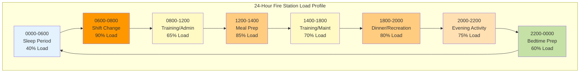

Fire and EMS stations operate 24 hours per day, 365 days per year, creating unique HVAC challenges. Unlike conventional buildings with predictable occupied/unoccupied schedules, fire stations maintain continuous staffing with overlapping shifts, meal preparation, physical training, and emergency response departures. This constant occupancy combined with highly variable load profiles demands specialized system design approaches.

## Continuous Operation System Selection

HVAC systems for 24-hour fire station occupancy must prioritize reliability, redundancy, and maintainability without compromising comfort during any period.

**Multiple Smaller Units vs. Single Large Units**

Deploy multiple smaller capacity units rather than single large systems. A living quarters area requiring 10 tons of cooling should utilize two 5-ton units or three 4-ton units rather than one 10-ton unit. This approach provides:

- Continued partial operation during equipment failure
- Maintenance scheduling flexibility
- Better load matching at partial capacity
- Reduced single-point failure risk

**Variable Refrigerant Flow (VRF) Systems**

VRF technology excels in 24-hour fire station applications due to inherent redundancy and efficiency at partial loads. Individual indoor units can fail without total system shutdown. Heat recovery VRF systems simultaneously provide heating to sleeping quarters while cooling kitchen and dayroom areas—common during nighttime operations.

**Dual-Fuel Heat Pump Systems**

Dual-fuel air-source heat pumps with fossil fuel backup optimize 24-hour operation economics. The system operates in heat pump mode during moderate conditions for maximum efficiency, automatically switching to gas heat during extreme cold when heat pump efficiency drops below economic viability. This configuration ensures continuous heating capacity regardless of outdoor conditions while minimizing operating costs.

## Equipment Sizing for Always-On Operation

Traditional HVAC sizing methodologies based on peak design conditions prove inadequate for facilities never entering setback mode.

**Load Duration Analysis**

Rather than sizing exclusively for peak design conditions, analyze the time-weighted load distribution. Fire stations spend the majority of operational hours at 40-60% of peak load. The average daily load can be calculated:

$$Q_{avg} = \frac{1}{24} \sum_{h=1}^{24} Q_h$$

Where $Q_h$ represents the hourly load. Design systems to operate efficiently at this average load while maintaining capacity for peaks.

**Part-Load Efficiency Priority**

Equipment selection must prioritize Integrated Energy Efficiency Ratio (IEER) and Integrated Part Load Value (IPLV) metrics over peak efficiency ratings (EER, SEER). Fire stations operate at 100% capacity less than 5% of annual hours. A unit with superior part-load performance delivers substantially better annual energy performance.

**Capacity Staging**

Multi-stage or variable capacity equipment allows precise load matching throughout the day. Two-stage compressors, modulating gas valves, and variable-speed blowers provide 3-4 distinct capacity levels, eliminating the efficiency losses associated with oversized equipment cycling on peak design capacity.

## Energy Efficiency for 24/7 Facilities

Continuous operation amplifies the financial impact of design efficiency decisions. A 1% efficiency improvement saves energy 8,760 hours per year rather than 2,000-3,000 hours in conventional buildings.

**Optimized Setpoint Strategies**

While true setback is impossible with 24-hour occupancy, intelligent setpoint strategies reduce loads:

- Sleeping quarters: 68°F heating / 76°F cooling during sleep periods (2200-0600)
- Dayroom/kitchen: 70°F heating / 74°F cooling during peak activity (0600-2200)
- Administrative areas: 68°F heating / 78°F cooling overnight when unoccupied

This differential setpoint strategy reduces average loads without compromising comfort during occupancy periods.

**Heat Recovery Ventilation**

Fire stations require substantial outdoor air for IAQ in continuously occupied spaces. Energy recovery ventilators (ERVs) recover 70-80% of heating/cooling energy from exhaust air. The annual energy savings equation:

$$E_{saved} = 1.08 \times CFM \times \Delta T \times hours \times \eta_{HRV}$$

Where $\eta_{HRV}$ represents heat recovery effectiveness (0.70-0.80 typical). For a 500 CFM system with 30°F average temperature difference operating 8,760 hours annually at 75% effectiveness:

$$E_{saved} = 1.08 \times 500 \times 30 \times 8,760 \times 0.75 = 106,434,000 \text{ Btu/year}$$

## Variable Load Profiles Throughout Day

Fire station loads exhibit dramatic fluctuations based on shift activities, meal preparation, training, and weather-independent occupancy patterns.

**Peak Load Variations**

Morning shift changes (0600-0800) and meal preparation periods (1200-1400, 1800-2000) represent peak loads, often reaching 85-100% of design capacity. Overnight sleep periods drop to 40-50% of peak load. HVAC systems must handle this 2.5:1 load variation efficiently.

**Response Time Requirements**

Fire stations cannot tolerate the 2-4 hour recovery times typical of setback strategies. Systems must maintain comfort continuously or recover within 15-30 minutes. This demands oversized distribution systems (ductwork, piping) that minimize temperature swing during load transitions.

## Design Considerations for Continuous Occupancy

| **Design Parameter** | **Standard Building** | **24-Hour Fire Station** | **Impact** |
|----------------------|----------------------|--------------------------|------------|
| Annual Operating Hours | 2,000-3,000 | 8,760 | 3-4× energy consumption |
| Load Diversity Factor | 0.60-0.75 | 0.85-0.95 | Higher simultaneous loads |
| Setback Period | 12-16 hours daily | None | No recovery energy savings |
| Part-Load Hours | 40-50% annual | 85-90% annual | Part-load efficiency critical |
| Equipment Redundancy | N | N+1 or 2N | No failure tolerance |
| Maintenance Windows | Unoccupied hours | Planned outages only | Complex scheduling |
| Ventilation Requirements | Intermittent | Continuous | Higher ventilation loads |
| Peak Demand Response | Available | Limited | Cannot curtail for comfort |

## Maintenance Scheduling Challenges

Continuous occupancy eliminates convenient maintenance windows available in conventional buildings. All maintenance occurs during occupied periods with zero tolerance for comfort disruption.

**N+1 Redundancy for Maintenance**

Design all critical systems with N+1 redundancy. If two units are required to meet peak load, install three units. This allows complete unit shutdown for maintenance without capacity reduction below comfort thresholds. The incremental capital cost (typically 15-25%) is recovered through avoided emergency service calls and extended equipment life through proper maintenance.

**Hot Standby Systems**

Maintain redundant equipment in hot standby mode—powered, controls active, ready for immediate operation. Cold standby systems requiring startup procedures create unacceptable comfort disruption when primary equipment fails or enters maintenance. Hot standby systems assume load within 30-60 seconds.

**Predictive Maintenance Programs**

Implement comprehensive predictive maintenance using vibration analysis, oil analysis, infrared thermography, and performance trending. Predictive programs identify developing problems 2-4 weeks before failure, providing scheduling flexibility to coordinate maintenance during favorable weather and low-activity periods (mid-week, mid-day, moderate outdoor conditions).

## Redundancy for Continuous Comfort

Fire station HVAC redundancy extends beyond equipment to include controls, utilities, and distribution systems.

**Dual Fuel Sources**

Where available, provision for dual fuel capability (natural gas + propane, or electricity + natural gas). This protects against utility disruptions while allowing fuel switching based on cost optimization.

**Distributed vs. Central Systems**

Distributed systems (multiple package units or split systems) inherently provide redundancy. Central systems (chiller/boiler plants) require engineered redundancy through multiple chillers/boilers with independent piping circuits.

**Control System Redundancy**

Critical control components require redundancy:
- Dual thermostats with automatic switchover
- Redundant temperature sensors
- Backup power for control circuits
- Manual override capability for all automated functions

**Emergency Power Integration**

Size emergency generators for full HVAC operation, not just emergency lighting and equipment. Fire personnel must rest comfortably between emergency calls regardless of utility power status. Generator capacity calculations must include HVAC locked rotor amperage (LRA) for equipment startup:

$$kW_{required} = (HP_{HVAC} \times 0.746 \times 1.5) + kW_{other\\_loads}$$

The 1.5 multiplier accounts for motor starting current exceeding running current.

## Operational Strategies

**Predictive Load Management**

Integrate weather forecasting with building automation systems to pre-cool or pre-heat during off-peak utility rate periods. Fire stations' 24-hour occupancy allows time-shifting of loads to minimize demand charges without compromising comfort.

**Zone Isolation**

Design independent zones for sleeping quarters, dayroom, kitchen, administrative areas, and apparatus bays. This allows targeted conditioning of occupied zones while maintaining setback temperatures in temporarily unoccupied areas—the only viable setback strategy in 24-hour facilities.

**Continuous Commissioning**

Implement continuous commissioning programs that monitor system performance 24/7 and automatically optimize control sequences. The always-on nature of fire stations provides abundant performance data for trending and optimization algorithms.

---

**Conclusion**

HVAC design for 24-hour fire station occupancy requires fundamental departures from conventional design methodologies. Equipment selection must prioritize part-load efficiency, reliability, and maintainability over peak performance ratings. Redundancy is not optional—it is essential for mission continuity. The substantial incremental capital investment in properly designed continuous-operation systems is recovered through reduced operating costs, eliminated emergency repairs during critical periods, and sustained crew comfort supporting emergency response readiness.
