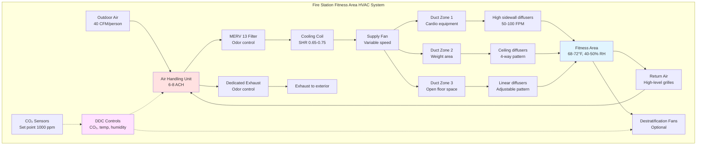

Fire station fitness areas require specialized HVAC design to maintain comfort during intense physical activity while managing equipment heat loads, controlling odors, and providing adequate ventilation for occupants engaged in aerobic and anaerobic exercise. These spaces operate continuously with variable occupancy patterns driven by shift schedules and training requirements.

## Ventilation Requirements for Exercise Spaces

Fitness areas demand significantly higher ventilation rates than standard occupied spaces due to elevated metabolic activity and associated respiratory rates. During vigorous exercise, oxygen consumption increases 10-15 times above resting levels, requiring proportional outdoor air delivery.

Design ventilation rates for fire station fitness areas:

$$Q_{fitness} = (A_{floor} \times ACH) = (A_{floor} \times 6-8)$$

where $Q_{fitness}$ is the required airflow in CFM, $A_{floor}$ is the floor area in square feet divided by 60 for conversion, and ACH represents 6-8 air changes per hour for exercise spaces.

For occupancy-based calculations:

$$Q_{occupant} = N \times 40 \text{ CFM/person}$$

where $N$ is the maximum anticipated occupancy. Fire stations typically design for 6-10 occupants during peak shift training periods.

The higher ventilation requirement accounts for increased CO₂ production, moisture generation from perspiration, and VOC emissions from occupants and equipment. Demand-controlled ventilation using CO₂ sensors set to maintain levels below 1,000 ppm optimizes energy use during variable occupancy periods.

## Equipment Heat Generation and Load Calculations

Exercise equipment contributes substantial sensible heat loads beyond typical occupant-generated loads. Treadmills, ellipticals, stationary bikes, and rowing machines generate heat through motor operation and user activity.

Typical equipment heat gains:

| Equipment Type | Sensible Heat (BTU/hr) | Quantity (typical) | Total Load (BTU/hr) |
|---|---|---|---|
| Treadmill | 3,500-4,500 | 2-3 | 7,000-13,500 |
| Elliptical trainer | 2,500-3,000 | 2 | 5,000-6,000 |
| Stationary bike | 1,500-2,000 | 2-3 | 3,000-6,000 |
| Rowing machine | 500-800 | 1-2 | 500-1,600 |
| Weight machines | 200-400 | 5-8 | 1,000-3,200 |
| Free weights (minimal) | Negligible | Variable | 500 |

Total equipment load for a typical fire station fitness area ranges from 17,000-30,800 BTU/hr, requiring approximately 1.4-2.6 tons of dedicated cooling capacity beyond occupant loads.

Occupant heat generation during exercise averages 800-1,200 BTU/hr sensible and 800-1,000 BTU/hr latent per person, compared to 250/200 BTU/hr for seated activities. For 8 occupants exercising simultaneously:

$$Q_{total} = (Q_{sensible} + Q_{latent}) \times N = (1000 + 900) \times 8 = 15,200 \text{ BTU/hr}$$

Combined equipment and occupant loads require robust cooling systems with adequate dehumidification capacity.

## Temperature and Humidity Design Parameters

Fitness areas require cooler temperatures than standard occupied spaces to accommodate elevated metabolic rates and maintain thermal comfort during exercise.

### Design Parameters for Fire Station Fitness Areas

| Parameter | Design Value | Tolerance | Notes |
|---|---|---|---|
| Dry-bulb temperature | 68-72°F | ±2°F | Lower than office spaces |
| Relative humidity | 40-50% | ±5% | Controls moisture, mold risk |
| Air velocity (occupied zone) | 50-100 FPM | Variable | Higher for comfort |
| Outdoor air rate | 40 CFM/person | Minimum | ASHRAE 62.1 requirement |
| Air changes per hour | 6-8 ACH | Minimum | Odor and moisture control |
| Sound level (NC) | NC-35 to NC-40 | Maximum | Balance with air movement |
| Supply air temperature | 55-58°F | ±2°F | Increased differential |

Temperature setpoints should trend toward the lower end (68-70°F) during peak usage periods and may increase to 72°F during unoccupied periods for energy conservation. Programmable thermostats or occupancy sensors optimize operation.

Humidity control prevents moisture accumulation on equipment, mirrors, and building surfaces while maintaining comfort. Dehumidification capacity should handle 6-8 pounds of moisture per hour during peak occupancy, requiring systems with sensible heat ratios (SHR) of 0.65-0.75.

$$SHR = \frac{Q_{sensible}}{Q_{sensible} + Q_{latent}} = \frac{16,000}{16,000 + 7,200} = 0.69$$

## Air Movement and Distribution Strategies

Elevated air velocities enhance evaporative cooling and thermal comfort for exercising occupants. Supply air distribution should provide 50-100 FPM velocities in the occupied zone without creating drafts during light activity or rest periods.

Design strategies include:

- **High sidewall diffusers**: Deliver air across equipment zones with horizontal throw patterns, creating air movement at 4-6 feet above floor level where occupants exercise
- **Ceiling-mounted diffusers**: Four-way pattern diffusers in areas with adequate ceiling height (10+ feet) provide even distribution
- **Displacement ventilation**: Low-velocity supply at floor level with high-level return captures heat and contaminants through natural convection
- **Destratification fans**: Ceiling fans operating at low speeds (50-150 RPM) improve air circulation and comfort during cooling mode

Return air grilles should be positioned to capture rising warm air and moisture, typically located near the ceiling or upper wall sections. Avoid placing returns near doors to prevent short-circuiting outdoor air supply.

## Acoustic Considerations

Fitness areas generate substantial noise from equipment operation, weight impacts, and music systems. HVAC systems must provide adequate ventilation without contributing to noise levels that interfere with communication or create annoyance.

Target noise criteria range from NC-35 to NC-40, balanced against the need for air movement. Strategies to achieve acoustic performance include:

- **Low-velocity duct design**: Maintain duct velocities below 1,500 FPM in main ducts, 800 FPM in branches, and 500 FPM at diffusers
- **Duct silencers**: Install lined silencers 10-15 feet upstream of diffusers serving fitness areas
- **Vibration isolation**: Mount air handling equipment on spring isolators (1.5-2 inch deflection) to prevent structure-borne noise transmission
- **Equipment selection**: Specify low-sone fans and acoustically-rated diffusers with NC ratings ≤35
- **Sound masking**: Background HVAC air movement can mask intermittent equipment noise without excessive velocity

Return air paths through corridors or transfer grilles provide acoustic separation between fitness areas and quiet zones like sleeping quarters.

## Odor Control Strategies

Exercise areas generate odors from perspiration, equipment materials, and cleaning products. Effective odor control requires adequate ventilation, filtration, and occasional supplemental treatment.

Primary odor control methods:

1. **High outdoor air percentages**: Maintain 50-100% outdoor air during occupied periods rather than recirculating contaminated air
2. **Enhanced filtration**: MERV 13 filters capture particles and some odor-causing compounds; activated carbon filters provide additional odor adsorption
3. **Dedicated exhaust**: Continuously operate exhaust fans at 0.1-0.2 CFM/ft² to maintain slight negative pressure, preventing odor migration to adjacent spaces
4. **Air change frequency**: 6-8 ACH provides odor dilution and removal between exercise sessions
5. **Surface cleaning protocols**: Regular equipment cleaning reduces odor sources at the material level

Calculate required dilution ventilation for odor control:

$$Q_{dilution} = \frac{G}{C_{max} - C_{outdoor}}$$

where $G$ is the contaminant generation rate, $C_{max}$ is the maximum acceptable concentration, and $C_{outdoor}$ is the outdoor concentration. For fitness spaces, empirical outdoor air rates of 40 CFM/person typically provide adequate dilution.

Humidity control below 50% RH inhibits bacterial and fungal growth on equipment and surfaces, reducing biological odor sources. Ensure condensate drains operate properly and coil surfaces remain clean to prevent microbial amplification within HVAC equipment.

Separate ventilation for toilet/shower facilities adjacent to fitness areas prevents moisture and odor crossover. Maintain pressure relationships: corridor (neutral) > fitness area (-5 Pa) > toilet rooms (-10 Pa) to direct airflow appropriately.
