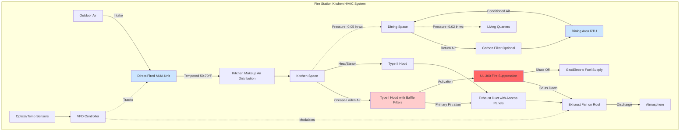

Fire station kitchens operate 24/7 with varying cooking loads and require specialized HVAC systems that balance commercial kitchen requirements with residential comfort expectations. These facilities must provide effective exhaust, adequate makeup air, and proper isolation from other station areas while maintaining energy efficiency during off-peak hours.

## Commercial Kitchen Exhaust Requirements

Fire station kitchens fall under commercial kitchen standards despite their institutional nature. Type I exhaust hoods are required over equipment that produces grease-laden vapors and smoke.

**Hood capture velocity** requirements:

$$V_{capture} = \frac{Q_{hood}}{A_{hood}} = 100-150 \text{ fpm}$$

where $Q_{hood}$ is exhaust airflow (cfm) and $A_{hood}$ is hood face area (ft²).

**Exhaust flow rates** depend on hood type and configuration:

$$Q_{exhaust} = L \times W \times CF$$

where $L$ is hood length (ft), $W$ is hood width (ft), and $CF$ is the configuration factor (cfm/ft² ranging from 200-400 cfm/ft² for wall-mounted canopy hoods to 300-600 cfm/ft² for island canopy hoods).

### Fire Station Kitchen Ventilation Requirements

| Hood Type | Application | Minimum Exhaust Rate | Capture Area Extension |
|-----------|-------------|---------------------|------------------------|
| Wall Canopy | Range, oven | 200-300 cfm/ft² | 6 in. beyond equipment |
| Island Canopy | Multi-station cooking | 300-400 cfm/ft² | 12 in. beyond equipment |
| Backshelf | Light-duty equipment | 300-500 cfm/linear ft | Behind equipment only |
| Proximity/Ventilator | Single appliance | 250-400 cfm/ft² | Minimal overhang |
| Type II (Heat/Steam) | Steam kettles, dishwashers | 150-250 cfm/ft² | 6 in. beyond equipment |

## Makeup Air Systems

Makeup air systems must replace 100% of exhausted air to maintain building pressure balance and prevent backdrafting of apparatus bay contaminants into living quarters.

**Makeup air volume**:

$$Q_{MA} = 0.8 \times Q_{exhaust}$$

This provides replacement air while maintaining slight negative pressure (-0.02 to -0.05 in. w.c.) in the kitchen relative to dining areas.

**Makeup air supply temperature** during heating season:

$$T_{supply} = T_{outdoor} + \Delta T_{preheat}$$

where $\Delta T_{preheat}$ brings outdoor air to 50-60°F minimum to prevent occupant discomfort. Direct-fired makeup air units (80-90% efficiency) are common in fire station applications.

**Makeup air discharge velocity** should be limited:

$$V_{discharge} \leq 500 \text{ fpm at 5 ft above floor}$$

to prevent drafts in the occupied zone while ensuring proper distribution.

## Dining Area Comfort Conditioning

Dining areas require separate temperature control from kitchen spaces, typically serving 10-20 personnel during meal periods with variable occupancy throughout the day.

**Cooling load considerations**:
- Radiant heat from adjacent kitchen: 15-25 Btuh/ft² of shared wall
- Occupant sensible load: 250 Btuh per person
- Occupant latent load: 200 Btuh per person
- Lighting: 1.0-1.5 W/ft²

**Ventilation requirements** per ASHRAE 62.1:
- Dining areas: 7.5 cfm per person + 0.12 cfm/ft²
- Kitchen (non-cooking zones): 0.12 cfm/ft² area component only

Separate zone control allows setback during unoccupied periods while maintaining kitchen exhaust operation.

## Odor Isolation and Pressure Control

Effective odor control requires careful pressure relationship management between kitchen, dining, and other living quarters.

**Recommended pressure cascade**:
1. Apparatus bay: 0 in. w.c. (reference)
2. Kitchen: -0.05 to -0.08 in. w.c.
3. Dining area: -0.02 to -0.03 in. w.c.
4. Sleeping quarters: +0.02 to +0.03 in. w.c.

Transfer grilles between dining and kitchen should incorporate backdraft dampers to prevent reverse flow during variable exhaust operation. Consider activated carbon filtration in dining area return air to remove residual odors.

## Grease Filtration and Fire Protection

Multi-stage grease removal protects ductwork and suppression systems while reducing maintenance requirements.

**Grease filtration stages**:
1. **Baffle filters**: 70-80% removal efficiency, UL 1046 listed, installed at 45-60° angle
2. **Centrifugal separators**: Additional 15-20% removal for high-volume cooking
3. **ESP units** (optional): 90-95% total efficiency for sensitive installations

**Fire suppression requirements**:
- UL 300 listed wet chemical systems
- Fusible link activation at 350-500°F
- Manual pull station at exit path
- Fuel shutoff integration with suppression activation

**Exhaust duct clearances** per NFPA 96:
- 18 in. to combustible construction (unenclosed)
- 6 in. to combustible construction (enclosed in fire-rated shaft)
- Listed grease duct enclosure systems reduce clearance to 3 in.

## Night Cooking and Part-Load Considerations

Fire stations experience continuous operation with varying cooking intensity. Part-load strategies reduce energy consumption during low-activity periods.

**Variable exhaust strategies**:

$$Q_{night} = 0.5 \times Q_{design}$$

Minimum code-required exhaust maintains capture while reducing makeup air heating/cooling costs. VFD-controlled exhaust fans modulate based on:
- Temperature sensors above cooking surface
- Optical smoke/grease sensors
- Manual override switches at cooking stations

**Demand-controlled makeup air**:

$$Q_{MA,variable} = f(T_{plume}, C_{optical}) \times Q_{MA,design}$$

where makeup air tracks exhaust reduction, maintaining pressure relationships while minimizing conditioning costs during overnight and low-cooking periods.

## Kitchen HVAC System Configuration

## Design Recommendations

Fire station kitchen HVAC systems should prioritize:

1. **Redundancy**: Backup exhaust capability for emergency cooking during maintenance
2. **Accessibility**: Quarterly grease duct cleaning requires adequate access panels every 12 ft maximum
3. **Controls integration**: Kitchen exhaust interlocked with apparatus bay door opening to prevent smoke migration
4. **Energy recovery**: Consider dedicated outdoor air systems with energy recovery for makeup air preconditioning in extreme climates
5. **Noise control**: Kitchen equipment noise should not exceed NC 45 to maintain communication during emergency calls

Proper integration of commercial kitchen requirements with fire station operational needs ensures safe, comfortable, and efficient kitchen and dining facilities that support 24/7 emergency response operations.
