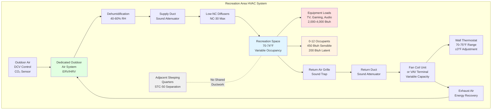

Recreation areas in fire stations serve as critical crew recovery spaces where personnel decompress between emergency calls, maintain morale during extended shifts, and transition from high-stress responses to rest periods. These day rooms and TV lounges must provide comfortable, flexible environments that accommodate widely variable occupancy patterns while maintaining acoustic separation from adjacent sleeping quarters to protect off-shift personnel rest.

## Day Room Comfort Requirements

Fire station day rooms function as multi-purpose gathering spaces experiencing occupancy ranging from zero during simultaneous emergency responses to full crew complement during shift changes, meal times, or training sessions. HVAC systems must respond to these rapid occupancy transitions while maintaining consistent comfort conditions.

**Critical comfort parameters:**

- Maintain space temperature at 70-74°F during occupied periods
- Design for relative humidity between 40-60% year-round
- Provide minimum 5 cfm/person + 0.06 cfm/ft² outdoor air per ASHRAE 62.1 Table 6-1
- Achieve air distribution effectiveness $E_v$ = 1.0 minimum to ensure complete mixing
- Target acoustic criteria below NC-35 to support conversation and media consumption

The thermal environment must accommodate personnel in various dress states—from full uniform to casual athletic wear—without requiring frequent thermostat adjustments. Design for neutral thermal sensation (PMV = 0 ± 0.5) based on light sedentary activity at 1.0-1.2 met.

## Entertainment Equipment Thermal Loads

Modern fire station recreation areas contain significant electronic equipment generating continuous internal heat gains. Large-screen televisions, gaming consoles, audio systems, and computer equipment produce sensible loads that vary with usage patterns but contribute baseline heat even in standby modes.

**Typical entertainment equipment loads:**

| Equipment Type | Typical Size/Rating | Sensible Heat Gain | Diversity Factor |
|----------------|---------------------|-----------------------|-------------------|
| Large LED TV | 65-75 inch | 150-250 Btuh | 0.7-0.9 |
| Gaming Console | 100-200 W | 350-700 Btuh | 0.3-0.5 |
| Audio Receiver | 100-150 W | 350-500 Btuh | 0.5-0.7 |
| Cable/Streaming Box | 20-40 W | 70-140 Btuh | 0.8-1.0 |
| Computers/Tablets | 50-100 W per unit | 170-350 Btuh | 0.4-0.6 |

Calculate total equipment cooling load using:

$$Q_{equipment} = \sum_{i=1}^{n} (W_i \times 3.412 \times DF_i \times UF_i)$$

Where $W_i$ is equipment wattage, $DF_i$ is diversity factor accounting for simultaneous use probability, and $UF_i$ is usage factor representing average operational time fraction. For fire station recreation areas, assume $UF$ = 0.6-0.8 due to 24-hour occupancy patterns.

Equipment loads in day rooms typically range from 2,000-4,000 Btuh depending on equipment complement and room size. Unlike conventional commercial applications, diversity factors remain high due to continuous facility occupancy and unpredictable usage patterns.

## Variable Occupancy Design Considerations

Recreation area occupancy fluctuates dramatically based on emergency call volume, shift schedules, training activities, and time of day. HVAC systems must accommodate these variations without excessive energy consumption during low-occupancy periods or comfort degradation during peak use.

**Occupancy-responsive HVAC strategies:**

Implement demand-controlled ventilation (DCV) using CO₂ sensors to modulate outdoor air delivery based on actual occupancy. Set CO₂ control at 1,000 ppm maximum with ventilation ranging from:

$$V_{ot} = V_{bz} + (V_{max} - V_{bz}) \times \frac{(C_{measured} - C_{ambient})}{(C_{setpoint} - C_{ambient})}$$

Where $V_{bz}$ is base zone ventilation (area component only), $V_{max}$ is design maximum ventilation, $C_{measured}$ is current CO₂ level, $C_{ambient}$ is outdoor CO₂ (typically 400 ppm), and $C_{setpoint}$ is control setpoint (1,000 ppm).

Thermal load variations require responsive temperature control with fast recovery capability. Size cooling systems for maximum simultaneous occupancy (full crew present) plus equipment loads, but implement multi-stage or variable-capacity equipment to maintain efficiency during partial-load conditions.

**Design occupancy scenarios:**

| Scenario | Occupancy Density | Sensible Load | Latent Load | Ventilation Rate |
|----------|-------------------|---------------|-------------|------------------|
| Minimal (0-2 people) | <0.1 people/100 ft² | Equipment only | Negligible | 0.06 cfm/ft² |
| Typical (4-6 people) | 0.2-0.3 people/100 ft² | 450 Btuh/person | 200 Btuh/person | 5 cfm/person + area |
| Peak (8-12 people) | 0.4-0.6 people/100 ft² | 450 Btuh/person | 200 Btuh/person | 5 cfm/person + area |
| Shift Change | 1.0+ people/100 ft² | 500 Btuh/person | 250 Btuh/person | 5 cfm/person + area |

## Acoustic Isolation from Sleeping Areas

Recreation areas often share walls with sleeping quarters housing off-shift personnel requiring daytime rest. Sound transmission through HVAC ductwork, return air paths, and plenum spaces creates unacceptable sleep disturbance if not properly controlled.

**Acoustic isolation requirements:**

- Provide complete duct separation between recreation and sleeping areas—no shared ductwork runs
- Install sound attenuators in supply and return ducts within 10 feet of recreation area diffusers/grilles
- Design return air paths with sound traps or lined ductwork to prevent cross-talk between spaces
- Maintain Sound Transmission Class (STC) rating minimum STC-50 for walls separating recreation from sleeping quarters
- Seal all duct penetrations through rated wall assemblies with acoustic caulking

Select air distribution devices with low sound generation characteristics. Specify diffusers and grilles with manufacturer's sound ratings (NC) at least 5 points below room design criteria. For recreation areas with NC-35 criteria, select devices rated NC-30 or lower at design airflow.

Avoid common return air plenums serving both recreation and sleeping areas. Sound readily transmits through return air paths, and normal activities in day rooms (television audio, conversation, gaming) generate sufficient noise to disturb sleeping personnel if return systems are interconnected.

## Fresh Air Ventilation Distribution

Effective outdoor air distribution in recreation areas prevents localized stuffiness, controls body odor during periods of crew recovery after physical emergency responses, and dilutes equipment off-gassing from electronics and furniture.

**Ventilation design approach:**

Install dedicated outdoor air systems (DOAS) or central air handlers with 100% outdoor air capability to decouple ventilation from thermal loads. This prevents overcooling during mild weather when full outdoor air quantities are required but sensible cooling demands are modest.

Distribute outdoor air uniformly throughout the recreation space using medium to high induction diffusers that promote mixing. Calculate ventilation effectiveness using:

$$E_v = \frac{C_{exhaust} - C_{supply}}{C_{breathing} - C_{supply}}$$

For well-mixed spaces with proper air distribution, target $E_v$ ≥ 1.0. Poor distribution patterns with short-circuiting between supply and return may reduce $E_v$ to 0.7-0.8, requiring proportionally higher ventilation rates to achieve acceptable indoor air quality.

Locate exhaust/return grilles away from supply diffusers to maximize air sweep across occupied zones. In rectangular day rooms, supply air along one long wall with return on the opposite wall to create cross-flow patterns that improve mixing effectiveness.

## Temperature Control Flexibility

Recreation areas experience diverse simultaneous preferences based on personnel activity level, dress, and individual thermal comfort requirements. Unlike sleeping quarters requiring individual room control, day rooms function as shared spaces requiring compromise thermal environments satisfying the majority of occupants.

**Flexible control implementation:**

Provide single-zone VAV or multi-speed fan coil systems allowing crew-adjustable temperature setpoints within administratively established deadbands. Typical administrative range: 70-75°F cooling, 68-72°F heating with 2°F differential to prevent excessive cycling.

Install wall-mounted thermostats in accessible locations away from direct solar gain, supply diffusers, and exterior walls. Consider lockout capabilities or limited adjustment ranges (±3°F from setpoint) to prevent extreme settings that compromise energy efficiency or create conflicts between shifts.

For larger recreation complexes with multiple day rooms, TV lounges, and game areas, implement separate zone control for each functional space. A 2,500 ft² recreation area should have minimum two zones; larger facilities may require 3-4 zones based on occupancy patterns and load diversity.

## Recreation Area HVAC System Diagram

## System Selection and Control Integration

Select HVAC equipment emphasizing quiet operation, variable capacity, and rapid response to changing loads. Water-source heat pumps provide excellent zone-level control with low sound levels. Variable refrigerant flow (VRF) systems offer high efficiency during partial-load conditions common in recreation areas.

Integrate HVAC controls with building management systems to track occupancy patterns, optimize ventilation delivery, and coordinate with apparatus bay pressure management. Maintain positive pressure in recreation areas relative to corridors (minimum +0.02 in. w.c.) while ensuring living quarters remain positive relative to apparatus bays.

Avoid oversized equipment that short-cycles during low-occupancy periods. Right-size cooling based on realistic peak loads rather than extreme worst-case scenarios. Use load calculations accounting for diversity:

$$Q_{total} = Q_{envelope} + Q_{equipment} + (Q_{occupant} \times N_{design} \times DF_{occ})$$

Where $DF_{occ}$ (occupant diversity factor) = 0.7-0.8 for recreation areas, recognizing that rarely will all crew members simultaneously occupy day rooms during peak load conditions.

---

**Related Topics:**
- [24-Hour Occupancy Requirements](../../../../../specialty-applications-testing/specialty-hvac-applications/fire-emt-stations/living-quarters/24-hour-occupancy/_index.md)
- [Sleeping Area HVAC Design](../../../../../specialty-applications-testing/specialty-hvac-applications/fire-emt-stations/living-quarters/sleeping-areas/_index.md)
- [Fitness Room Environmental Control](../../../../../specialty-applications-testing/specialty-hvac-applications/fire-emt-stations/living-quarters/fitness/_index.md)
- [Kitchen and Dining Area Ventilation](../../../../../specialty-applications-testing/specialty-hvac-applications/fire-emt-stations/living-quarters/kitchen-dining/_index.md)
- [Apparatus Bay Isolation](../../../../../specialty-applications-testing/specialty-hvac-applications/fire-emt-stations/apparatus-bays/_index.md)
