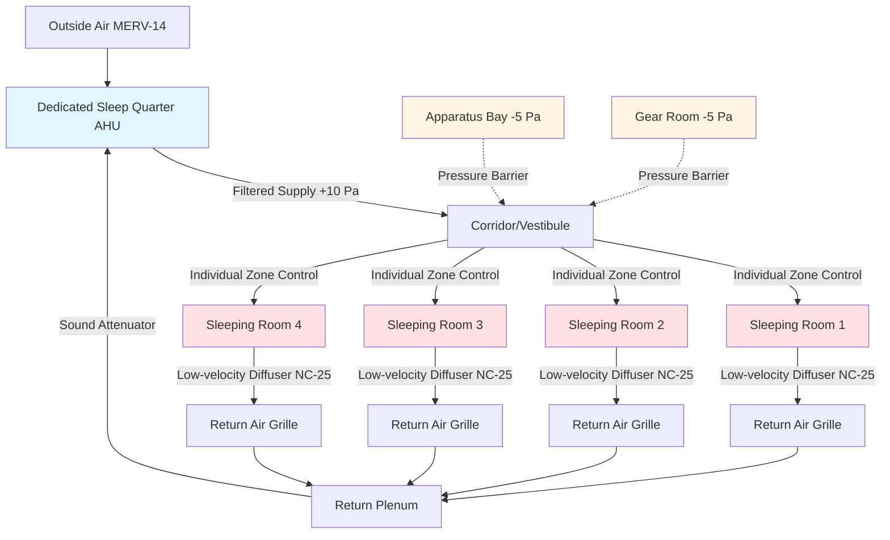

Fire station sleeping quarters present unique HVAC challenges that balance stringent acoustic requirements, individual comfort control, contamination protection, and rapid system recovery after emergency responses. These spaces must support quality rest while maintaining operational readiness 24/7.

## Acoustic Requirements for Sleep Quality

Fire station sleeping quarters demand exceptionally quiet HVAC operation to support restorative sleep between emergency calls. The target noise criterion is **NC-25 to NC-30**, significantly lower than typical commercial spaces.

### Sound Level Calculations

The overall sound pressure level from multiple HVAC sources combines logarithmically:

$$L_{total} = 10 \log_{10} \left( \sum_{i=1}^{n} 10^{L_i/10} \right)$$

Where $L_i$ represents individual sound pressure levels in dB from diffusers, ductwork, and mechanical equipment.

For terminal devices, the room-corrected sound level is:

$$L_{room} = L_{device} - 10 \log_{10}(A) + 0.5$$

Where $A$ is the room absorption in sabins. Individual sleeping rooms typically provide 50-100 sabins at mid-frequencies.

### Noise Control Strategies

**Supply air diffusers** must operate at exceptionally low velocities (200-300 fpm neck velocity) to minimize regenerated noise. Ceiling diffusers should be rated at least 10 NC points below target when operated at design airflow.

**Duct attenuation** requirements typically include:
- Lined ductwork for all branches serving sleeping areas
- Sound attenuators in main supply and return ducts
- Minimum 15-20 feet of lined duct before terminal devices
- Flexible duct connections at all equipment

**Vibration isolation** prevents structure-borne noise transmission from mechanical equipment, even when located remotely from sleeping quarters.

## Individual Temperature Control

Firefighters have widely varying thermal comfort preferences influenced by age, metabolism, and personal preference. **Individual zone control** for each sleeping room is essential.

### Zoning Approaches

**Fan coil units** provide excellent individual control with minimal central equipment. Each room receives a dedicated unit with occupant-accessible thermostat. Units must be ultra-quiet models (NC-25 rated) with EC motors.

**VAV terminal boxes** with reheat offer individual control from central systems. Electric or hot water reheat coils provide zone-level temperature adjustment. However, low minimum airflow requirements (often 30-50 CFM) can increase first cost.

**Ductless mini-split systems** provide exceptional individual control and near-silent operation. Multi-zone systems serve multiple sleeping rooms from a single outdoor unit. Indoor cassette units can achieve NC-20 operation.

## Air Quality and Ventilation

Sleeping quarters require continuous ventilation even during unoccupied periods to maintain air quality and prevent stagnant conditions.

### Ventilation Requirements

ASHRAE 62.1 specifies **5 CFM per person plus 0.06 CFM/ft²** for sleeping areas. For a typical 120 ft² firefighter sleeping room:

$$Q_{OA} = 5 \times 1 + 0.06 \times 120 = 12.2 \text{ CFM}$$

However, **fire stations typically provide 15-25 CFM per sleeping room** to account for:
- Door infiltration during frequent entries
- Pressure relationships with adjacent spaces
- Enhanced dilution of body odors and CO₂

### Filtration and Air Cleaning

**MERV 13-14 filtration** at central air handlers protects sleeping areas from particulate contamination. Some stations incorporate **activated carbon filters** to remove diesel exhaust odors that may migrate from apparatus bays.

## Contamination Separation

Physical and pressure separation between sleeping quarters and apparatus bays prevents diesel exhaust, combustion products, and gear contamination from reaching rest areas.

### Pressure Control Strategy

Sleeping quarters should maintain **+5 to +10 Pa positive pressure** relative to apparatus bays and gear storage areas. This requires:
- Dedicated supply air systems for sleeping areas
- Minimal or no return air transfer from contaminated zones
- Pressure monitoring with alarm notification
- Vestibules or airlocks at transition points

**Air handling separation** involves completely independent systems:
- Sleeping quarters served by dedicated AHUs
- No air recirculation from apparatus bays
- Exhaust systems in contaminated areas maintain negative pressure

## Rapid Conditioning After Responses

When firefighters return from calls, sleeping quarters must quickly recover comfortable conditions after extended vacancy or door-induced pressure disturbances.

### Recovery Performance

Systems should restore setpoint conditions within **10-15 minutes** after occupied mode activation. This requires:

$$Q_{recovery} = \frac{C \times V \times \rho \times \Delta T}{t_{recovery} \times 60}$$

Where:
- $C$ = specific heat (0.24 Btu/lb·°F)
- $V$ = room volume (ft³)
- $\rho$ = air density (0.075 lb/ft³)
- $\Delta T$ = temperature recovery (°F)
- $t_{recovery}$ = recovery time (minutes)

For a 120 ft² × 9 ft room requiring 5°F recovery in 15 minutes:

$$Q = \frac{0.24 \times 1080 \times 0.075 \times 5}{15 \times 60} = 0.108 \text{ tons}$$

Total cooling capacity must account for both steady-state loads and recovery requirements.

## Night Setback Limitations

Unlike commercial buildings, fire stations have **limited opportunity for energy-saving setback** due to unpredictable occupancy and the need for immediate comfort upon return.

### Setback Strategies

**Temperature setback** is typically limited to **2-4°F** from occupied setpoint to balance energy savings with rapid recovery capability. Deeper setbacks extend recovery time unacceptably.

**Ventilation reduction** to minimum code-required outside air during unoccupied periods saves substantial fan energy without compromising recovery time. Demand-controlled ventilation based on CO₂ or occupancy sensors enables this strategy.

**Equipment staging** allows partial system operation during low-occupancy periods (typically overnight when most personnel are in sleeping quarters) while maintaining full capacity for rapid response.

## Design Criteria Summary

| Parameter | Requirement | Notes |
|-----------|-------------|-------|
| **Acoustic Performance** |
| Noise Criterion | NC-25 to NC-30 | Target NC-25 for optimal sleep |
| Diffuser Velocity | 200-300 fpm | At neck, not face |
| Equipment Vibration | 0.1-0.2 in/sec | At source, isolated mounting |
| **Thermal Comfort** |
| Individual Control | Each room | Thermostat per sleeping room |
| Temperature Range | 68-76°F | User-adjustable setpoint |
| Recovery Time | 10-15 minutes | From setback to setpoint |
| Setback Limit | 2-4°F | Heating and cooling |
| **Air Quality** |
| Ventilation Rate | 15-25 CFM/room | Continuous operation |
| Filtration | MERV 13-14 | At central air handler |
| Outside Air | 100% dedicated | No apparatus bay recirculation |
| **Pressure Control** |
| Sleeping Area Pressure | +5 to +10 Pa | Relative to apparatus bay |
| Pressure Monitoring | Continuous | Alarm on loss of pressure |
| Door Undercut | 1/2 inch max | Limit pressure loss on opening |

## System Selection Considerations

The choice between central VAV, fan coil, or ductless systems depends on:

**Building size** - Stations with fewer than 8 sleeping rooms often favor ductless systems for simplicity and individual control.

**Acoustic priority** - Ductless mini-splits with inverter-driven compressors offer the quietest operation (NC-20 achievable).

**Maintenance capability** - Central systems concentrate maintenance activities but require more sophisticated controls for individual zone management.

**Energy efficiency** - Ductless heat pumps provide excellent part-load efficiency, critical for fire stations with variable occupancy patterns.

Proper HVAC design for fire station sleeping quarters directly impacts firefighter health, rest quality, and operational readiness. The investment in superior acoustic performance, individual comfort control, and contamination separation pays dividends in personnel well-being and retention.
