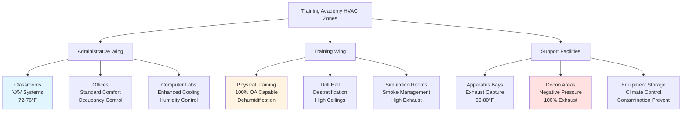

Fire training academies present unique HVAC challenges requiring integration of classroom environments, high-intensity physical training areas, equipment maintenance zones, and specialized decontamination facilities. These facilities must maintain comfort for instructional spaces while managing extreme moisture loads, contaminant removal, and varying occupancy patterns across diverse functional zones.

## Training Facility HVAC Requirements

Fire training academies combine educational, physical training, and operational support functions in a single complex. The HVAC system must accommodate simultaneous use of climate-controlled classrooms, high-ventilation fitness areas, apparatus bays, live fire training props, and specialized decontamination zones. System design requires careful attention to zone isolation, cross-contamination prevention, and energy efficiency despite widely varying load profiles.

The total facility cooling load combines multiple diverse components:

$$Q_{total} = Q_{classroom} + Q_{physical} + Q_{apparatus} + Q_{decon} + Q_{admin}$$

Each zone operates under different environmental parameters, occupancy schedules, and air quality requirements.

## Classroom and Administrative Areas

Instructional spaces follow standard educational facility HVAC design with enhanced ventilation for higher adult occupancy densities. Classrooms typically house 20-30 recruits plus instructors, requiring robust outdoor air delivery and effective temperature control.

Design cooling load for a typical 1,200 ft² classroom:

$$Q_{classroom} = (1200 \times 40) + (30 \times 300) + (30 \times 100 \times 3.5)$$

$$Q_{classroom} = 48,000 + 9,000 + 10,500 = 67,500 \text{ BTU/hr}$$

Where terms represent envelope load (40 BTU/hr·ft²), sensible occupant load (300 BTU/hr per person), and latent occupant load (100 BTU/hr per person at 3.5 sensible heat ratio).

Administrative offices, computer labs, and simulation rooms require standard comfort conditioning with 72-76°F temperature control and 40-60% relative humidity. These zones benefit from occupancy-based controls and night setback to reduce energy consumption during unoccupied periods.

## Physical Training Area Ventilation

Fitness centers, drill halls, and physical training spaces generate substantial sensible and latent loads from high-intensity exercise. A facility serving 40 recruits performing heavy exercise produces:

$$Q_{latent} = 40 \times 1,400 = 56,000 \text{ BTU/hr latent}$$

$$Q_{sensible} = 40 \times 800 = 32,000 \text{ BTU/hr sensible}$$

This yields a sensible heat ratio of 0.36, indicating latent-dominant loads requiring significant dehumidification capacity. Outdoor air rates should provide minimum 20 CFM per person, with many facilities providing 30-40 CFM per person to manage odors and maintain air quality during peak training sessions.

High-volume low-speed (HVLS) fans complement mechanical cooling by providing air movement at the occupied zone, improving comfort at higher temperature setpoints (76-78°F) and reducing cooling energy consumption by 20-30%.

## Equipment Storage and Maintenance Bays

Apparatus bays housing training vehicles, SCBA equipment, and turnout gear require conditioned space with enhanced ventilation. These areas face contamination from diesel exhaust, off-gassing from firefighting equipment, and moisture from wet gear.

Minimum ventilation rates should provide 0.5-0.75 CFM per square foot with higher rates (1.0-1.5 CFM/ft²) in active maintenance areas. Dedicated vehicle exhaust capture systems supplement general ventilation, directly removing diesel particulates at the tailpipe.

Temperature control in apparatus bays typically maintains 60-65°F in winter and provides cooling to 80°F maximum in summer, balancing equipment protection with energy efficiency.

## Decontamination Areas

Specialized decontamination facilities remove carcinogens and contaminants from firefighting equipment and personnel. These areas require 100% exhaust with no recirculation, negative pressure relative to adjacent spaces (-0.05 to -0.10 inches w.c.), and minimum 10 air changes per hour.

The decontamination zone includes:

- Gross decontamination area with equipment wash stations
- Transition zones with shower facilities
- Clean storage for decontaminated equipment
- Contaminated equipment holding areas

Each subzone operates under progressively negative pressure, creating airflow from clean to contaminated areas. Exhaust air receives filtration (MERV 13-15 minimum) before discharge to prevent environmental contamination.

Temperature in active decontamination areas should maintain 72-76°F with 50-60% relative humidity to support personnel comfort during extended decon operations.

## Multi-Zone Integration

Effective academy HVAC design requires careful integration of diverse functional zones with appropriate isolation, pressure relationships, and control strategies.

## Design Criteria by Space Type

| Space Type | Temperature (°F) | Humidity (%) | OA Rate | ACH | Pressure | Special Requirements |
|------------|-----------------|--------------|---------|-----|----------|---------------------|
| Classrooms | 72-76 | 40-60 | 15 CFM/person | 4-6 | Neutral | CO₂ monitoring |
| Physical Training | 68-76 | 40-60 | 30-40 CFM/person | 8-12 | Neutral | High dehumidification |
| Apparatus Bay | 60-80 | 40-70 | 0.75 CFM/ft² | 4-6 | Negative | Exhaust capture |
| Decon Wet Area | 72-76 | 50-60 | 100% OA | 10-15 | -0.08" w.c. | No recirculation |
| Decon Storage | 68-72 | 40-50 | 2 CFM/ft² | 6-8 | -0.05" w.c. | MERV 13 filtration |
| Drill Hall | 65-75 | 40-60 | 20 CFM/person | 3-4 | Neutral | Destratification fans |
| Simulation Room | 70-75 | 40-60 | 1.5 CFM/ft² | 12-20 | Negative | Smoke exhaust |
| Locker Rooms | 72-76 | 40-70 | 1.0 CFM/ft² | 10-12 | Exhaust only | Moisture control |

## Control and Energy Management

Building automation systems should provide zone-level control with scheduling based on training calendars and facility use patterns. Demand-controlled ventilation in classrooms and physical training areas optimizes outdoor air delivery based on actual occupancy, reducing conditioning loads during partial-use periods.

Separate air handling units for each major functional zone provide operational flexibility and prevent cross-contamination between clean administrative areas and potentially contaminated training/apparatus zones. Heat recovery from decontamination exhaust and physical training areas can provide preheating or precooling for incoming outdoor air, improving overall system efficiency.

Night setback for unoccupied periods and seasonal temperature adjustment (wider acceptable ranges during non-critical training periods) further reduce energy consumption while maintaining equipment protection and facility readiness.

Fire training academies require sophisticated HVAC design integrating multiple specialized zones with distinct environmental requirements. Proper system design ensures instructor and recruit comfort, maintains air quality across diverse activities, prevents cross-contamination between zones, and supports the critical mission of preparing emergency responders for life-saving service.
