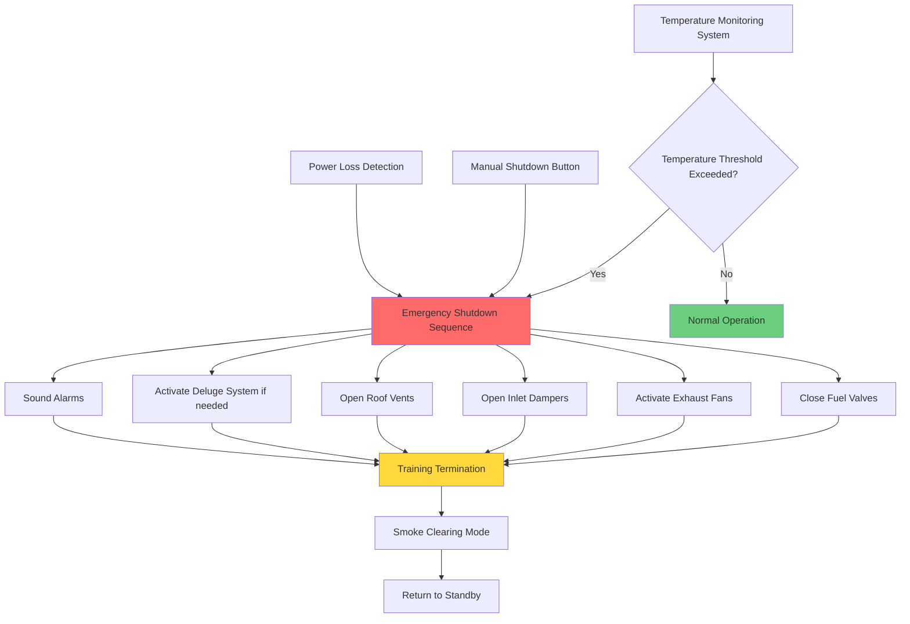

## Design Overview

Fire training burn buildings require specialized HVAC systems that support controlled fire exercises while protecting instructors, observers, and the structure itself. These facilities simulate real-world fire conditions for training firefighters in structural firefighting techniques, search and rescue operations, and thermal environment management.

The fundamental design challenge involves providing adequate ventilation to control combustion products and heat buildup during training evolutions while maintaining safe observation areas and enabling rapid smoke clearance between exercises. Modern burn buildings employ gas-fired systems or Class A fuel systems with engineered ventilation replacing older uncontrolled wood-burning structures.

Temperature monitoring and emergency shutdown integration represent critical safety systems preventing catastrophic structural damage and protecting personnel from excessive thermal exposure. Exhaust stack design must address emissions control, draft management, and roof penetration weatherproofing while maintaining reliable performance under extreme temperature cycling.

## Burn Building Ventilation Systems

### Natural Ventilation Components

Burn building ventilation combines natural and mechanical systems creating controlled air movement patterns that support realistic fire behavior while preventing hazardous conditions.

**Inlet Air Openings**: Supply fresh air for combustion and cooling:
- Low-level inlets sized 15-25% of floor area total
- Manually operated louvers or removable panels
- Multiple locations allow instructors to control air patterns
- Protection from weather when not in use (covers, rain guards)

**Roof Vents**: Natural smoke and heat removal:
- Opening area 10-15% of floor area minimum
- Manually controlled or automatic opening mechanisms
- Hydraulic or pneumatic operators survive extreme temperatures
- Emergency override capability for rapid venting

**Window and Door Openings**: Training props and ventilation control:
- Functional windows replicating residential construction
- Solid doors and forced-entry doors for realistic training
- Opening configuration controls fire behavior and ventilation effectiveness
- Replaceable frames accommodate training damage

### Mechanical Exhaust Systems

**Primary Exhaust Fans**: Remove smoke and combustion products between training evolutions:
- High-temperature construction (600-800°F continuous rating)
- Capacity 6-12 air changes per hour (ACH) for training rooms
- Variable speed control allows gradual or rapid smoke clearance
- Redundant units ensure availability for scheduled training

**Fan Sizing Calculation**: Based on room volume and desired clearing time:

$$Q_{exhaust} = \frac{V \times ACH}{60}$$

Where:
- $Q_{exhaust}$ = exhaust airflow (CFM)
- $V$ = room volume (cubic feet)
- $ACH$ = air changes per hour (6-12 typical)

For example, a 30 ft × 40 ft × 10 ft burn room with 8 ACH requirement:

$$Q_{exhaust} = \frac{(30 \times 40 \times 10) \times 8}{60} = 1,600 \text{ CFM}$$

**Makeup Air**: Balanced airflow during mechanical ventilation:
- Dedicated makeup air fans or passive inlet dampers
- Heating capacity for winter operation (optional)
- Filtration prevents outdoor contamination accumulation
- Makeup airflow 85-95% of exhaust capacity prevents excessive negative pressure

**Ductwork Design**: High-temperature materials and construction:
- 16-gauge stainless steel ductwork minimum
- Welded or flanged connections (no spiral lockseam)
- Minimum 2-inch clearance to combustible materials
- Thermal expansion joints for long duct runs
- Insulation on exterior portions prevents condensation

## Gas-Fired vs Class A Fuel Systems

### Gas-Fired Burn Systems

Modern training facilities increasingly employ gas-fired systems providing repeatable, controllable fire conditions with reduced emissions and structural wear.

**System Components**:
- Natural gas or propane supply piping to burn chambers
- Computer-controlled valve manifolds regulate heat release rate
- Flame safety controls prevent uncontrolled gas release
- Ignition systems with flame supervision
- Manual shutoff valves at multiple locations

**Heat Release Control**: Programmable fire intensity:

$$Q_{fire} = \dot{m}_{fuel} \times LHV \times \eta_{combustion}$$

Where:
- $Q_{fire}$ = heat release rate (BTU/hr)
- $\dot{m}_{fuel}$ = fuel mass flow rate (lb/hr)
- $LHV$ = lower heating value (21,500 BTU/lb for natural gas)
- $\eta_{combustion}$ = combustion efficiency (0.95-0.98)

Typical training scenarios range from 500,000 to 3,000,000 BTU/hr heat release depending on room size and training objectives.

**Advantages**:
- Precise temperature control and repeatability
- Rapid evolution cycling (15-20 minute intervals)
- Reduced particulate emissions
- Minimal structural cleanup and maintenance
- Extended structure service life (20-30 years vs 5-10 for wood-burning)

**Limitations**:
- Higher initial installation cost
- Different smoke characteristics than structural fires
- Requires utility infrastructure (gas supply, electrical)
- Training realism concerns from some instructors

### Class A Fuel Systems

Traditional wood-burning systems use pallets, dimensional lumber, and straw creating realistic structural fire conditions with natural fuel behavior.

**Fuel Loading Guidelines**:
- 50-150 pounds wood per evolution typical
- Fuel arranged to create desired fire growth pattern
- Ignition accelerants controlled (newspaper, cardboard only)
- Prohibited materials: plastics, treated lumber, rubber, petroleum products

**Ventilation Requirements**: Natural fuel systems demand higher ventilation rates:
- 10-15 ACH during clearing phase
- Extended clearing time (30-45 minutes) between evolutions
- Creosote and particulate buildup requires frequent cleaning
- Ash removal systems or manual cleanup between uses

**Advantages**:
- Lower capital cost
- Realistic fuel behavior and smoke characteristics
- Flexibility in fire scenario creation
- No utility dependencies (can operate off-grid)

**Limitations**:
- Inconsistent fire behavior evolution-to-evolution
- Heavy particulate and creosote production
- Structural deterioration from thermal cycling
- Environmental emissions concerns
- Labor-intensive fuel preparation and cleanup

## Temperature Limits and Monitoring

### Structural Temperature Limits

Concrete and steel structures tolerate different maximum temperatures:

**Concrete Structures**:
- Maximum surface temperature: 1,200-1,400°F
- Sustained exposure above 1,200°F causes spalling and strength loss
- Refractory coatings or liners extend temperature tolerance
- Thermal cycling accelerates deterioration (expansion/contraction damage)

**Steel Structures**:
- Structural steel loses strength above 1,000°F
- Maximum recommended temperature: 800-900°F for repeated cycling
- Fireproofing or refractory barriers protect structural members
- Paint and finish damage occurs above 500°F

### Temperature Monitoring Systems

**Thermocouple Arrays**: Distributed temperature measurement:
- Type K thermocouples (32-2,300°F range) most common
- Multiple measurement points per room (ceiling, walls, structural members)
- Displayed on instructor control panels
- Data logging for training analysis and safety documentation

**Infrared Temperature Monitoring**: Non-contact measurement:
- Fixed infrared sensors monitor critical structural points
- 1,000-2,500°F measurement range typical
- Faster response than thermocouples
- Higher cost limits deployment to critical areas only

**Temperature Alarm Thresholds**:

| Location | Warning Level | Shutdown Level | Notes |
|----------|--------------|----------------|-------|
| Ceiling Surface | 1,000°F | 1,200°F | Concrete structures |
| Wall Surface | 900°F | 1,100°F | Concrete structures |
| Steel Structural Members | 700°F | 900°F | Protected structural steel |
| Observer Area Ceiling | 150°F | 200°F | Radiant heat protection |
| Exhaust Stack | 1,200°F | 1,500°F | Stack material dependent |

**Automatic Shutdown Integration**: Temperature limits trigger emergency responses:
- Fuel shutoff (gas systems) or water deluge activation (Class A systems)
- Forced ventilation activation (full exhaust capacity)
- Audible and visual alarms in all areas
- Training evolution termination protocol

## Exhaust Stack Design and Emissions

### Stack Sizing and Configuration

**Stack Height Calculation**: Adequate draft and dispersion:

$$H_{stack} = H_{building} + 10 \text{ ft minimum}$$

Higher stacks improve draft and emissions dispersion but increase structural loads and maintenance access challenges.

**Stack Diameter**: Based on exhaust volumetric flow and desired velocity:

$$D_{stack} = \sqrt{\frac{4Q_{exhaust}}{\pi V_{stack}}}$$

Where:
- $D_{stack}$ = stack inside diameter (inches)
- $Q_{exhaust}$ = exhaust flow rate (CFM)
- $V_{stack}$ = stack velocity (800-1,200 FPM typical)

Target velocity balances draft performance against excessive friction losses and noise.

**Stack Construction**:
- Stainless steel (304 or 316 grade) for corrosion resistance
- Double-wall insulated construction prevents condensation
- Welded seams (no mechanical joints below roof line)
- Cleanout access at base for particulate removal
- Rain cap with bird screen

**Draft Control**: Natural and mechanical draft management:
- Barometric dampers prevent excessive draft during high winds
- Variable speed exhaust fans provide controllable mechanical draft
- Inlet air control coordinates with exhaust to maintain building pressure
- Stack effect calculation for natural ventilation design:

$$\Delta P_{stack} = 7.64 \times H_{stack} \times \left(\frac{1}{T_{outside}} - \frac{1}{T_{stack}}\right)$$

Where:
- $\Delta P_{stack}$ = pressure difference (inches water column)
- $H_{stack}$ = stack height (feet)
- $T_{outside}$ = outdoor air temperature (°R = °F + 460)
- $T_{stack}$ = stack gas temperature (°R)

### Emissions Control

**Particulate Emissions**: Primary concern for Class A fuel systems:
- Visible smoke during training evolutions acceptable
- Post-evolution clearing smoke minimized by complete combustion
- Settling chambers in stack base capture heavy particulates
- Spark arrestors prevent ember discharge

**Carbon Monoxide**: Incomplete combustion byproduct:
- Adequate combustion air prevents excessive CO generation
- Exhaust stack height and location prevent CO accumulation near intakes
- Gas-fired systems produce lower CO than wood-burning

**Regulatory Compliance**: Local air quality regulations vary:
- Some jurisdictions require air quality permits for burn buildings
- Emission testing may be required during commissioning
- Operating hour restrictions in non-attainment areas
- Neighbor complaint mitigation strategies (scheduling, notification)

## Observer and Instructor Area Ventilation

### Observer Gallery Design

Burn buildings include protected observation areas allowing instructors to monitor training evolutions while remaining safe from thermal exposure.

**Thermal Barrier Construction**:
- Tempered or wire-reinforced glass observation windows
- Air gap or water curtain between burn area and observer space
- Insulated walls (minimum R-19) separate observer area
- Maximum radiant heat exposure 300 BTU/hr·ft² at observer position

**Ventilation Requirements**:
- Positive pressure relative to burn area (+10 to +15 Pa)
- 100% outdoor air (no recirculation from burn area)
- Air conditioning for summer comfort (training often conducted in warm weather)
- Supply airflow 0.5-1.0 CFM/ft² floor area minimum
- MERV 13 filtration prevents smoke infiltration

**Emergency Pressurization**: Smoke infiltration protection:
- Increased supply airflow during training evolutions
- Pressurization activates automatically when burn exercises commence
- Door vestibules with dedicated supply air prevent smoke entry
- Backup fans ensure reliability

### Instructor Control Stations

**Climate Control**: Continuous occupancy during multi-hour training sessions:
- Individual temperature control separate from burn area
- Design temperature 70-75°F year-round
- Humidity control prevents window condensation
- Noise levels NC-35 maximum for clear communication

**Communication Systems Integration**:
- HVAC system noise controlled to allow radio and PA communication
- Acoustic isolation from burn area (doors, walls, penetrations sealed)
- Ventilation air supply through sound attenuators

## Emergency Shutdown Integration

### Automatic Shutdown Triggers

Fire training burn buildings incorporate multiple automated safety systems that integrate with HVAC operations.

**Temperature-Based Shutdown**:
- Thermocouples or RTDs exceed predetermined thresholds
- Immediate fuel shutoff (gas systems) or water deluge activation
- Full mechanical exhaust activation regardless of mode
- Inlet air dampers open fully for maximum natural ventilation
- Training evolution termination alarm

**Manual Emergency Shutdown**:
- Push-button stations at multiple locations (instructor area, entry points, control room)
- Wireless remote triggers for instructors inside burn area
- Clear identification and protective covers prevent accidental activation
- Override capability for maintenance and testing

**Loss of Power Shutdown**:
- Fail-safe position for all dampers and valves
- Fuel valves close on power loss (spring return or gravity)
- Exhaust dampers open on power loss (spring return)
- Natural ventilation continues during power outage
- Backup generator powers critical monitoring if provided

### System Integration Architecture

### Post-Evolution Ventilation Sequence

**Smoke Clearing Protocol**: Controlled sequence removes combustion products:

1. **Initial Phase (0-5 minutes)**:
   - Fuel secured (gas valves closed or combustion complete)
   - Mechanical exhaust at 50% capacity
   - Inlet air 50% open (controlled smoke movement)
   - Temperatures begin declining

2. **Active Clearing (5-15 minutes)**:
   - Mechanical exhaust to 100% capacity
   - All inlet air openings fully open
   - Roof vents opened if equipped
   - Temperatures declining to 300-400°F range

3. **Final Clearing (15-30 minutes)**:
   - Continued full ventilation
   - Temperature monitoring confirms safe entry levels
   - Particulate settling period for Class A systems
   - Instructor authorization required before personnel re-entry

4. **Reset Phase (30-45 minutes)**:
   - Reduced ventilation rate (25-50% exhaust capacity)
   - Structure cooling to ambient temperature
   - Setup for next evolution or shutdown for day

## Burn Building Design Parameters

| Parameter | Gas-Fired Systems | Class A Fuel Systems | Notes |
|-----------|------------------|---------------------|-------|
| **Heat Release Rate** | 500,000-3,000,000 BTU/hr | Variable (fuel dependent) | Controlled vs natural fuel |
| **Exhaust Capacity** | 6-10 ACH | 10-15 ACH | Higher for Class A clearing |
| **Clearing Time** | 15-20 minutes | 30-45 minutes | Between evolutions |
| **Max Ceiling Temp** | 1,200°F (concrete) | 1,200°F (concrete) | Structural protection limit |
| **Max Wall Temp** | 1,100°F (concrete) | 1,100°F (concrete) | Structural protection limit |
| **Observer Area Pressure** | +10 to +15 Pa | +10 to +15 Pa | Relative to burn area |
| **Stack Velocity** | 800-1,200 FPM | 800-1,200 FPM | Balance draft vs friction |
| **Stack Height** | Building + 10 ft minimum | Building + 10 ft minimum | Draft and dispersion |
| **Inlet Air Area** | 15-25% floor area | 15-25% floor area | Multiple locations |
| **Roof Vent Area** | 10-15% floor area | 10-15% floor area | Natural ventilation |
| **Makeup Air** | 85-95% of exhaust | 85-95% of exhaust | Prevent excessive negative pressure |
| **Thermocouple Spacing** | 10-15 ft maximum | 10-15 ft maximum | Adequate coverage |
| **Evolution Cycle Time** | 20-30 minutes | 45-60 minutes | Setup through clearing |
| **Structure Life Expectancy** | 20-30 years | 5-10 years | With proper maintenance |

## Commissioning and Testing

**Performance Verification**: Systematic testing confirms design intent:
- Exhaust system airflow measurement (pitot traverse or calibrated balancing)
- Temperature monitoring calibration at multiple points
- Emergency shutdown sequence testing (simulated triggers)
- Pressurization verification (observer areas, control rooms)
- Smoke clearance timing under actual fire conditions

**Safety System Testing**: Regular verification required:
- Monthly thermocouple and alarm function tests
- Quarterly emergency shutdown testing
- Annual exhaust fan performance measurement
- Gas system leak testing and safety valve verification
- Deluge system testing if installed

**Operator Training**: Facility staff require comprehensive training:
- Normal operating procedures for each evolution type
- Emergency shutdown recognition and response
- Temperature monitoring interpretation
- Maintenance requirements and schedules
- Regulatory compliance and documentation

Proper design, installation, and operation of burn building HVAC systems enable safe, effective firefighter training while protecting facilities and personnel from excessive thermal exposure and combustion product hazards.
