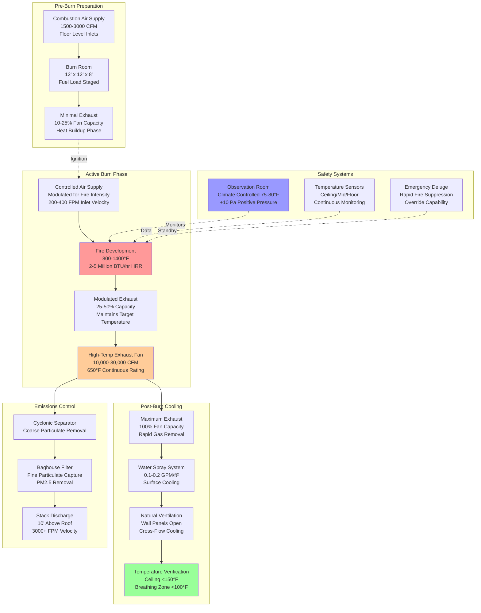

## Design Overview

Live fire training facilities expose firefighters to realistic fire conditions in controlled burn buildings. HVAC systems must provide adequate combustion air to sustain training fires, withstand extreme temperatures exceeding 1200°F, protect equipment from thermal damage, remove combustion products between training evolutions, and rapidly cool structures for successive burns. The design balances fire intensity requirements with instructor safety, structural protection, and environmental compliance.

The fundamental engineering challenge involves managing high-temperature gas flows while maintaining controlled combustion conditions. Unlike building fires, training burns occur repeatedly in the same structure, requiring mechanical systems that facilitate ignition, sustain combustion at desired intensities, exhaust products completely, and restore ambient conditions between evolutions.

## Combustion Air Supply Requirements

### Stoichiometric Air Calculations

Complete combustion of training fuels requires precise air supply to achieve target fire intensities. Insufficient air produces incomplete combustion and excessive smoke, while excess air reduces temperatures and creates unrealistic training conditions.

**Theoretical Air Requirement**: For typical Class A training fuels (wood pallets, straw, oriented strand board):

$$A_{theo} = \frac{m_{fuel} \cdot s}{0.232}$$

Where:
- $A_{theo}$ = theoretical air requirement (lb air/lb fuel)
- $m_{fuel}$ = fuel consumption rate (lb/hr)
- $s$ = stoichiometric ratio (typically 6-8 for cellulosic materials)
- 0.232 = mass fraction of oxygen in air

**Practical Air Supply**: Training operations require excess air above stoichiometric values:

$$Q_{combust} = A_{theo} \cdot m_{fuel} \cdot (1 + EA) \cdot \frac{1}{\rho_{air}}$$

Where:
- $Q_{combust}$ = combustion air flow rate (CFM)
- $EA$ = excess air factor (0.20 to 0.50 typical, representing 20-50% excess)
- $\rho_{air}$ = air density at supply conditions (0.075 lb/ft³ at standard conditions)

**Example Calculation**: Burn room consuming 200 lb/hr wood pallets (s = 7.5):

$$A_{theo} = \frac{200 \cdot 7.5}{0.232} = 6,466 \text{ lb air/hr}$$

With 30% excess air ($EA$ = 0.30):

$$Q_{combust} = \frac{6,466 \cdot 1.30}{0.075 \cdot 60} = 1,871 \text{ CFM}$$

### Air Supply System Design

**Natural Ventilation Systems**: Simple facilities rely on natural air movement:
- Low-level air inlets sized for 100-200 FPM inlet velocity
- Inlet area minimum 1.5 ft² per 1000 BTU/hr heat release rate
- Multiple inlets distributed around burn room perimeter
- Adjustable louvers control air supply and fire intensity
- Free area minimum 70% of nominal inlet size accounting for louver resistance

**Mechanical Supply Systems**: Dedicated combustion air fans for controlled conditions:
- Centrifugal fans rated for intermittent high-temperature exposure
- Variable frequency drives modulate air supply to target fire intensities
- Supply ductwork insulated and heat-shielded near burn rooms
- Backdraft dampers prevent hot gas reverse flow during burns
- Fan capacity 1500-3000 CFM per typical burn room (12 ft × 12 ft × 8 ft)

**Air Inlet Location**: Strategic placement optimizes combustion and visibility:
- Floor-level inlets create upward fire development (realistic training)
- Multiple inlets prevent preferential air channels
- Inlet velocity limited to 300 FPM to avoid excessive turbulence
- Protection from direct flame impingement using refractory baffles

## High-Temperature Exhaust Systems

### Exhaust System Thermal Requirements

**Temperature Conditions**: Exhaust gases during active burns reach extreme temperatures:

| Burn Phase | Gas Temperature | Duration | Exhaust Requirements |
|------------|----------------|----------|---------------------|
| Ignition | 400-600°F | 5-10 min | Minimal exhaust, maximize heat buildup |
| Growth | 800-1200°F | 10-20 min | Controlled exhaust maintains intensity |
| Fully Developed | 1000-1400°F | 15-30 min | Full exhaust prevents structural damage |
| Decay | 600-900°F | 20-40 min | Increased exhaust accelerates cooling |
| Post-Burn Ventilation | 200-400°F | 30-60 min | Maximum exhaust for rapid cooldown |

**Heat Release Calculation**: Exhaust system capacity based on fire heat release:

$$Q_{exhaust} = \frac{HRR}{c_p \cdot \rho_{gas} \cdot \Delta T}$$

Where:
- $Q_{exhaust}$ = required exhaust flow rate (CFM)
- $HRR$ = heat release rate (BTU/hr), typically 2,000,000-5,000,000 BTU/hr for training fires
- $c_p$ = specific heat of combustion gases (0.24 BTU/lb·°F)
- $\rho_{gas}$ = gas density at exhaust temperature (lb/ft³)
- $\Delta T$ = temperature rise above ambient (°F)

For gas density at elevated temperature:

$$\rho_{gas} = \frac{0.075 \cdot 530}{460 + T_{gas}}$$

Where $T_{gas}$ is exhaust gas temperature in °F.

### Exhaust System Components

**High-Temperature Exhaust Fans**: Purpose-built fans withstand combustion gases:
- Spark-resistant construction (aluminum or stainless steel)
- Belt-driven arrangement isolates motor from hot gas stream
- Wheel and housing rated to 650°F continuous, 1000°F intermittent
- Vibration isolation protects fan from thermal expansion forces
- Capacity 10,000-30,000 CFM per burn building

**Variable Exhaust Control**: Modulating exhaust regulates fire intensity and thermal exposure:
- VFD control adjusts exhaust from 25% (fire buildup) to 100% (post-burn cooling)
- Automated control based on room temperature or instructor override
- Minimum exhaust during fire growth phase sustains high temperatures
- Maximum exhaust during cooldown reduces time between training evolutions

**Exhaust Ductwork Materials**:
- 16-gauge stainless steel (304 or 316) for corrosion resistance
- Insulated double-wall construction protects surrounding structure
- Expansion joints accommodate thermal growth (up to 6 inches per 100 feet)
- Minimum 2% slope toward condensate drains removes moisture
- Discharge velocity 2500-3500 FPM prevents condensate accumulation

**Stack Design**: Terminal discharge requirements:
- Exhaust discharge minimum 10 feet above roof level
- Stack height extends 3 feet above any surface within 20-foot radius
- Rain cap and spark arrestor protect from weather and contain embers
- Stack temperature monitoring ensures safe discharge conditions
- Discharge velocity minimum 3000 FPM for plume rise and dispersion

## Heat Protection for HVAC Equipment

### Equipment Thermal Protection

**Refractory Barriers**: Physical separation protects equipment from radiant heat:
- Ceramic fiber insulation (rated 2300°F) lines burn room interior surfaces
- Minimum 2-inch thickness on walls adjacent to mechanical equipment
- Stainless steel cladding protects insulation from physical damage
- Air gap between refractory and structural steel prevents conductive heat transfer

**Thermal Barriers for Ductwork**: Duct insulation and heat shields:
- High-temperature mineral wool insulation (450°F continuous rating)
- Aluminum jacket protects insulation from mechanical damage
- 6-inch minimum air space between hot ductwork and combustible materials
- Radiation shields (sheet metal) reflect radiant heat from ducts

**Equipment Location**: Strategic placement minimizes thermal exposure:
- Exhaust fans located in rooftop penthouses away from burn rooms
- Supply air handling units in separate mechanical rooms with fire-rated separation
- Control panels and instrumentation in climate-controlled observation rooms
- Refrigerant-based cooling equipment isolated from high-temperature areas

### Structural Cooling Systems

**Post-Burn Water Spray**: Accelerates cooling between training evolutions:
- Deluge nozzles spray interior surfaces after burn completion
- Water application rate 0.1-0.2 GPM/ft² of surface area
- Spray duration 5-10 minutes reduces surface temperatures below 200°F
- Drainage system removes water and steam from burn rooms
- Interlocked with exhaust fans to evacuate steam

**Structural Ventilation**: Natural and mechanical cooling:
- Operable wall panels create cross-ventilation during cooldown
- Panel opening creates 8-12 air changes per hour natural ventilation
- Mechanical exhaust supplements natural ventilation as needed
- Temperature sensors confirm cooldown to safe re-entry levels (below 120°F)

## Combustion Product Removal

### Post-Burn Exhaust Requirements

**Ventilation Effectiveness**: Complete removal of smoke and combustion gases:

$$t_{purge} = \frac{V}{Q_{exhaust} \cdot E}$$

Where:
- $t_{purge}$ = time to achieve acceptable conditions (minutes)
- $V$ = burn room volume (ft³)
- $Q_{exhaust}$ = exhaust flow rate (CFM)
- $E$ = ventilation effectiveness (0.5-0.8 for mixing ventilation, 0.8-1.0 for displacement)

**Example**: 12 ft × 12 ft × 8 ft burn room (1,152 ft³) with 6,000 CFM exhaust and mixing ventilation ($E$ = 0.6):

$$t_{purge} = \frac{1,152}{6,000 \cdot 0.6} = 0.32 \text{ minutes} = 19 \text{ seconds}$$

Multiple air changes required for acceptable conditions (typically 10-15 air changes):

$$t_{total} = t_{purge} \cdot ACH_{required} = 0.32 \cdot 12 = 3.8 \text{ minutes}$$

### Particulate and Gas Removal

**Filtration Systems**: Exhaust treatment for environmental compliance:
- Dry scrubbers remove particulate matter using cyclonic separation
- Baghouse filters capture fine particulates (PM2.5 and smaller)
- Filter media rated for 400°F continuous exposure
- Automated filter cleaning (reverse air pulse) maintains pressure drop
- Ash collection hoppers require weekly emptying

**Emissions Monitoring**: Continuous monitoring ensures regulatory compliance:
- Opacity monitors measure visible emissions (target below 20% opacity)
- CO monitors measure incomplete combustion (typical range 100-500 ppm)
- Temperature monitoring confirms adequate residence time for complete combustion
- Data logging demonstrates compliance with air quality permits

## Thermal Management During Burns

### Temperature Control Strategies

**Fire Intensity Modulation**: Controlling heat release manages thermal exposure:

$$HRR = m_{fuel} \cdot H_c \cdot \chi$$

Where:
- $HRR$ = heat release rate (BTU/hr)
- $m_{fuel}$ = fuel consumption rate (lb/hr)
- $H_c$ = heat of combustion (typically 7,000-8,500 BTU/lb for wood products)
- $\chi$ = combustion efficiency (0.6-0.9 depending on ventilation)

**Control Methods**:
- Fuel load adjustment (increase/decrease fuel quantity)
- Air supply modulation (restrict air reduces intensity)
- Exhaust adjustment (increased exhaust cools gases, reduces ceiling temperatures)
- Water fog application (fine mist absorbs heat without extinguishing fire)

### Instructor Protection

**Observation Room Climate Control**: Safe viewing positions require cooling:
- Separate HVAC system maintains observation areas at 75-80°F
- Positive pressure prevents smoke infiltration (minimum +10 Pa)
- Tempered glass or polycarbonate viewing windows withstand radiant heat
- Emergency ventilation purges smoke if windows fail

**Breathing Air Systems**: Supplied air for instructors in burn rooms:
- SCBA (self-contained breathing apparatus) mandatory during active burns
- Supplied air lines for extended observation periods
- Breathing air quality meets CGA Grade D standards
- Backup air supply for emergency egress

## Post-Burn Ventilation and Cooling

### Rapid Cooldown Requirements

Training facilities maximize utilization through rapid structure cooling between burns. Target cooldown time from 1200°F to 120°F (safe entry) within 60-90 minutes enables multiple daily training evolutions.

**Cooling Rate Calculation**:

$$\frac{dT}{dt} = -\frac{h \cdot A \cdot (T_{surface} - T_{air})}{m \cdot c_p}$$

Where:
- $\frac{dT}{dt}$ = cooling rate (°F/min)
- $h$ = convective heat transfer coefficient (BTU/hr·ft²·°F)
- $A$ = surface area (ft²)
- $T_{surface}$ = surface temperature (°F)
- $T_{air}$ = air temperature (°F)
- $m$ = thermal mass (lb)
- $c_p$ = specific heat (BTU/lb·°F)

**Enhanced Cooling Methods**:
1. **Maximum Mechanical Exhaust**: 100% fan capacity evacuates hot gases
2. **Natural Ventilation Augmentation**: Open all wall panels for cross-flow
3. **Water Spray Application**: Evaporative cooling absorbs substantial heat
4. **Forced Air Circulation**: Portable fans increase convective cooling

### Cooldown Verification

**Temperature Monitoring**: Continuous measurement confirms safe re-entry:
- Thermocouples at ceiling, mid-height, and floor levels
- Target temperatures: ceiling below 150°F, breathing zone below 100°F
- Thermal imaging cameras scan for hot spots
- Audible and visual alarms indicate safe entry conditions

**Structural Integrity Verification**: Inspect heat-affected components:
- Visual inspection of refractory material for spalling or cracks
- Steel structural members checked for distortion
- Exhaust duct joints inspected for separation due to thermal cycling
- Documentation of any damage requiring repair before next burn

## Live Fire Training Ventilation Flow Diagram

## Design Parameters Table

| Parameter | Typical Range | Design Basis | Notes |
|-----------|--------------|--------------|-------|
| **Combustion Air Supply** |
| Flow Rate per Burn Room | 1500-3000 CFM | Stoichiometric + 20-50% excess | Varies with fuel load |
| Inlet Velocity | 100-300 FPM | Minimize turbulence, distribute uniformly | Higher velocity for mechanical systems |
| Inlet Free Area | 1.5 ft²/1000 BTU/hr HRR | Adequate pressure drop | Adjust for louver resistance |
| **Exhaust System** |
| Exhaust Fan Capacity | 10,000-30,000 CFM | Building volume and burn intensity | Larger for multiple simultaneous burns |
| Fan Temperature Rating | 650°F continuous, 1000°F intermittent | Withstand peak exhaust temperatures | Include safety factor |
| Duct Velocity | 2500-3500 FPM | Prevent condensate settling | Higher velocity in vertical runs |
| Stack Height | 10 ft minimum above roof | Plume dispersion and draft | Increase near air intakes |
| **Temperature Limits** |
| Peak Ceiling Temperature | 1200-1400°F | Training realism, structural protection | Limited by refractory rating |
| Instructor Observation Area | 75-80°F | Personnel comfort and safety | Separate climate control |
| Safe Re-Entry Temperature | Ceiling <150°F, Breathing zone <100°F | NFPA guidelines | Measured after cooldown |
| Exhaust Gas Temperature | 400-1200°F active burn | Varies with burn phase | Monitor continuously |
| **Cooling Performance** |
| Cooldown Time | 60-90 minutes | Operational efficiency | 1200°F to 120°F safe entry |
| Post-Burn Air Changes | 10-15 ACH | Complete gas removal | Higher for large volumes |
| Water Spray Application Rate | 0.1-0.2 GPM/ft² | Evaporative cooling | Duration 5-10 minutes |
| **Structural Protection** |
| Refractory Insulation Thickness | 2-4 inches | Thermal protection rating | Ceramic fiber, 2300°F rating |
| Air Gap to Combustibles | 6 inches minimum | Radiant heat protection | Code requirement |
| Equipment Separation | Fire-rated walls, separate rooms | Equipment longevity | Minimize thermal exposure |
| **Emissions Control** |
| Particulate Removal Efficiency | 95-99% | Regulatory compliance | Baghouse filter performance |
| Stack Opacity | <20% | Visible emissions limit | Continuous monitoring |
| CO Concentration | 100-500 ppm typical | Combustion efficiency indicator | Higher during incomplete combustion |

## System Integration and Control

**Building Automation**: Centralized control coordinates burn phases:
- Pre-burn checklist verification (fuel loaded, personnel clear, exhaust operational)
- Automated burn sequence (ignition, growth, sustained, decay phases)
- Temperature-based exhaust modulation maintains target conditions
- Post-burn cooldown automation (water spray, maximum exhaust, ventilation)
- Safety interlocks prevent unsafe operations

**Safety Interlocks**: Critical system protection:
- Exhaust fan operation verified before ignition permitted
- Deluge system armed and pressure-monitored during all burns
- Emergency stop buttons located at instructor positions
- Automatic fire suppression activation on over-temperature conditions
- Personnel accountability system confirms all trainees evacuated

**Instructor Override**: Manual control available at all times:
- Combustion air damper positioning
- Exhaust fan speed adjustment
- Water spray system activation
- Emergency ventilation panel opening
- All automated sequences subject to instructor control

Live fire training facilities represent one of the most thermally demanding HVAC applications. Successful designs provide adequate combustion air, remove high-temperature combustion products, protect equipment and structure from thermal damage, and enable rapid cooldown between training evolutions while maintaining instructor safety throughout all operations.
