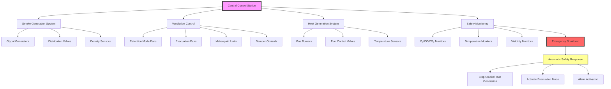

## System Overview

Fire training smoke houses present unique HVAC challenges requiring precise control of smoke density, temperature management during live-fire or simulated conditions, and rapid post-exercise evacuation. The system must balance realistic training conditions with trainee safety through sophisticated smoke generation, ventilation control, and air quality monitoring.

The fundamental design requirement centers on controlling smoke environment parameters while maintaining trainee survivability. Unlike standard building HVAC systems that eliminate smoke, training facility systems must generate, contain, control, and then rapidly evacuate smoke on demand.

## Smoke Generation Systems

### Theatrical Smoke Generators

Modern training facilities employ theatrical smoke generators producing dense, non-toxic smoke for search and rescue training exercises.

**Glycol-Based Generators**: Primary method for training smoke production:
- Heated vaporization of propylene glycol or glycerin-water mixtures
- Output capacity 3,000-20,000 ft³/min of dense white smoke
- Adjustable output rate for variable density control
- Non-toxic formulation safe for extended trainee exposure
- Operating temperature 350-450°F at vaporizer element

**Distribution System Design**:
- Multiple injection points throughout training structure
- 2-4 inch diameter smoke delivery piping from generators
- Zone control allows selective smoke deployment by room or floor
- Automated control systems maintain target visibility ranges
- Smoke density sensors provide feedback for generation rate

**Visibility Control Calculation**:

The smoke optical density required for specific visibility distance:

$$OD = \log_{10}\left(\frac{100}{V_d}\right) \times \frac{L}{3.28}$$

Where:
- $OD$ = Optical density (extinction coefficient, m⁻¹)
- $V_d$ = Desired visibility distance (feet)
- $L$ = Path length through smoke (meters)

Typical training targets: 3-6 feet visibility for search operations, 0-3 feet for zero-visibility exercises.

**Generator Capacity Sizing**:

Required smoke generation rate depends on facility volume and infiltration:

$$Q_{smoke} = \frac{V \times ACH}{60} + Q_{leak}$$

Where:
- $Q_{smoke}$ = Smoke generation rate (CFM smoke output)
- $V$ = Training facility volume (ft³)
- $ACH$ = Air changes per hour required to maintain density (typical 0.5-2 ACH)
- $Q_{leak}$ = Infiltration and door opening losses (CFM)

### Heat Smoke Generators

Advanced training facilities incorporate controlled heat sources producing thermal layering and realistic fire conditions.

**Gas-Fired Heat Generators**:
- Natural gas or propane burners producing heat and combustion products
- Output 50,000-500,000 BTU/hr per unit
- Elevated ceiling temperature 200-400°F creating thermal stratification
- Automated fuel control maintains target ceiling temperatures
- Requires continuous monitoring and safety interlocks

**Safety Systems for Heat Generators**:
- Continuous ceiling temperature monitoring with high-limit shutdown
- Oxygen level monitoring (shutdown below 19.5% O₂)
- Carbon monoxide monitoring (alarm at 100 ppm, shutdown at 200 ppm)
- Manual emergency shutdown stations at all exit points
- Automatic fuel shutoff on loss of ventilation

## Ventilation and Smoke Control

### Normal Training Mode Ventilation

During active training exercises, ventilation systems operate in smoke retention mode maintaining controlled environment.

**Minimum Ventilation Requirements**:

| Training Mode | Ventilation Rate | Purpose |
|---------------|------------------|---------|
| Smoke Retention | 0.5-1 ACH | Replace oxygen consumed by personnel |
| Pre-Exercise Purge | 6-10 ACH | Clear residual smoke before start |
| Post-Exercise Evacuation | 12-20 ACH | Rapid smoke removal |
| Standby Mode | 2-4 ACH | Background ventilation |

**Makeup Air Design**:
- Low-level introduction (12-18 inches above floor)
- Tempered outdoor air 55-70°F to prevent thermal discomfort
- Capacity 50-100% of exhaust rate during retention mode
- Increased to 100% during evacuation mode
- Individual zone control for multi-room facilities

**Smoke Retention Exhaust**:
- High-level exhaust points at ceiling (preserves thermal layer)
- Variable speed fans maintain slight negative pressure
- Exhaust rate balances oxygen supply against smoke loss
- Pressure differential -2 to -5 Pa relative to exterior prevents uncontrolled leakage

### Post-Exercise Smoke Evacuation

Rapid smoke removal between training evolutions requires high-capacity exhaust with outdoor air replacement.

**Evacuation Fan Sizing**:

$$Q_{evac} = \frac{V \times ACH_{evac}}{60} \times SF$$

Where:
- $Q_{evac}$ = Evacuation exhaust capacity (CFM)
- $V$ = Facility volume (ft³)
- $ACH_{evac}$ = Evacuation air changes (12-20 ACH typical)
- $SF$ = Safety factor (1.15-1.25 for duct losses)

For a 10,000 ft³ training building with 15 ACH evacuation:
$$Q_{evac} = \frac{10,000 \times 15}{60} \times 1.2 = 3,000 \text{ CFM}$$

**Exhaust System Configuration**:
- Dedicated evacuation fans separate from retention mode exhaust
- High and low exhaust points for complete smoke removal
- Ceiling-level exhausts remove hot upper layer first
- Floor-level exhausts complete evacuation removing cool smoke
- Automated sequencing: ceiling fans first, floor fans after temperature drop

**Makeup Air for Evacuation**:
- Powered makeup air units match evacuation exhaust rate
- Outdoor air introduction through multiple low-level points
- Cross-ventilation pattern sweeps smoke toward exhaust points
- Heated makeup air prevents thermal shock (minimum 50°F supply)

## Heat Management Systems

### Temperature Control During Exercises

Live-fire and heat training exercises generate substantial thermal loads requiring management for trainee safety and building protection.

**Ceiling Temperature Limits**:
- Training exercises: 300-400°F maximum ceiling temperature
- Flashover training (advanced): 600-800°F controlled conditions
- Structural protection: 250°F maximum sustained wall temperature
- Floor level: 120°F maximum for trainee safety

**Active Cooling Strategies**:

**Thermal Dilution**: Controlled outdoor air introduction reduces peak temperatures:
- Variable speed makeup air fans increase flow during high heat
- Cool air introduced below neutral plane (typically 4-6 feet above floor)
- Flow rate adjustment based on ceiling thermocouple readings
- Balances cooling requirement against smoke retention

**Water Mist Cooling**: Advanced systems for extreme heat control:
- Fine water mist nozzles (100-200 micron droplets) at ceiling level
- Evaporative cooling absorbs heat without excessive wetting
- Automated activation at preset ceiling temperatures
- Pulse operation minimizes water application and drainage

### Building Thermal Protection

**Insulated Construction**:
- Interior walls: ceramic fiber blanket 1-2 inches thick (R-8 to R-16)
- Ceiling: suspended ceramic board or blanket system (R-10 to R-20)
- Floor: concrete slab with optional refractory coating for extreme heat
- Exterior walls: standard insulation plus interior thermal barrier

**Thermal Mass Management**:
- Concrete and masonry structure absorbs heat during exercise
- Post-exercise ventilation includes extended cooling period
- Minimum 30-60 minute recovery between high-heat evolutions
- Temperature monitoring confirms return to safe baseline

## Visibility Control Requirements

### Optical Density Monitoring

Precise smoke density control ensures consistent training conditions and prevents dangerous over-smoking.

**Visibility Measurement Systems**:
- Optical beam transmissometers measure light transmission through smoke
- Beam path 10-50 feet depending on facility size
- Multiple measurement locations for spatial density mapping
- Real-time feedback to smoke generation control system

**Target Visibility Ranges**:

| Training Objective | Visibility Distance | Optical Density | Smoke Concentration |
|--------------------|---------------------|-----------------|---------------------|
| Light Smoke | 15-30 feet | 0.05-0.1 m⁻¹ | Initial search conditions |
| Moderate Smoke | 6-15 feet | 0.1-0.3 m⁻¹ | Standard search and rescue |
| Heavy Smoke | 3-6 feet | 0.3-0.5 m⁻¹ | Advanced search operations |
| Zero Visibility | 0-3 feet | 0.5-1.0 m⁻¹ | Extreme conditions training |

**Automated Density Control**:
- PLC-based control system maintains target optical density
- Feedback loop adjusts smoke generation rate every 10-30 seconds
- Zone-specific control allows varying conditions by room
- Safety limits prevent excessive density (maximum 1.2 m⁻¹ typical)

### Stratification Management

Thermal stratification control maintains realistic fire conditions with clear lower layer and smoke-filled upper layer.

**Neutral Plane Control**:
- Target neutral plane height 4-6 feet above floor (crawl space below)
- Temperature differential 50-100°F between ceiling and floor maintains stratification
- Makeup air velocity <50 FPM prevents layer disruption
- Exhaust solely from upper layer preserves interface

## Air Quality Monitoring

### Continuous Safety Monitoring

Comprehensive gas monitoring protects trainees during exercises with immediate alerts for dangerous conditions.

**Required Monitoring Parameters**:

| Parameter | Normal Range | Alert Level | Shutdown Level | Sensor Type |
|-----------|--------------|-------------|----------------|-------------|
| Oxygen (O₂) | 20.9% | <19.5% | <19.0% | Electrochemical |
| Carbon Monoxide (CO) | 0-50 ppm | 100 ppm | 200 ppm | Electrochemical |
| Carbon Dioxide (CO₂) | 400-1,000 ppm | 5,000 ppm | 10,000 ppm | NDIR |
| Temperature (breathing zone) | 60-100°F | 120°F | 140°F | Thermocouple |
| Temperature (ceiling) | 100-300°F | 400°F | 500°F | Thermocouple |

**Sensor Placement**:
- Breathing zone sensors at 4-6 feet above floor (trainee height when crawling)
- Multiple locations throughout facility (minimum 1 per 500 ft²)
- Ceiling temperature sensors every 10-15 feet
- Exhaust duct sensors monitor discharge air quality
- Control room display shows all parameters in real time

**Response Actions**:
- Alert level: Audible and visual alarm, instructor notification
- Shutdown level: Automatic smoke generation stop, evacuation mode activation, trainee evacuation signal
- Manual override capability at control station
- Event logging for post-exercise review

### Personnel Protection

**Respiratory Protection**:
- All trainees wear SCBA (self-contained breathing apparatus) during smoke exercises
- Air supply independent of facility atmosphere
- Minimum 30-minute rated SCBA capacity
- Buddy system and accountability tracking mandatory

**Emergency Egress**:
- Illuminated exit signs visible through smoke
- Multiple exit paths from all training areas
- Emergency evacuation signal (horn, strobe) activated on shutdown
- Doors unlock automatically on alarm

## System Control and Integration

### Control System Architecture

### Operating Modes

**Pre-Exercise Setup** (5-10 minutes):
1. Verify all safety systems operational
2. Set target smoke density and temperature parameters
3. Activate retention mode ventilation (0.5-1 ACH)
4. Begin smoke generation to target density
5. Activate heat generators if thermal training
6. Confirm visibility and air quality within parameters

**Training Exercise** (15-30 minutes typical):
1. Maintain smoke density via automated control
2. Continuous safety monitoring with 10-second updates
3. Instructor override capability for density adjustment
4. Retention mode ventilation preserves conditions
5. Makeup air provides minimum oxygen replenishment

**Post-Exercise Evacuation** (5-15 minutes):
1. Stop smoke and heat generation immediately
2. Switch to evacuation mode ventilation (12-20 ACH)
3. Activate all exhaust fans and makeup air units
4. Monitor temperature drop and smoke clearance
5. Confirm air quality return to normal before re-entry

**Standby Mode**:
1. Background ventilation maintains air quality (2-4 ACH)
2. All safety sensors remain active
3. Facility ready for next evolution setup
4. Temperature normalized to ambient conditions

## Design Considerations

**Facility Sizing**: Training evolution capacity determines required volume:
- Single-room trainer: 1,000-3,000 ft³
- Multi-room residential simulator: 5,000-15,000 ft³
- Multi-story commercial trainer: 20,000-50,000 ft³
- Larger volume requires proportionally greater smoke generation and evacuation capacity

**Construction Materials**:
- Non-combustible or limited-combustible construction throughout
- Thermal barriers protect structural elements
- Sealed construction prevents uncontrolled smoke leakage
- Windows and doors rated for thermal exposure and pressure differential

**Accessibility for Maintenance**:
- Smoke generators require weekly cleaning (glycol residue removal)
- Gas burners need quarterly inspection and annual certification
- Sensor calibration every 6-12 months depending on type
- Exhaust fan access for bearing lubrication and belt inspection

**Code Compliance**:
- NFPA 1403: Standard on Live Fire Training Evolutions
- NFPA 1402: Guide to Building Fire Service Training Centers
- IMC exhaust and ventilation requirements
- Local fire marshal approval for live-fire operations

Fire training smoke houses demand specialized HVAC systems balancing realistic training conditions with absolute safety requirements. Proper integration of smoke generation, ventilation control, heat management, and comprehensive monitoring creates effective training environments preparing firefighters for real-world conditions while protecting their health and safety.
