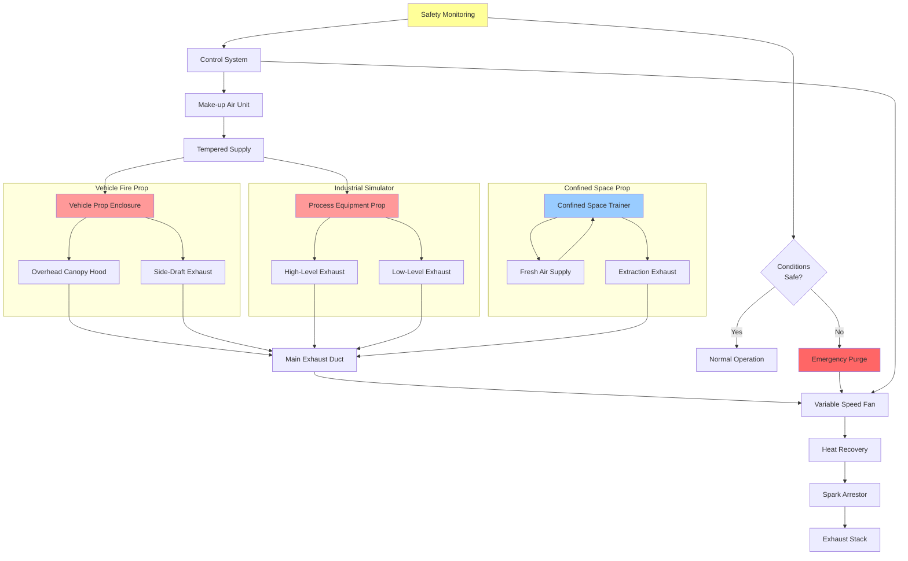

Fire training props and simulators require specialized HVAC systems to manage intense heat loads, coordinate with smoke effects, ensure trainee safety, and provide realistic scenarios while maintaining indoor air quality. These systems must balance training effectiveness with ventilation performance.

## Vehicle Fire Prop Ventilation

Vehicle fire training props generate substantial heat and combustion products requiring dedicated exhaust systems.

**Exhaust Requirements:**

Vehicle props demand high-capacity ventilation:

$$Q_{veh} = V_{prop} \times ACH + Q_{fire}$$

where $V_{prop}$ is prop enclosure volume (ft³), $ACH$ is air changes per hour (15-20 minimum), and $Q_{fire}$ is heat release rate contribution (typically 500-2000 cfm per vehicle).

**System Design Features:**

- Overhead canopy hoods with minimum 150 fpm capture velocity
- Side-draft exhaust for horizontal smoke layer capture
- Variable speed fans to accommodate different fire intensities
- Heat-resistant ductwork rated for 1000°F continuous exposure
- Spark arrestors and flame traps in exhaust paths
- Emergency purge capacity of 30+ ACH
- Separate make-up air systems to prevent backdrafting

**Temperature Control:**

Post-exercise cooling requires:

$$t_{cool} = \frac{m_{prop} \times c_p \times \Delta T}{Q_{cool}}$$

where $m_{prop}$ is prop mass, $c_p$ is specific heat, $\Delta T$ is temperature reduction, and $Q_{cool}$ is cooling air capacity. Typical cooling periods range from 15-45 minutes.

## Industrial Scenario Simulator HVAC

Industrial fire simulators replicate process equipment, storage tanks, and chemical scenarios with complex ventilation needs.

**Ventilation Strategies:**

Multi-zone exhaust systems address:

- High-level smoke removal (ceiling-mounted exhausts)
- Low-level vapor collection (floor-level pickups)
- Perimeter ventilation for trainee safety zones
- Dedicated exhausts for flammable vapor props
- Explosion-proof equipment in classified areas

**Heat Load Management:**

Industrial props generate heat loads of 200,000-1,000,000 BTU/hr requiring:

$$Q_{exhaust} = \frac{q_{sensible}}{1.08 \times \Delta T}$$

where $q_{sensible}$ is sensible heat gain (BTU/hr) and $\Delta T$ is temperature rise (typically 100-200°F).

## Rescue Scenario Ventilation Needs

Confined space, structural collapse, and vehicle extrication props require breathable air for participants.

**Ventilation Criteria:**

- Minimum 30 cfm per trainee in confined space props
- CO monitoring with automatic ventilation increase at 35 ppm
- Oxygen level maintenance above 19.5% by volume
- Particulate filtration of make-up air (MERV 13 minimum)
- Emergency fresh air injection systems
- Positive pressure in instructor observation areas

**Pressure Relationships:**

Confined space props maintain:

$$\Delta P = P_{ambient} - P_{prop} = -0.02 \text{ to } -0.05 \text{ in. w.c.}$$

This slight negative pressure contains contaminants while allowing safe entry/egress.

## Portable Prop Considerations

Mobile training props present unique HVAC challenges requiring flexible solutions.

**Design Approaches:**

- Self-contained exhaust fans with flexible ductwork
- Temporary make-up air units with distribution ducting
- Quick-disconnect ventilation couplings
- Portable gas detection and monitoring systems
- Battery-powered or generator-supplied equipment
- Weatherproof controls and wiring

**Capacity Calculations:**

Portable props require:

$$cfm_{portable} = V_{prop} \times 20 \text{ ACH} \times 1.2$$

The 1.2 factor accounts for leakage and incomplete capture in temporary installations.

## Heat and Smoke Effects Integration

Coordinating ventilation with training effects requires sophisticated control.

**System Coordination:**

- Staged ventilation activation (delayed to allow smoke accumulation)
- Variable exhaust rates synchronized with fire intensity
- Smoke generator integration with air movement patterns
- Thermal imaging compatibility (minimal temperature stratification disruption)
- Programmable ventilation sequences for scenario realism

**Smoke Management:**

Theatrical smoke systems require:

- 5-10 ACH during smoke generation (reduced ventilation)
- 15-30 ACH for clearing operations
- Separate exhausts for toxic combustion products vs. theatrical smoke
- Air curtains at prop exits to contain effects

## Safety Monitoring Systems

Integrated monitoring ensures trainee protection during realistic scenarios.

**Monitoring Requirements:**

| Parameter | Alarm Threshold | Action Level |
|-----------|----------------|--------------|
| CO Concentration | 35 ppm (8-hr TWA) | 50 ppm (immediate ventilation increase) |
| Temperature | 300°F | 400°F (exercise termination) |
| Oxygen Level | 19.5% | 19.0% (emergency ventilation) |
| Visibility | 10 ft | 5 ft (scenario modification) |
| Heat Flux | 5 kW/m² | 10 kW/m² (safety intervention) |

**Automated Responses:**

- Instant ventilation override for dangerous conditions
- Audible/visual alarms with prop shutdown
- Data logging for post-exercise analysis
- Integration with building fire alarm systems

## Training Prop Ventilation System

## Prop Types and HVAC Requirements

| Prop Type | Exhaust Rate | Make-up Air | Special Requirements |
|-----------|--------------|-------------|---------------------|
| Car Fire | 8,000-12,000 cfm | 7,000-11,000 cfm | High-temp ductwork, spark arrestor |
| Aircraft Fire | 15,000-25,000 cfm | 14,000-23,000 cfm | Explosion-proof fans, foam suppression coordination |
| Kitchen Fire | 3,000-5,000 cfm | 2,500-4,500 cfm | Grease duct cleaning, ansul system integration |
| Industrial Tank | 10,000-20,000 cfm | 9,000-18,000 cfm | Vapor detection, classified wiring |
| Confined Space | 1,500-3,000 cfm | 2,000-3,500 cfm | Positive pressure supply, oxygen monitoring |
| Structural Collapse | 2,000-4,000 cfm | 1,800-3,600 cfm | Dust collection, HEPA filtration |
| Hazmat Scenario | 5,000-10,000 cfm | 4,500-9,000 cfm | Chemical resistant materials, scrubbers |
| Wildland Fire | 6,000-15,000 cfm | 5,500-14,000 cfm | Outdoor/indoor transition, weather protection |

**Design Considerations:**

Training prop HVAC systems must provide:

- Rapid heat removal to enable consecutive training evolutions
- Flexible control for varied scenario intensity
- Redundant safety monitoring with automatic overrides
- Minimal interference with training realism
- Energy recovery where practical (tempered make-up air)
- Compliance with NFPA 1402 (Training Facilities Standard)

Proper ventilation design allows fire academies to conduct intensive, realistic training while protecting participants and maintaining facility integrity. System capacity must accommodate peak loads while providing economical operation during routine use.
