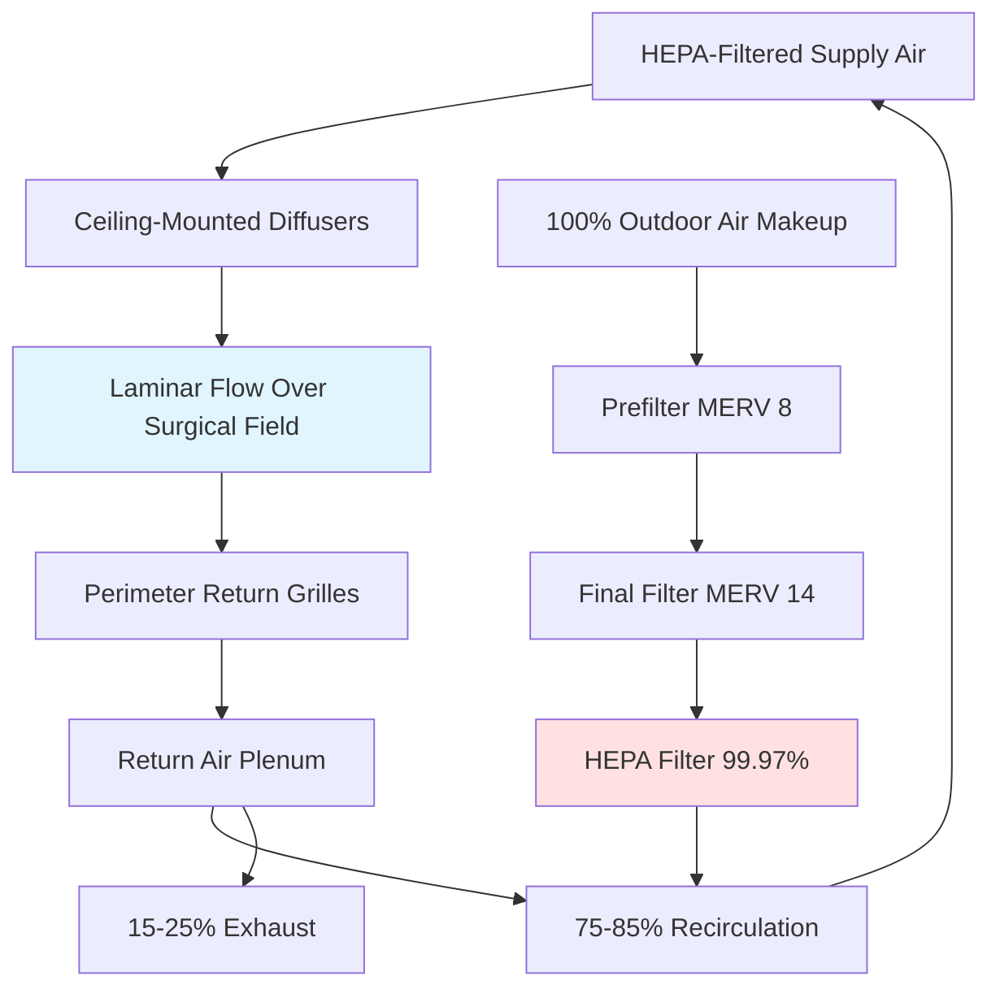

# HVAC Systems for Healthcare Facilities

Healthcare facility HVAC systems serve critical life-safety functions beyond occupant comfort. Proper design prevents airborne disease transmission, maintains sterile environments for surgical procedures, controls pharmaceutical compounding conditions, and ensures patient recovery environments. ASHRAE Standard 170 and the Facility Guidelines Institute (FGI) Guidelines establish mandatory pressure relationships, ventilation rates, filtration requirements, temperature limits, and humidity ranges for medical spaces.

## Pressure Relationships and Airflow Patterns

Pressure differentials between spaces control airborne contaminant migration. Positive pressure spaces protect occupants from external contamination, while negative pressure spaces contain infectious agents or hazardous materials.

### Pressure Cascade Design

The fundamental principle governing healthcare pressure relationships:

$$\Delta P = \frac{Q \cdot \rho}{2 \cdot C_d \cdot A} \times \frac{1}{3600^2}$$

Where:
- ΔP = pressure differential (in. w.g.)
- Q = airflow differential between spaces (cfm)
- ρ = air density (lb/ft³)
- C_d = discharge coefficient (typically 0.6-0.65 for door undercuts)
- A = leakage area (ft²)

Practical design targets minimum 0.01 in. w.g. (2.5 Pa) differential under door-closed conditions, increasing to 0.03-0.05 in. w.g. for critical spaces. This requires approximately 75-125 cfm differential through typical door undercuts.

### Space Pressure Requirements

| Space Type | Pressure Relationship | Minimum Differential (in. w.g.) | Air Changes per Hour | Outdoor Air Changes per Hour |
|------------|---------------------|-------------------------------|---------------------|----------------------------|
| Operating Rooms | Positive to corridor | +0.01 | 20 | 4 |
| Protective Environment (PE) | Positive to anteroom | +0.01 | 12 | 2 |
| Airborne Infection Isolation (AII) | Negative to corridor | -0.01 | 12 | 2 |
| Bronchoscopy | Negative to corridor | -0.01 | 12 | 2 |
| Pharmacy Compounding (USP 797) | Positive to adjacent | +0.02-0.05 | 30+ | Variable |
| Laboratory - Biological Safety | Negative to corridor | -0.01 | 6-12 | 2 |
| Soiled Holding Room | Negative to corridor | -0.01 | 10 | 2 |
| Clean Workroom | Positive to corridor | +0.01 | 4 | 2 |

**Anteroom Function:**

Anteroom spaces provide pressure transitions and contamination control barriers. Three configurations exist:

1. **Positive Anteroom** (AII suite): Positive to corridor, positive to isolation room. Allows PPE donning without contamination exposure.
2. **Negative Anteroom** (PE suite): Negative to corridor, negative to protective environment. Contains contamination during entry.
3. **Neutral Anteroom** (dual function): Can switch modes to support either AII or PE depending on patient needs.

## Operating Room HVAC Design

Operating rooms demand the highest level of environmental control to minimize surgical site infection (SSI) risk. Temperature, humidity, air velocity patterns, and particulate concentration directly affect patient outcomes.

### Airflow Distribution

### Operating Room Specifications

**Critical Parameters:**

| Parameter | Requirement | Tolerance | Measurement Location |
|-----------|------------|-----------|---------------------|
| Temperature | 68-75°F (adjustable) | ±2°F | 4 feet above floor |
| Relative Humidity | 20-60% | ±5% | Room average |
| Air Changes | 20 ACH minimum | +10% / -0% | Total supply |
| Outdoor Air | 4 ACH minimum | +10% / -0% | Dedicated OA |
| Pressure | +0.01 in. w.g. min | ±0.005 | To corridor |
| Filtration | HEPA terminal filters | 99.97% @ 0.3 μm | Supply air |
| Particulate Count | ISO Class 7 (at rest) | Per ISO 14644 | Surgical field |

**Temperature Control Rationale:**

Lower temperatures (68-70°F) reduce surgical team heat stress during long procedures while minimizing bacterial growth rates. The relationship between temperature and bacterial doubling time:

$$t_d = \frac{\ln(2)}{k \cdot e^{-E_a/(R \cdot T)}}$$

Where bacterial generation time increases exponentially as temperature decreases below optimal growth range (98-100°F).

**Humidity Control:**

Maintaining 20-60% RH balances infection control with electrostatic discharge prevention. Below 20% RH, static electricity endangers electronics and creates spark risk near flammable anesthetics. Above 60% RH, bacterial and fungal proliferation accelerates. Dedicated outdoor air systems with desiccant dehumidification provide superior humidity control compared to conventional cooling-based dehumidification.

### Laminar Flow vs. Turbulent Mixing

**Laminar (Unidirectional) Flow:**
- Supply air velocity: 25-35 fpm downward
- Coverage area: Minimum 8 × 8 feet over surgical table
- Particulate dilution factor: 100-1000× greater than turbulent
- Applications: Orthopedic joint replacement, cardiovascular, neurosurgery
- Cost premium: 40-60% over turbulent systems

**Turbulent Mixing (Conventional):**
- Supply air velocity: 25-50 fpm at diffuser face
- Distribution: Perimeter or multiple ceiling diffusers
- Mixing effectiveness: Relies on air change dilution
- Applications: General surgery, obstetrics, endoscopy
- Cost: Standard healthcare construction

Laminar flow systems demonstrate 20-50% reduction in deep surgical site infections for orthopedic implant procedures. Cost-benefit analysis justifies implementation for high-risk procedures where infection consequences are severe.

## Airborne Infection Isolation Rooms

Airborne infection isolation (AII) rooms contain patients with suspected or confirmed airborne infectious diseases including tuberculosis, measles, varicella, and emerging respiratory pathogens.

### AII Room Requirements

**Ventilation Performance:**

$$ACH = \frac{Q}{V} \times 60$$

Where:
- ACH = air changes per hour
- Q = total supply airflow (cfm)
- V = room volume (ft³)

Minimum 12 ACH total supply with minimum 2 ACH outdoor air. For pathogen removal effectiveness:

$$t_{99\%} = \frac{\ln(100)}{ACH} \times 60 = \frac{276}{ACH} \text{ minutes}$$

A 12 ACH room removes 99% of airborne particles in 23 minutes. Increasing to 15 ACH reduces removal time to 18 minutes.

**Pressure Monitoring:**

Continuous pressure monitoring with visual indicators (manometers or digital displays) outside each AII room provides immediate verification of negative pressure status. Alarm systems must alert staff when pressure differential falls below -0.01 in. w.g.

**Exhaust Air Treatment:**

Three approaches for AII exhaust air handling:

1. **HEPA Filtration Before Exhaust**: 99.97% efficient at 0.3 μm captures M. tuberculosis (1-5 μm). Allows recirculation or safe exhaust.
2. **Direct Exhaust to Atmosphere**: Requires exhaust discharge location analysis to prevent re-entrainment. Minimum 25 feet from air intakes, operable windows, pedestrian areas.
3. **UV Germicidal Irradiation (UVGI)**: 254 nm wavelength provides supplemental disinfection in exhaust ducts. Dose requirements vary by organism.

### Anteroom Design for AII

Anteroom configuration options:

**Type 1: Positive Anteroom (Preferred for Staff Protection)**
- Anteroom positive to both corridor and AII room
- Staff don PPE in clean environment
- Prevents contaminated air escape during door operation
- Requires 10-15% greater supply than AII room exhaust

**Type 2: Negative Anteroom (Maximum Containment)**
- Anteroom negative to corridor, positive to AII room
- Double barrier containment
- Increased energy consumption
- Used for high-consequence pathogens

## Filtration Requirements by Space Type

Healthcare filtration removes particulate matter, microorganisms, and allergens while minimizing pressure drop and energy consumption.

### Filter Efficiency Standards

| Space Category | Filter Bank 1 (Prefilter) | Filter Bank 2 (Final) | Particle Size Target | Efficiency Basis |
|----------------|------------------------|-------------------|---------------------|-----------------|
| Operating Rooms | MERV 14 (85% | HEPA 99.97% | 0.3 μm | Bacteria, spores |
| Protective Environment | MERV 14 | HEPA 99.97% | 0.3 μm | Aspergillus spores |
| ICU, Critical Care | MERV 14 | MERV 14 | 1.0 μm | General bioaerosols |
| Patient Rooms | MERV 8 | MERV 14 | 3.0 μm | Pollen, dander |
| Airborne Isolation | MERV 8 | MERV 14 | 1.0 μm | M. tuberculosis |
| Pharmacies (sterile) | MERV 8 | HEPA 99.97% | 0.3 μm | Particulate contamination |
| Laboratories | MERV 8 | MERV 14 | 1.0 μm | Variable by function |

**Filter Pressure Drop Impact:**

Total system pressure increases with filter loading:

$$\Delta P_{total} = \Delta P_{clean} + \Delta P_{loading}$$

HEPA filters: 0.5-1.0 in. w.g. clean, 1.5-2.0 in. w.g. at replacement
MERV 14 filters: 0.3-0.5 in. w.g. clean, 0.8-1.2 in. w.g. at replacement

Fan energy increases proportionally with pressure drop. Magnehelic gauges or differential pressure transmitters monitor filter loading to trigger replacement before system performance degrades.

## Protective Environment Rooms

Protective environment (PE) rooms house severely immunocompromised patients (bone marrow transplant, chemotherapy, organ transplant recipients) who are extremely vulnerable to environmental fungal infections, particularly Aspergillus species.

### PE Room Design Parameters

**Environmental Specifications:**

- Positive pressure: +0.01 in. w.g. minimum to corridor
- Air changes: 12 ACH minimum
- Outdoor air: 2 ACH minimum
- Filtration: HEPA 99.97% terminal filters on supply
- Temperature: 68-75°F
- Relative humidity: 40-60%
- Sealed room construction: No crevices for fungal growth

**HEPA Filter Installation:**

Terminal HEPA filters must install in the room ceiling or wall to prevent contamination from ductwork particle accumulation. Gel-sealed or knife-edge sealed housings prevent bypass leakage. In-place leak testing per IEST-RP-CC034 verifies filter integrity.

**Water Intrusion Prevention:**

Aspergillus proliferates in wet building materials. PE room design requires:

- Sealed wall and ceiling construction
- No carpet (harbors fungal spores)
- Waterproof surfaces in patient bathrooms
- Continuous building envelope pressure monitoring
- Immediate remediation of any water damage within 24-48 hours

## Humidity Control Strategies

Healthcare humidity control prevents mold growth, controls static electricity, and supports patient comfort. ASHRAE 170 requires 20-60% RH in most spaces, with narrower ranges for specific areas.

### Dehumidification Approaches

**Cooling-Based Dehumidification:**

Traditional cooling coils remove moisture through condensation when air temperature drops below dewpoint. Effectiveness depends on entering air conditions and coil temperature:

$$W_{removed} = 60 \cdot Q \cdot \rho \cdot (w_1 - w_2)$$

Where:
- W = moisture removal rate (lb/hr)
- Q = airflow rate (cfm)
- ρ = air density (lb/ft³)
- w₁, w₂ = humidity ratios entering and leaving (lb_water/lb_dry air)

**Limitations**: Cannot achieve low humidity without overcooling and reheating, wasting energy.

**Desiccant Dehumidification:**

Solid or liquid desiccants absorb moisture chemically without cooling. Regeneration requires heat (140-180°F for solid desiccants). Energy-efficient when regeneration heat sources are available (waste heat recovery, solar thermal, gas-fired burners).

**Dedicated Outdoor Air Systems (DOAS):**

DOAS with energy recovery wheels handle latent loads separately from sensible cooling. Outdoor air dehumidifies to supply dewpoint (typically 50-55°F), then tempers to neutral temperature before delivery to spaces. Parallel sensible cooling systems (chilled beams, radiant panels, fan coils) handle room sensible loads without humidity penalty.

## Special Considerations

### Magnetic Resonance Imaging (MRI) Suites

MRI magnets require dedicated HVAC systems:

- Non-ferromagnetic ductwork and components within magnetic field (typically stainless steel or aluminum)
- Dedicated cooling for magnet cryogenic systems: 10-30 tons depending on field strength
- Emergency quench exhaust: 3000-10,000 cfm capacity to vent helium gas safely to exterior
- Acoustic control: MRI gradient coils generate 100+ dBA noise requiring isolation

### Pharmacy Compounding (USP 797/800)

**Sterile Compounding (USP 797):**

- ISO Class 5 primary engineering controls (laminar flow hoods)
- ISO Class 7 buffer room surrounding hoods
- ISO Class 8 anteroom for garbing
- Positive pressure cascade: Cleanest to least clean
- HEPA filtration throughout

**Hazardous Drug Compounding (USP 800):**

- Negative pressure throughout compounding area
- Containment primary engineering controls (externally vented)
- Minimum 12 ACH, 100% exhaust (no recirculation)
- Negative to adjacent areas by -0.02 to -0.03 in. w.g.

### Emergency Power Requirements

Life-safety ventilation systems require emergency power backup:

- Operating rooms: Maintain full environmental conditions
- AII rooms: Maintain exhaust and negative pressure
- PE rooms: Maintain supply and positive pressure
- Critical care areas: Minimum 4 ACH ventilation
- Smoke control systems: Full capacity

Transfer to emergency power must occur within 10 seconds for critical life-safety systems.

## Conclusion

Healthcare facility HVAC systems require rigorous adherence to ASHRAE 170, FGI Guidelines, and applicable codes. Pressure relationships prevent cross-contamination, ventilation rates dilute airborne pathogens, and filtration removes particulates that cause infection. Operating room design balances temperature for surgical team comfort with humidity control and HEPA filtration for infection prevention. Isolation room pressurization contains or protects vulnerable patients depending on medical needs. Successful healthcare HVAC design integrates infection control principles with energy efficiency through technologies including DOAS, energy recovery, and optimized filtration strategies.
