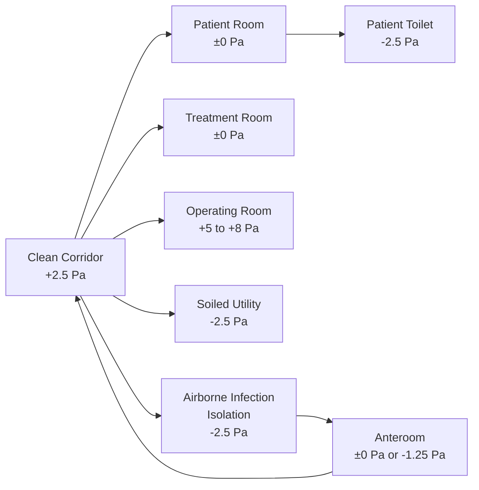
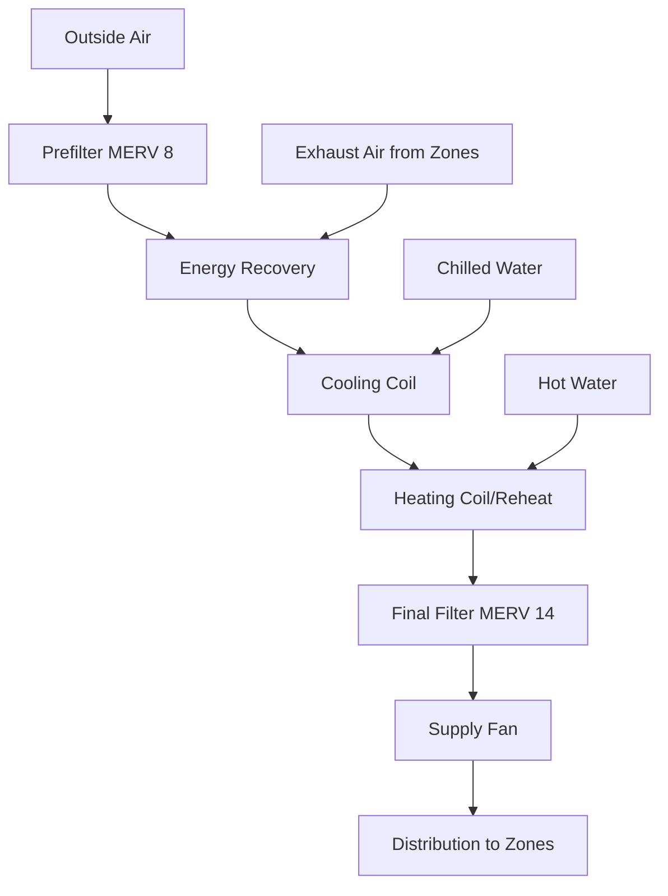

# Hospital HVAC Systems

Hospital HVAC systems function as critical infection control infrastructure, maintaining precise environmental conditions that directly impact patient outcomes, surgical site infection rates, and healthcare worker safety. Unlike conventional buildings, hospital systems must simultaneously address contradictory requirements across diverse spaces: positive pressure operating rooms, negative pressure isolation rooms, stringent particulate control, and continuous operation without shutdown for maintenance. ASHRAE Standard 170 and the Facility Guidelines Institute (FGI) Guidelines for Design and Construction of Hospitals establish minimum performance criteria for pressure relationships, ventilation rates, temperature, humidity, and filtration that form the foundation of healthcare facility design.

## Regulatory Framework and Standards

### Primary Design Standards

Hospital HVAC design must comply with multiple overlapping standards and codes:

**ASHRAE Standard 170**: Ventilation of Health Care Facilities establishes minimum ventilation rates, pressure relationships, temperature ranges, humidity limits, air change requirements, and filtration efficiency for all healthcare spaces. This consensus standard forms the basis for most state and local healthcare codes.

**FGI Guidelines**: The Facility Guidelines Institute publishes comprehensive design and construction guidelines updated every 4 years. These guidelines exceed ASHRAE 170 minimums in many areas and establish requirements for surgical suites, imaging departments, and specialized treatment areas.

**NFPA 99**: Health Care Facilities Code addresses life safety systems including medical gas, electrical systems, and HVAC system reliability requirements.

**CDC Guidelines**: The Centers for Disease Control and Prevention publish infection control guidelines that influence HVAC design, particularly for airborne infection isolation rooms and protective environments.

**State and Local Codes**: Many jurisdictions adopt modified versions of national standards with additional requirements. California's Title 24, New York State DOH regulations, and local health department requirements often impose stricter criteria than national minimums.

### Design Authority Hierarchy

When conflicts arise between standards, the following hierarchy typically applies:

1. Local health department requirements (most stringent)
2. State health codes and regulations
3. FGI Guidelines (if adopted by authority having jurisdiction)
4. ASHRAE Standard 170
5. International Mechanical Code (IMC) or Uniform Mechanical Code (UMC)
6. ASHRAE Handbook applications chapters (design guidance)

## Pressure Relationships and Airflow Patterns

### Pressure Cascade Strategy

Hospital pressure relationships prevent cross-contamination between spaces by controlling airflow direction. Air flows from clean spaces toward contaminated spaces, from higher pressure to lower pressure zones.

**Pressure hierarchy for typical hospital floor:**

**Pressure differential calculation:**

The volumetric imbalance required to maintain pressure differential depends on envelope leakage characteristics:

$$\Delta Q = C_d A \sqrt{\frac{2 \Delta P}{\rho}}$$

Where:
- $\Delta Q$ = Volumetric offset between supply and exhaust (CFM)
- $C_d$ = Discharge coefficient (0.65 typical for door undercuts)
- $A$ = Leakage area (ft²)
- $\Delta P$ = Pressure differential (in w.c.)
- $\rho$ = Air density (0.075 lb/ft³)

**Simplified design criteria:**

For standard hospital construction with door undercuts and typical envelope tightness, the following offsets maintain specified pressure differentials:

| Pressure Differential | Approximate Airflow Offset |
|----------------------|---------------------------|
| ±2.5 Pa | 75-125 CFM per door |
| +5 Pa | 150-200 CFM per door |
| -2.5 Pa | 75-125 CFM per door |
| +8 Pa | 200-250 CFM per door |

### Critical Space Pressure Requirements

**Positive pressure spaces (prevent contamination entry):**

- Operating rooms: +5 Pa minimum, +8 Pa preferred relative to corridor
- Delivery rooms: +5 Pa minimum
- Cardiac catheterization labs: +5 Pa minimum
- Protective environment (PE) rooms: +2.5 Pa minimum
- Sterile processing (clean areas): +2.5 Pa minimum
- Pharmacy compounding (clean rooms): +5 Pa minimum

**Negative pressure spaces (contain contamination):**

- Airborne infection isolation (AII) rooms: -2.5 Pa minimum
- Bronchoscopy procedure rooms: -2.5 Pa minimum
- Autopsy rooms: -5 Pa minimum
- Soiled utility rooms: -2.5 Pa minimum
- Decontamination rooms: -5 Pa minimum
- Isolation anteroom: -1.25 Pa relative to corridor (option 1) or ±0 Pa (option 2)

**Neutral pressure spaces:**

- General patient rooms: Slightly positive recommended (+1.25 Pa)
- Exam rooms: Neutral acceptable
- Corridors: Positive relative to exterior, neutral relative to protected spaces

### Pressure Monitoring and Alarms

ASHRAE 170 requires continuous pressure monitoring for:
- All airborne infection isolation rooms
- All protective environment rooms
- All operating rooms and procedure rooms

**Alarm conditions:**
- Visual and audible indication when pressure falls below minimum
- Delay before alarm (30-60 seconds) to prevent nuisance alarms during door openings
- Remote annunciation to facilities management and infection control
- Historical trending for commissioning validation

**Monitoring device placement:**
- Reference pressure port in corridor at mid-height
- Room pressure port in patient/surgical space at mid-height
- Avoid placement near supply diffusers or exhaust grilles (minimum 3 ft separation)
- Protected from damage and tampering

## Ventilation Rates and Air Changes

### Minimum Outside Air Requirements

ASHRAE 170 Table 7-1 specifies minimum outside air requirements for healthcare spaces. Unlike commercial buildings using ASHRAE 62.1 (which bases ventilation on occupancy and area), healthcare facilities use air change rates:

$$Q_{OA} = \frac{ACH_{OA} \times V_{room}}{60}$$

Where:
- $Q_{OA}$ = Required outside air (CFM)
- $ACH_{OA}$ = Outside air changes per hour
- $V_{room}$ = Room volume (ft³)

### Air Change Rates by Space Type

| Space Type | Total Air Changes per Hour | Minimum Outside Air Changes | Pressure Relationship | Notes |
|------------|---------------------------|---------------------------|---------------------|-------|
| Operating room | 20 minimum, 25 recommended | 4 | Positive | Class B/C surgical spaces |
| Protective environment | 12 | 2 | Positive | Immunocompromised patients |
| Airborne infection isolation | 12 | 2 | Negative | TB, measles, COVID-19 |
| Patient room | 6 | 2 | Neutral/positive | General med-surg |
| Patient corridor | 4 | 2 | Positive to exterior | — |
| Intensive care unit | 6 | 2 | Neutral/positive | Similar to patient room |
| Emergency department | 12 | 2 | Negative preferred | High infection risk |
| Bronchoscopy | 12 | 2 | Negative | Aerosol-generating |
| Autopsy | 12 | 3 | Negative | Infection control |
| Pharmacy compounding | 12 | 4 | Positive | USP 797/800 requirements |
| Radiology (CT/MRI) | 6 | 2 | Neutral | Equipment heat loads |
| Soiled utility | 10 | 2 | Negative | Waste handling |
| Sterile processing (clean) | 10 | 4 | Positive | ISO 7 recommended |

**Total airflow calculation:**

The total supply air must be the greater of:
1. Total air changes required (from table)
2. Cooling load requirement
3. Heating load requirement
4. Outside air requirement + recirculation minimum

$$Q_{total} = \max\left(\frac{ACH \times V}{60}, \frac{Q_c}{1.08 \times \Delta T}, ACH_{OA} \times \frac{V}{60}\right)$$

**Recirculation within room:**

ASHRAE 170 permits recirculation within the same room for most spaces (exceptions include airborne infection isolation rooms, soiled utilities, and certain procedure rooms). However, no air may be recirculated from one patient room to another or from patient areas to public corridors.

## Temperature and Humidity Requirements

### Temperature Control Criteria

ASHRAE 170 specifies narrow temperature ranges for patient comfort and infection control. Operating room temperature directly affects surgical site infection rates and anesthetic requirements.

**Temperature ranges by space:**

| Space Type | Temperature Range (°F) | Control Tolerance | Justification |
|------------|----------------------|------------------|---------------|
| Operating room | 68-73 (adjustable) | ±2°F | Surgeon comfort, infection control |
| Delivery room | 68-73 | ±2°F | Newborn thermoregulation |
| Patient room | 70-75 | ±3°F | Patient comfort |
| Nursery | 72-78 | ±2°F | Infant thermoregulation |
| Intensive care | 70-75 | ±2°F | Patient monitoring |
| MRI suite | 68-73 | ±2°F | Equipment heat load management |
| Pharmacy compounding | 68-73 | ±2°F | Medication stability |

**Design considerations:**

Operating rooms require individual temperature control with override capability. Surgical teams prefer different temperatures: orthopedic surgery often 65-68°F, while pediatric surgery requires 72-75°F. Thermostat location must be outside the sterile field but accessible to the surgical team.

### Humidity Control Requirements

Humidity control in healthcare facilities serves multiple functions: infection control (bacteria and virus transmission), static electricity control (in operating rooms with flammable anesthetics, historically), medication stability, and patient comfort.

**Humidity ranges:**

| Space Type | Relative Humidity Range | Dewpoint Control Alternative | Critical Factor |
|------------|------------------------|----------------------------|-----------------|
| Operating room | 20-60% RH | — | Infection control, static |
| Delivery room | 20-60% RH | — | Infection control |
| Protective environment | 40-60% RH | — | Aspergillus suppression |
| Patient room | Maximum 60% RH | — | Mold prevention |
| Nursery | 30-60% RH | — | Infant comfort |
| Sterile processing | 30-60% RH | — | Instrument drying |
| Pharmacy compounding | 30-60% RH | Maximum 58°F DP | USP 797 requirement |

**Humidity control energy impact:**

Maintaining humidity control, particularly minimum RH in winter, represents a significant energy penalty. Humidification energy for a 400-bed hospital in cold climates can exceed 500,000 kWh annually.

$$Q_{humidification} = \frac{CFM \times \rho \times \Delta W \times h_{fg}}{\eta}$$

Where:
- $Q_{humidification}$ = Humidification energy (Btu/hr)
- $CFM$ = Outdoor air volume
- $\rho$ = Air density (0.075 lb/ft³)
- $\Delta W$ = Humidity ratio increase (lb water/lb dry air)
- $h_{fg}$ = Latent heat of vaporization (1050 Btu/lb)
- $\eta$ = Humidifier efficiency

**Dehumidification challenges:**

Summer dehumidification in humid climates requires aggressive cooling to condense moisture, followed by reheat to maintain space temperature. Dedicated outdoor air systems (DOAS) with energy recovery provide superior humidity control compared to conventional VAV systems.

## Filtration Requirements

### Filter Efficiency Standards

ASHRAE 170 and FGI Guidelines specify minimum filter efficiency using MERV (Minimum Efficiency Reporting Value) ratings per ASHRAE Standard 52.2.

**Filtration requirements by location:**

| Location | Prefilter MERV | Final Filter MERV | HEPA Requirement | Justification |
|----------|---------------|------------------|------------------|---------------|
| All outdoor air intakes | MERV 7 minimum | — | No | Protect downstream equipment |
| General air handlers (patient areas) | MERV 7-8 | MERV 14 minimum | No | General infection control |
| Operating room supply | MERV 7-8 | MERV 14 minimum | HEPA recommended | Surgical site infection prevention |
| Protective environment | MERV 7-8 | MERV 17 (99.97% HEPA) | Yes | Aspergillus protection |
| Pharmacy compounding | MERV 7-8 | MERV 17 (HEPA) | Yes | USP 797 requirement |
| AII room exhaust | — | HEPA (optional) | No (unless pathogens require) | Contains airborne pathogens |
| Sterile processing supply | MERV 7-8 | MERV 14 minimum | No | Clean instrument storage |

**Filter pressure drop impact:**

HEPA filters impose significant pressure drop (1.0-2.0 in w.c. clean, 2.5-4.0 in w.c. at replacement). Fan static pressure must account for full filter loading:

$$\Delta P_{system} = \Delta P_{ductwork} + \Delta P_{coils} + \Delta P_{filters,dirty} + \Delta P_{terminal}$$

**Filter replacement strategy:**

- Prefilters: Replace when pressure drop reaches 0.5 in w.c.
- Final filters (MERV 14): Replace when pressure drop reaches 1.0-1.5 in w.c.
- HEPA filters: Replace when pressure drop reaches 2.5 in w.c. or annually (whichever first)
- Maintain filter change records for infection control audit trail

### Operating Room Filtration and Airflow Patterns

Operating rooms require special consideration for air distribution and filtration to minimize particulate concentration at the surgical site.

**Laminar flow versus turbulent mixing:**

Traditional turbulent mixing systems deliver HEPA-filtered air through ceiling diffusers at low velocity (< 75 FPM), achieving 20-25 air changes per hour. Room air mixes thoroughly, diluting particulate concentration.

Unidirectional (laminar) flow systems use large HEPA filter arrays (8 ft × 10 ft typical) directly over the surgical table, delivering air at 25-50 FPM vertical velocity. Laminar flow creates a clean air curtain that sweeps particles away from the surgical site before mixing with room air. Studies show laminar flow reduces surgical site infection rates in orthopedic implant surgery.

**Comparison of OR ventilation strategies:**

| Parameter | Turbulent Mixing (Standard) | Unidirectional Laminar Flow |
|-----------|----------------------------|----------------------------|
| Supply configuration | 2×2 or 2×4 diffusers, distributed | 8×10 ft HEPA array, centered over table |
| Supply velocity | < 75 FPM at diffuser | 25-50 FPM vertical |
| Air changes per hour | 20-25 | 40-60 (within clean zone) |
| Particle count (0.5 μm) | < 3500/ft³ at surgical site | < 350/ft³ at surgical site |
| First cost | Baseline | 2.5-3.5× turbulent system |
| Operating cost | Baseline | 1.5-2× turbulent system |
| Application | General surgery | Orthopedic implants, transplant |

## System Configurations and Design Approaches

### Dedicated Outdoor Air Systems (DOAS)

DOAS architecture separates ventilation air conditioning from space sensible load management, providing superior humidity control, consistent outdoor air delivery, and simplified control sequences.

**DOAS system components:**

**DOAS advantages in healthcare:**
- Guaranteed outdoor air delivery independent of space load
- Superior dehumidification through lower supply air temperature
- Simplified pressure control (constant ventilation volume)
- Energy recovery on 100% exhaust air stream
- Reduced risk of control sequence errors compromising ventilation

**DOAS implementation strategy:**

DOAS handles outdoor air conditioning (typically 2-4 ACH), delivering neutral or slightly cool air to each space. Terminal equipment (fan coils, chilled beams, radiant panels, or variable refrigerant flow) manages sensible cooling and heating loads without outdoor air responsibility.

$$Q_{DOAS} = ACH_{OA} \times \frac{V_{room}}{60}$$

$$Q_{terminal} = Q_{total} - Q_{DOAS} = \frac{q_{sensible}}{1.08 \times \Delta T_{room-supply}}$$

### All-Air VAV Systems

Variable air volume systems with terminal reheat remain common in hospital patient wings and administrative areas. VAV systems modulate airflow to match cooling load while maintaining minimum ventilation rates.

**Control challenges in healthcare VAV:**

Healthcare VAV differs from commercial VAV due to minimum outdoor air requirements that often exceed cooling load airflow. During low-load conditions, VAV boxes cannot reduce below minimum ventilation volume, requiring continuous reheat.

**Minimum flow reset strategy:**

$$V_{min} = \max\left(V_{cooling,min}, \frac{ACH_{total} \times V_{room}}{60}, \frac{ACH_{OA} \times V_{room}}{60}\right)$$

For many patient rooms, minimum flow equals maximum flow, effectively creating constant volume operation. This occurs when:
- Cooling load is low (perimeter zones in winter)
- Ventilation requirement exceeds cooling airflow
- Pressure control requires fixed supply volume

**VAV applicability:**

VAV systems work best for:
- Administrative areas (lower ventilation rates)
- Large assembly spaces (cafeterias, waiting areas)
- Spaces with high and variable cooling loads (imaging, procedure rooms)

VAV systems require careful design for:
- Patient rooms (often constant volume in practice)
- Small exam rooms (minimum flow nearly equals maximum)

### Zone Pressure Control Methods

Maintaining pressure relationships between spaces requires sophisticated control coordination.

**Tracking supply-exhaust offset:**

The simplest pressure control method maintains fixed offset between supply and exhaust:

$$Q_{exhaust} = Q_{supply} + \Delta Q_{offset}$$

For positive pressure room: $\Delta Q_{offset}$ = -150 CFM (exhaust less than supply)
For negative pressure room: $\Delta Q_{offset}$ = +150 CFM (exhaust greater than supply)

**Direct pressure control:**

Advanced systems measure room pressure directly and modulate supply or exhaust to maintain setpoint. A pressure sensor measures differential between room and corridor, and a PI controller adjusts airflow:

$$Q_{supply}(t) = Q_{supply,base} + K_p \times e(t) + K_i \int e(t) dt$$

Where:
- $e(t)$ = Pressure error (setpoint - actual)
- $K_p$ = Proportional gain
- $K_i$ = Integral gain

**Cascade control architecture:**

The most robust approach uses cascade control:
1. Pressure controller (master) generates airflow setpoint
2. Airflow controller (slave) modulates damper to achieve flow setpoint
3. Faster airflow loop responds to disturbances before pressure deviates significantly

This prevents hunting and provides better disturbance rejection during door openings.

## Redundancy and Reliability Requirements

### Critical System Continuity

Hospital HVAC systems must maintain life-safety functions during utility failures, maintenance activities, and equipment breakdowns.

**Dual air handler strategy:**

Critical areas (operating rooms, intensive care, emergency department) typically employ 100% redundant air handlers:
- Two air handlers, each sized for 100% of load
- Automatic switchover upon failure detection
- Independent power sources (normal and emergency)
- Cross-connected ductwork with isolation dampers

**Emergency power requirements:**

NFPA 99 and FGI Guidelines require emergency power for:
- Minimum one air handler per operating room suite
- All airborne infection isolation room exhaust fans
- Minimum one air handler per critical care unit
- Emergency department HVAC
- Pharmacy clean room HVAC
- Medical gas system support (compressors, vacuum pumps)

Emergency systems must restore operation within 10 seconds of power failure (life safety) or 60 seconds (critical care).

**Redundant central plant:**

Central heating and cooling plants serving hospitals require N+1 redundancy:
- Chillers: Minimum two, each ≥50% capacity
- Boilers: Minimum two, each ≥65% capacity
- Cooling towers: N+1 configuration with cell isolation
- Primary pumps: Redundant pumps for critical loads

### Maintenance Access Without Shutdown

Hospital mechanical systems operate 24/7/365, requiring service strategies that maintain operation during maintenance:

- **Bypass filtration banks**: Allows filter replacement while maintaining airflow
- **Redundant fan arrays**: Replace one fan while others operate
- **Isolation valves**: Service coils and control valves without system shutdown
- **Dual compressors**: Maintain partial cooling during compressor maintenance

Isolation strategies must not compromise infection control or patient safety during maintenance activities.

## Infection Control and Special Considerations

### Airborne Infection Isolation (AII) Rooms

AII rooms contain patients with confirmed or suspected airborne infectious diseases (tuberculosis, measles, varicella, COVID-19). These rooms prevent pathogen transmission to healthcare workers and other patients.

**Performance requirements:**
- Negative pressure: -2.5 Pa minimum
- Air changes: 12 ACH minimum
- Outside air: 2 ACH minimum
- Exhaust: Direct to outside, no recirculation
- Filtration: HEPA optional (recommended for SARS-CoV-2)
- Pressure monitoring: Continuous with alarms
- Door: Self-closing

**Anteroom options:**

ASHRAE 170 provides two anteroom pressure configurations:

**Option 1 (negative anteroom):**
- Corridor: 0 Pa (reference)
- Anteroom: -1.25 Pa relative to corridor
- AII room: -2.5 Pa relative to anteroom (-3.75 Pa total)
- Airflow: Corridor → Anteroom → AII room → Exhaust

**Option 2 (positive anteroom):**
- Corridor: 0 Pa (reference)
- Anteroom: +1.25 Pa relative to corridor
- AII room: -3.75 Pa relative to anteroom (-2.5 Pa relative to corridor)
- Airflow: AII room → Anteroom → Corridor or Exhaust

**Exhaust air treatment:**

Direct exhaust to outdoors above roof level. HEPA filtration of exhaust not required for TB but recommended for SARS-CoV-2 and viral hemorrhagic fevers if exhaust near sensitive intakes.

### Protective Environment (PE) Rooms

PE rooms protect severely immunocompromised patients (bone marrow transplant, leukemia patients) from environmental fungal spores, particularly Aspergillus.

**Performance requirements:**
- Positive pressure: +2.5 Pa minimum
- Air changes: 12 ACH minimum
- Filtration: HEPA (99.97% at 0.3 μm)
- Sealed room envelope: No bypass around filters
- Pressure monitoring: Continuous with alarms
- Anteroom: Required for transfer between corridor and PE room

**Aspergillus control:**

Aspergillus fumigatus spores (2-3 μm diameter) cause invasive aspergillosis in immunocompromised patients with mortality rates exceeding 50%. HEPA filtration removes >99.97% of spores. Positive pressure prevents unfiltered air infiltration.

Construction activity near PE rooms poses extreme risk. During construction:
- Seal all PE rooms completely
- Increase air changes to 15-20 ACH
- Monitor particle counts continuously
- Relocate patients if particle counts exceed 1 CFU/m³ Aspergillus

## Conclusion

Hospital HVAC systems integrate infection control, patient safety, staff protection, and operational continuity into complex, highly regulated designs. Successful implementation requires thorough understanding of ASHRAE 170 requirements, pressure relationship physics, filtration performance, and control system coordination. The engineer must balance competing demands for energy efficiency with non-negotiable infection control requirements, system reliability with maintenance accessibility, and initial cost with life-cycle performance. Rigorous commissioning, staff training, and ongoing performance monitoring ensure these critical systems protect patient health while supporting the clinical mission of modern healthcare facilities.
