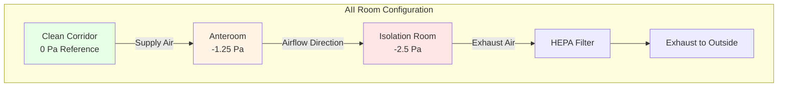
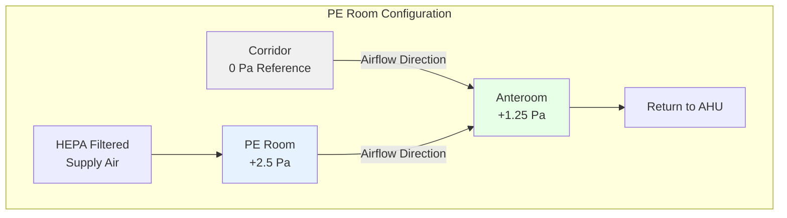

## Overview

Isolation room HVAC systems provide critical environmental control to prevent transmission of airborne pathogens in healthcare facilities. These specialized spaces use differential pressure, enhanced filtration, and controlled airflow patterns to protect patients, staff, and visitors from infectious disease transmission.

The fundamental principle relies on directing airflow from clean to contaminated areas through precise pressure control and air change requirements that exceed standard patient room specifications.

## Isolation Room Types

### Airborne Infection Isolation (AII) Rooms

Negative pressure rooms contain infectious agents within the space:

| Parameter | Requirement | Purpose |
|-----------|-------------|---------|
| Pressure Differential | -2.5 Pa minimum | Prevent airborne pathogen escape |
| Air Changes per Hour | 12 ACH minimum | Dilute airborne contaminant concentration |
| Outdoor Air | 2 ACH minimum | Provide fresh air for occupant health |
| Exhaust Air | 100% exhausted | No recirculation of contaminated air |
| Filtration (Exhaust) | HEPA if no adequate dilution | Remove pathogens before discharge |

**Applications:** Tuberculosis, measles, varicella, SARS-CoV-2, novel respiratory pathogens

### Protective Environment (PE) Rooms

Positive pressure rooms protect immunocompromised patients:

| Parameter | Requirement | Purpose |
|-----------|-------------|---------|
| Pressure Differential | +2.5 Pa minimum | Prevent contaminated air entry |
| Air Changes per Hour | 12 ACH minimum | Maintain cleanliness through dilution |
| Filtration (Supply) | HEPA 99.97% @ 0.3 μm | Remove airborne particles and spores |
| Anteroom | Required | Pressure buffer and transition zone |
| Recirculation | Permitted with HEPA | Reduce energy while maintaining quality |

**Applications:** Bone marrow transplant patients, severe immunosuppression, neutropenic patients

## Pressure Differential Physics

The pressure difference across isolation room boundaries drives directional airflow. The relationship between airflow and pressure is governed by:

$$Q = C \cdot A \cdot \sqrt{\frac{2\Delta P}{\rho}}$$

Where:
- $Q$ = volumetric airflow through openings (m³/s)
- $C$ = discharge coefficient (0.6-0.7 for door gaps)
- $A$ = effective leakage area (m²)
- $\Delta P$ = pressure differential (Pa)
- $\rho$ = air density (kg/m³)

For negative pressure AII rooms, exhaust airflow must exceed supply airflow. The pressure differential achieved depends on the net airflow difference and room leakage characteristics:

$$\Delta P = \frac{\rho}{2} \left(\frac{Q_{net}}{C \cdot A}\right)^2$$

Where $Q_{net} = Q_{exhaust} - Q_{supply}$ for negative pressure rooms.

**Critical Design Consideration:** A typical 250 CFM (425 m³/h) differential creates approximately -2.5 Pa to -5 Pa depending on door undercut and construction tightness.

## Air Change Rate Requirements

ASHRAE Standard 170 specifies minimum air changes to achieve adequate contaminant dilution. The concentration decay of airborne pathogens follows first-order kinetics:

$$C(t) = C_0 \cdot e^{-N \cdot t}$$

Where:
- $C(t)$ = contaminant concentration at time $t$
- $C_0$ = initial concentration
- $N$ = air changes per hour (1/h)
- $t$ = time (hours)

To reduce concentration to 1% of initial levels:

$$t_{99\%} = \frac{-\ln(0.01)}{N} = \frac{4.6}{N}$$

For 12 ACH: $t_{99\%} = 23$ minutes. For 6 ACH standard rooms: $t_{99\%} = 46$ minutes.

This doubling of air change rate halves the time required for pathogen removal, critical for room turnover between infectious patients.

## Airflow Pattern Design

### Unidirectional Pressure Cascade

The pressure cascade ensures consistent airflow direction. For AII rooms with anteroom:

- Corridor: 0 Pa (reference)
- Anteroom: -1.25 Pa to -1.5 Pa
- Isolation room: -2.5 Pa minimum

This creates two pressure steps, preventing corridor contamination even during door operation.

## Differential Pressure Control

### Monitoring and Alarming

Continuous pressure monitoring with visual indication at the door entrance provides real-time status. ASHRAE 170 requires:

- Permanent visual pressure monitoring device
- Alarm notification for pressure deviation
- Pressure reading visible from outside room

**Typical Alarm Setpoints:**
- Alert: ±0.5 Pa deviation from setpoint
- Alarm: ±1.0 Pa deviation or pressure reversal

### Control Strategies

**Method 1: Offset Constant Volume**

Supply and exhaust fans operate at fixed speeds with calibrated offset:
- AII: $Q_{exhaust} = Q_{supply} + Q_{offset}$
- PE: $Q_{supply} = Q_{exhaust} + Q_{offset}$

Typical offset: 100-150 CFM (170-255 m³/h)

**Method 2: Modulating Pressure Control**

Direct digital control (DDC) modulates exhaust or supply damper/fan to maintain setpoint:

$$Q_{control}(t) = Q_{base} + K_p \cdot e(t) + K_i \int e(t)dt$$

Where $e(t) = P_{setpoint} - P_{measured}$ is the pressure error.

**Advantages:** Precise control, automatic compensation for leakage variation
**Disadvantages:** Higher complexity, requires regular sensor calibration

## Filtration Requirements

### HEPA Filtration Efficiency

High-efficiency particulate air (HEPA) filters capture particles through multiple mechanisms:

1. **Interception:** Particles follow streamlines and contact fibers
2. **Impaction:** Particles with inertia deviate from streamlines
3. **Diffusion:** Brownian motion causes small particle capture

The most penetrating particle size (MPPS) occurs at approximately 0.3 μm where all mechanisms are least effective. HEPA filters achieve 99.97% capture at this size.

Pressure drop across HEPA filters follows:

$$\Delta P_{filter} = \Delta P_{clean} + k \cdot m_{dust}$$

Where $m_{dust}$ is accumulated dust mass and $k$ is the loading coefficient.

**Design Consideration:** Size HEPA filter systems for 2× clean filter pressure drop to extend service life before replacement.

### Filter Location Strategy

| Application | Supply Filtration | Exhaust Filtration |
|-------------|-------------------|-------------------|
| AII Room | MERV 14 minimum | HEPA if central exhaust |
| AII Room | MERV 14 minimum | None if dedicated outside exhaust |
| PE Room | HEPA 99.97% required | MERV 8-13 adequate |
| PE Room Recirculation | HEPA on return path | Not applicable |

## Room Pressurization Sequence

### Door Operation Effects

Door opening temporarily disrupts pressure differential. The pressure recovery time depends on:

$$t_{recovery} = \frac{V_{room}}{Q_{net}} \cdot \ln\left(\frac{\Delta P_{initial}}{\Delta P_{final}}\right)$$

For a 200 ft² (18.6 m²) × 9 ft (2.74 m) room with 150 CFM offset:
- Room volume: 1,800 ft³ (51 m³)
- Net airflow: 150 CFM (255 m³/h)
- Recovery time: 12-15 seconds to 90% of setpoint

**Design Strategy:** Anterooms provide buffer zone, allowing one door to close before opening second door, maintaining directional control.

## Outdoor Air Requirements

ASHRAE 170 mandates minimum outdoor air for dilution and occupant health:

$$Q_{OA} = \max(Q_{ventilation}, Q_{makeup})$$

Where:
- $Q_{ventilation}$ = 2 ACH × room volume (ventilation requirement)
- $Q_{makeup}$ = Exhaust quantity for AII rooms (makeup air requirement)

For 100% exhaust AII rooms, all supply air must be outdoor air or transfer air from clean areas. No recirculation of room air is permitted.

## Sound Level Considerations

High air change rates create elevated sound levels. ASHRAE 170 limits:
- Patient rooms: NC 35 maximum
- Isolation rooms: Often NC 35-40 due to increased airflow

Sound attenuation strategies:
- Lined ducts near diffusers and grilles
- Low-velocity diffuser selection (< 500 FPM terminal velocity)
- Isolation of mechanical equipment
- Vibration isolation for exhaust fans

## Validation and Performance Testing

### Initial Commissioning Tests

| Test | Acceptance Criteria | Method |
|------|-------------------|---------|
| Pressure Differential | -2.5 Pa minimum (AII) | Calibrated differential pressure gauge |
| Pressure Differential | +2.5 Pa minimum (PE) | Calibrated differential pressure gauge |
| Air Changes | 12 ACH minimum | Measure airflow at all devices |
| Airflow Direction | Visible movement toward room (AII) | Smoke tube visualization |
| Pressure Recovery | < 30 seconds to setpoint | Door operation test |
| Alarm Verification | Audible/visual alarm activation | Simulate pressure fault |

### Periodic Performance Verification

Annual testing per ASHRAE 170 and facility infection control policy:
- Differential pressure measurement
- Airflow direction verification
- Air change rate confirmation
- Filter pressure drop measurement
- Control system calibration

## Energy Considerations

Isolation rooms consume 2-3× the energy of standard patient rooms due to:
- 100% outdoor air for AII rooms (no heat recovery possible)
- Elevated air change rates (12 vs. 6 ACH)
- Continuous operation (no occupancy-based setback)

Energy optimization strategies without compromising infection control:
- Heat recovery on general exhaust (not AII exhaust)
- Demand-based control when rooms unoccupied (requires infection control approval)
- High-efficiency HEPA fans with optimized filter sizing

## References

- ASHRAE Standard 170-2021: Ventilating of Health Care Facilities
- CDC Guidelines for Environmental Infection Control in Health-Care Facilities (2003)
- FGI Guidelines for Design and Construction of Hospitals (2022)
- ASHRAE Handbook—HVAC Applications, Chapter 9: Healthcare Facilities

---

*Isolation room HVAC systems represent the intersection of engineering precision and infection control science, requiring rigorous design, commissioning, and maintenance to protect vulnerable populations.*
