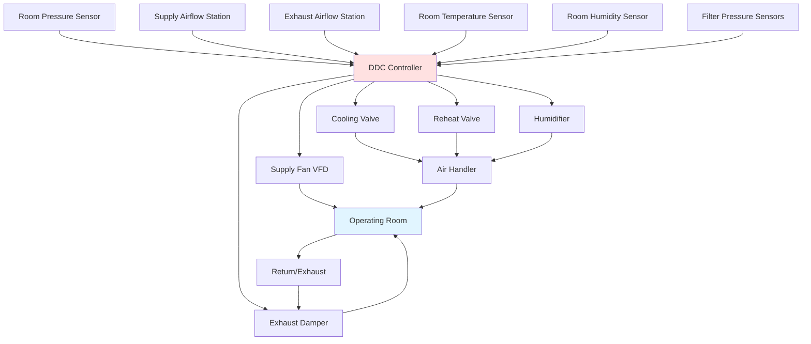

# Operating Room HVAC Systems

Operating room HVAC systems maintain stringent environmental conditions to minimize surgical site infections, support anesthetic gas management, and provide thermal comfort for surgical teams during extended procedures. These systems deliver filtered, conditioned air at elevated flow rates while maintaining positive pressure relationships to adjacent spaces, precise temperature and humidity control, and minimal air turbulence at the surgical field. ASHRAE Standard 170 establishes minimum ventilation, filtration, pressure, temperature, and humidity requirements for healthcare facilities. The Facility Guidelines Institute (FGI) Guidelines for Design and Construction of Hospitals provides additional design criteria based on infection control research and clinical practice standards.

## Ventilation and Air Change Requirements

### Air Change Rates per ASHRAE 170

Operating rooms require substantially higher air change rates than general patient areas to dilute airborne contaminants and maintain air quality during surgical procedures.

**Minimum ventilation requirements:**

| Space Classification | Minimum Total ACH | Minimum Outside Air ACH | Air Movement Relationship | Temperature Range (°F) | Relative Humidity Range (%) |
|---------------------|-------------------|------------------------|--------------------------|----------------------|---------------------------|
| Operating Room (Class B & C) | 20 | 4 | Positive | 68-73 | 20-60 |
| Operating Room (orthopedic) | 20 | 4 | Positive | 68-73 | 20-60 |
| Cardiac Catheterization Lab | 15 | 3 | Positive | 70-75 | 30-60 |
| C-Section Room | 20 | 4 | Positive | 68-73 | 20-60 |
| Post-Anesthesia Care Unit | 6 | 2 | N/A | 70-75 | 30-60 |
| Anesthesia Storage | 8 | 2 | Negative | 70-75 | 30-60 |
| Soiled Workroom | 10 | 2 | Negative | 68-73 | 30-60 |
| Sterile Processing | 10 | 2 | Positive | 68-73 | 30-60 |

ASHRAE 170-2017 requires minimum 20 air changes per hour (ACH) for operating rooms, with at least 4 ACH from outdoor air. This establishes the baseline ventilation requirement, though many facilities design for 25-30 ACH to provide additional dilution capacity and maintain laminar flow characteristics.

**Air change rate calculation:**

$$ACH = \frac{Q_{supply}}{V_{room}} \times 60$$

Where:
- $Q_{supply}$ = Supply airflow rate (CFM)
- $V_{room}$ = Room volume (cubic feet)
- 60 = Minutes per hour conversion

**Example calculation for standard OR:**
- Room dimensions: 20 ft × 20 ft × 10 ft ceiling = 4,000 ft³
- Minimum requirement: 20 ACH
- Required airflow: $(20 \times 4000) / 60 = 1,333$ CFM
- Typical design: 25 ACH = 1,667 CFM

### Outside Air Requirements

The 4 ACH minimum outside air requirement ensures continuous introduction of fresh air to dilute anesthetic gases, body odors, and volatile organic compounds from cleaning solutions and surgical materials.

**Outside air calculation:**

$$Q_{OA} = \frac{4 \times V_{room}}{60}$$

For the standard 400 ft² OR example:
$$Q_{OA} = \frac{4 \times 4000}{60} = 267 \text{ CFM}$$

This represents 20% outside air at 20 ACH design or 16% at 25 ACH. The balance of supply air recirculates through HEPA filters, reducing energy consumption while maintaining air quality.

## Positive Pressure Control

Operating rooms maintain positive pressure relative to adjacent corridors and support spaces to prevent migration of unfiltered air into the sterile field during door openings.

### Pressure Differential Requirements

ASHRAE 170 and FGI Guidelines require minimum pressure differentials between operating rooms and adjacent spaces:

**Pressure hierarchy:**
1. Operating room: +0.02 to +0.04 in w.c. (5-10 Pa) relative to corridor
2. Sterile core corridor: +0.01 to +0.02 in w.c. (2.5-5 Pa) relative to general corridor
3. Sub-sterile room: Equal to OR or +0.01 in w.c. (2.5 Pa) relative to OR
4. Anesthesia induction: Equal to corridor
5. Scrub/prep areas: Equal to corridor
6. Soiled workroom: -0.01 in w.c. (-2.5 Pa) negative to corridor

**Pressure differential physics:**

The pressure difference between spaces results from volumetric flow imbalance and the flow resistance of connecting paths:

$$\Delta P = \frac{\rho (Q_{in} - Q_{out})^2}{2 C^2 A^2}$$

Where:
- $\Delta P$ = Pressure differential (in w.c.)
- $\rho$ = Air density (0.075 lb/ft³ standard conditions)
- $Q_{in}$ = Total airflow into space (CFM)
- $Q_{out}$ = Total airflow out of space (CFM)
- $C$ = Discharge coefficient (0.6-0.7 for door undercuts)
- $A$ = Total leakage area (ft²)

**Simplified design relationship:**

For initial design, approximate the excess supply required to maintain positive pressure:

$$Q_{excess} = 50-100 \text{ CFM per doorway for +0.03 in w.c. differential}$$

A typical operating room with two doors (corridor entrance and sub-sterile connection) requires 100-200 CFM excess supply over exhaust to maintain the prescribed positive pressure.

### Pressure Control Strategies

**Direct differential pressure control:**
- Pressure transducer measures OR-to-corridor differential
- Controller modulates exhaust damper to maintain setpoint
- Supply airflow remains constant
- Response time: 5-15 seconds
- Most common control method

**Airflow tracking control:**
- Supply air maintained at constant design value
- Exhaust airflow set at fixed offset below supply (typically 150-200 CFM less)
- Pressure differential results from offset
- Simpler control but less precise
- Suitable for stable environments

**Cascade room control:**
- Multiple rooms share pressure monitoring
- Control system maintains pressure hierarchy
- Supply and exhaust coordination across surgical suite
- Requires sophisticated building automation
- Used in large surgical departments

## Air Distribution and Laminar Flow

### Unidirectional Airflow Systems

High-performance operating rooms utilize laminar (unidirectional) airflow systems to minimize airborne particle counts at the surgical site. These systems deliver HEPA-filtered air through a large ceiling diffuser array directly over the surgical table, creating a vertical airflow pattern that sweeps particles away from the sterile field.

**Laminar flow design criteria:**

| Parameter | Conventional Mixing | Unidirectional Flow | Ultra-Clean (Orthopedic) |
|-----------|-------------------|---------------------|------------------------|
| Supply diffuser coverage | 25-40% of ceiling | 8 ft × 8 ft minimum | 10 ft × 10 ft minimum |
| Supply velocity | N/A | 25-35 FPM | 35-50 FPM |
| Airflow pattern | Turbulent mixing | Vertical laminar | Vertical laminar |
| ISO cleanliness class | ISO 7 (Class 10,000) | ISO 6 (Class 1,000) | ISO 5 (Class 100) |
| Particle count (≥0.5 μm/ft³) | ≤10,000 | ≤1,000 | ≤100 |
| Air changes per hour | 20-25 | 25-30 | 30-40 |
| First cost (relative) | 1.0 | 1.5-2.0 | 2.5-3.5 |

**Vertical laminar flow calculation:**

The supply diffuser must deliver sufficient airflow to achieve target face velocity across the protected zone:

$$Q_{supply} = V_{face} \times A_{diffuser}$$

Where:
- $V_{face}$ = Target face velocity (FPM)
- $A_{diffuser}$ = Diffuser face area (ft²)

For an 8 ft × 8 ft laminar flow ceiling (64 ft²) at 30 FPM:
$$Q = 30 \times 64 = 1,920 \text{ CFM}$$

This flow rate exceeds the ASHRAE 170 minimum and establishes the design basis for high-performance operating rooms.

**Return air placement:**

Laminar flow systems require perimeter low-wall returns or floor returns to maintain vertical airflow patterns. Return locations typically include:

- Low wall returns at 12-18 inches above finished floor
- Four sides of room for optimal symmetry
- Total return area sized for face velocity below 500 FPM
- Returns located outside sterile field boundary (minimum 3 ft from table)

### Conventional Mixing Systems

Standard operating rooms without laminar flow utilize ceiling-mounted diffusers distributed across the ceiling to provide mixing ventilation. This approach costs less but achieves lower air quality at the surgical site.

**Mixing system design:**
- 4-8 diffusers per operating room
- HEPA terminal filters at each diffuser (or central HEPA)
- Supply air velocity at diffuser: 150-300 FPM
- Air pattern: turbulent mixing with multiple air changes
- Particle dilution rather than displacement

**Diffuser selection criteria:**
- High induction ratio to promote mixing
- Low discharge velocity to minimize drafts
- Adjustable pattern controllers for flexibility
- Integral HEPA filters (preferred) or upstream central HEPA

## Filtration Requirements

### HEPA Filtration per ASHRAE 170

ASHRAE Standard 170 requires 99.97% efficiency HEPA filters (minimum efficiency reporting value of MERV 17) for all air supplied to operating rooms. This filtration level captures particles ≥0.3 μm including bacteria (0.5-10 μm) and fungal spores (2-10 μm).

**Filter specifications:**

| Filter Type | Efficiency | Particle Size | Initial Pressure Drop | Application |
|-------------|-----------|---------------|---------------------|--------------|
| MERV 8 (prefilter) | 70-75% | 3-10 μm | 0.25 in w.c. | Air handler first stage |
| MERV 14 (final) | 90-95% | 0.3-1.0 μm | 0.40 in w.c. | Non-OR healthcare |
| HEPA (99.97%) | 99.97% | 0.3 μm | 1.0-1.5 in w.c. | Operating rooms |
| ULPA (99.999%) | 99.999% | 0.12 μm | 1.5-2.0 in w.c. | Specialized cleanrooms |

**Filter location options:**

**Central HEPA banks:**
- Filters located in mechanical room or above ceiling
- Multiple ORs served by single filter bank
- Lower maintenance accessibility
- Risk of duct contamination downstream
- Requires validated duct cleaning protocols

**Terminal HEPA filters:**
- Individual filter at each supply diffuser
- Protected sterile air delivery to point of use
- Easier validation of sterile air
- More expensive installation
- Field replacement complexity
- Preferred approach for critical applications

### Two-Stage Filtration Strategy

Most operating room air handlers employ two-stage filtration to protect expensive HEPA filters and extend service life:

1. **Prefilter stage**: MERV 8-11 bag filters remove large particles and protect HEPA filters from rapid loading
2. **Final HEPA stage**: 99.97% efficiency HEPA filters provide sterile air delivery

**Filter life and replacement:**
- Prefilters: 3-6 month replacement interval
- HEPA filters: 3-5 year replacement interval (pressure drop dependent)
- Monitor pressure drop across filter banks
- Replace HEPA filters when pressure drop exceeds 2.0 in w.c. or 1.5× initial
- Test HEPA filter integrity after installation (DOP or PAO aerosol test)

## Temperature and Humidity Control

### Temperature Requirements

Operating room temperature specifications balance thermal comfort for surgical teams wearing non-breathable gowns with patient thermal regulation during anesthesia when thermoregulatory mechanisms are suppressed.

**Temperature control range:**

ASHRAE 170 requires operating room temperature within 68-73°F, adjustable based on surgical procedure and surgeon preference. Typical practice:

- General surgery: 68-72°F
- Cardiovascular surgery: 65-68°F (cooler for surgical team during long procedures)
- Pediatric surgery: 72-75°F (prevent infant hypothermia)
- Burn surgery: 80-85°F (minimize metabolic stress in burn patients)

**Temperature control precision:**

Operating rooms require tight temperature control tolerance:
- Control band: ±2°F maximum from setpoint
- Control response time: < 10 minutes for 2°F step change
- No temperature stratification (< 3°F floor-to-ceiling gradient)

**Heating and cooling load considerations:**

Operating room thermal loads include:
- Surgical lights: 400-800 watts per fixture (2-4 fixtures typical)
- Medical equipment: 1,000-3,000 watts (imaging, lasers, electrosurgery)
- Occupants: 8-12 people at 400-500 BTU/hr each (sensible load)
- Outside air ventilation load: largest component
- Envelope loads: minimal due to interior location

**Cooling load calculation:**

$$Q_{cooling} = 1.08 \times CFM \times (T_{supply} - T_{room}) + q_{lights} + q_{equipment} + q_{people}$$

For a 1,667 CFM operating room at 70°F with 55°F supply air:
$$Q_{sensible} = 1.08 \times 1667 \times (70-55) + 1600 + 2000 + 4000 = 34,600 \text{ BTU/hr (2.9 tons)}$$

### Humidity Control

Humidity control prevents static electricity buildup (fire hazard with flammable anesthetics, though rarely used), maintains patient comfort, and controls bacterial growth on surfaces.

**ASHRAE 170 humidity requirements:**
- Minimum: 20% RH (prevent static electricity)
- Maximum: 60% RH (prevent bacterial growth)
- Typical design range: 40-60% RH
- Control tolerance: ±5% RH from setpoint

**Humidity control strategies:**

**Dedicated outside air system (DOAS):**
- Separate air handler preconditions outside air to dew point
- Removes latent load from main OR air handler
- Main air handler operates sensible-only with reheat
- Provides superior humidity control year-round
- Higher first cost but better performance

**Reheat with humidification:**
- Air handler cools below dew point for dehumidification
- Reheat coil raises temperature to setpoint
- Steam humidifier adds moisture during low humidity periods
- Common approach but higher energy consumption
- Requires steam source (boiler or electric)

**Latent load calculation:**

$$Q_{latent} = 4.5 \times CFM \times (W_{room} - W_{supply})$$

Where:
- $W$ = Humidity ratio (grains of moisture per pound of dry air)
- 4.5 = Conversion constant (0.68 × 60 / 1000 × 7000 grains/lb)

Operating rooms have minimal internal latent loads (occupants under surgical drapes), so humidity control addresses primarily outside air loads.

## System Design Considerations

### Dedicated vs. Shared Air Handling

**Dedicated air handler per OR:**
- Single operating room served by dedicated AHU
- Maximum control flexibility
- Allows individual temperature adjustment
- Redundancy through multiple units
- Higher equipment cost
- Larger mechanical space requirements
- Typical for specialty ORs (cardiac, neurosurgery)

**Multi-room air handler:**
- Single AHU serves 2-6 operating rooms
- Terminal reheat at each room for temperature control
- Shared HEPA filter bank reduces cost
- Single point of failure affects multiple rooms
- Lower first cost per room
- More efficient for standardized surgical suites

### System Redundancy Requirements

Critical surgical facilities require redundancy to maintain environmental conditions during equipment failure:

**Redundant air handling:**
- N+1 air handler configuration (one backup unit)
- Automatic switchover upon failure detection
- Backup unit capable of maintaining minimum 15 ACH
- Common for large surgical departments (8+ ORs)

**Dual duct systems:**
- Two supply ducts to each OR from separate AHUs
- Dampers select active supply source
- Provides redundancy without full backup unit
- Higher installation cost

**Emergency power:**
- All operating room HVAC on emergency power
- Automatic transfer within 10 seconds
- Maintain minimum 15 ACH on emergency power
- Required by NFPA 99 and most building codes

## Control Sequences and Automation

### Operating Room Control Strategy

Modern operating room HVAC employs sophisticated direct digital control (DDC) to maintain multiple environmental parameters simultaneously:

**Primary control loops:**

1. **Supply airflow control**
   - Maintains constant supply CFM via VFD or inlet vanes
   - Compensates for filter loading over time
   - Setpoint: Design ACH requirement

2. **Pressure control**
   - Modulates exhaust damper to maintain positive pressure
   - Setpoint: +0.03 in w.c. typical
   - Control tolerance: ±0.01 in w.c.

3. **Temperature control**
   - Modulates cooling and reheat valves
   - Cascading control prevents simultaneous heating/cooling
   - Setpoint: User-adjustable 68-73°F

4. **Humidity control**
   - Modulates humidifier during low humidity
   - Increases cooling for dehumidification when needed
   - Setpoint: 40-60% RH

### Occupancy Modes

Operating rooms typically operate in multiple modes depending on surgical schedule:

**Occupied mode (during surgery):**
- Full design airflow (20-30 ACH)
- Temperature and humidity at setpoint
- Positive pressure maintained
- All alarms active

**Unoccupied setback mode:**
- Reduced airflow (typically 10-15 ACH minimum)
- Temperature setback to 65°F (heating) / 75°F (cooling)
- Humidity control continues (prevent mold growth)
- Positive pressure maintained
- Energy savings: 30-50% during unoccupied hours

**Flush-out mode:**
- Activated after terminal cleaning
- Full airflow for rapid air quality recovery
- Duration: 15-30 minutes
- Returns to setback after flush-out complete

**Start-up mode:**
- Begins 1-2 hours before first procedure
- Ramps from setback to occupied conditions
- Ensures stable environment at case start
- Automatic scheduling via building automation

## Commissioning and Performance Testing

### ASHRAE 170 Compliance Verification

Operating room HVAC systems require comprehensive testing and balancing to verify code compliance and design performance:

**Required test measurements:**

1. **Airflow verification**
   - Supply airflow to each OR (±10% of design)
   - Outside air percentage (≥20% minimum)
   - Exhaust airflow and balance
   - Confirm minimum ACH met

2. **Pressure relationship testing**
   - Room-to-corridor pressure differential
   - Verify positive pressure maintained
   - Test with doors closed and during door swing
   - Measure pressure decay time after door closure

3. **Air distribution testing**
   - Air velocity measurements at critical locations
   - Smoke visualization of airflow patterns
   - Confirm laminar flow characteristics (if applicable)
   - Verify no dead zones or short-circuiting

4. **Filtration verification**
   - HEPA filter integrity testing (DOP or PAO scan)
   - Confirm 99.97% efficiency
   - No filter bypass leakage
   - Pressure drop within acceptable range

5. **Temperature and humidity validation**
   - Verify control range 68-73°F
   - Multi-point temperature measurements
   - Humidity control 20-60% RH
   - Recovery time testing

6. **Room air changes and air pattern testing**
   - Tracer gas decay for actual ACH measurement
   - Particle count testing at surgical field
   - Sound level measurements (NC 35-40 typical)

### Particle Count Testing

Critical and ultra-clean operating rooms undergo particle count testing to verify ISO cleanliness classification:

**ISO 14644-1 cleanliness classes:**

| ISO Class | Maximum Particles/m³ (≥0.5 μm) | Maximum Particles/ft³ (≥0.5 μm) | Application |
|-----------|-------------------------------|--------------------------------|-------------|
| ISO 5 | 10,200 | 289 | Ultra-clean orthopedic ORs |
| ISO 6 | 102,000 | 2,890 | High-performance ORs |
| ISO 7 | 1,020,000 | 28,900 | Standard ORs |
| ISO 8 | 10,200,000 | 289,000 | Sterile corridors |

**Testing protocol:**
- Particle counter with 0.5 μm sensitivity
- Multiple sample locations around surgical field
- "At rest" testing (unoccupied with systems operating)
- "Operational" testing (during simulated surgery)
- Minimum 3 samples per location
- Compare results to ISO classification limits

## Energy Considerations

Operating room HVAC systems consume 3-5 times more energy per square foot than typical commercial buildings due to high ventilation rates, 100% outside air, HEPA filtration, and continuous operation.

**Energy reduction strategies:**

1. **Setback during unoccupied periods**
   - Reduce from 25 ACH to 10-15 ACH overnight
   - Potential savings: 30-40% of annual HVAC energy

2. **Heat recovery on exhaust**
   - Runaround glycol loop between exhaust and outside air
   - Energy recovery effectiveness: 50-65%
   - Payback period: 4-7 years in most climates

3. **Dedicated outside air system**
   - Precondition outside air with heat recovery
   - Reduces load on OR air handlers
   - Better humidity control reduces overcooling/reheat

4. **Efficient filtration**
   - High-quality prefilters extend HEPA life
   - Monitor pressure drop, replace proactively
   - Lower pressure drop reduces fan energy

5. **LED surgical lighting**
   - Reduce cooling load by 40-60% versus halogen
   - Lower electrical consumption
   - Rapid payback through utility savings

**Energy benchmarks:**
- Typical OR energy intensity: 200-400 kBTU/ft²/year
- High-performance OR: 150-250 kBTU/ft²/year (with heat recovery)
- Comparable office space: 50-80 kBTU/ft²/year

Operating room HVAC systems represent the most demanding application in healthcare facility design, requiring integration of infection control principles, precision environmental control, redundancy for life safety, and energy management. Successful designs balance these competing objectives through careful attention to ASHRAE 170 requirements, proven system configurations, and comprehensive commissioning to verify performance.
