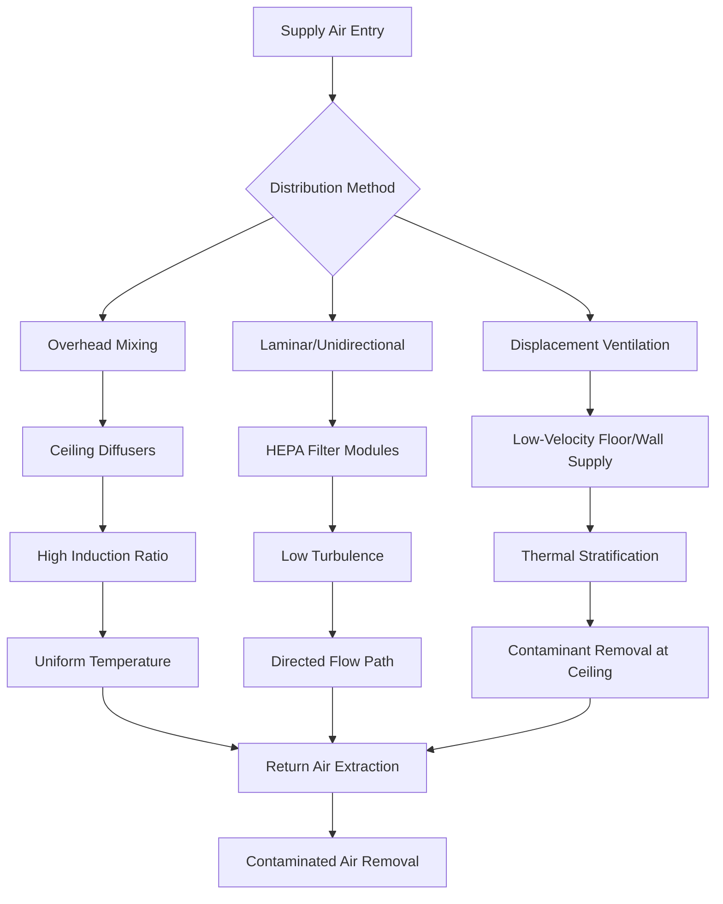

# Hospital Patient Room HVAC Design and Requirements

Patient room HVAC systems directly impact infection control, patient recovery rates, and thermal comfort. ASHRAE Standard 170 and the Facilities Guidelines Institute (FGI) Guidelines establish minimum environmental parameters for general patient rooms, while clinical evidence demonstrates the relationship between proper environmental control and healthcare-associated infection (HAI) reduction. Design must balance infection prevention, energy efficiency, and patient comfort while accommodating variable occupancy and heat loads.

## ASHRAE 170 Minimum Requirements

ASHRAE Standard 170-2021 establishes mandatory ventilation rates, pressure relationships, filtration efficiency, temperature ranges, and humidity limits for patient care areas. These requirements form the baseline for all patient room designs in U.S. healthcare facilities.

### Environmental Parameter Requirements

| Parameter | General Patient Room | Exam Room | Recovery Room | Critical Care/ICU |
|-----------|---------------------|-----------|---------------|-------------------|
| Air Changes per Hour (Total) | 6 ACH | 6 ACH | 6 ACH | 6 ACH |
| Outdoor Air (Minimum) | 2 ACH | 2 ACH | 2 ACH | 2 ACH |
| Pressure Relationship | Equal or Positive | Equal or Positive | Equal or Positive | Positive |
| Minimum Temperature | 70°F (21°C) | 70°F (21°C) | 70°F (21°C) | 70°F (21°C) |
| Maximum Temperature | 75°F (24°C) | 75°F (24°C) | 75°F (24°C) | 75°F (24°C) |
| Minimum Relative Humidity | 30% | 30% | 30% | 30% |
| Maximum Relative Humidity | 60% | 60% | 60% | 60% |
| Minimum Filtration (Supply) | MERV 14 | MERV 14 | MERV 14 | MERV 14 |
| Recirculation | Allowed within room | Allowed within room | Allowed within room | Allowed within room |

The 6 ACH minimum ensures adequate dilution of airborne contaminants, odors, and anesthetic gases. The 2 ACH outdoor air requirement provides fresh air for occupants and prevents buildup of trace contaminants that recirculation cannot remove.

## Air Change Rate Calculations and Airflow Distribution

Air change rate defines the volumetric airflow relative to room volume. The required supply airflow depends on room geometry and air change requirements.

**Total Supply Airflow:**

$$Q_{supply} = \frac{V \times ACH}{60}$$

Where:
- $Q_{supply}$ = supply airflow (cfm)
- $V$ = room volume (ft³)
- $ACH$ = air changes per hour (h⁻¹)

For a typical 12 ft × 16 ft patient room with 9 ft ceilings:

**Calculation:**
- Room volume: 12 × 16 × 9 = 1,728 ft³
- Minimum total supply: (1,728 × 6) / 60 = 172.8 cfm
- Minimum outdoor air: (1,728 × 2) / 60 = 57.6 cfm

The supply airflow must satisfy both the total ACH requirement and the minimum outdoor air requirement simultaneously. In this example, 172.8 cfm total with at least 57.6 cfm outdoor air meets ASHRAE 170 requirements.

### Airflow Distribution Patterns

Proper air distribution prevents stagnant zones and ensures uniform dilution throughout the occupied space. The supply air delivery method significantly impacts ventilation effectiveness.

**Mixing Ventilation**: Standard approach using ceiling-mounted diffusers that induce room air into the supply jet, creating turbulent mixing. Air change effectiveness typically 0.9-1.0, meaning actual contaminant removal equals or slightly exceeds the nominal ACH value.

**Displacement Ventilation**: Low-velocity air supplied near floor level at temperatures 3-5°F below room setpoint. Thermal plumes from patients, equipment, and lights drive upward airflow, carrying contaminants to ceiling-level exhaust. Effectiveness values of 1.2-1.4 possible but requires careful design to prevent drafts.

**Laminar/Unidirectional Flow**: Reserved for critical applications like operating rooms and protective environment rooms. Not typically used in general patient rooms due to high energy consumption and spatial requirements.

## Pressure Relationships and Airflow Balance

Maintaining proper pressure relationships prevents contaminant migration between spaces. General patient rooms operate at equal or positive pressure relative to corridors to prevent corridor air infiltration.

**Pressure Differential Calculation:**

The pressure differential between spaces depends on airflow imbalance and leakage path resistance:

$$\Delta P = \left(\frac{Q_{leak}}{C \times A}\right)^2 \times \rho$$

Where:
- $\Delta P$ = pressure differential (in. w.g.)
- $Q_{leak}$ = net airflow imbalance (cfm)
- $C$ = flow coefficient (dimensionless, typically 0.6-0.7)
- $A$ = effective leakage area (ft²)
- $\rho$ = air density (lbm/ft³)

For practical design, a simplified relationship applies:

**Target Pressure:** +0.01 to +0.03 in. w.g. relative to corridor

**Required Airflow Imbalance:** Approximately 50-150 cfm net supply excess for typical patient room envelope tightness.

### Pressure Control Strategies

| Control Method | Description | Accuracy | Complexity | Application |
|----------------|-------------|----------|------------|-------------|
| Fixed Supply/Return | Constant supply and return volumes with calibrated offset | ±0.005 in. w.g. | Low | Small facilities, stable loads |
| Differential Pressure Control | Direct pressure sensor modulates supply or exhaust | ±0.001 in. w.g. | Medium | Newer facilities, critical rooms |
| Cascade Airflow Tracking | Return tracks supply with fixed offset CFM | ±0.003 in. w.g. | Medium | Large hospitals, zone control |
| Venturi Valve Systems | Self-balancing airflow stations maintain pressure | ±0.002 in. w.g. | High | Renovation, legacy systems |

Differential pressure sensors with cascade control provide superior performance by continuously measuring actual room pressure and modulating airflow devices to maintain setpoint regardless of door openings, filter loading, or system changes.

## Filtration Requirements and Efficiency

ASHRAE 170 mandates minimum MERV 14 filtration for all supply air to patient rooms. This filtration level captures 75-90% of particles in the 0.3-1.0 μm range, including most bacteria and large virus-carrying droplet nuclei.

### Filtration System Design

Two-stage filtration improves overall system efficiency and extends final filter life:

**Stage 1 - Prefilter:**
- MERV 8-11 efficiency
- Captures large particles, dust, lint
- Protects downstream coils and final filters
- Replacement interval: 3-6 months

**Stage 2 - Final Filter:**
- MERV 14-15 efficiency
- Removes fine particles, bioaerosols
- Pressure drop when clean: 0.3-0.5 in. w.g.
- Replacement interval: 12-24 months

**Filter Pressure Drop:**

As filters load with particulate matter, pressure drop increases, reducing airflow if fan pressure is insufficient.

$$\Delta P_{filter} = \Delta P_{clean} \times \left(1 + \frac{m_{dust}}{m_{capacity}}\right)^n$$

Where:
- $\Delta P_{filter}$ = current filter pressure drop (in. w.g.)
- $\Delta P_{clean}$ = clean filter pressure drop (in. w.g.)
- $m_{dust}$ = accumulated dust mass (grams)
- $m_{capacity}$ = filter dust holding capacity (grams)
- $n$ = loading exponent (typically 1.5-2.0)

Magnehelic gauges or differential pressure transmitters monitor filter loading. Replace filters when pressure drop reaches 2.0-2.5 times the clean pressure drop or per manufacturer recommendation.

## Temperature and Humidity Control

Thermal comfort significantly impacts patient satisfaction and recovery. Temperature and humidity must remain within ASHRAE 170 ranges while accommodating individual patient preferences where possible.

### Thermal Comfort Considerations

Patient metabolic rates average 0.8-1.0 met (metabolic equivalents) during bed rest, lower than sedentary office workers. Combined with reduced clothing insulation (0.3-0.5 clo), patients require warmer ambient temperatures for thermal neutrality.

**Predicted Mean Vote (PMV) Analysis:**

The PMV model predicts thermal sensation on a 7-point scale from cold (-3) to hot (+3), with 0 representing thermal neutrality.

For a patient at rest:
- Metabolic rate: 0.9 met (52 W/m²)
- Clothing insulation: 0.4 clo (hospital gown)
- Air velocity: <0.15 m/s (30 fpm)
- Mean radiant temperature ≈ air temperature

At these conditions, thermal neutrality (PMV = 0) occurs at approximately 74-75°F, explaining why many patients prefer temperatures at the upper end of the ASHRAE 170 range.

**Individual Zone Control:**

Each patient room requires independent temperature control through:
- Individual zone thermostats accessible to nursing staff
- Local reheat coils (electric or hot water)
- Variable air volume with minimum airflow enforcement
- Radiant panels for supplemental heating/cooling without airflow variation

### Humidity Control Challenges

Maintaining 30-60% RH year-round presents significant challenges in both heating and cooling seasons.

**Winter Humidification:**

Cold outdoor air contains minimal moisture. Heating this air to room temperature without humidification results in extremely low relative humidity.

**Moisture addition required:**

$$\dot{m}_{water} = \frac{Q_{oa} \times \rho \times (W_{room} - W_{oa})}{60}$$

Where:
- $\dot{m}_{water}$ = moisture addition rate (lbm/hr)
- $Q_{oa}$ = outdoor airflow (cfm)
- $\rho$ = air density (0.075 lbm/ft³ standard)
- $W_{room}$ = room humidity ratio (lbm water/lbm dry air)
- $W_{oa}$ = outdoor air humidity ratio (lbm water/lbm dry air)

For 1000 cfm outdoor air at 20°F, 30% RH heated to 72°F, 35% RH:
- Outdoor humidity ratio: 0.0007 lbm/lbm
- Room humidity ratio: 0.0047 lbm/lbm
- Required moisture: (1000 × 0.075 × (0.0047 - 0.0007)) / 60 = 0.005 lbm/min = 0.3 lbm/hr per cfm OA = 300 lbm/hr total

**Summer Dehumidification:**

Hot, humid outdoor air requires deep cooling to condense moisture, then reheating to maintain space temperature. Energy recovery systems reduce this load by precooling and dehumidifying outdoor air with exhaust air.

## System Types and Comparison

Multiple system configurations can satisfy ASHRAE 170 requirements. Selection depends on facility size, budget, maintenance capability, and performance priorities.

### Common Patient Room HVAC Systems

| System Type | Ventilation Control | Temperature Control | Humidity Control | Energy Efficiency | First Cost | Maintenance |
|-------------|---------------------|---------------------|------------------|-------------------|------------|-------------|
| Central VAV with Reheat | Excellent | Excellent | Excellent | Medium | Medium-High | Medium |
| DOAS + Fan Coil Units | Excellent | Good | Excellent | High | High | Medium-High |
| DOAS + Chilled Beams | Excellent | Excellent | Good | High | Very High | Medium |
| 4-Pipe Fan Coil with MUA | Good | Excellent | Fair | Medium | Medium | Low-Medium |
| Single-Zone AHU per Room | Excellent | Excellent | Excellent | Low | High | High |
| Packaged Terminal Units | Poor | Good | Poor | Low | Low | Medium |

**Central VAV System:**
Variable air volume terminal units serve each patient room or small group of rooms. Central air handling units provide heating, cooling, humidification, dehumidification, and filtration. Minimum airflow setpoints enforce the 6 ACH requirement. Pressure-independent VAV terminals with airflow measurement ensure accurate ventilation delivery regardless of duct pressure fluctuations.

**DOAS + Fan Coil:**
Dedicated outdoor air systems handle 100% outdoor air with energy recovery, providing ventilation, humidity control, and filtration. Fan coil units in each room handle sensible cooling and heating without introducing additional outdoor air. This separation allows optimal humidity control and ensures consistent ventilation independent of room thermal loads.

**DOAS + Chilled Beam:**
Active or passive chilled beams provide sensible cooling through convection from chilled water coils. The DOAS supplies 100% outdoor air at neutral temperature and controlled humidity. This configuration offers excellent energy efficiency and very quiet operation but requires careful dewpoint control to prevent condensation on beams.

## Noise and Vibration Control

Excessive HVAC noise interferes with patient rest and recovery. ANSI/ASA S12.60 does not apply to healthcare facilities, but FGI Guidelines and industry practice establish maximum noise criteria.

**Target Noise Levels:**

| Space | Maximum RC/NC | Design Target (dBA) |
|-------|--------------|---------------------|
| Patient Rooms | RC 35(N) | 30-35 |
| Critical Care | RC 35(N) | 30-35 |
| Exam Rooms | RC 35(N) | 30-35 |
| Procedure Rooms | RC 38(N) | 33-38 |

**Noise Control Measures:**

- Terminal device selection: Low-pressure drop VAV boxes and diffusers with manufacturer sound data
- Duct velocity limits: 1500 fpm maximum in mains, 800 fpm in branches, 500 fpm at terminals
- Duct silencers: Install in supply ducts upstream of noise-sensitive areas
- Vibration isolation: Spring isolators for air handlers, flexible duct connections, resilient hangers
- Equipment location: Separate mechanical rooms from patient areas with sound-rated construction

## Energy Efficiency Strategies

Patient rooms operate continuously year-round, making energy efficiency critical for life-cycle cost management.

**High-Impact Efficiency Measures:**

- **Energy recovery on outdoor air**: Enthalpy wheels or plate heat exchangers recover 60-80% of heating and cooling energy from exhaust air
- **Variable speed drive fans**: Reduce fan energy during low-load periods while maintaining minimum airflow
- **LED lighting**: Reduces internal heat gains and cooling loads by 50-70% versus fluorescent
- **Demand-based ventilation**: Reduce outdoor air to 2 ACH during unoccupied cleaning periods (if codes permit)
- **Economizer operation**: Free cooling when outdoor air conditions are favorable
- **Heat recovery chillers**: Simultaneous heating and cooling using condenser heat for reheat or domestic hot water
- **Advanced controls**: Integrate ventilation, temperature, humidity, and lighting control with occupancy detection and load prediction

## Infection Control Considerations

While general patient rooms do not require the stringent controls of isolation rooms, proper HVAC design reduces HAI risk.

**Infection Control Principles:**

- Maintain positive pressure to prevent infiltration of corridor air
- Provide adequate outdoor air for dilution ventilation
- Ensure MERV 14 minimum filtration to remove airborne pathogens
- Control humidity in the 30-60% range to minimize pathogen survival and optimize immune function
- Prevent stagnant zones where contaminants can accumulate
- Design for easy cleaning and maintenance without contaminating occupied spaces

When patient rooms must accommodate isolation cases (negative pressure for airborne precautions), conversion capability should be designed into the system. This typically requires exhaust fan capacity and control sequences to reverse room pressurization on demand.

## Maintenance and Commissioning

Proper commissioning and ongoing maintenance ensure continuous compliance with environmental parameters.

**Commissioning Verification:**

- Measure and document supply, return, and outdoor airflows at each terminal
- Verify room pressurization under all door positions
- Confirm temperature and humidity control throughout design range
- Test filter installation for bypass and proper sealing
- Measure sound levels in unoccupied patient rooms
- Verify control sequences for all operating modes

**Preventive Maintenance Schedule:**

- **Monthly**: Inspect and replace filters as needed, verify pressure relationships
- **Quarterly**: Lubricate fan bearings, inspect belts and drives, clean coils
- **Annually**: Comprehensive airflow measurement and rebalancing, control calibration, sound level verification
- **Continuous**: Building automation system monitoring of temperatures, humidity, pressures, and airflows with automated alarms for out-of-range conditions

Comprehensive maintenance prevents system degradation that can compromise infection control and patient comfort while increasing energy consumption.
