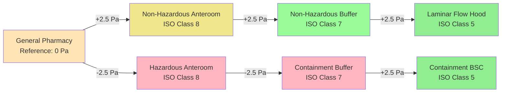
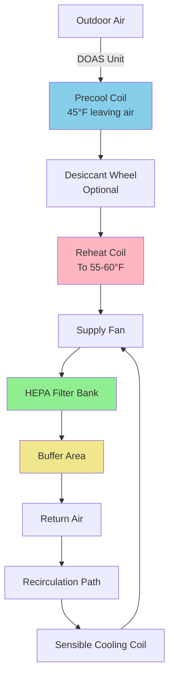

# Hospital Pharmacy HVAC Systems

Hospital pharmacies require specialized HVAC systems to maintain environmental conditions mandated by USP General Chapters 797 and 800, which govern sterile compounding and hazardous drug handling. The HVAC system must provide precise temperature and humidity control, maintain specific air cleanliness classifications, establish pressure relationships between spaces, and prevent cross-contamination while ensuring personnel safety.

## USP Standards and Cleanroom Classifications

USP <797> establishes requirements for compounding sterile preparations (CSPs), while USP <800> addresses hazardous drug handling. These standards define buffer areas, anteroom requirements, and segregated compounding areas with specific environmental controls.

### ISO Cleanroom Classifications for Pharmacy Spaces

| Space Type | ISO Classification | Maximum Particles ≥0.5 μm per m³ | Air Changes per Hour (ACH) | Pressure Relationship |
|------------|-------------------|----------------------------------|---------------------------|----------------------|
| Primary Engineering Control (PEC) | ISO Class 5 | 3,520 | N/A (unidirectional flow) | Positive to buffer area |
| Buffer Area (Non-Hazardous) | ISO Class 7 | 352,000 | 30 minimum | Positive to anteroom |
| Buffer Area (Hazardous) | ISO Class 7 | 352,000 | 30 minimum | Negative to anteroom |
| Anteroom (Non-Hazardous) | ISO Class 8 | 3,520,000 | 20 minimum | Positive to general pharmacy |
| Anteroom (Hazardous) | ISO Class 8 | 3,520,000 | 20 minimum | Negative to general pharmacy |
| Segregated Compounding Area | ISO Class 7 | 352,000 | 30 minimum | Positive to surrounding area |

**Primary Engineering Controls (PECs)** include laminar airflow workbenches (LAFWs), biological safety cabinets (BSCs), and compounding aseptic isolators (CAIs). These devices provide ISO Class 5 conditions at the critical compounding site through HEPA-filtered unidirectional airflow at 90 ± 20 fpm.

The pressure cascade prevents migration of particles and contaminants. For non-hazardous compounding, air flows from cleanest (buffer area) to less clean (anteroom) to general pharmacy. For hazardous drugs, the containment buffer area operates under negative pressure to prevent escape of hazardous substances.

## Pressure Differential Requirements

Maintaining proper pressure relationships between pharmacy spaces is critical for contamination control. Pressure differentials are achieved through supply and exhaust airflow imbalances.

### Pressure Cascade Design

**Pressure Differential Calculation:**

The required airflow differential to achieve a target pressure difference across a partition is determined by the leakage area:

$$Q = 2610 \times A \times \sqrt{\frac{\Delta P}{\rho}}$$

Where:
- $Q$ = airflow through leakage paths (cfm)
- $A$ = effective leakage area (ft²)
- $\Delta P$ = pressure differential (inches water column)
- $\rho$ = air density (lb/ft³, standard = 0.075)

For a typical construction with 0.1 ft² leakage area per 100 ft² of partition area and a target differential of 0.01 in. w.c. (2.5 Pa):

$$Q = 2610 \times 0.1 \times \sqrt{\frac{0.01}{0.075}} = 30.1 \text{ cfm}$$

This calculation establishes the minimum supply-exhaust imbalance required. Actual design typically uses 50-100 cfm differential to account for door openings and filter loading.

**Pressure Monitoring:**

Continuous pressure monitoring with visual indicators (magnehelic gauges or digital displays) at each anteroom entry point provides real-time verification of proper pressure relationships. The building automation system should alarm when pressure differentials deviate beyond ±20% of setpoint.

## Air Change Rates and Filtration

Air change rates determine both particle dilution and air cleanliness classification. Higher ACH values provide faster recovery from contamination events and maintain lower particle counts during compounding activities.

### Minimum Air Change Requirements

| Room Classification | Minimum ACH | Recommended ACH | Supply Air Filtration | Exhaust Filtration |
|---------------------|-------------|-----------------|---------------------|-------------------|
| ISO Class 5 PEC | Unidirectional flow 90 fpm | N/A | HEPA 99.99% at 0.3 μm | N/A (recirculated) |
| ISO Class 7 Buffer | 30 | 40-60 | HEPA 99.97% at 0.3 μm | HEPA if hazardous |
| ISO Class 8 Anteroom | 20 | 25-30 | MERV 14-16 minimum | HEPA if hazardous |
| Hazardous Waste Room | 12 | 15-20 | MERV 14 minimum | HEPA 99.99% at 0.3 μm |

**Particle Clearance Time:**

The time required to reduce airborne particle concentration by 99% or 99.9% depends on air change rate:

$$t = \frac{-\ln(C/C_0)}{ACH/60}$$

Where:
- $t$ = time (minutes)
- $C/C_0$ = final/initial concentration ratio
- $ACH$ = air changes per hour

For 99% reduction ($C/C_0 = 0.01$) with 30 ACH:

$$t = \frac{-\ln(0.01)}{30/60} = \frac{4.605}{0.5} = 9.2 \text{ minutes}$$

For 99.9% reduction with 30 ACH: 13.8 minutes. Higher ACH rates provide faster recovery, which is critical after spills or between compounding sessions.

**HEPA Filter Installation:**

HEPA filters must be installed in the supply ductwork as close as practical to the point of use. Terminal HEPA filter housings should include:
- Bag-in/bag-out capability for hazardous drug areas
- DOP test ports for in-place filter integrity testing
- Dampers for airflow balancing
- Pressure differential monitoring across filter banks

## Temperature and Humidity Control

USP <797> requires maintaining specific temperature and humidity ranges in compounding areas to ensure medication stability, personnel comfort, and control of microbial growth.

### Environmental Set Points

| Parameter | USP Requirement | Recommended Control Range | Control Tolerance |
|-----------|----------------|--------------------------|------------------|
| Temperature | ≤77°F (25°C) | 68-73°F (20-23°C) | ±2°F |
| Relative Humidity | ≤60% RH | 30-50% RH | ±5% RH |
| Temperature Monitoring | Continuous | Every 1 hour | N/A |
| Humidity Monitoring | Continuous | Every 1 hour | N/A |

**Sensible Heat Ratio Considerations:**

Cleanroom HVAC systems operate at high sensible heat ratios (SHR) due to elevated air change rates and minimal internal moisture generation. The required cooling capacity is predominantly sensible:

$$SHR = \frac{Q_{sensible}}{Q_{sensible} + Q_{latent}}$$

Typical pharmacy cleanrooms exhibit SHR values of 0.85-0.95. This requires careful equipment selection:
- Standard direct-expansion equipment may overcool before adequate dehumidification occurs
- Dedicated outdoor air systems (DOAS) with separate sensible cooling improve humidity control
- Reheat may be necessary to achieve temperature setpoint after dehumidification

**Humidity Control Strategy:**

This configuration separates latent load (outdoor air) from sensible load (recirculated air), providing superior humidity control. The DOAS delivers dehumidified outdoor air at the exact quantity required for ventilation and pressurization, while recirculation air handlers address sensible cooling loads.

## Airflow Patterns and Contamination Control

Proper air distribution prevents cross-contamination between clean and less-clean areas while maintaining ISO classifications.

**Supply Air Distribution:**

Non-aspirating, low-turbulence diffusers with HEPA terminal filters distribute air uniformly across the ceiling. HEPA diffuser spacing of 2-4 feet on center creates a vertical laminar flow pattern that sweeps particles downward toward low-level return grilles.

**Return Air Location:**

Low-level return air grilles installed 12-18 inches above the finished floor remove particle-laden air. This configuration establishes top-down airflow that continuously purges the breathing zone of particles generated during compounding activities.

**Airflow Visualization Study:**

Computational fluid dynamics (CFD) modeling or physical smoke studies verify proper airflow patterns. Critical verification points include:
- No dead zones where particles accumulate
- No turbulent mixing between contaminated and clean air streams
- Adequate air velocity (0.005-0.015 m/s) to transport particles to return grilles
- Protection of critical compounding sites from personnel-generated contamination

## HVAC System Configurations

Several HVAC system types can meet pharmacy cleanroom requirements. Selection depends on facility size, budget, redundancy requirements, and integration with hospital infrastructure.

### System Comparison

| System Type | First Cost | Operating Cost | Redundancy | Complexity | Application |
|-------------|-----------|----------------|------------|------------|-------------|
| Dedicated Recirculating AHU | High | Low | Excellent | Medium | New construction, large facilities |
| DOAS + Recirculation Fan-Filter Units | High | Low | Good | High | Renovations, multiple clean areas |
| Modified Central Hospital AHU | Medium | Medium | Fair | Low | Small pharmacies in existing buildings |
| Packaged Cleanroom Unit | Medium-High | Medium | Poor | Low | Single-room cleanrooms, temporary facilities |

**Dedicated Recirculating Air Handler:**

A constant-volume air handler serves pharmacy cleanrooms exclusively. The unit operates 24/7 with:
- 100% return air with small outdoor air makeup (typically 10-20% of total airflow)
- HEPA filtration in supply ductwork
- Redundant fans (duty/standby or parallel operation)
- Precision humidity control using reheat and humidification
- Variable frequency drives for pressure control

This approach provides maximum reliability and performance but requires dedicated mechanical room space and higher first cost.

**DOAS + Fan-Filter Units:**

A dedicated outdoor air system provides ventilation air, pressurization makeup, and latent cooling. Ceiling-mounted fan-filter units (FFUs) provide recirculation and HEPA filtration directly in the cleanroom space. Each FFU contains a motor, HEPA filter, and controls, eliminating return ductwork.

Advantages include modular installation, easy expansion, and individual zone control. Disadvantages include higher filter replacement costs (each FFU requires its own HEPA filter) and potential acoustic issues from multiple small fans.

## Hazardous Drug Containment

USP <800> requires containment of hazardous drugs during compounding, storage, and waste handling to protect personnel from exposure.

**Negative Pressure Containment Areas:**

Spaces where hazardous drugs are compounded operate under negative pressure relative to adjacent areas. The exhaust system removes contaminated air and prevents migration to clean areas.

**Exhaust Air Treatment:**

Exhaust air from hazardous drug areas must be:
- HEPA filtered before discharge to atmosphere
- Discharged above roof level with adequate stack height to prevent re-entrainment
- Not recirculated to occupied spaces
- Continuously monitored for airflow and pressure

**Exhaust Stack Height Calculation:**

Discharge velocity and stack height prevent exhaust air from entering building air intakes or occupied areas. ASHRAE recommends:

$$h_{min} = h_{intake} + 3 \times \sqrt{\frac{Q_{exhaust}}{V_{discharge}}}$$

Where:
- $h_{min}$ = minimum stack height above roof (ft)
- $h_{intake}$ = height of nearest air intake (ft)
- $Q_{exhaust}$ = exhaust flow rate (cfm)
- $V_{discharge}$ = discharge velocity (fpm, minimum 2000 fpm)

For 500 cfm exhaust with 2000 fpm discharge velocity:

$$h_{min} = h_{intake} + 3 \times \sqrt{\frac{500}{2000}} = h_{intake} + 1.5 \text{ ft}$$

**Biological Safety Cabinets:**

Class II Type B2 BSCs provide personnel, product, and environmental protection for hazardous drug compounding. These cabinets:
- Exhaust 100% of airflow (no recirculation)
- Maintain 100 fpm inward face velocity
- Provide HEPA-filtered ISO Class 5 work zone
- Require dedicated exhaust connection with redundant fans

BSC selection must account for medication compatibility with cabinet materials and airflow patterns.

## Monitoring and Validation

Continuous environmental monitoring and periodic certification ensure ongoing compliance with USP requirements.

**Required Monitoring Parameters:**

- Temperature and relative humidity (continuous, recorded)
- Differential pressure between spaces (continuous, with alarms)
- Airflow velocity at critical locations (periodic verification)
- HEPA filter integrity (annual DOP testing)
- ISO classification (semi-annual particle counts)
- Surface viable sampling (periodic microbial monitoring)

**Particle Count Testing:**

ISO 14644-1 defines particle count procedures and classification limits. Testing is performed:
- At installation qualification (IQ) before use
- Semi-annually during operational qualification (OQ)
- After HEPA filter replacement
- Following any system modification

Sampling locations include corners, center, and near contamination sources at work surface height (30 inches). Multiple samples verify consistent cleanliness across the space.

**System Commissioning:**

Functional performance testing verifies:
1. Air change rates meet or exceed minimum requirements
2. Pressure differentials maintain proper cascade under all door positions
3. Temperature and humidity remain within control ranges
4. Smoke studies confirm proper airflow patterns
5. Recovery testing demonstrates adequate particle clearance
6. Alarm functionality for critical parameters
7. Redundant system automatic switchover

Documentation of commissioning results provides baseline data for ongoing performance verification.

## Conclusion

Hospital pharmacy HVAC systems must satisfy stringent requirements for air cleanliness, pressure control, temperature, and humidity while ensuring personnel safety during hazardous drug handling. Compliance with USP <797> and USP <800> requires careful system design, proper equipment selection, continuous monitoring, and regular validation. HEPA filtration, adequate air change rates, and proper pressure cascades form the foundation of contamination control. Dedicated systems with redundancy and precise controls provide reliable performance essential for patient safety and regulatory compliance.
