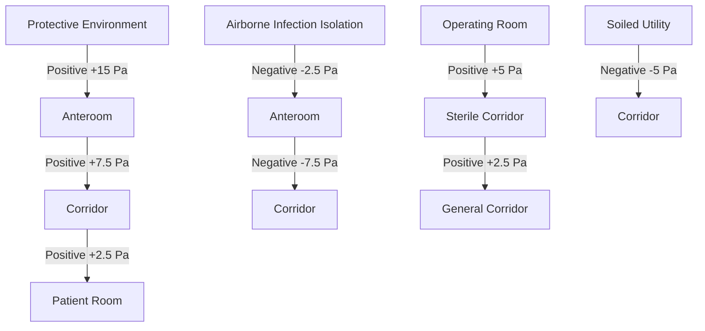
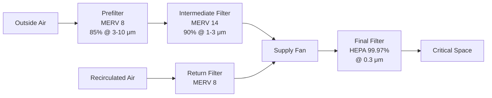

## ASHRAE Standard 170 Overview

ASHRAE Standard 170, "Ventilation of Health Care Facilities," establishes minimum ventilation requirements for healthcare spaces to minimize infection transmission, control odors, and maintain appropriate environmental conditions. The standard provides prescriptive requirements based on space function, recognizing that healthcare environments demand precise control due to vulnerable patient populations and critical procedures.

The physical basis for these requirements stems from **dilution ventilation principles**, where contaminant concentration decreases exponentially with air change rate according to:

$$C(t) = C_0 \cdot e^{-\frac{Q}{V}t} + \frac{G}{Q}(1 - e^{-\frac{Q}{V}t})$$

where $C(t)$ is contaminant concentration at time $t$, $C_0$ is initial concentration, $Q$ is ventilation rate, $V$ is room volume, and $G$ is contaminant generation rate.

## Pressure Relationship Requirements

Differential pressure control prevents airborne contaminant migration between spaces. The standard specifies positive or negative pressure relationships relative to adjacent areas, maintaining pressure differentials typically between 0.01 to 0.03 inches water column (2.5 to 7.5 Pa).

### Pressure Hierarchy

The pressure differential is maintained through exhaust/supply airflow imbalance:

$$\Delta P = \frac{8\rho L Q^2}{\pi^2 D^5}$$

where $\Delta P$ is pressure differential, $\rho$ is air density (1.2 kg/m³), $L$ is equivalent length of leakage paths, $Q$ is airflow imbalance, and $D$ is equivalent diameter of leakage openings.

## Ventilation Requirements by Space Type

### Critical Care Spaces

| Space Type | Air Changes per Hour (ACH) | Minimum Outdoor Air (ACH) | Pressure Relationship | Minimum Total Filtration | Temperature Range (°F) | Maximum RH (%) |
|------------|----------------------------|---------------------------|----------------------|-------------------------|----------------------|----------------|
| Operating Room | 20 | 4 | Positive | MERV 14 + HEPA (99.97%) | 68-73 | 60 |
| Delivery Room | 20 | 4 | Positive | MERV 14 | 68-73 | 60 |
| Cardiac Catheterization | 15 | 3 | Positive | MERV 14 | 70-75 | 60 |
| Anesthesia Storage | 8 | 2 | Negative | MERV 8 | 75 | 60 |

### Patient Care Spaces

| Space Type | Air Changes per Hour (ACH) | Minimum Outdoor Air (ACH) | Pressure Relationship | Minimum Total Filtration | Temperature Range (°F) | Maximum RH (%) |
|------------|----------------------------|---------------------------|----------------------|-------------------------|----------------------|----------------|
| Patient Room | 6 | 2 | Equal/Positive | MERV 14 | 70-75 | 65 |
| Protective Environment | 12 | 2 | Positive | MERV 14 + HEPA (99.97%) | 70-75 | 65 |
| Airborne Infection Isolation (AII) | 12 | 2 | Negative | MERV 14 | 70-75 | 65 |
| ICU | 6 | 2 | Positive | MERV 14 | 70-75 | 60 |
| Nursery | 6 | 2 | Positive | MERV 14 | 72-78 | 60 |

### Support Spaces

| Space Type | Air Changes per Hour (ACH) | Minimum Outdoor Air (ACH) | Pressure Relationship | Minimum Total Filtration | Temperature Range (°F) |
|------------|----------------------------|---------------------------|----------------------|-------------------------|----------------------|
| Soiled Utility | 10 | 2 | Negative | MERV 8 | 70-75 |
| Clean Utility | 4 | 2 | Positive | MERV 8 | 70-75 |
| Medication Room | 4 | 2 | Positive | MERV 8 | 70-75 |
| Pharmacy | 4 | 2 | Positive | MERV 8 | 70-75 |
| Laboratory (General) | 6 | 2 | Negative | MERV 14 | 70-75 |
| Laboratory (Bacteriology) | 6 | 2 | Negative | MERV 14 + HEPA Exhaust | 70-75 |

## Filtration Requirements

ASHRAE 170 mandates multi-stage filtration to progressively remove particles:

### Filtration System Design

Particle penetration through filter banks follows multiplicative probability:

$$P_{total} = P_1 \times P_2 \times P_3 = (1-E_1)(1-E_2)(1-E_3)$$

where $P$ is penetration fraction and $E$ is efficiency. For MERV 8 (85%) + MERV 14 (90%) + HEPA (99.97%):

$$P_{total} = 0.15 \times 0.10 \times 0.0003 = 0.0000045 \text{ or } 0.00045\%$$

## Temperature and Humidity Control

Temperature requirements balance patient thermal comfort with infection control. The thermoregulatory neutral zone for sedated patients is narrower (±0.5°F) than ambulatory individuals (±2°F).

Heat transfer from patient to environment:

$$Q_{total} = Q_{conv} + Q_{rad} + Q_{evap} = h_c A(T_{skin}-T_{air}) + \sigma \epsilon A(T_{skin}^4 - T_{mrt}^4) + h_{fg} \dot{m}_{evap}$$

where $h_c$ is convective heat transfer coefficient (2-5 W/m²·K depending on air velocity), $\sigma$ is Stefan-Boltzmann constant (5.67×10⁻⁸ W/m²·K⁴), $\epsilon$ is skin emissivity (0.95), $T_{mrt}$ is mean radiant temperature, $h_{fg}$ is latent heat of vaporization (2,260 kJ/kg), and $\dot{m}_{evap}$ is evaporation rate.

Humidity control prevents microbial growth (>65% RH) and static electricity accumulation (<30% RH). Bacterial survival rates vary dramatically with relative humidity, with minimum survival occurring at 40-60% RH for most pathogens.

## Air Change Requirements

The air change rate determines both dilution effectiveness and room air distribution patterns. Higher ACH values create stronger mixing and reduce contaminant dwell time.

Time to achieve specific contaminant removal efficiency:

$$t = -\frac{V}{Q} \ln(1-E) = -\frac{60}{ACH} \ln(1-E)$$

For 99% removal (E = 0.99):

- 6 ACH: $t = -\frac{60}{6} \ln(0.01) = 46$ minutes
- 12 ACH: $t = -\frac{60}{12} \ln(0.01) = 23$ minutes
- 20 ACH: $t = -\frac{60}{20} \ln(0.01) = 14$ minutes

This relationship explains why critical spaces like operating rooms require 20 ACH—rapid contaminant clearance between procedures.

## Outdoor Air Requirements

Minimum outdoor air prevents accumulation of trace contaminants not controlled by recirculation filtration, including anesthetic gases, body odors, and volatile organic compounds.

The outdoor air fraction required:

$$Y = \frac{C_r - C_s}{C_r - C_o}$$

where $Y$ is outdoor air fraction, $C_r$ is recirculated air contaminant concentration, $C_s$ is supply air target concentration, and $C_o$ is outdoor air concentration.

For most healthcare applications, outdoor air provides 2-4 ACH of the total 6-20 ACH requirement, with remaining ventilation through filtered recirculation to improve energy efficiency while maintaining air quality.

## Compliance Verification

Verification testing confirms performance:

- **Airflow measurement**: Capture hood or vane anemometer measurements at each diffuser/register
- **Pressure differential monitoring**: Calibrated manometers or pressure transducers with ±0.01 in. w.c. accuracy
- **Filter integrity testing**: DOP or PAO aerosol challenge for HEPA filters
- **Air balance**: Room supply minus exhaust determines pressure relationship
- **Temperature/humidity**: Continuous monitoring with ±0.5°F, ±3% RH accuracy

Regular testing intervals: quarterly for critical spaces, annually for general patient areas.

---

*ASHRAE 170 requirements represent engineering consensus on minimum ventilation performance for healthcare facility safety and function.*
