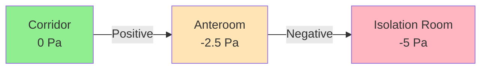
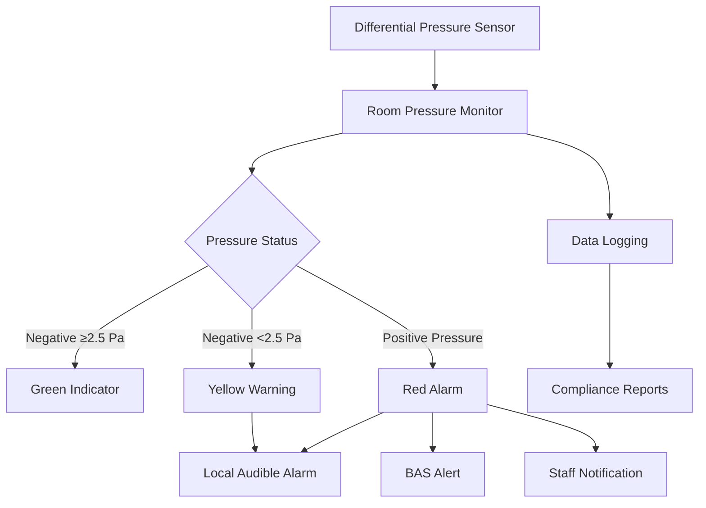

## Overview

Airborne infection isolation (AII) rooms protect healthcare workers and other patients from exposure to airborne infectious agents by maintaining controlled negative pressure relative to adjacent spaces. These specialized environments utilize differential pressure gradients, directional airflow, and enhanced filtration to contain pathogens such as tuberculosis, measles, varicella, and emerging infectious diseases.

The fundamental physics governing isolation room performance centers on pressure differentials and mass flow conservation. When exhaust airflow exceeds supply airflow, the room operates at negative pressure relative to adjacent spaces, ensuring air movement always flows from clean areas toward contaminated zones.

## Negative Pressure Design Principles

### Pressure Differential Requirements

ASHRAE 170 specifies minimum pressure differentials between isolation rooms and adjacent spaces. The relationship governing pressure difference across an opening:

$$\Delta P = \frac{\rho v^2}{2}$$

Where $\Delta P$ is pressure differential (Pa), $\rho$ is air density (kg/m³), and $v$ is air velocity through leakage paths (m/s).

For healthcare isolation, ASHRAE 170 requires:

| Parameter | Requirement | Notes |
|-----------|-------------|-------|
| Minimum pressure differential | -2.5 Pa (-0.01 in. wc) | Room to corridor |
| Recommended pressure differential | -5 to -10 Pa (-0.02 to -0.04 in. wc) | Enhanced containment |
| Maximum door opening time | 5 seconds | Maintain negative pressure |
| Recovery time | ≤30 seconds | Return to negative after door closure |

The volumetric flow imbalance creating negative pressure:

$$Q_{exhaust} - Q_{supply} = Q_{leakage} + Q_{door}$$

Where $Q_{exhaust}$ is total exhaust airflow, $Q_{supply}$ is supply airflow, $Q_{leakage}$ represents infiltration through construction gaps, and $Q_{door}$ accounts for door undercuts and openings.

### Air Change Rate Requirements

ASHRAE 170 mandates minimum air change rates for isolation rooms to ensure adequate dilution of airborne contaminants. The ventilation effectiveness for pathogen removal follows exponential decay:

$$C(t) = C_0 \cdot e^{-\lambda t}$$

Where $C(t)$ is pathogen concentration at time $t$, $C_0$ is initial concentration, and $\lambda$ is the air change rate (h⁻¹).

**ASHRAE 170 Requirements:**

- **Existing facilities**: 6 ACH minimum (2 outside air)
- **New construction**: 12 ACH minimum (2 outside air)
- **CDC recommendation**: 12 ACH or higher for tuberculosis isolation

Time to reduce airborne contamination by 99%:

| ACH | Time to 99% Removal | Time to 99.9% Removal |
|-----|---------------------|----------------------|
| 6 ACH | 46 minutes | 69 minutes |
| 12 ACH | 23 minutes | 35 minutes |
| 15 ACH | 18 minutes | 28 minutes |
| 20 ACH | 14 minutes | 21 minutes |

The removal efficiency equation:

$$t = \frac{-\ln(C/C_0)}{ACH} \times 60$$

Where $t$ is time in minutes to achieve concentration ratio $C/C_0$.

## Anteroom Configuration

Anterooms serve as pressure transition zones between isolation rooms and corridors, providing an additional barrier against pathogen escape during room entry/exit. Three anteroom pressure configurations exist:

### Anteroom Pressure Strategies

| Configuration | Anteroom Pressure | Application | Advantage |
|---------------|-------------------|-------------|-----------|
| Positive-Negative | Positive to corridor, Negative to room | General AII | Protects corridor from contamination |
| Negative-Negative | Negative to both corridor and room | High-risk pathogens | Maximum containment |
| Negative-Positive | Negative to corridor, Positive to room | Dual-purpose rooms | Convertible to protective environment |

ASHRAE 170 allows anteroom elimination if:
1. Room maintains -2.5 Pa minimum to corridor
2. Continuous visual pressure monitoring provided
3. Automatic door closers installed
4. Enhanced staff training protocols implemented

## Exhaust Air Treatment

Exhaust air from isolation rooms requires treatment before discharge to prevent environmental contamination and protect building occupants.

### HEPA Filtration Requirements

High-efficiency particulate air (HEPA) filters capture 99.97% of particles ≥0.3 μm, including tuberculosis bacilli (1-5 μm), measles virus (0.1-0.2 μm in droplet nuclei), and other airborne pathogens.

Pressure drop across HEPA filters:

$$\Delta P_{HEPA} = \Delta P_{initial} + \frac{V}{A} \cdot K \cdot m$$

Where $V$ is volumetric flow rate, $A$ is filter area, $K$ is resistance coefficient, and $m$ is accumulated particulate mass.

**HEPA Exhaust Options:**

1. **Room-level HEPA**: Individual filter housings on each isolation room exhaust
   - Advantages: Redundancy, individual room isolation
   - Disadvantages: Multiple maintenance points, space requirements

2. **Central HEPA**: Common HEPA bank serving multiple isolation rooms
   - Advantages: Centralized maintenance, space efficiency
   - Disadvantages: Cross-contamination risk without proper duct design

3. **Dual HEPA**: Series filtration for critical applications
   - 99.9999% combined efficiency
   - Required for some biocontainment laboratories

### Exhaust Discharge Location

CDC guidelines for exhaust discharge:

- Minimum 25 feet from air intakes, operable windows, pedestrian areas
- Vertical discharge with minimum upward velocity 2,500 fpm
- Stack height calculations per dispersion modeling (dilution factor >1000)
- No recirculation of isolation room exhaust air

## Pressure Monitoring and Alarm Systems

Continuous monitoring ensures isolation room negative pressure maintenance. Modern systems employ differential pressure sensors with visual and audible alarms.

### Monitoring System Components

**Sensor Specifications:**

| Parameter | Requirement |
|-----------|-------------|
| Accuracy | ±0.25 Pa (±0.001 in. wc) |
| Response time | <5 seconds |
| Sampling interval | Continuous or 10-second maximum |
| Display location | Outside room, visible from corridor |
| Alarm delay | 30-60 seconds (prevent nuisance alarms) |
| Calibration frequency | Annually minimum |

### Control Strategies

Modern isolation room control systems maintain negative pressure through:

1. **Constant volume differential**: Fixed supply/exhaust offset (150-200 cfm typical)
   $$Q_{offset} = Q_{exhaust} - Q_{supply}$$

2. **Pressure-based modulation**: Exhaust damper modulation based on pressure sensor feedback
   - PID control algorithm adjusts exhaust to maintain setpoint
   - Faster response to door openings and pressure fluctuations

3. **Venturi valve control**: Fixed-resistance devices creating predictable pressure drops
   - No power required for operation
   - Mechanical reliability for critical applications

## Room Construction and Sealing

Isolation room effectiveness depends on envelope integrity minimizing uncontrolled air leakage.

**Sealing Requirements:**

- Sealed ceiling penetrations (electrical, plumbing, HVAC)
- Weather-stripped doors with automatic closers
- Sealed windows (non-operable preferred)
- Continuous vapor barrier in walls and ceiling
- Sealed utility chases and penetrations
- Maximum door undercut: 0.5 inches (provides controlled leakage path)

The effective leakage area determines pressure response:

$$A_{eff} = \frac{Q_{offset}}{C_d \sqrt{2\Delta P/\rho}}$$

Where $A_{eff}$ is effective leakage area, $Q_{offset}$ is supply/exhaust differential, and $C_d$ is discharge coefficient (typically 0.6-0.7).

## Commissioning and Performance Verification

ASHRAE 170 requires initial and periodic verification of isolation room performance.

**Commissioning Tests:**

1. **Pressure differential verification**
   - Measure room-to-corridor differential with calibrated manometer
   - Verify maintenance during door opening (visual smoke test)
   - Confirm 30-second recovery after door closure

2. **Airflow measurements**
   - Supply and exhaust volume verification (±10% tolerance)
   - Air change rate calculation and verification
   - Verify supply/exhaust offset creates required negative pressure

3. **Alarm system functional testing**
   - Verify alarm activation at threshold pressure
   - Test visual and audible alarm functions
   - Confirm BAS integration and notification systems

4. **Envelope integrity testing**
   - Smoke tube visualization of airflow direction at doors
   - Pressurization testing (optional, for high-containment applications)

**Ongoing Monitoring:**

- Daily visual verification of pressure monitors by staff
- Monthly calibration checks of monitoring equipment
- Quarterly airflow measurements (supply and exhaust)
- Annual comprehensive performance testing
- Immediate response to alarm conditions

## Special Considerations

**Toilet Exhaust Integration:**
Isolation room toilets require dedicated exhaust maintaining negative pressure relative to patient room. This creates pressure cascade: Corridor > Room > Toilet.

**HVAC System Independence:**
Isolation rooms should be served by dedicated air handling units or have isolation capability from general HVAC systems to prevent cross-contamination during maintenance.

**Surge Capacity Planning:**
Healthcare facilities should design flexible infrastructure allowing conversion of standard patient rooms to temporary isolation during pandemic events, including provisions for supplemental exhaust fans and portable HEPA units.

## Conclusion

Airborne infection isolation room design integrates fundamental fluid mechanics, thermodynamics, and control systems to create safe healthcare environments. Proper implementation of negative pressure differentials, adequate air change rates, effective exhaust treatment, and continuous monitoring protects healthcare workers and patients from airborne pathogen transmission. Adherence to ASHRAE 170 standards and CDC guidelines ensures isolation room performance meets regulatory requirements and clinical safety objectives.
