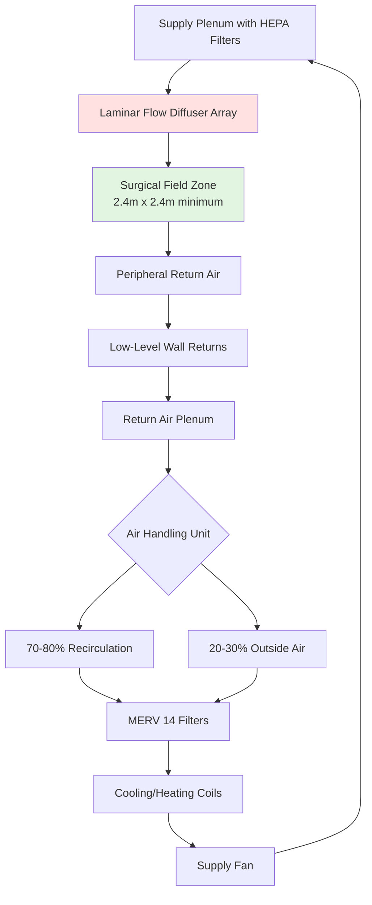
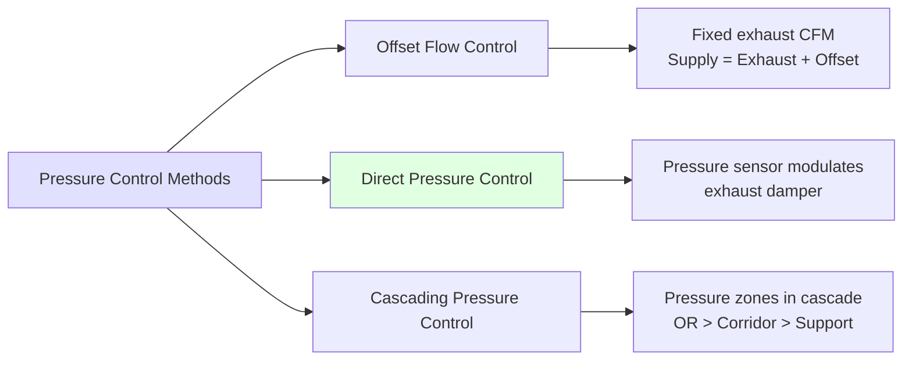

Operating room (OR) HVAC systems represent the most critical and demanding application in healthcare facilities. The primary objective is surgical site infection (SSI) prevention through precise control of airborne contamination, temperature, humidity, and differential pressure. These systems must balance stringent infection control requirements with occupant comfort and energy efficiency.

## Fundamental Design Criteria

ASHRAE 170 and FGI Guidelines establish minimum performance standards for operating room ventilation. These criteria derive from particle transport physics and infection transmission research.

**Minimum Ventilation Requirements:**

| Parameter | ASHRAE 170 Requirement | FGI Guidelines |
|-----------|------------------------|----------------|
| Total Air Changes | 20 ACH minimum | 20 ACH minimum |
| Outdoor Air | 4 ACH minimum | 4 ACH minimum |
| Pressure Relationship | Positive (+0.01 to +0.03 in. w.g.) | Positive relative to corridor |
| Temperature Range | 68-73°F (20-23°C) | 68-75°F (20-24°C) |
| Relative Humidity | 20-60% | 20-60% (30-60% preferred) |
| Filtration | MERV 14 + Terminal HEPA | MERV 14 minimum + HEPA |

The positive pressure requirement prevents infiltration of corridor air containing higher particle concentrations. The pressure differential drives airflow according to the orifice equation:

$$Q = C_d A \sqrt{\frac{2\Delta P}{\rho}}$$

where $Q$ is volumetric flow through door gaps (cfm), $C_d$ is discharge coefficient (0.6-0.65), $A$ is leakage area (ft²), $\Delta P$ is pressure differential (lbf/ft²), and $\rho$ is air density (lbm/ft³).

For typical OR door clearances (0.5-0.75 inch gaps), maintaining +0.02 in. w.g. requires approximately 150-300 cfm excess supply over exhaust and transfer air.

## Laminar Flow Ventilation Systems

Laminar (unidirectional) flow systems provide the highest level of air cleanliness for ultra-clean surgical procedures such as orthopedic implants and organ transplants. These systems create a piston-like airflow pattern that sweeps particles downward and away from the surgical field.

### Airflow Physics

True laminar flow requires Reynolds number below 2,300:

$$Re = \frac{\rho V D_h}{\mu}$$

where $V$ is air velocity (ft/s), $D_h$ is hydraulic diameter (ft), and $\mu$ is dynamic viscosity (lbm/ft·s).

For OR applications, vertical air velocities of 25-35 fpm through diffuser arrays create quasi-laminar conditions. The critical design parameter is velocity uniformity across the surgical zone, typically requiring coefficient of variation (CV) less than 20%:

$$CV = \frac{\sigma_V}{\bar{V}} \times 100\%$$

where $\sigma_V$ is standard deviation of velocity measurements.

### Diffuser Configuration

Laminar flow diffusers must cover a minimum 8 ft × 8 ft (2.4 m × 2.4 m) area centered over the surgical table. The supply air distribution follows plug flow displacement principles rather than mixing ventilation. Particle concentration decreases exponentially with distance from generation source:

$$C(x) = C_0 \exp\left(-\frac{V x}{D}\right)$$

where $C(x)$ is particle concentration at distance $x$ from source, $C_0$ is source concentration, $V$ is air velocity, and $D$ is particle diffusion coefficient.

## Temperature and Humidity Control

Thermal control in operating rooms addresses competing requirements: surgeon comfort during physically demanding procedures versus patient hypothermia prevention during anesthesia.

**Heat Load Components:**

| Source | Typical Load (Btu/hr) | Notes |
|--------|----------------------|-------|
| Surgical Lights | 4,000-8,000 | LED technology reduces load |
| Medical Equipment | 3,000-6,000 | Imaging, electrosurgical units |
| Personnel (4-8 people) | 1,600-3,200 | Sensible heat at light activity |
| Patient | -500 to +500 | Heat loss under anesthesia |
| Infiltration/Outside Air | Variable | Climate dependent |

The supply air temperature must be calculated to satisfy both sensible and latent loads:

$$T_s = T_r - \frac{q_s}{1.08 \times Q}$$

where $T_s$ is supply air temperature (°F), $T_r$ is room setpoint (°F), $q_s$ is sensible heat gain (Btu/hr), and $Q$ is supply airflow (cfm).

For a typical OR with 3,000 cfm supply air and 15,000 Btu/hr sensible load:

$$T_s = 70 - \frac{15,000}{1.08 \times 3,000} = 70 - 4.6 = 65.4°F$$

Humidity control prevents static electricity buildup (minimum 20% RH) and microbial growth on surfaces (maximum 60% RH). The low-temperature supply air often requires reheat to avoid overcooling while achieving dehumidification. Dew point control provides more reliable humidity management than relative humidity control, with target dew points of 35-45°F.

## HEPA Filtration Requirements

High-efficiency particulate air (HEPA) filters capture 99.97% of particles ≥0.3 μm, the most penetrating particle size (MPPS) where diffusion and interception mechanisms are least effective. Pressure drop across HEPA filters follows the Darcy-Weisbach relationship:

$$\Delta P = f \frac{L}{D_h} \frac{\rho V^2}{2}$$

Initial pressure drop ranges from 0.5-1.0 in. w.g. at rated flow, increasing to 2.0-2.5 in. w.g. at end of filter life. This pressure rise affects fan performance and system airflow.

Terminal HEPA filters installed at the room supply eliminate downstream contamination from ductwork and provide final air cleaning. The filter face velocity should not exceed 250 fpm to maintain efficiency and minimize pressure drop.

## Pressure Control Strategies

Maintaining positive pressure requires active control systems that adjust supply and exhaust flows based on real-time pressure measurements. Three primary strategies exist:

**Direct pressure control** provides the most reliable performance but requires high-quality differential pressure sensors (±0.001 in. w.g. accuracy) and tuned PID control loops. The control algorithm adjusts exhaust airflow to maintain setpoint:

$$Q_{exhaust} = Q_{supply} - Q_{offset} + K_p e + K_i \int e \, dt + K_d \frac{de}{dt}$$

where $e$ is pressure error, and $K_p$, $K_i$, $K_d$ are proportional, integral, and derivative gains.

## Redundancy and Reliability

Operating room HVAC systems require 100% standby capacity for critical components:

- Dual air handling units (N+1 configuration)
- Redundant supply and exhaust fans
- Backup power for all HVAC equipment
- Automatic switchover on component failure
- Continuous monitoring of pressure, temperature, humidity, and filter status

Emergency power systems must maintain full HVAC operation during utility outages. Generator sizing must account for starting inrush currents 6-8 times full load amperage for motor-driven equipment.

## Commissioning and Testing

Functional performance testing verifies system compliance with design criteria. Critical tests include:

1. **Airflow verification:** Measure total and outdoor air quantities within ±10% of design
2. **Pressure relationships:** Confirm +0.01 to +0.03 in. w.g. with doors closed
3. **Air change rate:** Calculate ACH from room volume and measured airflow
4. **Recovery time:** Measure time to reduce particle count by 90% after smoke challenge
5. **Temperature/humidity control:** Verify setpoint maintenance under varying loads
6. **Filter integrity:** Perform DOP aerosol test on HEPA filters (0% leakage)

The recovery time test evaluates air change effectiveness using particle clearance kinetics:

$$t_{90} = \frac{2.3}{\lambda} = \frac{2.3 \times V}{Q}$$

where $t_{90}$ is time for 90% reduction (minutes), $\lambda$ is air change rate (1/min), $V$ is room volume (ft³), and $Q$ is effective airflow (cfm).

For a 1,200 ft³ OR with 3,000 cfm supply, theoretical recovery time is:

$$t_{90} = \frac{2.3 \times 1,200}{3,000} = 0.92 \text{ minutes} \approx 55 \text{ seconds}$$

Operating room HVAC systems represent the pinnacle of precision environmental control, integrating particle physics, thermodynamics, and fluid mechanics to protect patient safety during the most vulnerable medical procedures. Proper design, installation, and maintenance of these systems directly impacts surgical outcomes and healthcare-associated infection rates.
