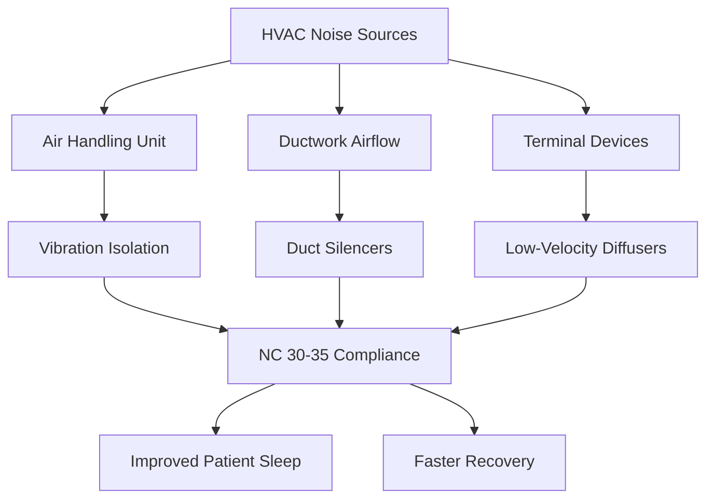
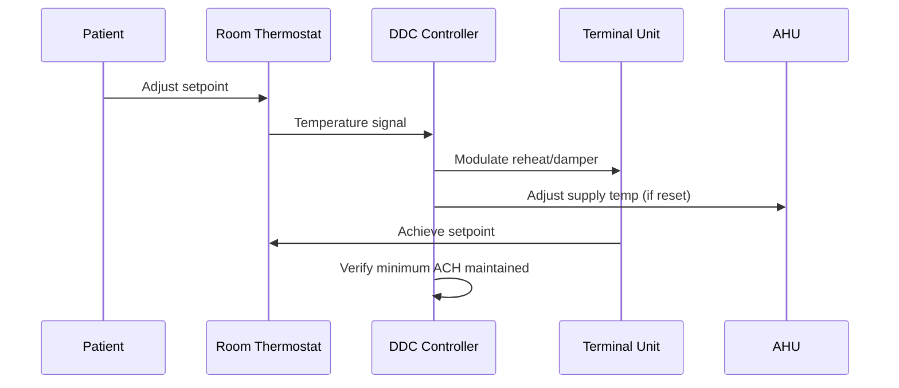

## Overview

Patient room HVAC systems must balance infection control, thermal comfort, energy efficiency, and individual patient preferences. ASHRAE 170 establishes minimum ventilation requirements while acknowledging that patient comfort directly influences healing outcomes. The design challenge involves maintaining consistent environmental parameters across diverse patient populations with varying metabolic rates and comfort expectations.

## ASHRAE 170 Ventilation Requirements

### Air Change Rates

ASHRAE 170 mandates minimum ventilation rates for general patient rooms based on infection control and dilution ventilation principles. The total air changes per hour (ACH) requirement is:

$$Q_{total} = \frac{V_{room} \times ACH}{60}$$

where $Q_{total}$ is volumetric flow rate (cfm), $V_{room}$ is room volume (ft³), and ACH is air changes per hour.

| Parameter | Requirement | Purpose |
|-----------|-------------|---------|
| Total Air Changes | 6 ACH minimum | Contaminant dilution |
| Outdoor Air | 2 ACH minimum | Odor control, pressurization |
| Recirculated Air | 4 ACH minimum | Energy efficiency |
| Air Movement | All supply air to patient | Minimize cross-contamination |

### Outdoor Air Calculation

The outdoor air requirement ensures adequate dilution of bioeffluents and maintains slight positive pressure relative to corridors:

$$Q_{OA} = \frac{V_{room} \times 2}{60} \text{ cfm}$$

For a typical 120 ft² patient room with 9 ft ceiling height (1,080 ft³):

$$Q_{OA} = \frac{1080 \times 2}{60} = 36 \text{ cfm}$$

$$Q_{total} = \frac{1080 \times 6}{60} = 108 \text{ cfm}$$

The physics basis involves the exponential decay of contaminant concentration through dilution ventilation:

$$C(t) = C_0 \cdot e^{-\frac{Q}{V} \cdot t}$$

where $C(t)$ is contaminant concentration at time $t$, $C_0$ is initial concentration, $Q$ is ventilation rate, and $V$ is room volume. Higher air change rates accelerate contaminant removal.

## Temperature Control Strategy

### Thermal Comfort Parameters

Patient rooms require precise temperature control within the ASHRAE 170 range of 70–75°F (21–24°C). The thermal comfort equation for sedentary patients in hospital gowns:

$$PMV = [M - W - E_{sk} - C_{res} - E_{res} - R - C]$$

where PMV is Predicted Mean Vote, $M$ is metabolic rate (approximately 0.8 met for resting patients), $W$ is external work (zero), $E_{sk}$ is evaporative heat loss from skin, $C_{res}$ and $E_{res}$ are respiratory convective and evaporative losses, $R$ is radiative heat transfer, and $C$ is convective heat transfer.

Patients have lower metabolic rates than healthy occupants (0.7–0.9 met vs. 1.0–1.2 met), requiring warmer setpoints:

| Condition | Metabolic Rate | Optimal Temperature |
|-----------|----------------|---------------------|
| Post-surgical patient | 0.7–0.8 met | 74–75°F |
| General medical patient | 0.8–0.9 met | 72–74°F |
| Ambulatory patient | 0.9–1.0 met | 70–72°F |

### Individual Room Controls

Individual temperature control accommodates patient-specific needs. Control systems must provide:

**Setpoint Range:** 70–75°F in 1°F increments
**Deadband:** Minimum 2°F to prevent short-cycling
**Response Time:** Temperature change within 15 minutes of adjustment

The heat transfer rate required for temperature adjustment:

$$q = \dot{m} \cdot c_p \cdot (T_{supply} - T_{return})$$

where $q$ is heat transfer rate (Btu/hr), $\dot{m}$ is air mass flow rate (lb/hr), $c_p$ is specific heat of air (0.24 Btu/lb·°F), and $T$ represents temperatures.

For rapid temperature response with constant volume systems, supply air temperature modulation through reheat is necessary:

$$T_{supply} = T_{room} - \frac{Q_{room}}{\dot{m} \cdot c_p}$$

## Humidity Management

ASHRAE 170 specifies 30–60% relative humidity. Humidity control affects both thermal comfort and infection control:

$$RH = \frac{p_v}{p_{sat}(T)} \times 100\%$$

where $p_v$ is partial pressure of water vapor and $p_{sat}$ is saturation pressure at temperature $T$.

The psychrometric relationship between temperature and humidity affects perceived comfort. At 72°F and 30% RH versus 60% RH, the difference in moisture content is:

$$\Delta W = 0.622 \times \left(\frac{p_v(60\%)}{p_{atm} - p_v(60\%)} - \frac{p_v(30\%)}{p_{atm} - p_v(30\%)}\right)$$

| Humidity Level | Impact on Comfort | Impact on Pathogens |
|----------------|-------------------|---------------------|
| Below 30% | Dry mucous membranes, static | Increased viral survival |
| 30–40% | Comfortable for most | Optimal for control |
| 40–60% | Slightly humid sensation | Bacterial growth possible |
| Above 60% | Uncomfortable, clammy | Mold growth risk |

## Acoustic Performance

Noise in patient rooms disrupts sleep and impairs recovery. ASHRAE sound criteria for patient rooms:

**Maximum NC Level:** NC 30–35
**Maximum A-weighted Sound:** 40 dBA

Sound power from HVAC systems follows:

$$L_p = L_w - 10\log_{10}(A) + K$$

where $L_p$ is sound pressure level at receiver, $L_w$ is source sound power level, $A$ is room absorption, and $K$ is room constant.

### Noise Control Strategies

**Terminal Device Selection:** Diffusers with discharge velocities below 400 fpm minimize regenerated noise. The sound power from a diffuser:

$$L_w = K + 10\log_{10}(Q) + 20\log_{10}(v)$$

where $K$ is a constant, $Q$ is airflow (cfm), and $v$ is velocity (fpm).

## Pressure Relationships

Patient rooms maintain slight positive pressure (+0.01 to +0.03 in. w.c.) relative to corridors to prevent infiltration of corridor contaminants. The pressure differential results from supply-exhaust airflow imbalance:

$$\Delta P = \frac{\rho v^2}{2} \cdot K$$

where $\Delta P$ is pressure difference, $\rho$ is air density, $v$ is velocity, and $K$ is a loss coefficient.

For infection control, the minimum pressure differential prevents reverse airflow through door undercuts:

$$Q_{leak} = C \cdot A \cdot \sqrt{\Delta P}$$

where $C$ is flow coefficient, $A$ is leakage area, and $\Delta P$ is pressure differential.

## System Design Approaches

### Constant Volume vs. Variable Volume

| System Type | Advantages | Disadvantages |
|-------------|-----------|---------------|
| Constant Volume Reheat | Guaranteed ventilation rates, simple controls | Higher energy consumption |
| VAV with Minimum Flow | Energy efficient | Complex controls, minimum flow verification |
| Fan-Powered Terminal | Consistent air motion, redundancy | Higher first cost, noise potential |

### Control Sequence

The control logic must prevent patient adjustment from compromising minimum ventilation:

$$Q_{actual} \geq Q_{min} = \frac{V_{room} \times 6}{60}$$

regardless of temperature setpoint.

## Special Considerations

**Immunocompromised Patients:** Some facilities provide HEPA filtration (99.97% at 0.3 μm) and increased ACH (12 ACH) for protective environments.

**Isolation Capability:** Design systems with capability to convert to negative pressure isolation through damper and exhaust fan activation.

**Night Setback:** While energy-saving, night setback in occupied patient rooms is generally avoided due to continuous occupancy and vulnerable populations.

The combination of adequate ventilation, precise temperature control, proper humidity, and low noise creates an environment conducive to healing while maintaining infection control standards mandated by ASHRAE 170.
