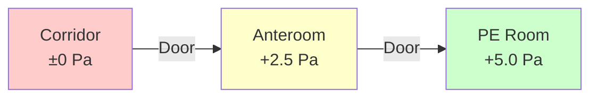

Protective environment (PE) rooms provide the highest level of environmental control in healthcare facilities for severely immunocompromised patients undergoing bone marrow transplants, stem cell therapy, or intensive chemotherapy. These specialized spaces employ positive pressure cascades, high-efficiency filtration, and sealed construction to create an ultra-clean environment that minimizes opportunistic infection risk.

## Physical Principles of Positive Pressure Protection

The fundamental protection mechanism relies on pressure differentials that establish outward airflow, preventing contaminated corridor air from entering the patient space. The pressure difference across a door or crack drives volumetric flow according to the orifice flow equation:

$$Q = C_d A \sqrt{\frac{2\Delta P}{\rho}}$$

where $Q$ is volumetric flow rate (CFM), $C_d$ is discharge coefficient (0.6-0.65 for door gaps), $A$ is leakage area (ft²), $\Delta P$ is pressure differential (inches w.g.), and $\rho$ is air density (lb/ft³). ASHRAE 170 requires minimum +2.5 Pa (+0.01 in. w.g.) pressure differential between PE room and anteroom, and between anteroom and corridor, creating a cascading pressure hierarchy.

This seemingly small pressure differential generates sufficient outward velocity through door gaps to overcome turbulent mixing during door openings. For a typical 3 ft × 7 ft door with 0.5-inch gap perimeter (0.73 ft²), a +0.01 in. w.g. differential produces approximately 35 CFM outward leakage flow, equivalent to 48 fpm velocity through the gap—sufficient to prevent inward contamination during brief openings.

## HEPA Filtration Requirements

PE rooms demand terminal HEPA filtration with minimum 99.97% efficiency at 0.3 μm particle size, the most penetrating particle size (MPPS) where filtration mechanisms transition between diffusion and interception. The filtration physics involves three mechanisms:

1. **Interception**: Particles following streamlines contact filter fibers (dominates for particles >0.5 μm)
2. **Diffusion**: Brownian motion causes small particles to deviate from streamlines (dominates <0.1 μm)
3. **Inertial impaction**: Large particles cannot follow airstream curvature around fibers

The combined efficiency exhibits a minimum at approximately 0.3 μm, making this the critical test size. HEPA filters must be installed with leak-tight gaskets and tested in-situ using DOP (dioctyl phthalate) or PAO (polyalphaolefin) aerosol scanning to verify <0.01% penetration at all points including filter-to-frame seals.

Supply air quantity must achieve minimum 12 air changes per hour (ACH) per ASHRAE 170, though many facilities specify 15-20 ACH for enhanced protection. For a typical 12 ft × 14 ft × 9 ft PE room (1,512 ft³):

$$\text{Required CFM} = \frac{\text{Volume} \times \text{ACH}}{60} = \frac{1512 \times 12}{60} = 302 \text{ CFM minimum}$$

## Sealed Room Construction

Maintaining positive pressure requires minimizing uncontrolled leakage paths. PE room construction employs:

- **Monolithic ceiling**: Sealed gypsum board or similar non-perforated surface eliminates plenum leakage
- **Caulked penetrations**: All electrical boxes, pipe penetrations, and duct openings sealed with appropriate non-outgassing sealant
- **Continuous vapor barrier**: Extends floor-to-deck to eliminate wall cavity leakage paths
- **Gasketed doors**: Self-closing doors with compression gaskets on all four edges
- **Welded or sealed window frames**: If viewing windows provided

The total room leakage should not exceed supply-to-exhaust offset required for pressure maintenance. Typical design offset of 75-100 CFM for a standard PE room accounts for door undercut transfers, terminal equipment leakage, and construction imperfections.

## Pressure Control Strategy

Maintaining stable positive pressure under varying conditions requires active pressure control. The pressure balance equation:

$$\Delta P = f(Q_{supply} - Q_{exhaust} - Q_{transfer} - Q_{leakage})$$

Most PE room systems employ one of two control strategies:

| Strategy | Supply Control | Exhaust Control | Transfer Damper | Pressure Stability |
|----------|---------------|-----------------|-----------------|-------------------|
| **Offset Constant Volume** | Fixed CFM | Fixed CFM (offset) | Fixed opening | Moderate (±0.005 in. w.g.) |
| **Direct Pressure Control** | Modulating damper | Fixed CFM | Modulating or fixed | High (±0.001 in. w.g.) |

Direct pressure control with room pressure sensor and modulating supply damper provides superior stability during door operations and filter loading changes, automatically adjusting supply volume to maintain setpoint.

## Anteroom Configuration

ASHRAE 170 permits two anteroom configurations for PE rooms:

**Configuration 1: Positive-Positive Cascade**
- Corridor: 0 Pa (reference)
- Anteroom: +2.5 Pa minimum
- PE Room: +5.0 Pa minimum (additional +2.5 Pa above anteroom)
- Anteroom supply: 75-100 CFM with HEPA filtration
- Provides staging area for donning protective equipment
- Both doors must never open simultaneously

**Configuration 2: Anteroom with Positive/Negative Capability**
- Allows switching anteroom to negative pressure when PE room patient has airborne infectious disease
- Requires dual setpoint controls and pressure-independent supply/exhaust systems
- Less common due to complexity and potential for control errors

## Ventilation Performance Verification

PE room commissioning requires rigorous testing per ASHRAE 170 and facility-specific protocols:

| Test | Acceptance Criteria | Frequency |
|------|---------------------|-----------|
| Pressure differential | +2.5 Pa minimum (room to anteroom, anteroom to corridor) | Initial, annual, filter change |
| HEPA filter integrity | Zero penetration >0.01% by aerosol scan | Initial, annual |
| Airflow volume | ≥12 ACH, verify at all terminals | Initial, annual |
| Room air distribution | Temperature uniformity ±2°F, no dead zones | Initial |
| Particle count | Class 100 (ISO 5): ≤100 particles/ft³ ≥0.5 μm | Initial, annual |
| Recovery time | 99% particle removal <30 minutes | Initial |

Recovery time testing measures the room's ability to purge introduced contamination, calculated from exponential decay:

$$C(t) = C_0 e^{-\frac{N \cdot t}{60}}$$

where $C(t)$ is particle concentration at time $t$ (minutes), $C_0$ is initial concentration, and $N$ is effective air changes per hour including filtration efficiency.

## Critical Design Considerations

**Supply Air Distribution**: Laminar or unidirectional flow from ceiling-mounted HEPA filter arrays provides superior performance compared to conventional mixing ventilation. Target supply air velocity of 60-90 fpm across the patient zone creates gentle downward flow that sweeps particles toward low-level exhaust grilles.

**Exhaust Location**: Position exhaust grilles low on wall opposite the supply, behind the patient bed. This arrangement establishes floor-to-ceiling flow pattern that continuously removes particles generated in the patient zone before they can recirculate.

**Temperature and Humidity Control**: Immunocompromised patients often experience altered thermoregulation. Provide individual room control with 68-75°F range and 30-60% RH. Achieve precise humidity control through dedicated outdoor air system (DOAS) with central dehumidification rather than relying on terminal reheat.

**Redundancy**: Critical PE units require N+1 or 2N redundant air handling equipment with automatic failover to maintain protection during maintenance or equipment failure. Include emergency power connections for uninterrupted operation during utility outages.

**Continuous Monitoring**: Install permanent pressure monitors with visual indication at room entrance and remote alarming to facility monitoring system. Pressure excursions below setpoint trigger immediate notification, allowing corrective action before patient exposure.

Protective environment rooms represent the apex of healthcare ventilation engineering, combining precision pressure control, high-efficiency filtration, and sealed construction to create environments approaching cleanroom standards. Proper design, construction, and ongoing verification ensure these critical spaces provide reliable protection for the most vulnerable patient population.
