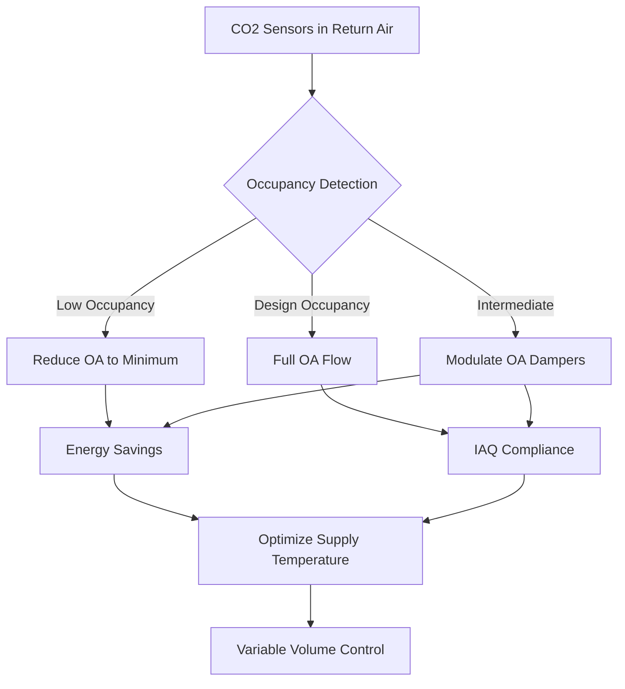
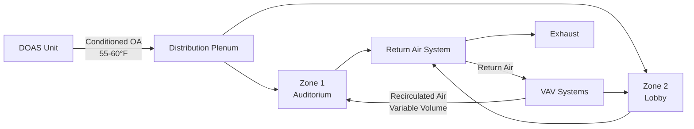

# High-Density Occupancy HVAC Systems

High-occupancy density spaces present unique HVAC challenges due to concentrated heat gains, elevated ventilation requirements, and variable loading patterns. These environments—auditoriums, theaters, lecture halls, convention centers, and worship spaces—require specialized design approaches to maintain acceptable indoor air quality while managing energy consumption.

## Occupancy Density Classifications

ASHRAE 62.1 categorizes occupancy densities for ventilation rate determination. High-density spaces exceed typical commercial occupancies by factors of 3-10.

| Space Type | Design Occupancy | ASHRAE 62.1 Category | $R_p$ (cfm/person) | $R_a$ (cfm/ft²) |
|------------|-----------------|---------------------|-------------------|----------------|
| Office | 5 persons/1000 ft² | Business | 5 | 0.06 |
| Classroom | 35 persons/1000 ft² | Educational | 10 | 0.12 |
| Theater (fixed seats) | 150 persons/1000 ft² | Assembly | 5 | 0.06 |
| Standing space | 100 persons/1000 ft² | Assembly | 7.5 | 0.06 |
| Auditorium | 150 persons/1000 ft² | Assembly | 5 | 0.06 |

The total ventilation requirement combines people-based and area-based components:

$$V_{oz} = R_p \cdot P_z + R_a \cdot A_z$$

Where:
- $V_{oz}$ = outdoor air requirement for zone (cfm)
- $R_p$ = outdoor air rate per person (cfm/person)
- $P_z$ = zone population (persons)
- $R_a$ = outdoor air rate per unit area (cfm/ft²)
- $A_z$ = zone floor area (ft²)

## Load Characteristics

High-density occupancies generate substantial sensible and latent loads concentrated in limited floor area.

### Sensible Heat from Occupants

Human metabolic heat varies with activity level. For seated assembly:

$$Q_{sensible} = N \cdot q_s \cdot CLF$$

Where:
- $N$ = number of occupants
- $q_s$ = sensible heat gain per person (250 BTU/hr seated, low activity)
- $CLF$ = cooling load factor (0.8-1.0 for high-occupancy spaces)

### Latent Heat from Occupants

Moisture generation creates significant dehumidification loads:

$$Q_{latent} = N \cdot q_l$$

Where:
- $q_l$ = latent heat gain per person (200 BTU/hr seated, low activity)

For a 500-seat auditorium operating at full capacity:
- Sensible load: 500 × 250 × 0.9 = 112,500 BTU/hr (9.4 tons)
- Latent load: 500 × 200 = 100,000 BTU/hr (8.3 tons)
- Total occupancy load: 212,500 BTU/hr (17.7 tons)

### Sensible Heat Ratio

High-density spaces exhibit lower sensible heat ratios than typical commercial applications:

$$SHR = \frac{Q_{sensible}}{Q_{sensible} + Q_{latent}}$$

Typical SHR values:
- Standard office: 0.75-0.85
- High-density assembly: 0.50-0.65
- Standing room events: 0.45-0.55

This low SHR demands equipment with enhanced dehumidification capability.

## Ventilation System Design

### Outdoor Air Requirements

For a 10,000 ft² auditorium with 1,500 seats:

$$V_{oz} = (5 \text{ cfm/person} \times 1,500) + (0.06 \text{ cfm/ft}^2 \times 10,000)$$
$$V_{oz} = 7,500 + 600 = 8,100 \text{ cfm}$$

This represents 540 cfm per ton of cooling at a typical 15 cfm/ton design—an outdoor air fraction of 36× normal office buildings.

### Demand-Controlled Ventilation

DCV systems modulate outdoor air based on actual occupancy, measured via CO₂ sensors:

$$V_{oa}(t) = V_{min} + \left(\frac{CO_2(t) - CO_{2,outdoor}}{CO_{2,setpoint} - CO_{2,outdoor}}\right) \cdot (V_{design} - V_{min})$$

Where:
- $V_{oa}(t)$ = outdoor air flow rate at time t
- $V_{min}$ = minimum outdoor air (code-required unoccupied ventilation)
- $CO_{2,setpoint}$ = target indoor CO₂ (typically 1,000-1,100 ppm)
- $CO_{2,outdoor}$ = ambient CO₂ (typically 400-450 ppm)

## System Types and Strategies

### All-Air Systems

**Multi-Zone VAV with Dedicated Outdoor Air System (DOAS)**

This approach separates ventilation from thermal conditioning:

Benefits:
- Decoupled ventilation and space conditioning
- Enhanced dehumidification in DOAS unit
- Reduced supply air volumes during low-latent periods
- Improved part-load efficiency

**Underfloor Air Distribution (UFAD)**

UFAD systems supply conditioned air at floor level, leveraging thermal stratification:

- Supply air temperature: 63-68°F (higher than overhead systems)
- Supply air volume reduced 20-30% via stratification
- Improved ventilation effectiveness: $E_v$ = 1.2-1.3 vs. 1.0 for overhead
- Effective ventilation rate: $V_{eff} = E_v \cdot V_{supply}$

### Air-Water Systems

**Chilled Beam Systems**

Active chilled beams combine ventilation air with local sensible cooling:

- Primary air (ventilation): 0.8-1.2 cfm/ft² at 55-58°F
- Chilled water sensible cooling: 25-40 BTU/hr·ft²
- Suitable for loads up to SHR = 0.65 with supplemental dehumidification

Limitation: High latent loads require upstream dehumidification to maintain space dew point below beam surface temperature (typically 58-60°F).

## Control Strategies

### Pre-Occupancy Purge

Before scheduled events, systems execute purge cycles:

1. 2 hours pre-event: 100% outdoor air at maximum flow
2. 1 hour pre-event: Reduce to 50% outdoor air, begin space cooling
3. Event start: Transition to DCV control mode

### Load Reset Strategies

Supply air temperature reset based on occupancy:

$$T_{supply} = T_{min} + \left(1 - \frac{CO_2 - CO_{2,outdoor}}{CO_{2,design} - CO_{2,outdoor}}\right) \cdot (T_{max} - T_{min})$$

This increases supply temperature during low occupancy, reducing reheat energy and improving dehumidification during high-latent periods.

## Design Considerations

### Acoustic Requirements

High-density spaces demand NC 25-30 criteria:

- Maximum duct velocity: 1,200-1,800 fpm in occupied spaces
- Terminal device pressure drop: <0.15 in. w.c.
- Discharge placement: avoid direct path to stage/presentation area
- Duct liner: 1-2 inches in final 10-15 feet of supply runs

### Transient Response

Rapid occupancy changes require responsive systems:

- VAV box minimum turndown: 30-40% (vs. 20-30% in offices)
- Damper actuator speed: 60-90 seconds full stroke
- DDC system response: 30-60 second sensor polling
- Chilled water valve authority: 0.4-0.5 for fast response

### Air Distribution

Uniform air distribution in high-ceiling spaces:

- Throw distance: 0.75 × ceiling height for mixing systems
- Terminal velocity at occupied zone: <150 fpm
- Temperature differential: 20-25°F for high ceilings (>20 ft)
- Air change rate: 6-12 ACH at design occupancy

## Energy Optimization

High-density spaces exhibit extreme load diversity. Peak design loads occur <5% of operating hours. Energy-efficient designs incorporate:

1. **Demand-controlled ventilation**: 30-50% annual energy savings vs. constant-volume outdoor air
2. **Economizer operation**: Free cooling during unoccupied/low-occupancy periods
3. **Variable-speed drives**: Fan energy proportional to (flow)³, significant savings at part-load
4. **Heat recovery**: Energy recovery ventilators capture 60-80% of exhaust energy during extreme outdoor conditions

The ventilation energy penalty in high-density applications:

$$E_{vent} = 1.08 \cdot V_{oa} \cdot \Delta T \cdot h_{operation}$$

For the 8,100 cfm auditorium example with 40°F temperature differential and 2,000 hours/year operation:

$$E_{vent} = 1.08 \times 8,100 \times 40 \times 2,000 = 699,840,000 \text{ BTU/year}$$

This represents approximately 205 MWh/year of conditioning energy—demand control can reduce this by 40-60% based on actual utilization patterns.

## Conclusion

High-occupancy density HVAC systems require careful integration of ventilation requirements, load management, and control strategies. Success depends on accurate occupancy projections, appropriate system selection for the specific sensible heat ratio, and responsive controls that adapt to highly variable conditions. Demand-controlled ventilation represents the single most effective energy conservation measure while maintaining code-compliant indoor air quality.
